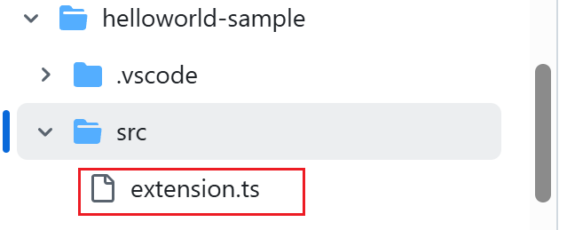

## 一、Windows

我这里使用的是windows开发环境：

```bash
版本: Windows 11 专业版
版本号: 24H2
安装日期: 2025/3/11
操作系统版本: 26100.4061
体验: Windows 功能体验包 1000.26100.84.0
```

## 二、VSCode

vscode版本信息如下：

```bash
版本: 1.100.2 (system setup)
提交: 848b80aeb52026648a8ff9f7c45a9b0a80641e2e
日期: 2025-05-14T21:47:40.416Z
Electron: 34.5.1
ElectronBuildId: 11369351
Chromium: 132.0.6834.210
Node.js: 20.19.0
V8: 13.2.152.41-electron.0
OS: Windows_NT x64 10.0.26100
```

## 三、nodejs

直接参考这个吧：[LV01-nodejs环境 | 苏木 —— site-vitepress](https://docs-site.github.io/site-vitepress/sdoc/01-前端相关/01-nodejs/LV01-nodejs环境.html#_1-安装node和npm)

## 四、相关资料

### 1. 怎么开始？

vscode官网已经我为我们提供了扩展API相关的文档：[Extension API | Visual Studio Code Extension API](https://code.visualstudio.com/api)。还有一份中文的文档资料：[扩展 API | Visual Studio Code 扩展 API - VSCode 编辑器](https://vscode.js.cn/api)，这里的demo都在这里：[microsoft/vscode-extension-samples: Sample code illustrating the VS Code extension API.](https://github.com/microsoft/vscode-extension-samples)

### 2. 什么语言开发？

这个我们可以看一下官方提供的扩展的demo：[vscode-extension-samples/helloworld-sample/src/extension.ts](https://github.com/microsoft/vscode-extension-samples/blob/main/helloworld-sample/src/extension.ts)



这里的ts就是**TypeScript**。TypeScript 是由微软开发的一种编程语言，它是 JavaScript 的超集，这意味着它包含了 JavaScript 的所有功能，并在此基础上添加了新的特性和工具。TypeScript 的设计目标是帮助开发者构建大型应用程序，并且它的代码最终会被编译成纯 JavaScript，使得编译后的代码可以在任何浏览器、任何计算机和任何操作系统上运行。


 TypeScript 使用的编译器是 `tsc`。我们需要全局或在工作区中安装 TypeScript 编译器，以便将 TypeScript 源代码转译为 JavaScript (`tsc HelloWorld.ts`)。

```bash
npm install -g typescript         # 全局安装
npm install --save-dev typescript # 本地安装，可以避免与我们可能拥有的其他 TypeScript 项目发生潜在冲突。
tsc --version
```

官网有一部分说明文档：[Visual Studio Code 中的 TypeScript - VSCode 编辑器](https://vscode.js.cn/docs/languages/typescript)

### 3. 其他参考资料

- [知乎vscode插件修改和重新编译 - 赵青青 - 博客园](https://www.cnblogs.com/zhaoqingqing/p/14823179.html)

- [VSCode插件开发全攻略（一）概览 - 我是小茗同学 - 博客园](https://www.cnblogs.com/liuxianan/p/vscode-plugin-overview.html)

- [VS Code 插件开发中文文档](https://rackar.github.io/vscode-ext-doccn/)


> 参考资料：
>
> [windows安装npm教程_npm 安装-CSDN博客](https://blog.csdn.net/zhouyan8603/article/details/109039732)
>
> [Node.js安装及环境配置超详细教程【Windows系统】_windows 安装nodejs-CSDN博客](https://blog.csdn.net/Nicolecocol/article/details/136788200)
>
> [Extension API | Visual Studio Code Extension API](https://code.visualstudio.com/api)
>
> [知乎vscode插件修改和重新编译 - 赵青青 - 博客园](https://www.cnblogs.com/zhaoqingqing/p/14823179.html)
>
> [VSCode插件开发全攻略（一）概览 - 我是小茗同学 - 博客园](https://www.cnblogs.com/liuxianan/p/vscode-plugin-overview.html)