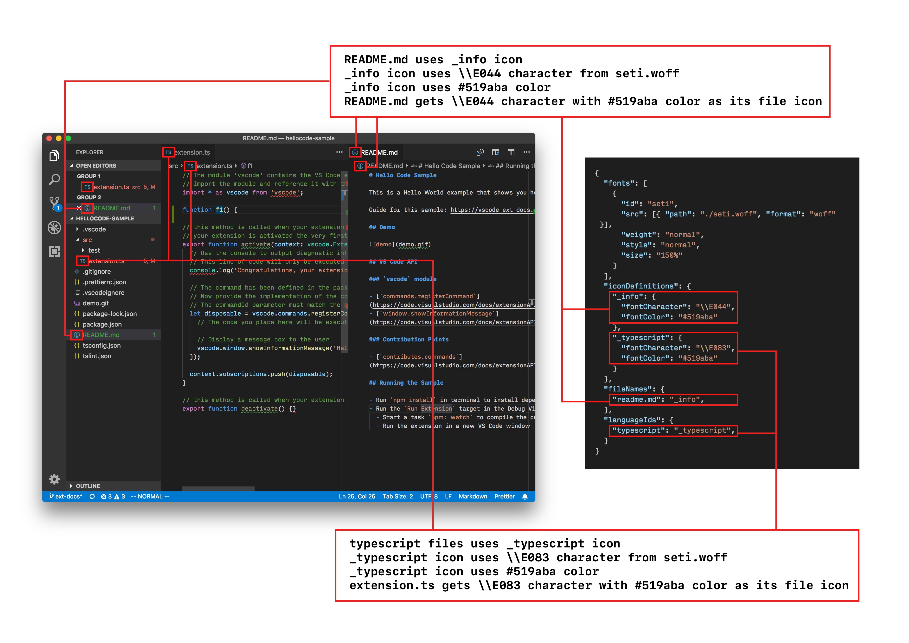

<!-- more -->

# [主题](https://vscode.js.cn/api/extension-capabilities/theming)

在 Visual Studio Code 中，有三种类型的主题

- **颜色主题**：将 UI 组件标识符和文本标记标识符映射到颜色的方式。颜色主题允许您将喜欢的颜色应用于 VS Code UI 组件和编辑器中的文本。
- **文件图标主题**：将文件类型/文件名映射到图像的方式。文件图标在 VS Code UI 的各个位置显示，例如文件资源管理器、快速打开列表和编辑器选项卡。
- **产品图标主题**：在整个 UI 中使用的一组图标，包括侧边栏、活动栏、状态栏到编辑器的字形边距。

## 一、[颜色主题](https://vscode.js.cn/api/extension-capabilities/theming#color-theme)

如您在插图中看到的，颜色主题定义了 UI 组件的颜色以及编辑器中的高亮颜色

- 控制 UI 组件颜色的 `colors` 映射。
- `tokenColors` 定义了编辑器中高亮的颜色和样式。有关此主题的更多信息，请参阅[语法高亮指南](https://vscode.js.cn/api/language-extensions/syntax-highlight-guide)。
- `semanticTokenColors` 映射以及 `semanticHighlighting` 设置可以增强编辑器中的高亮显示。[语义高亮指南](https://vscode.js.cn/api/language-extensions/semantic-highlight-guide)解释了与此相关的 API。

我们提供了一个[颜色主题指南](https://vscode.js.cn/api/extension-guides/color-theme)和一个[颜色主题示例](https://github.com/microsoft/vscode-extension-samples/tree/main/theme-sample)，它们说明了如何创建主题。

## 二、[文件图标主题](https://vscode.js.cn/api/extension-capabilities/theming#file-icon-theme)

文件图标主题允许您

- 创建一个从唯一文件图标标识符到图像或字体图标的映射。
- 通过文件名或文件语言类型将文件与这些唯一的文件图标标识符关联起来。

[文件图标主题指南](https://vscode.js.cn/api/extension-guides/file-icon-theme)讨论了如何创建文件图标主题。

## 三、[产品图标主题](https://vscode.js.cn/api/extension-capabilities/theming#product-icon-theme)

产品图标主题允许您

重新定义工作台中使用的所有内置图标。例如，筛选操作按钮和视图图标、状态栏中的图标、断点以及树和编辑器中的折叠图标。

[产品图标主题指南](https://vscode.js.cn/api/extension-guides/product-icon-theme)讨论了如何创建产品图标主题。
