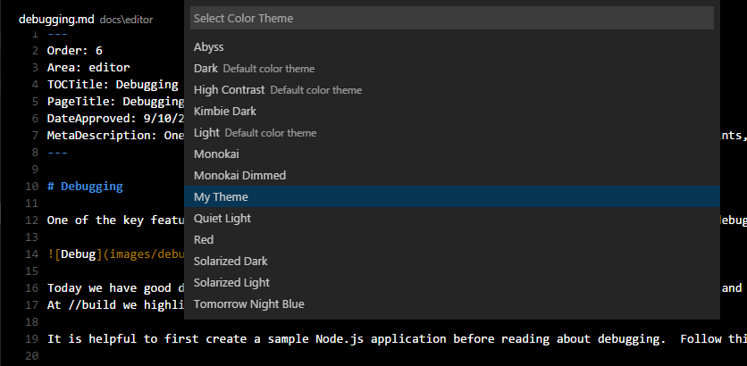

<!-- more -->

# [颜色主题](https://vscode.js.cn/api/extension-guides/color-theme)

Visual Studio Code 用户界面中可见的颜色分为两类

- 工作台颜色，用于视图和编辑器，从活动栏到状态栏。所有这些颜色的完整列表可以在[主题颜色参考](https://vscode.js.cn/api/references/theme-color)中找到。
- 语法颜色和样式，用于编辑器中的源代码。这些颜色的主题化方式不同，因为语法着色基于 TextMate 语法和 TextMate 主题以及语义标记。

本指南将介绍创建主题的不同方法。

## [工作台颜色](https://vscode.js.cn/api/extension-guides/color-theme#workbench-colors)

创建新工作台颜色主题最简单的方法是使用现有颜色主题并进行自定义。首先切换到要修改的颜色主题，然后打开您的[设置](https://vscode.js.cn/docs/getstarted/settings)并修改`workbench.colorCustomizations`设置。更改会实时应用到您的 VS Code 实例。

例如，以下代码将更改标题栏的背景颜色

```json
{
  "workbench.colorCustomizations": {
    "titleBar.activeBackground": "#ff0000"
  }
}
```

所有可主题化颜色的完整列表可以在[颜色参考](https://vscode.js.cn/api/references/theme-color)中找到。

## [语法颜色](https://vscode.js.cn/api/extension-guides/color-theme#syntax-colors)

对于语法高亮颜色，有两种方法。您可以引用社区中现有的 TextMate 主题（`.tmTheme`文件），或者您可以创建自己的主题规则。最简单的方法是使用现有主题并进行自定义，就像上面工作台颜色部分所述。

首先切换到要自定义的颜色主题，并使用`editor.tokenColorCustomizations`[设置](https://vscode.js.cn/docs/getstarted/settings)。更改会实时应用到您的 VS Code 实例，无需刷新或重新加载。

例如，以下代码将更改编辑器中注释的颜色

```json
{
  "editor.tokenColorCustomizations": {
    "comments": "#FF0000"
  }
}
```

该设置支持一个简单模型，其中包含一组常见的标记类型，例如“comments”（注释）、“strings”（字符串）和“numbers”（数字）。如果您想对更多内容进行着色，则需要直接使用 TextMate 主题规则，这在[语法高亮指南](https://vscode.js.cn/api/language-extensions/syntax-highlight-guide)中详细解释。

## [语义颜色](https://vscode.js.cn/api/extension-guides/color-theme#semantic-colors)

语义高亮在 VS Code 1.43 版本中适用于 TypeScript 和 JavaScript。我们预计它很快将被其他语言采用。

语义高亮基于语言服务提供的符号信息丰富了语法着色，语言服务对项目有更完整的理解。一旦语言服务器运行并计算出语义标记，颜色更改就会出现。

每个主题通过主题定义中的特定设置来控制是否启用语义高亮。每个语义标记的样式由主题的样式规则定义。

用户可以使用`editor.tokenColorCustomizations`设置覆盖语义高亮功能和着色规则。

为特定主题启用语义高亮

```json
"editor.tokenColorCustomizations": {
    "[Material Theme]": {
        "semanticHighlighting": true
    }
},
```

主题可以定义语义标记的主题规则，如[语法高亮指南](https://vscode.js.cn/api/language-extensions/syntax-highlight-guide#semantic-theming)中所述。

## [创建新的颜色主题](https://vscode.js.cn/api/extension-guides/color-theme#create-a-new-color-theme)

一旦您使用`workbench.colorCustomizations`和`editor.tokenColorCustomizations`调整了主题颜色，就可以创建实际主题了。

（1）从**命令面板**中使用**Developer: Generate Color Theme from Current Settings**命令生成主题文件。

（2）使用 VS Code 的 [Yeoman](https://yeoman.node.org.cn/) 扩展生成器来生成新的主题扩展。

```js
npm install -g yo generator-code
yo code
```

（3）如果您按照上述说明自定义了主题，请选择“从头开始”（'Start fresh'）。


（4）将从您的设置生成的主题文件复制到新的扩展。

您还可以通过告诉扩展生成器导入 TextMate 主题文件（.tmTheme）并将其打包以在 VS Code 中使用来使用现有的 TextMate 主题。或者，如果您已经下载了该主题，请将`tokenColors`部分替换为指向要使用的`.tmTheme`文件的链接。

```json
{
  "type": "dark",
  "colors": {
    "editor.background": "#1e1e1e",
    "editor.foreground": "#d4d4d4",
    "editorIndentGuide.background": "#404040",
    "editorRuler.foreground": "#333333",
    "activityBarBadge.background": "#007acc",
    "sideBarTitle.foreground": "#bbbbbb"
  },
  "tokenColors": "./Diner.tmTheme"
}
```

> **提示：**为您的颜色定义文件添加`-color-theme.json`后缀，您将在编辑时获得悬停提示、代码补全、颜色装饰器和颜色选择器。

> **提示：**[ColorSublime](https://colorsublime.github.io/) 有数百个现有的 TextMate 主题可供选择。选择您喜欢的主题并复制下载链接，以便在 Yeoman 生成器或您的扩展中使用。它将是类似于`"https://raw.githubusercontent.com/Colorsublime/Colorsublime-Themes/master/themes/(name).tmTheme"`的格式。

## [测试新的颜色主题](https://vscode.js.cn/api/extension-guides/color-theme#test-a-new-color-theme)

要试用新主题，请按 F5 启动一个扩展开发主机窗口。

在那里，通过**文件** > **首选项** > **主题** > **颜色主题**打开颜色主题选择器，您可以在下拉列表中看到您的主题。向上和向下箭头可以实时预览您的主题。



对主题文件的更改会实时应用到`Extension Development Host`窗口。

## [将主题发布到扩展市场](https://vscode.js.cn/api/extension-guides/color-theme#publishing-a-theme-to-the-extension-marketplace)

如果您想与社区分享您的新主题，可以将其发布到[扩展市场](https://vscode.js.cn/docs/configure/extensions/extension-marketplace)。使用[vsce 发布工具](https://vscode.js.cn/api/working-with-extensions/publishing-extension)打包您的主题并将其发布到 VS Code 市场。

> **提示：**为了方便用户找到您的主题，请在扩展描述中包含“theme”（主题）一词，并在您的`package.json`中将`Category`设置为`Themes`。

我们还提供了关于如何让您的扩展在 VS Code 市场上看起来更美观的建议，请参阅[市场展示技巧](https://vscode.js.cn/api/references/extension-manifest#marketplace-presentation-tips)。

## [添加新的颜色 ID](https://vscode.js.cn/api/extension-guides/color-theme#adding-a-new-color-id)

颜色 ID 也可以通过[颜色贡献点](https://vscode.js.cn/api/references/contribution-points#contributes.colors)由扩展贡献。当在`workbench.colorCustomizations`设置和颜色主题定义文件中使用代码补全时，这些颜色也会出现。用户可以在[扩展贡献](https://vscode.js.cn/docs/configure/extensions/extension-marketplace#_extension-details)选项卡中查看扩展定义了哪些颜色。

## [进一步阅读](https://vscode.js.cn/api/extension-guides/color-theme#further-reading)

- [CSS Tricks - 创建 VS Code 主题](https://css-tricks.cn/creating-a-vs-code-theme/)
