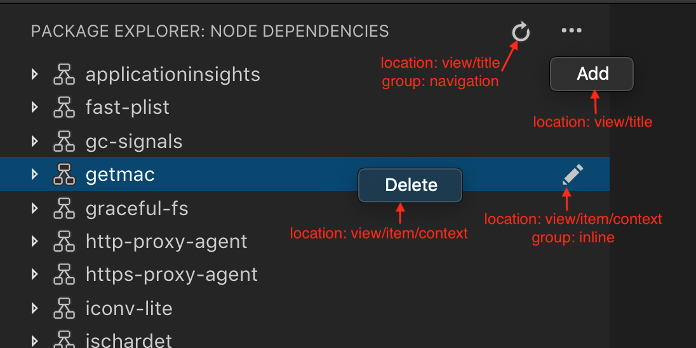

<!-- more -->

# [树视图 API](https://vscode.js.cn/api/extension-guides/tree-view)

树视图 API 允许扩展在 Visual Studio Code 侧边栏中显示内容。此内容以树状结构组织，并符合 VS Code [内置视图](https://vscode.js.cn/docs/getstarted/userinterface#_views) 的样式。

例如，内置的“引用搜索视图”扩展将引用搜索结果显示为单独的视图。


**查找所有引用**的结果显示在**引用：结果**树视图中，该树视图位于**引用**视图容器内。

本指南将教你如何编写一个向 Visual Studio Code 贡献树视图和视图容器的扩展。

## [树视图 API 基础](https://vscode.js.cn/api/extension-guides/tree-view#tree-view-api-basics)

为了解释树视图 API，我们将构建一个名为**Node Dependencies**的示例扩展。此扩展将使用树视图显示当前文件夹中的所有 Node.js 依赖项。添加树视图的步骤包括在你的`package.json`中贡献树视图、创建`TreeDataProvider`以及注册`TreeDataProvider`。你可以在[vscode-extension-samples](https://github.com/microsoft/vscode-extension-samples/tree/main/tree-view-sample/README.md) GitHub 仓库中的`tree-view-sample`中找到此示例扩展的完整源代码。

### [package.json 贡献](https://vscode.js.cn/api/extension-guides/tree-view#package.json-contribution)

首先，你必须通过在`package.json`中使用[contributes.views](https://vscode.js.cn/api/references/contribution-points#contributes.views)贡献点，让 VS Code 知道你正在贡献一个视图。

这是我们扩展的第一个版本的`package.json`

```json
{
  "name": "custom-view-samples",
  "displayName": "Custom view Samples",
  "description": "Samples for VS Code's view API",
  "version": "0.0.1",
  "publisher": "alexr00",
  "engines": {
    "vscode": "^1.74.0"
  },
  "activationEvents": [],
  "main": "./out/extension.js",
  "contributes": {
    "views": {
      "explorer": [
        {
          "id": "nodeDependencies",
          "name": "Node Dependencies"
        }
      ]
    }
  },
  "scripts": {
    "vscode:prepublish": "npm run compile",
    "compile": "tsc -p ./",
    "watch": "tsc -watch -p ./"
  },
  "devDependencies": {
    "@types/node": "^10.12.21",
    "@types/vscode": "^1.42.0",
    "typescript": "^3.5.1",
    "tslint": "^5.12.1"
  }
}
```

> **注意**：如果你的扩展目标 VS Code 版本低于 1.74，则必须在`activationEvents`中明确列出`onView:nodeDependencies`。

你必须为视图指定一个标识符和名称，并且可以贡献到以下位置

- `explorer`：侧边栏中的资源管理器视图
- `debug`：侧边栏中的运行和调试视图
- `scm`：侧边栏中的源代码管理视图
- `test`：侧边栏中的测试资源管理器视图
- [自定义视图容器](https://vscode.js.cn/api/extension-guides/tree-view#view-container)

### [树数据提供者](https://vscode.js.cn/api/extension-guides/tree-view#tree-data-provider)

第二步是为你注册的视图提供数据，以便 VS Code 可以在视图中显示数据。为此，你应该首先实现[TreeDataProvider](https://vscode.js.cn/api/references/vscode-api#TreeDataProvider)。我们的`TreeDataProvider`将提供节点依赖项数据，但你可以拥有一个提供其他类型数据的数据提供者。

此 API 中有两个你需要实现的必要方法

- `getChildren(element?: T): ProviderResult<T[]>` - 实现此方法以返回给定`element`的子项或根（如果没有传递 element）。
- `getTreeItem(element: T): TreeItem | Thenable<TreeItem>` - 实现此方法以返回在视图中显示的元素的用户界面表示 ([TreeItem](https://vscode.js.cn/api/references/vscode-api#TreeItem))。

当用户打开树视图时，`getChildren`方法将在不带`element`的情况下被调用。从那时起，你的`TreeDataProvider`应该返回你的顶级树项。在我们的示例中，顶级树项的`collapsibleState`是`TreeItemCollapsibleState.Collapsed`，这意味着顶级树项将显示为折叠状态。将`collapsibleState`设置为`TreeItemCollapsibleState.Expanded`将导致树项显示为展开状态。将`collapsibleState`保留其默认值`TreeItemCollapsibleState.None`表示该树项没有子项。对于`collapsibleState`为`TreeItemCollapsibleState.None`的树项，将不会调用`getChildren`。

以下是一个提供节点依赖项数据的`TreeDataProvider`实现示例

```typescript
import * as vscode from 'vscode';
import * as fs from 'fs';
import * as path from 'path';

export class NodeDependenciesProvider implements vscode.TreeDataProvider<Dependency> {
  constructor(private workspaceRoot: string) {}

  getTreeItem(element: Dependency): vscode.TreeItem {
    return element;
  }

  getChildren(element?: Dependency): Thenable<Dependency[]> {
    if (!this.workspaceRoot) {
      vscode.window.showInformationMessage('No dependency in empty workspace');
      return Promise.resolve([]);
    }

    if (element) {
      return Promise.resolve(
        this.getDepsInPackageJson(
          path.join(this.workspaceRoot, 'node_modules', element.label, 'package.json')
        )
      );
    } else {
      const packageJsonPath = path.join(this.workspaceRoot, 'package.json');
      if (this.pathExists(packageJsonPath)) {
        return Promise.resolve(this.getDepsInPackageJson(packageJsonPath));
      } else {
        vscode.window.showInformationMessage('Workspace has no package.json');
        return Promise.resolve([]);
      }
    }
  }

  /**
   * Given the path to package.json, read all its dependencies and devDependencies.
   */
  private getDepsInPackageJson(packageJsonPath: string): Dependency[] {
    if (this.pathExists(packageJsonPath)) {
      const toDep = (moduleName: string, version: string): Dependency => {
        if (this.pathExists(path.join(this.workspaceRoot, 'node_modules', moduleName))) {
          return new Dependency(
            moduleName,
            version,
            vscode.TreeItemCollapsibleState.Collapsed
          );
        } else {
          return new Dependency(moduleName, version, vscode.TreeItemCollapsibleState.None);
        }
      };

      const packageJson = JSON.parse(fs.readFileSync(packageJsonPath, 'utf-8'));

      const deps = packageJson.dependencies
        ? Object.keys(packageJson.dependencies).map(dep =>
            toDep(dep, packageJson.dependencies[dep])
          )
        : [];
      const devDeps = packageJson.devDependencies
        ? Object.keys(packageJson.devDependencies).map(dep =>
            toDep(dep, packageJson.devDependencies[dep])
          )
        : [];
      return deps.concat(devDeps);
    } else {
      return [];
    }
  }

  private pathExists(p: string): boolean {
    try {
      fs.accessSync(p);
    } catch (err) {
      return false;
    }
    return true;
  }
}

class Dependency extends vscode.TreeItem {
  constructor(
    public readonly label: string,
    private version: string,
    public readonly collapsibleState: vscode.TreeItemCollapsibleState
  ) {
    super(label, collapsibleState);
    this.tooltip = `${this.label}-${this.version}`;
    this.description = this.version;
  }

  iconPath = {
    light: path.join(__filename, '..', '..', 'resources', 'light', 'dependency.svg'),
    dark: path.join(__filename, '..', '..', 'resources', 'dark', 'dependency.svg')
  };
}
```

### [注册 TreeDataProvider](https://vscode.js.cn/api/extension-guides/tree-view#registering-the-treedataprovider)

第三步是将上述数据提供者注册到你的视图。

可以通过以下两种方式完成

- `vscode.window.registerTreeDataProvider` - 通过提供已注册的视图 ID 和上述数据提供者来注册树数据提供者。

  ```typescript
  const rootPath =
    vscode.workspace.workspaceFolders && vscode.workspace.workspaceFolders.length > 0
      ? vscode.workspace.workspaceFolders[0].uri.fsPath
      : undefined;
  vscode.window.registerTreeDataProvider(
    'nodeDependencies',
    new NodeDependenciesProvider(rootPath)
  );
  ```
  
- `vscode.window.createTreeView` - 通过提供已注册的视图 ID 和上述数据提供者来创建树视图。这将提供对[TreeView](https://vscode.js.cn/api/references/vscode-api#TreeView)的访问，你可以使用它执行其他视图操作。如果需要`TreeView` API，请使用`createTreeView`。

  ```typescript
  vscode.window.createTreeView('nodeDependencies', {
    treeDataProvider: new NodeDependenciesProvider(rootPath)
  });
  ```

这是扩展的实际运行效果


### [更新树视图内容](https://vscode.js.cn/api/extension-guides/tree-view#updating-tree-view-content)

我们的节点依赖项视图很简单，一旦数据显示，它就不会更新。然而，在视图中有一个刷新按钮并用`package.json`的当前内容更新节点依赖项视图会很有用。为此，我们可以使用`onDidChangeTreeData`事件。

- `onDidChangeTreeData?: Event<T | undefined | null | void>` - 如果你的树数据可能更改并且你想要更新树视图，请实现此方法。

将以下内容添加到你的`NodeDependenciesProvider`中。

```typescript
  private _onDidChangeTreeData: vscode.EventEmitter<Dependency | undefined | null | void> = new vscode.EventEmitter<Dependency | undefined | null | void>();
  readonly onDidChangeTreeData: vscode.Event<Dependency | undefined | null | void> = this._onDidChangeTreeData.event;

  refresh(): void {
    this._onDidChangeTreeData.fire();
  }
```

现在我们有了刷新方法，但没有人调用它。我们可以添加一个命令来调用刷新。

在你的`package.json`的`contributes`部分，添加

```json
    "commands": [
            {
                "command": "nodeDependencies.refreshEntry",
                "title": "Refresh",
                "icon": {
                    "light": "resources/light/refresh.svg",
                    "dark": "resources/dark/refresh.svg"
                }
            },
    ]
```

并在你的扩展激活中注册该命令

```typescript
import * as vscode from 'vscode';
import { NodeDependenciesProvider } from './nodeDependencies';

export function activate(context: vscode.ExtensionContext) {
  const rootPath =
    vscode.workspace.workspaceFolders && vscode.workspace.workspaceFolders.length > 0
      ? vscode.workspace.workspaceFolders[0].uri.fsPath
      : undefined;
  const nodeDependenciesProvider = new NodeDependenciesProvider(rootPath);
  vscode.window.registerTreeDataProvider('nodeDependencies', nodeDependenciesProvider);
  vscode.commands.registerCommand('nodeDependencies.refreshEntry', () =>
    nodeDependenciesProvider.refresh()
  );
}
```

现在我们有一个可以刷新节点依赖项视图的命令，但视图上的一个按钮会更好。我们已经为该命令添加了一个`icon`，因此当我们将其添加到视图时，它将显示该图标。

在你的`package.json`的`contributes`部分，添加

```json
"menus": {
    "view/title": [
        {
            "command": "nodeDependencies.refreshEntry",
            "when": "view == nodeDependencies",
            "group": "navigation"
        },
    ]
}
```

## [激活](https://vscode.js.cn/api/extension-guides/tree-view#activation)

重要的是，你的扩展只在用户需要其提供的功能时才被激活。在这种情况下，你应该考虑仅在用户开始使用视图时激活你的扩展。当你的扩展声明视图贡献时，VS Code 会自动为你完成此操作。当用户打开视图时，VS Code 会发出一个激活事件[onView:${viewId}](https://vscode.js.cn/api/references/activation-events#onView)（对于上面的示例是`onView:nodeDependencies`）。

> **注意**：对于 1.74.0 之前的 VS Code 版本，你必须在`package.json`中明确注册此激活事件，以便 VS Code 在此视图上激活你的扩展。
>
> ```json
> "activationEvents": [
>        "onView:nodeDependencies",
> ],
> ```

## [视图容器](https://vscode.js.cn/api/extension-guides/tree-view#view-container)

视图容器包含一个视图列表，这些视图与内置视图容器一起显示在活动栏或面板中。内置视图容器的示例包括源代码管理和资源管理器。


要贡献一个视图容器，你应该首先在`package.json`中使用[contributes.viewsContainers](https://vscode.js.cn/api/references/contribution-points#contributes.viewsContainers)贡献点来注册它。

你必须指定以下必填字段

- `id` - 你正在创建的新视图容器的 ID。
- `title` - 将显示在视图容器顶部名称。
- `icon` - 当视图容器在活动栏中时将显示一个图像。

```json
"contributes": {
  "viewsContainers": {
    "activitybar": [
      {
        "id": "package-explorer",
        "title": "Package Explorer",
        "icon": "media/dep.svg"
      }
    ]
  }
}
```

或者，你也可以通过将其放置在`panel`节点下，将此视图贡献到面板。

```json
"contributes": {
  "viewsContainers": {
    "panel": [
      {
        "id": "package-explorer",
        "title": "Package Explorer",
        "icon": "media/dep.svg"
      }
    ]
  }
}
```

## [向视图容器贡献视图](https://vscode.js.cn/api/extension-guides/tree-view#contributing-views-to-view-containers)

创建视图容器后，你可以在`package.json`中使用[contributes.views](https://vscode.js.cn/api/references/contribution-points#contributes.views)贡献点。

```json
"contributes": {
  "views": {
    "package-explorer": [
      {
        "id": "nodeDependencies",
        "name": "Node Dependencies",
        "icon": "media/dep.svg",
        "contextualTitle": "Package Explorer"
      }
    ]
  }
}
```

视图还可以有一个可选的`visibility`属性，可以设置为`visible`（可见）、`collapsed`（折叠）或`hidden`（隐藏）。此属性仅在首次使用此视图打开工作区时受 VS Code 尊重。此后，可见性将设置为用户选择的任何值。如果你的视图容器包含许多视图，或者你的视图并非对每个扩展用户都有用，请考虑将视图设置为`collapsed`或`hidden`。`hidden`视图将出现在视图容器的“视图”菜单中。


## [视图操作](https://vscode.js.cn/api/extension-guides/tree-view#view-actions)

操作可作为内联图标显示在你单个的树项上、树项上下文菜单中，以及视图顶部的视图标题中。操作是你通过向`package.json`添加贡献来设置在这些位置显示的命令。

要贡献到这三个位置，你可以在 package.json 中使用以下菜单贡献点

- `view/title` - 在视图标题中显示操作的位置。主要或内联操作使用`"group": "navigation"`，其余为辅助操作，位于`...`菜单中。
- `view/item/context` - 显示树项操作的位置。内联操作使用`"group": "inline"`，其余为辅助操作，位于`...`菜单中。

你可以使用[when 子句](https://vscode.js.cn/api/references/when-clause-contexts)控制这些操作的可见性。



示例

```json
"contributes": {
  "commands": [
    {
      "command": "nodeDependencies.refreshEntry",
      "title": "Refresh",
      "icon": {
        "light": "resources/light/refresh.svg",
        "dark": "resources/dark/refresh.svg"
      }
    },
    {
      "command": "nodeDependencies.addEntry",
      "title": "Add"
    },
    {
      "command": "nodeDependencies.editEntry",
      "title": "Edit",
      "icon": {
        "light": "resources/light/edit.svg",
        "dark": "resources/dark/edit.svg"
      }
    },
    {
      "command": "nodeDependencies.deleteEntry",
      "title": "Delete"
    }
  ],
  "menus": {
    "view/title": [
      {
        "command": "nodeDependencies.refreshEntry",
        "when": "view == nodeDependencies",
        "group": "navigation"
      },
      {
        "command": "nodeDependencies.addEntry",
        "when": "view == nodeDependencies"
      }
    ],
    "view/item/context": [
      {
        "command": "nodeDependencies.editEntry",
        "when": "view == nodeDependencies && viewItem == dependency",
        "group": "inline"
      },
      {
        "command": "nodeDependencies.deleteEntry",
        "when": "view == nodeDependencies && viewItem == dependency"
      }
    ]
  }
}
```

默认情况下，操作按字母顺序排列。要指定不同的排序顺序，请在组名后添加`@`和所需的顺序。例如，`navigation@3`将使该操作在`navigation`组中显示为第3个。

你可以通过创建不同的组来进一步分隔`...`菜单中的项。这些组名是任意的，并按组名按字母顺序排序。

**注意：**如果你想显示针对特定树项的操作，可以通过使用`TreeItem.contextValue`定义树项的上下文来实现，并且你可以在`when`表达式中为键`viewItem`指定上下文值。

示例

```json
"contributes": {
  "menus": {
    "view/item/context": [
      {
        "command": "nodeDependencies.deleteEntry",
        "when": "view == nodeDependencies && viewItem == dependency"
      }
    ]
  }
}
```

## [欢迎内容](https://vscode.js.cn/api/extension-guides/tree-view#welcome-content)

如果你的视图可能为空，或者你希望向另一个扩展的空视图添加欢迎内容，你可以贡献`viewsWelcome`内容。空视图是指没有`TreeView.message`且树为空的视图。

```json
"contributes": {
  "viewsWelcome": [
    {
      "view": "nodeDependencies",
      "contents": "No node dependencies found [learn more](https://npmjs.net.cn/).\n[Add Dependency](command:nodeDependencies.addEntry)"
    }
  ]
}
```


欢迎内容支持链接。按照惯例，单独一行上的链接是一个按钮。每个欢迎内容还可以包含一个`when`子句。有关更多示例，请参阅[内置 Git 扩展](https://github.com/microsoft/vscode/tree/main/extensions/git)。

## [TreeDataProvider](https://vscode.js.cn/api/extension-guides/tree-view#treedataprovider)

扩展开发者应以编程方式注册[TreeDataProvider](https://vscode.js.cn/api/references/vscode-api#TreeDataProvider)以在视图中填充数据。

```typescript
vscode.window.registerTreeDataProvider('nodeDependencies', new DepNodeProvider());
```

有关实现，请参阅`tree-view-sample`中的[nodeDependencies.ts](https://github.com/microsoft/vscode-extension-samples/tree/main/tree-view-sample/src/nodeDependencies.ts)。

## [TreeView](https://vscode.js.cn/api/extension-guides/tree-view#treeview)

如果你想以编程方式对视图执行某些 UI 操作，可以使用`window.createTreeView`而不是`window.registerTreeDataProvider`。这将提供对视图的访问，你可以使用它执行视图操作。

```typescript
vscode.window.createTreeView('ftpExplorer', {
  treeDataProvider: new FtpTreeDataProvider()
});
```

有关实现，请参阅`tree-view-sample`中的[ftpExplorer.ts](https://github.com/microsoft/vscode-extension-samples/tree/main/tree-view-sample/src/ftpExplorer.ts)。
