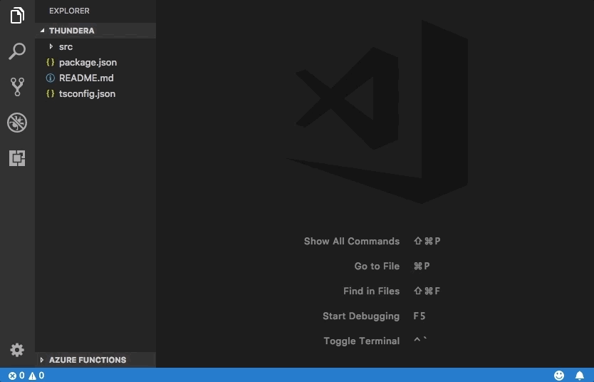
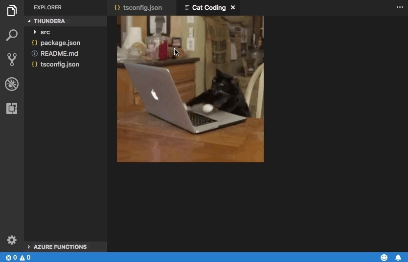
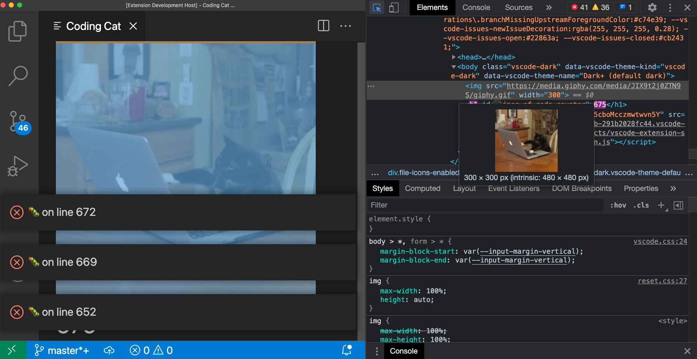
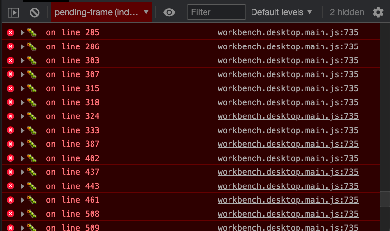
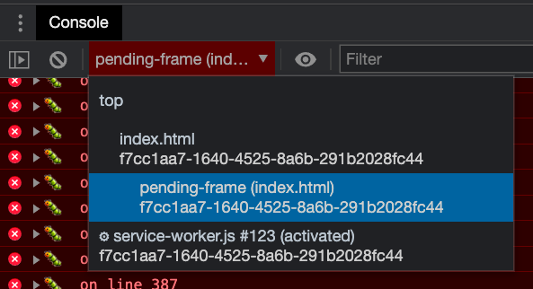
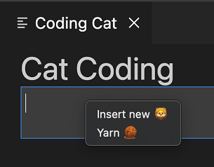
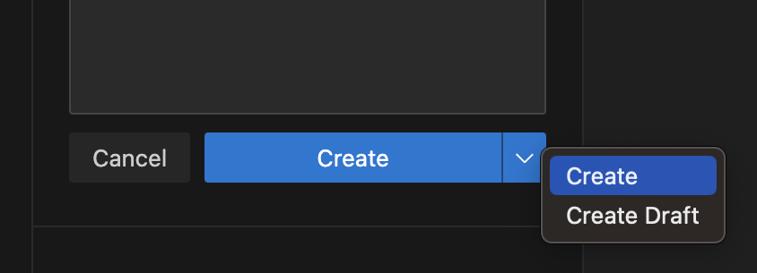
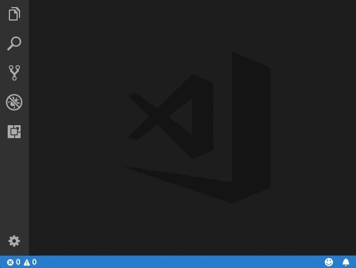
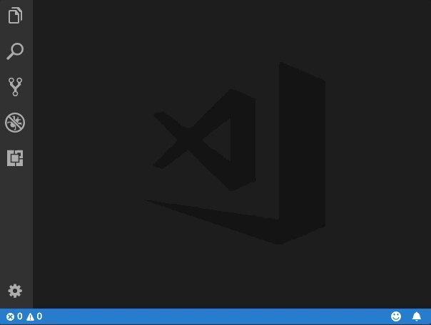
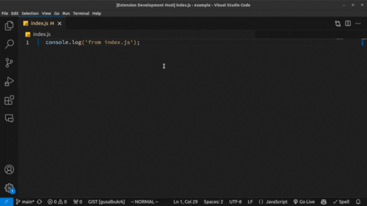

<!-- more -->

# [Webview API](https://vscode.js.cn/api/extension-guides/webview)

Webview API 允许扩展在 Visual Studio Code 中创建完全可定制的视图。例如，内置的 Markdown 扩展使用 webview 来渲染 Markdown 预览。Webview 也可以用于构建超出 VS Code 原生 API 支持的复杂用户界面。

可以将 webview 视为 VS Code 中由你的扩展控制的 `iframe`。Webview 可以在此框架中渲染几乎任何 HTML 内容，并使用消息传递与扩展通信。这种自由使 webview 变得极其强大，并开辟了全新的扩展可能性。

Webview 在多个 VS Code API 中使用

- 通过使用 `createWebviewPanel` 创建的 Webview 面板。在这种情况下，Webview 面板在 VS Code 中作为独立的编辑器显示。这使得它们适用于显示自定义 UI 和自定义可视化。
- 作为[自定义编辑器](https://vscode.js.cn/api/extension-guides/custom-editors)的视图。自定义编辑器允许扩展为工作区中的任何文件提供自定义 UI 进行编辑。自定义编辑器 API 还允许你的扩展挂钩到编辑器事件，例如撤销和重做，以及文件事件，例如保存。
- 在侧边栏或面板区域渲染的[Webview 视图](https://vscode.js.cn/api/references/vscode-api#WebviewView)中。有关更多详细信息，请参阅[webview 视图示例扩展](https://github.com/microsoft/vscode-extension-samples/tree/main/webview-view-sample)。

本页重点介绍基本的 webview 面板 API，尽管这里涵盖的几乎所有内容也适用于自定义编辑器和 webview 视图中使用的 webview。即使你对这些 API 更感兴趣，我们也建议你先通读本页，熟悉 webview 的基础知识。

## [链接](https://vscode.js.cn/api/extension-guides/webview#links)

- [Webview 示例](https://github.com/microsoft/vscode-extension-samples/blob/main/webview-sample/README.md)
- [自定义编辑器文档](https://vscode.js.cn/api/extension-guides/custom-editors)
- [Webview 视图示例](https://github.com/microsoft/vscode-extension-samples/tree/main/webview-view-sample)

### [VS Code API 用法](https://vscode.js.cn/api/extension-guides/webview#vs-code-api-usage)

- [`window.createWebviewPanel`](https://vscode.js.cn/api/references/vscode-api#window.createWebviewPanel)
- [`window.registerWebviewPanelSerializer`](https://vscode.js.cn/api/references/vscode-api#window.registerWebviewPanelSerializer)

## [我应该使用 Webview 吗？](https://vscode.js.cn/api/extension-guides/webview#should-i-use-a-webview)

Webview 非常棒，但它们也应该谨慎使用，并且只在 VS Code 的原生 API 不足时才使用。Webview 资源消耗大，并且与普通扩展在不同的上下文中运行。设计不佳的 webview 也很容易在 VS Code 中显得格格不入。

在使用 webview 之前，请考虑以下事项

- 此功能真的需要在 VS Code 内运行吗？作为独立的应用程序或网站会更好吗？
- Webview 是实现你的功能的唯一方式吗？你能否使用常规的 VS Code API 替代？
- 你的 webview 是否能增加足够的Although `retainContextWhenHidden` may be appealing, keep in mind that this has high memory overhead and should only be used when other persistence techniques will not work.用户价值以证明其高资源成本？

记住：仅仅因为你可以用 webview 做某事，并不意味着你应该这样做。但是，如果你确信需要使用 webview，那么本文将为你提供帮助。让我们开始吧。

## [Webview API 基础](https://vscode.js.cn/api/extension-guides/webview#webviews-api-basics)

为了解释 webview API，我们将构建一个名为 **Cat Coding** 的简单扩展。此扩展将使用 webview 来显示一只猫编写代码（可能是在 VS Code 中）的 gif。在学习 API 的过程中，我们将继续向扩展添加功能，包括一个跟踪猫编写了多少行源代码的计数器，以及在猫引入 bug 时通知用户的通知。

以下是 **Cat Coding** 扩展第一个版本的 `package.json`。你可以在[这里](https://github.com/microsoft/vscode-extension-samples/blob/main/webview-sample/README.md)找到示例应用程序的完整代码。我们扩展的第一个版本[贡献了一个名为 `catCoding.start` 的命令](https://vscode.js.cn/api/references/contribution-points#contributes.commands)。当用户调用此命令时，我们将显示一个简单的 webview，其中包含我们的猫。用户可以从**命令面板**调用此命令，例如**Cat Coding: Start new cat coding session**，如果他们愿意，甚至可以为其创建键盘快捷键。

```json
{
  "name": "cat-coding",
  "description": "Cat Coding",
  "version": "0.0.1",
  "publisher": "bierner",
  "engines": {
    "vscode": "^1.74.0"
  },
  "activationEvents": [],
  "main": "./out/extension.js",
  "contributes": {
    "commands": [
      {
        "command": "catCoding.start",
        "title": "Start new cat coding session",
        "category": "Cat Coding"
      }
    ]
  },
  "scripts": {
    "vscode:prepublish": "tsc -p ./",
    "compile": "tsc -watch -p ./",
    "postinstall": "node ./node_modules/vscode/bin/install"
  },
  "dependencies": {
    "vscode": "*"
  },
  "devDependencies": {
    "@types/node": "^9.4.6",
    "typescript": "^2.8.3"
  }
}
```

> **注意**：如果你的扩展针对的是 1.74 之前的 VS Code 版本，则必须在 `activationEvents` 中明确列出 `onCommand:catCoding.start`。

现在让我们实现 `catCoding.start` 命令。在我们的扩展主文件中，我们注册 `catCoding.start` 命令并用它来显示一个基本的 webview

```typescript
import * as vscode from 'vscode';

export function activate(context: vscode.ExtensionContext) {
  context.subscriptions.push(
    vscode.commands.registerCommand('catCoding.start', () => {
      // Create and show a new webview
      const panel = vscode.window.createWebviewPanel(
        'catCoding', // Identifies the type of the webview. Used internally
        'Cat Coding', // Title of the panel displayed to the user
        vscode.ViewColumn.One, // Editor column to show the new webview panel in.
        {} // Webview options. More on these later.
      );
    })
  );
}
```

`vscode.window.createWebviewPanel` 函数在编辑器中创建并显示一个 webview。如果你尝试运行当前状态的 `catCoding.start` 命令，你会看到以下内容


我们的命令打开了一个带有正确标题的新 webview 面板，但没有内容！要将我们的猫添加到新面板，我们还需要使用 `webview.html` 设置 webview 的 HTML 内容

```typescript
import * as vscode from 'vscode';

export function activate(context: vscode.ExtensionContext) {
  context.subscriptions.push(
    vscode.commands.registerCommand('catCoding.start', () => {
      // Create and show panel
      const panel = vscode.window.createWebviewPanel(
        'catCoding',
        'Cat Coding',
        vscode.ViewColumn.One,
        {}
      );

      // And set its HTML content
      panel.webview.html = getWebviewContent();
    })
  );
}

function getWebviewContent() {
  return `<!DOCTYPE html>
<html lang="en">
<head>
    <meta charset="UTF-8">
    <meta name="viewport" content="width=device-width, initial-scale=1.0">
    <title>Cat Coding</title>
</head>
<body>
    
</body>
</html>`;
}
```

如果你再次运行该命令，现在 webview 看起来像这样


有进展！

`webview.html` 应始终是一个完整的 HTML 文档。HTML 片段或格式错误的 HTML 可能会导致意外行为。

### [更新 webview 内容](https://vscode.js.cn/api/extension-guides/webview#updating-webview-content)

`webview.html` 也可以在 webview 创建后更新其内容。让我们用这个来让 **Cat Coding** 更具动态性，引入猫的轮换

```typescript
import * as vscode from 'vscode';

const cats = {
  'Coding Cat': 'https://media.giphy.com/media/JIX9t2j0ZTN9S/giphy.gif',
  'Compiling Cat': 'https://media.giphy.com/media/mlvseq9yvZhba/giphy.gif'
};

export function activate(context: vscode.ExtensionContext) {
  context.subscriptions.push(
    vscode.commands.registerCommand('catCoding.start', () => {
      const panel = vscode.window.createWebviewPanel(
        'catCoding',
        'Cat Coding',
        vscode.ViewColumn.One,
        {}
      );

      let iteration = 0;
      const updateWebview = () => {
        const cat = iteration++ % 2 ? 'Compiling Cat' : 'Coding Cat';
        panel.title = cat;
        panel.webview.html = getWebviewContent(cat);
      };

      // Set initial content
      updateWebview();

      // And schedule updates to the content every second
      setInterval(updateWebview, 1000);
    })
  );
}

function getWebviewContent(cat: keyof typeof cats) {
  return `<!DOCTYPE html>
<html lang="en">
<head>
    <meta charset="UTF-8">
    <meta name="viewport" content="width=device-width, initial-scale=1.0">
    <title>Cat Coding</title>
</head>
<body>
    
</body>
</html>`;
}
```



设置 `webview.html` 会替换整个 webview 内容，类似于重新加载 iframe。一旦开始在 webview 中使用脚本，记住这一点很重要，因为它意味着设置 `webview.html` 也会重置脚本的状态。

上面的例子还使用 `webview.title` 更改编辑器中显示的文档标题。设置标题不会导致 webview 重新加载。

### [生命周期](https://vscode.js.cn/api/extension-guides/webview#lifecycle)

Webview 面板归创建它们的扩展所有。扩展必须持有从 `createWebviewPanel` 返回的 webview 引用。如果你的扩展失去此引用，它将无法再次访问该 webview，即使该 webview 将继续在 VS Code 中显示。

与文本编辑器一样，用户也可以随时关闭 webview 面板。当用户关闭 webview 面板时，webview 本身会被销毁。尝试使用已销毁的 webview 会抛出异常。这意味着上面使用 `setInterval` 的示例实际上有一个重要的 bug：如果用户关闭面板，`setInterval` 将继续触发，这将尝试更新 `panel.webview.html`，这当然会抛出异常。猫讨厌异常。让我们修复它！

当 webview 被销毁时，会触发 `onDidDispose` 事件。我们可以使用此事件来取消进一步的更新并清理 webview 的资源

```typescript
import * as vscode from 'vscode';

const cats = {
  'Coding Cat': 'https://media.giphy.com/media/JIX9t2j0ZTN9S/giphy.gif',
  'Compiling Cat': 'https://media.giphy.com/media/mlvseq9yvZhba/giphy.gif'
};

export function activate(context: vscode.ExtensionContext) {
  context.subscriptions.push(
    vscode.commands.registerCommand('catCoding.start', () => {
      const panel = vscode.window.createWebviewPanel(
        'catCoding',
        'Cat Coding',
        vscode.ViewColumn.One,
        {}
      );

      let iteration = 0;
      const updateWebview = () => {
        const cat = iteration++ % 2 ? 'Compiling Cat' : 'Coding Cat';
        panel.title = cat;
        panel.webview.html = getWebviewContent(cat);
      };

      updateWebview();
      const interval = setInterval(updateWebview, 1000);

      panel.onDidDispose(
        () => {
          // When the panel is closed, cancel any future updates to the webview content
          clearInterval(interval);
        },
        null,
        context.subscriptions
      );
    })
  );
}
```

扩展还可以通过调用 `dispose()` 以编程方式关闭 webview。例如，如果我们想将猫的工作日限制在五秒内

```typescript
export function activate(context: vscode.ExtensionContext) {
  context.subscriptions.push(
    vscode.commands.registerCommand('catCoding.start', () => {
      const panel = vscode.window.createWebviewPanel(
        'catCoding',
        'Cat Coding',
        vscode.ViewColumn.One,
        {}
      );

      panel.webview.html = getWebviewContent('Coding Cat');

      // After 5sec, programmatically close the webview panel
      const timeout = setTimeout(() => panel.dispose(), 5000);

      panel.onDidDispose(
        () => {
          // Handle user closing panel before the 5sec have passed
          clearTimeout(timeout);
        },
        null,
        context.subscriptions
      );
    })
  );
}
```

### [可见性和移动](https://vscode.js.cn/api/extension-guides/webview#visibility-and-moving)

当 webview 面板移至后台选项卡时，它会变为隐藏。但它不会被销毁。当面板再次带到前台时，VS Code 将自动从 `webview.html` 恢复 webview 的内容



`.visible` 属性告诉你 webview 面板当前是否可见。

扩展可以通过调用 `reveal()` 以编程方式将 webview 面板带到前台。此方法接受一个可选的目标视图列以显示面板。一个 webview 面板一次只能显示在一个编辑器列中。调用 `reveal()` 或将 webview 面板拖到新编辑器列会将其移动到该新列。


让我们更新我们的扩展，使其一次只允许存在一个 webview。如果面板在后台，则 `catCoding.start` 命令会将其带到前台

```typescript
export function activate(context: vscode.ExtensionContext) {
  // Track the current panel with a webview
  let currentPanel: vscode.WebviewPanel | undefined = undefined;

  context.subscriptions.push(
    vscode.commands.registerCommand('catCoding.start', () => {
      const columnToShowIn = vscode.window.activeTextEditor
        ? vscode.window.activeTextEditor.viewColumn
        : undefined;

      if (currentPanel) {
        // If we already have a panel, show it in the target column
        currentPanel.reveal(columnToShowIn);
      } else {
        // Otherwise, create a new panel
        currentPanel = vscode.window.createWebviewPanel(
          'catCoding',
          'Cat Coding',
          columnToShowIn || vscode.ViewColumn.One,
          {}
        );
        currentPanel.webview.html = getWebviewContent('Coding Cat');

        // Reset when the current panel is closed
        currentPanel.onDidDispose(
          () => {
            currentPanel = undefined;
          },
          null,
          context.subscriptions
        );
      }
    })
  );
}
```

这是新扩展的实际操作


每当 webview 的可见性发生变化，或 webview 移动到新列时，都会触发 `onDidChangeViewState` 事件。我们的扩展可以使用此事件根据 webview 显示的列来更改猫咪

```typescript
const cats = {
  'Coding Cat': 'https://media.giphy.com/media/JIX9t2j0ZTN9S/giphy.gif',
  'Compiling Cat': 'https://media.giphy.com/media/mlvseq9yvZhba/giphy.gif',
  'Testing Cat': 'https://media.giphy.com/media/3oriO0OEd9QIDdllqo/giphy.gif'
};

export function activate(context: vscode.ExtensionContext) {
  context.subscriptions.push(
    vscode.commands.registerCommand('catCoding.start', () => {
      const panel = vscode.window.createWebviewPanel(
        'catCoding',
        'Cat Coding',
        vscode.ViewColumn.One,
        {}
      );
      panel.webview.html = getWebviewContent('Coding Cat');

      // Update contents based on view state changes
      panel.onDidChangeViewState(
        e => {
          const panel = e.webviewPanel;
          switch (panel.viewColumn) {
            case vscode.ViewColumn.One:
              updateWebviewForCat(panel, 'Coding Cat');
              return;

            case vscode.ViewColumn.Two:
              updateWebviewForCat(panel, 'Compiling Cat');
              return;

            case vscode.ViewColumn.Three:
              updateWebviewForCat(panel, 'Testing Cat');
              return;
          }
        },
        null,
        context.subscriptions
      );
    })
  );
}

function updateWebviewForCat(panel: vscode.WebviewPanel, catName: keyof typeof cats) {
  panel.title = catName;
  panel.webview.html = getWebviewContent(catName);
}
```


### [检查和调试 webview](https://vscode.js.cn/api/extension-guides/webview#inspecting-and-debugging-webviews)

**Developer: Toggle Developer Tools** 命令会打开一个[开发者工具](https://developer.chrome.com/docs/devtools/)窗口，你可以使用它来调试和检查你的 webview。



请注意，如果你使用的 VS Code 版本低于 1.56，或者你正在尝试调试一个设置了 `enableFindWidget` 的 webview，则必须改用 **Developer: Open Webview Developer Tools** 命令。此命令会为每个 webview 打开一个专用的开发者工具页面，而不是使用所有 webview 和编辑器本身共享的开发者工具页面。

从开发者工具中，你可以使用开发者工具窗口左上角的检查工具开始检查 webview 的内容


你还可以在开发者工具控制台中查看 webview 的所有错误和日志



要在 webview 的上下文中评估表达式，请务必从开发者工具控制台面板左上角的下拉菜单中选择**active frame**环境



**活动帧**环境是 webview 脚本本身执行的地方。

此外，**Developer: Reload Webview** 命令会重新加载所有活动的 webview。如果你需要重置 webview 的状态，或者磁盘上某些 webview 内容已更改并且你希望加载新内容，这会很有帮助。

## [加载本地内容](https://vscode.js.cn/api/extension-guides/webview#loading-local-content)

Webview 在隔离的上下文中运行，无法直接访问本地资源。这是出于安全原因。这意味着为了从你的扩展中加载图像、样式表和其他资源，或者加载用户当前工作区中的任何内容，你必须使用 `Webview.asWebviewUri` 函数将本地 `file:` URI 转换为 VS Code 可以用来加载本地资源子集的特殊 URI。

想象一下，我们想开始将猫咪 GIF 打包到我们的扩展中，而不是从 Giphy 获取它们。为此，我们首先创建一个指向磁盘上文件的 URI，然后将这些 URI 通过 `asWebviewUri` 函数传递

```typescript
import * as vscode from 'vscode';

export function activate(context: vscode.ExtensionContext) {
  context.subscriptions.push(
    vscode.commands.registerCommand('catCoding.start', () => {
      const panel = vscode.window.createWebviewPanel(
        'catCoding',
        'Cat Coding',
        vscode.ViewColumn.One,
        {}
      );

      // Get path to resource on disk
      const onDiskPath = vscode.Uri.joinPath(context.extensionUri, 'media', 'cat.gif');

      // And get the special URI to use with the webview
      const catGifSrc = panel.webview.asWebviewUri(onDiskPath);

      panel.webview.html = getWebviewContent(catGifSrc);
    })
  );
}

function getWebviewContent(catGifSrc: vscode.Uri) {
  return `<!DOCTYPE html>
<html lang="en">
<head>
    <meta charset="UTF-8">
    <meta name="viewport" content="width=device-width, initial-scale=1.0">
    <title>Cat Coding</title>
</head>
<body>
    
</body>
</html>`;
}
```

如果调试此代码，我们会发现 `catGifSrc` 的实际值类似于

```typescript
vscode-resource:/Users/toonces/projects/vscode-cat-coding/media/cat.gif
```

VS Code 理解这个特殊的 URI，并将使用它从磁盘加载我们的 gif！

默认情况下，webview 只能访问以下位置的资源

- 在你的扩展安装目录内。
- 在用户当前活动的工作区内。

使用 `WebviewOptions.localResourceRoots` 允许访问其他本地资源。

你也可以始终使用数据 URI 将资源直接嵌入到 webview 中。

### [控制对本地资源的访问](https://vscode.js.cn/api/extension-guides/webview#controlling-access-to-local-resources)

Webview 可以使用 `localResourceRoots` 选项控制可以从用户机器加载哪些资源。`localResourceRoots` 定义了一组根 URI，可以从这些 URI 加载本地内容。

我们可以使用 `localResourceRoots` 将 **Cat Coding** webview 限制为只能从我们扩展中的 `media` 目录加载资源

```typescript
import * as vscode from 'vscode';

export function activate(context: vscode.ExtensionContext) {
  context.subscriptions.push(
    vscode.commands.registerCommand('catCoding.start', () => {
      const panel = vscode.window.createWebviewPanel(
        'catCoding',
        'Cat Coding',
        vscode.ViewColumn.One,
        {
          // Only allow the webview to access resources in our extension's media directory
          localResourceRoots: [vscode.Uri.joinPath(context.extensionUri, 'media')]
        }
      );

      const onDiskPath = vscode.Uri.joinPath(context.extensionUri, 'media', 'cat.gif');
      const catGifSrc = panel.webview.asWebviewUri(onDiskPath);

      panel.webview.html = getWebviewContent(catGifSrc);
    })
  );
}
```

要禁用所有本地资源，只需将 `localResourceRoots` 设置为 `[]`。

通常，webview 在加载本地资源时应尽可能严格。但是，请记住 `localResourceRoots` 本身并不能提供完整的安全保护。确保你的 webview 还遵循[安全最佳实践](https://vscode.js.cn/api/extension-guides/webview#security)，并添加[内容安全策略](https://vscode.js.cn/api/extension-guides/webview#content-security-policy)以进一步限制可以加载的内容。

### [为 webview 内容设置主题](https://vscode.js.cn/api/extension-guides/webview#theming-webview-content)

Webview 可以使用 CSS 根据 VS Code 的当前主题更改其外观。VS Code 将主题分为三类，并向 `body` 元素添加一个特殊类来指示当前主题

- `vscode-light` - 浅色主题。
- `vscode-dark` - 深色主题。
- `vscode-high-contrast` - 高对比度主题。

以下 CSS 根据用户的当前主题更改 webview 的文本颜色

```css
body.vscode-light {
  color: black;
}

body.vscode-dark {
  color: white;
}

body.vscode-high-contrast {
  color: red;
}
```

在开发 webview 应用程序时，请确保它适用于这三种类型的主题。并且始终在高对比度模式下测试你的 webview，以确保视障人士可以使用它。

Webview 还可以使用[CSS 变量](https://mdn.org.cn/docs/Web/CSS/Using_CSS_variables)访问 VS Code 主题颜色。这些变量名称以 `vscode` 为前缀，并将 `.` 替换为 `-`。例如，`editor.foreground` 变为 `var(--vscode-editor-foreground)`

```css
code {
  color: var(--vscode-editor-foreground);
}
```

查阅[主题颜色参考](https://vscode.js.cn/api/references/theme-color)以获取可用的主题变量。[有一个扩展](https://marketplace.visualstudio.com/items?itemName=connor4312.css-theme-completions)提供这些变量的 IntelliSense 建议。

还定义了以下与字体相关的变量

- `--vscode-editor-font-family` - 编辑器字体家族（来自 `editor.fontFamily` 设置）。
- `--vscode-editor-font-weight` - 编辑器字体粗细（来自 `editor.fontWeight` 设置）。
- `--vscode-editor-font-size` - 编辑器字体大小（来自 `editor.fontSize` 设置）。

最后，对于需要编写针对单一主题的 CSS 的特殊情况，webview 的 body 元素有一个名为 `vscode-theme-id` 的数据属性，它存储当前活动主题的 ID。这允许你为 webview 编写主题特定的 CSS

```css
body[data-vscode-theme-id="One Dark Pro"] {
    background: hotpink;
}
```

### [支持的媒体格式](https://vscode.js.cn/api/extension-guides/webview#supported-media-formats)

Webview 支持音频和视频，但并非所有媒体编解码器或媒体文件容器类型都受支持。

以下音频格式可在 Webview 中使用

- Wav
- Mp3
- Ogg
- Flac

以下视频格式可在 webview 中使用

- H.264
- VP8

对于视频文件，请确保视频和音频轨道的媒体格式都受支持。例如，许多 `.mp4` 文件使用 `H.264` 作为视频，`AAC` 作为音频。VS Code 将能够播放 `mp4` 的视频部分，但由于不支持 `AAC` 音频，因此不会有声音。相反，你需要将 `mp3` 用于音轨。

### [上下文菜单](https://vscode.js.cn/api/extension-guides/webview#context-menus)

高级 webview 可以自定义用户在 webview 内右键单击时显示的上下文菜单。这是通过[贡献点](https://vscode.js.cn/api/references/contribution-points)完成的，类似于 VS Code 的常规上下文菜单，因此自定义菜单与编辑器的其他部分完美契合。Webview 还可以为 webview 的不同部分显示自定义上下文菜单。

要向 webview 添加新的上下文菜单项，首先在 `menus` 下的新 `webview/context` 部分添加一个新条目。每个贡献都包含一个 `command`（也是项目标题的来源）和一个 `when` 子句。[when 子句](https://vscode.js.cn/api/references/when-clause-contexts)应包含 `webviewId == 'YOUR_WEBVIEW_VIEW_TYPE'`，以确保上下文菜单仅适用于你的扩展的 webview

```json
"contributes": {
  "menus": {
    "webview/context": [
      {
        "command": "catCoding.yarn",
        "when": "webviewId == 'catCoding'"
      },
      {
        "command": "catCoding.insertLion",
        "when": "webviewId == 'catCoding' && webviewSection == 'editor'"
      }
    ]
  },
  "commands": [
    {
      "command": "catCoding.yarn",
      "title": "Yarn 🧶",
      "category": "Cat Coding"
    },
    {
      "command": "catCoding.insertLion",
      "title": "Insert 🦁",
      "category": "Cat Coding"
    },
    ...
  ]
}
```

在 webview 内部，你还可以使用 `data-vscode-context` [数据属性](https://mdn.org.cn/docs/Learn/HTML/Howto/Use_data_attributes)（或在 JavaScript 中使用 `dataset.vscodeContext`）设置 HTML 特定区域的上下文。`data-vscode-context` 的值是一个 JSON 对象，它指定当用户右键单击元素时要设置的上下文。最终上下文是通过从文档根目录到单击的元素来确定的。

例如，考虑以下 HTML

```html
<div class="main" data-vscode-context='{"webviewSection": "main", "mouseCount": 4}'>
  <h1>Cat Coding</h1>

  <textarea data-vscode-context='{"webviewSection": "editor", "preventDefaultContextMenuItems": true}'></textarea>
</div>
```

如果用户右键单击 `textarea`，将设置以下上下文

- `webviewSection == 'editor'` - 这会覆盖父元素中的 `webviewSection`。
- `mouseCount == 4` - 这是从父元素继承的。
- `preventDefaultContextMenuItems == true` - 这是一个特殊上下文，它会隐藏 VS Code 通常添加到 webview 上下文菜单中的复制和粘贴条目。

如果用户在 `<textarea>` 内右键单击，他们将看到



有时，在左键/主点击时显示菜单会很有用。例如，在拆分按钮上显示菜单。你可以通过在 `onClick` 事件中分派 `contextmenu` 事件来实现此目的

```html
<button data-vscode-context='{"preventDefaultContextMenuItems": true }' onClick='((e) => {
        e.preventDefault();
        e.target.dispatchEvent(new MouseEvent("contextmenu", { bubbles: true, clientX: e.clientX, clientY: e.clientY }));
        e.stopPropagation();
    })(event)'>Create</button>
```



## [脚本和消息传递](https://vscode.js.cn/api/extension-guides/webview#scripts-and-message-passing)

Webview 就像 iframe 一样，这意味着它们也可以运行脚本。Webview 中的 JavaScript 默认是禁用的，但可以通过传入 `enableScripts: true` 选项轻松重新启用。

让我们用一个脚本来添加一个计数器，跟踪我们的猫编写了多少行源代码。运行一个基本脚本非常简单，但请注意，这个例子仅用于演示目的。在实践中，你的 webview 应该始终使用[内容安全策略](https://vscode.js.cn/api/extension-guides/webview#content-security-policy)禁用内联脚本

```typescript
import * as path from 'path';
import * as vscode from 'vscode';

export function activate(context: vscode.ExtensionContext) {
  context.subscriptions.push(
    vscode.commands.registerCommand('catCoding.start', () => {
      const panel = vscode.window.createWebviewPanel(
        'catCoding',
        'Cat Coding',
        vscode.ViewColumn.One,
        {
          // Enable scripts in the webview
          enableScripts: true
        }
      );

      panel.webview.html = getWebviewContent();
    })
  );
}

function getWebviewContent() {
  return `<!DOCTYPE html>
<html lang="en">
<head>
    <meta charset="UTF-8">
    <meta name="viewport" content="width=device-width, initial-scale=1.0">
    <title>Cat Coding</title>
</head>
<body>
    
    <h1 id="lines-of-code-counter">0</h1>

    <script>
        const counter = document.getElementById('lines-of-code-counter');

        let count = 0;
        setInterval(() => {
            counter.textContent = count++;
        }, 100);
    </script>
</body>
</html>`;
}
```



哇！那真是一只高产的猫。

Webview 脚本可以做普通网页脚本可以做的任何事情。但请记住，webview 存在于它们自己的上下文中，因此 webview 中的脚本无法访问 VS Code API。这就是消息传递的用武之地！

### [从扩展向 webview 传递消息](https://vscode.js.cn/api/extension-guides/webview#passing-messages-from-an-extension-to-a-webview)

扩展可以使用 `webview.postMessage()` 向其 webview 发送数据。此方法将任何 JSON 可序列化的数据发送到 webview。消息通过标准的 `message` 事件在 webview 内部接收。

为了演示这一点，让我们为 **Cat Coding** 添加一个新命令，指示当前编码的猫重构其代码（从而减少总行数）。新的 `catCoding.doRefactor` 命令将使用 `postMessage` 将指令发送到当前 webview，并在 webview 内部使用 `window.addEventListener('message', event => { ... })` 来处理消息

```typescript
export function activate(context: vscode.ExtensionContext) {
  // Only allow a single Cat Coder
  let currentPanel: vscode.WebviewPanel | undefined = undefined;

  context.subscriptions.push(
    vscode.commands.registerCommand('catCoding.start', () => {
      if (currentPanel) {
        currentPanel.reveal(vscode.ViewColumn.One);
      } else {
        currentPanel = vscode.window.createWebviewPanel(
          'catCoding',
          'Cat Coding',
          vscode.ViewColumn.One,
          {
            enableScripts: true
          }
        );
        currentPanel.webview.html = getWebviewContent();
        currentPanel.onDidDispose(
          () => {
            currentPanel = undefined;
          },
          undefined,
          context.subscriptions
        );
      }
    })
  );

  // Our new command
  context.subscriptions.push(
    vscode.commands.registerCommand('catCoding.doRefactor', () => {
      if (!currentPanel) {
        return;
      }

      // Send a message to our webview.
      // You can send any JSON serializable data.
      currentPanel.webview.postMessage({ command: 'refactor' });
    })
  );
}

function getWebviewContent() {
  return `<!DOCTYPE html>
<html lang="en">
<head>
    <meta charset="UTF-8">
    <meta name="viewport" content="width=device-width, initial-scale=1.0">
    <title>Cat Coding</title>
</head>
<body>
    
    <h1 id="lines-of-code-counter">0</h1>

    <script>
        const counter = document.getElementById('lines-of-code-counter');

        let count = 0;
        setInterval(() => {
            counter.textContent = count++;
        }, 100);

        // Handle the message inside the webview
        window.addEventListener('message', event => {

            const message = event.data; // The JSON data our extension sent

            switch (message.command) {
                case 'refactor':
                    count = Math.ceil(count * 0.5);
                    counter.textContent = count;
                    break;
            }
        });
    </script>
</body>
</html>`;
}
```


### [从 webview 向扩展传递消息](https://vscode.js.cn/api/extension-guides/webview#passing-messages-from-a-webview-to-an-extension)

Webview 也可以将消息传回给它们的扩展。这是通过在 webview 内的特殊 VS Code API 对象上使用 `postMessage` 函数来实现的。要访问 VS Code API 对象，请在 webview 内调用 `acquireVsCodeApi`。此函数每个会话只能调用一次。你必须保留此方法返回的 VS Code API 实例，并将其提供给需要使用它的任何其他函数。

我们可以在我们的 **Cat Coding** webview 中使用 VS Code API 和 `postMessage`，以便在我们的猫咪代码中引入 bug 时提醒扩展

```typescript
export function activate(context: vscode.ExtensionContext) {
  context.subscriptions.push(
    vscode.commands.registerCommand('catCoding.start', () => {
      const panel = vscode.window.createWebviewPanel(
        'catCoding',
        'Cat Coding',
        vscode.ViewColumn.One,
        {
          enableScripts: true
        }
      );

      panel.webview.html = getWebviewContent();

      // Handle messages from the webview
      panel.webview.onDidReceiveMessage(
        message => {
          switch (message.command) {
            case 'alert':
              vscode.window.showErrorMessage(message.text);
              return;
          }
        },
        undefined,
        context.subscriptions
      );
    })
  );
}

function getWebviewContent() {
  return `<!DOCTYPE html>
<html lang="en">
<head>
    <meta charset="UTF-8">
    <meta name="viewport" content="width=device-width, initial-scale=1.0">
    <title>Cat Coding</title>
</head>
<body>
    
    <h1 id="lines-of-code-counter">0</h1>

    <script>
        (function() {
            const vscode = acquireVsCodeApi();
            const counter = document.getElementById('lines-of-code-counter');

            let count = 0;
            setInterval(() => {
                counter.textContent = count++;

                // Alert the extension when our cat introduces a bug
                if (Math.random() < 0.001 * count) {
                    vscode.postMessage({
                        command: 'alert',
                        text: '🐛  on line ' + count
                    })
                }
            }, 100);
        }())
    </script>
</body>
</html>`;
}
```



出于安全原因，你必须将 VS Code API 对象设为私有，并确保它永远不会泄露到全局范围。

### [使用 Web Workers](https://vscode.js.cn/api/extension-guides/webview#using-web-workers)

[Web Workers](https://mdn.org.cn/docs/Web/API/Web_Workers_API/Using_web_workers) 在 webview 中受支持，但需要注意一些重要的限制。

首先，Workers 只能使用 `data:` 或 `blob:` URI 加载。你不能直接从扩展文件夹加载 Worker。

如果你确实需要从扩展中的 JavaScript 文件加载 Worker 代码，请尝试使用 `fetch`

```typescript
const workerSource = 'absolute/path/to/worker.js';

fetch(workerSource)
  .then(result => result.blob())
  .then(blob => {
    const blobUrl = URL.createObjectURL(blob);
    new Worker(blobUrl);
  });
```

Worker 脚本也不支持使用 `importScripts` 或 `import(...)` 导入源代码。如果你的 Worker 动态加载代码，请尝试使用打包工具（如 [webpack](https://webpack.js.cn/)）将 Worker 脚本打包成单个文件。

使用 `webpack`，你可以使用 `LimitChunkCountPlugin` 强制编译后的 worker JavaScript 为单个文件

```typescript
const path = require('path');
const webpack = require('webpack');

module.exports = {
  target: 'webworker',
  entry: './worker/src/index.js',
  output: {
    filename: 'worker.js',
    path: path.resolve(__dirname, 'media')
  },
  plugins: [
    new webpack.optimize.LimitChunkCountPlugin({
      maxChunks: 1
    })
  ]
};
```

## [安全](https://vscode.js.cn/api/extension-guides/webview#security)

与任何网页一样，在创建 webview 时，你必须遵循一些基本的安全最佳实践。

### [限制功能](https://vscode.js.cn/api/extension-guides/webview#limit-capabilities)

Webview 应拥有其所需的最小功能集。例如，如果你的 webview 不需要运行脚本，请勿设置 `enableScripts: true`。如果你的 webview 不需要从用户工作区加载资源，请将 `localResourceRoots` 设置为 `[vscode.Uri.file(extensionContext.extensionPath)]` 甚至 `[]` 以禁止访问所有本地资源。

### [内容安全策略](https://vscode.js.cn/api/extension-guides/webview#content-security-policy)

[内容安全策略](https://developers.google.com/web/fundamentals/security/csp/)进一步限制了可以在 webview 中加载和执行的内容。例如，内容安全策略可以确保只有允许的脚本列表才能在 webview 中运行，甚至可以告诉 webview 只通过 `https` 加载图像。

要添加内容安全策略，请在 webview 的 `<head>` 顶部放置一个 `<meta http-equiv="Content-Security-Policy">` 指令

```typescript
function getWebviewContent() {
  return `<!DOCTYPE html>
<html lang="en">
<head>
    <meta charset="UTF-8">

    <meta http-equiv="Content-Security-Policy" content="default-src 'none';">

    <meta name="viewport" content="width=device-width, initial-scale=1.0">

    <title>Cat Coding</title>
</head>
<body>
    ...
</body>
</html>`;
}
```

策略 `default-src 'none';` 禁止所有内容。然后，我们可以重新启用扩展所需的最少内容。以下是一个内容安全策略，它允许加载本地脚本和样式表，并通过 `https` 加载图像

```html
<meta
  http-equiv="Content-Security-Policy"
  content="default-src 'none'; img-src ${webview.cspSource} https:; script-src ${webview.cspSource}; style-src ${webview.cspSource};"
/>
```

`${webview.cspSource}` 值是来自 webview 对象本身的占位符。有关如何使用此值的完整示例，请参阅[webview 示例](https://github.com/microsoft/vscode-extension-samples/blob/main/webview-sample)。

此内容安全策略也隐式禁用内联脚本和样式。最佳实践是将所有内联样式和脚本提取到外部文件，以便它们可以在不放松内容安全策略的情况下正确加载。

### [仅通过 https 加载内容](https://vscode.js.cn/api/extension-guides/webview#only-load-content-over-https)

如果你的 webview 允许加载外部资源，强烈建议你只允许这些资源通过 `https` 而不是 http 加载。上面的示例内容安全策略已经通过只允许通过 `https:` 加载图像来实现这一点。

### [清理所有用户输入](https://vscode.js.cn/api/extension-guides/webview#sanitize-all-user-input)

就像你在普通网页上一样，在为 webview 构建 HTML 时，你必须对所有用户输入进行清理。未能正确清理输入可能会导致内容注入，从而使你的用户面临安全风险。

必须清理的示例值

- 文件内容。
- 文件和文件夹路径。
- 用户和工作区设置。

考虑使用辅助库来构建你的 HTML 字符串，或者至少确保来自用户工作区的所有内容都经过适当的清理。

切勿单独依赖清理来保障安全。务必遵循其他安全最佳实践，例如设置[内容安全策略](https://vscode.js.cn/api/extension-guides/webview#content-security-policy)，以最大程度地减少任何潜在内容注入的影响。

## [持久化](https://vscode.js.cn/api/extension-guides/webview#persistence)

在标准的 webview [生命周期](https://vscode.js.cn/api/extension-guides/webview#lifecycle)中，webview 由 `createWebviewPanel` 创建，并在用户关闭或调用 `.dispose()` 时销毁。但是，webview 的内容在 webview 变为可见时创建，并在 webview 移至后台时销毁。当 webview 移至后台选项卡时，webview 内部的任何状态都将丢失。

解决此问题的最佳方法是使你的 webview 无状态。使用[消息传递](https://vscode.js.cn/api/extension-guides/webview#passing-messages-from-a-webview-to-an-extension)来保存 webview 的状态，然后在 webview 再次可见时恢复该状态。

### [getState 和 setState](https://vscode.js.cn/api/extension-guides/webview#getstate-and-setstate)

在 webview 内部运行的脚本可以使用 `getState` 和 `setState` 方法来保存和恢复 JSON 可序列化的状态对象。即使当 webview 面板变为隐藏时，webview 内容本身被销毁后，此状态仍会持久存在。当 webview 面板被销毁时，状态也会被销毁。

```typescript
// Inside a webview script
const vscode = acquireVsCodeApi();

const counter = document.getElementById('lines-of-code-counter');

// Check if we have an old state to restore from
const previousState = vscode.getState();
let count = previousState ? previousState.count : 0;
counter.textContent = count;

setInterval(() => {
  counter.textContent = count++;
  // Update the saved state
  vscode.setState({ count });
}, 100);
```

`getState` 和 `setState` 是持久化状态的首选方法，因为它们的性能开销远低于 `retainContextWhenHidden`。

### [序列化](https://vscode.js.cn/api/extension-guides/webview#serialization)

通过实现 `WebviewPanelSerializer`，你的 webview 可以在 VS Code 重新启动时自动恢复。序列化建立在 `getState` 和 `setState` 的基础上，并且仅在你为 webview 注册 `WebviewPanelSerializer` 时才启用。

为了让我们的编程猫在 VS Code 重启后也能持久化，首先在扩展的 `package.json` 中添加一个 `onWebviewPanel` 激活事件

```json
"activationEvents": [
    ...,
    "onWebviewPanel:catCoding"
]
```

此激活事件确保每当 VS Code 需要恢复 `catCoding` 视图类型的 webview 时，我们的扩展都会被激活。

然后，在我们的扩展的 `activate` 方法中，调用 `registerWebviewPanelSerializer` 来注册一个新的 `WebviewPanelSerializer`。`WebviewPanelSerializer` 负责从其持久化状态恢复 webview 的内容。此状态是 webview 内容使用 `setState` 设置的 JSON blob。

```typescript
export function activate(context: vscode.ExtensionContext) {
  // Normal setup...

  // And make sure we register a serializer for our webview type
  vscode.window.registerWebviewPanelSerializer('catCoding', new CatCodingSerializer());
}

class CatCodingSerializer implements vscode.WebviewPanelSerializer {
  async deserializeWebviewPanel(webviewPanel: vscode.WebviewPanel, state: any) {
    // `state` is the state persisted using `setState` inside the webview
    console.log(`Got state: ${state}`);

    // Restore the content of our webview.
    //
    // Make sure we hold on to the `webviewPanel` passed in here and
    // also restore any event listeners we need on it.
    webviewPanel.webview.html = getWebviewContent();
  }
}
```

现在，如果你在猫咪编码面板打开的情况下重新启动 VS Code，面板将自动在相同的编辑器位置恢复。

### [retainContextWhenHidden](https://vscode.js.cn/api/extension-guides/webview#retaincontextwhenhidden)

对于 UI 或状态非常复杂且无法快速保存和恢复的 webview，你可以改用 `retainContextWhenHidden` 选项。此选项使 webview 保留其内容，但处于隐藏状态，即使 webview 本身不再在前台。

尽管 **Cat Coding** 很难说有复杂的状态，但让我们尝试启用 `retainContextWhenHidden`，看看该选项如何改变 webview 的行为

```typescript
import * as vscode from 'vscode';

export function activate(context: vscode.ExtensionContext) {
  context.subscriptions.push(
    vscode.commands.registerCommand('catCoding.start', () => {
      const panel = vscode.window.createWebviewPanel(
        'catCoding',
        'Cat Coding',
        vscode.ViewColumn.One,
        {
          enableScripts: true,
          retainContextWhenHidden: true
        }
      );
      panel.webview.html = getWebviewContent();
    })
  );
}

function getWebviewContent() {
  return `<!DOCTYPE html>
<html lang="en">
<head>
    <meta charset="UTF-8">
    <meta name="viewport" content="width=device-width, initial-scale=1.0">
    <title>Cat Coding</title>
</head>
<body>
    
    <h1 id="lines-of-code-counter">0</h1>

    <script>
        const counter = document.getElementById('lines-of-code-counter');

        let count = 0;
        setInterval(() => {
            counter.textContent = count++;
        }, 100);
    </script>
</body>
</html>`;
}
```



请注意，现在当 webview 隐藏然后恢复时，计数器不会重置。无需额外的代码！使用 `retainContextWhenHidden`，webview 的行为类似于网页浏览器中的后台选项卡。脚本和其他动态内容即使在选项卡不活动或不可见时也会继续运行。当启用 `retainContextWhenHidden` 时，你还可以向隐藏的 webview 发送消息。

尽管 `retainContextWhenHidden` 可能很有吸引力，但请记住，这会带来高内存开销，并且只有在其他持久化技术不起作用时才应使用。

## [辅助功能](https://vscode.js.cn/api/extension-guides/webview#accessibility)

在用户使用屏幕阅读器操作 VS Code 的情况下，类 `vscode-using-screen-reader` 将被添加到你的 webview 主体中。此外，在用户表示偏好减少窗口中的运动量的情况下，类 `vscode-reduce-motion` 将被添加到文档的主体元素中。通过观察这些类并相应地调整渲染，你的 webview 内容可以更好地反映用户的偏好。

## [后续步骤](https://vscode.js.cn/api/extension-guides/webview#next-steps)

如果你想了解更多关于 VS Code 可扩展性的信息，请尝试以下主题

- [扩展 API](https://vscode.js.cn/api) - 了解完整的 VS Code 扩展 API。
- [扩展能力](https://vscode.js.cn/api/extension-capabilities/overview) - 查看扩展 VS Code 的其他方式。
