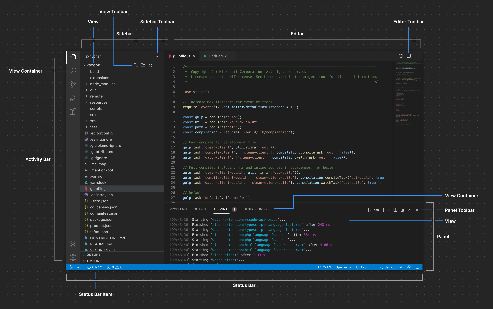
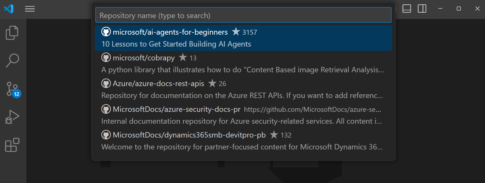
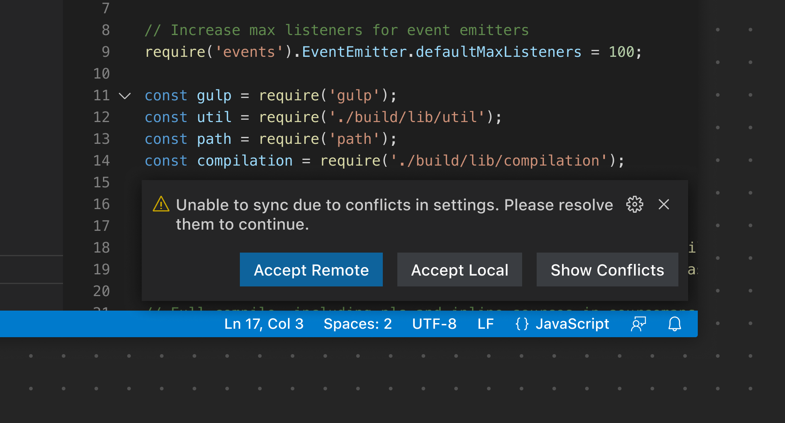
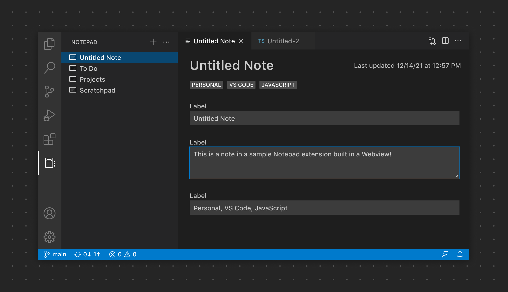
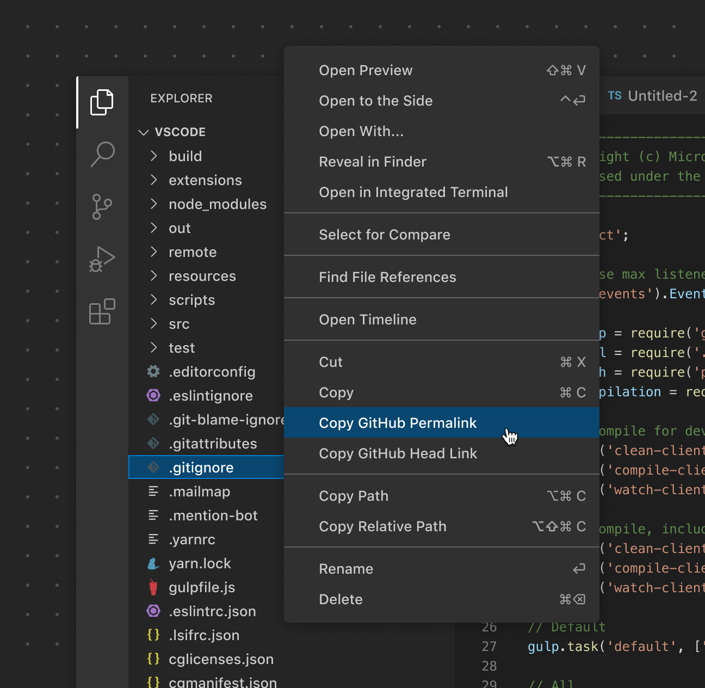
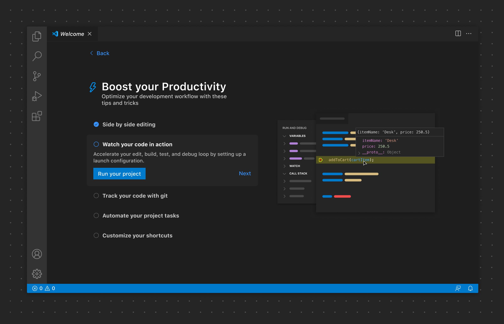
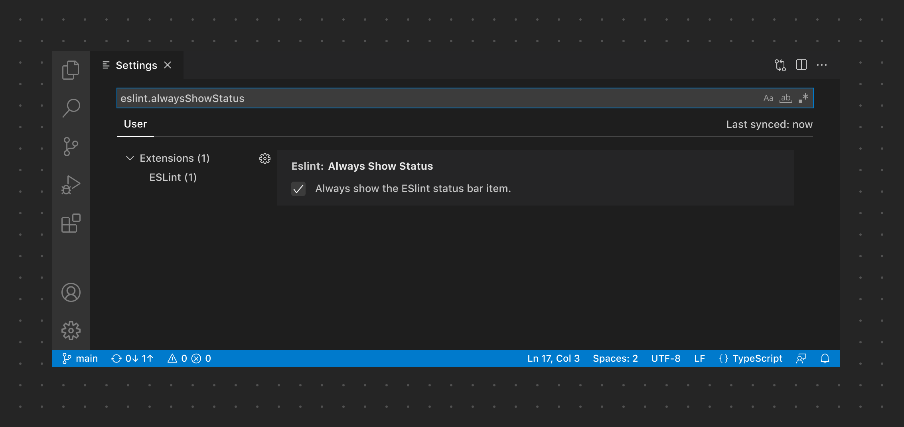

# [UX 指南](https://vscode.js.cn/api/ux-guidelines/overview)

本指南涵盖了创建与 VS Code 原生界面和模式无缝集成的扩展的最佳实践。在本指南中，您将找到

- VS Code 整体 UI 架构和元素的概述
- 扩展贡献的 UI 的建议和示例
- 相关指南和示例的链接

在深入细节之前，了解 VS Code 的各种架构 UI 部分如何协同工作以及您的扩展可以在何处以及如何做出贡献非常重要。

## [容器](https://vscode.js.cn/api/ux-guidelines/overview#containers)

VS Code 界面大致可以分为两个主要概念：**容器**和**项**。一般来说，容器可以视为 VS Code 界面中渲染一个或多个项的较大区域

### [活动栏](https://vscode.js.cn/api/ux-guidelines/overview#activity-bar)

[活动栏](https://vscode.js.cn/api/ux-guidelines/activity-bar)是 VS Code 中的核心导航界面。扩展可以将项贡献给活动栏，这些项作为[视图容器](https://vscode.js.cn/api/references/contribution-points#contributes.viewsContainers)，在主侧边栏中渲染[视图](https://vscode.js.cn/api/ux-guidelines/views)。

### [主侧边栏](https://vscode.js.cn/api/ux-guidelines/overview#primary-sidebar)

[主侧边栏](https://vscode.js.cn/api/ux-guidelines/sidebars#primary-sidebar)渲染一个或多个[视图](https://vscode.js.cn/api/ux-guidelines/views)。活动栏和主侧边栏紧密耦合。单击贡献的活动栏项（即：视图容器）会打开主侧边栏，其中将渲染与该视图容器关联的一个或多个视图。一个具体示例是资源管理器。单击资源管理器项将打开主侧边栏，其中显示文件夹、时间线和大纲视图。

### [副侧边栏](https://vscode.js.cn/api/ux-guidelines/overview#secondary-sidebar)

[副侧边栏](https://vscode.js.cn/api/ux-guidelines/sidebars#secondary-sidebar)也用作渲染带视图的视图容器的界面。用户可以将终端或问题视图等视图拖动到副侧边栏，以自定义其布局。

### [编辑器](https://vscode.js.cn/api/ux-guidelines/overview#editor)

编辑器区域包含一个或多个编辑器组。扩展可以贡献[自定义编辑器](https://vscode.js.cn/api/references/contribution-points#contributes.customEditors)或[Webview](https://vscode.js.cn/api/extension-guides/webview)以在编辑器区域中打开。它们还可以贡献[编辑器操作](https://vscode.js.cn/api/ux-guidelines/editor-actions)，以便在编辑器工具栏中显示额外的图标按钮。

### [面板](https://vscode.js.cn/api/ux-guidelines/overview#panel)

[面板](https://vscode.js.cn/api/ux-guidelines/panel)是另一个用于显示视图容器的区域。默认情况下，终端、问题和输出等视图可以在面板中一次在一个选项卡中查看。用户还可以将视图拖动到分屏布局中，就像在编辑器中一样。此外，扩展可以选择将视图容器专门添加到面板而不是活动栏/主侧边栏。

### [状态栏](https://vscode.js.cn/api/ux-guidelines/overview#status-bar)

[状态栏](https://vscode.js.cn/api/ux-guidelines/status-bar)提供有关工作区和当前活动文件的上下文信息。它渲染两组[状态栏项](https://vscode.js.cn/api/ux-guidelines/status-bar#status-bar-items)。

## [项](https://vscode.js.cn/api/ux-guidelines/overview#items)

扩展可以将项添加到上面列出的各种容器中。

### [视图](https://vscode.js.cn/api/ux-guidelines/overview#view)

[视图](https://vscode.js.cn/api/ux-guidelines/views)可以以[树视图](https://vscode.js.cn/api/ux-guidelines/views#tree-views)、[欢迎视图](https://vscode.js.cn/api/ux-guidelines/views#welcome-views)或[Webview 视图](https://vscode.js.cn/api/ux-guidelines/webviews#webview-views)的形式贡献，并可以拖动到界面的其他区域。

### [视图工具栏](https://vscode.js.cn/api/ux-guidelines/overview#view-toolbar)

扩展可以公开视图特定的[操作](https://vscode.js.cn/api/ux-guidelines/views#view-actions)，这些操作以按钮形式出现在视图工具栏上。

### [侧边栏工具栏](https://vscode.js.cn/api/ux-guidelines/overview#sidebar-toolbar)

作用域为整个视图容器的操作也可以在[侧边栏工具栏](https://vscode.js.cn/api/ux-guidelines/sidebars#sidebar-toolbars)中显示。

### [编辑器工具栏](https://vscode.js.cn/api/ux-guidelines/overview#editor-toolbar)

扩展可以将作用域为编辑器的[编辑器操作](https://vscode.js.cn/api/ux-guidelines/editor-actions)直接贡献到编辑器工具栏中。

### [面板工具栏](https://vscode.js.cn/api/ux-guidelines/overview#panel-toolbar)

[面板工具栏](https://vscode.js.cn/api/ux-guidelines/panel#panel-toolbar)可以显示作用域为当前选定视图的选项。例如，终端视图公开了添加新终端、拆分视图布局等操作。切换到问题视图会显示一组不同的操作。

### [状态栏项](https://vscode.js.cn/api/ux-guidelines/overview#status-bar-item)

左侧的[状态栏项](https://vscode.js.cn/api/ux-guidelines/status-bar#status-bar-items)作用于整个工作区。右侧的项作用于活动文件。

## [常用 UI 元素](https://vscode.js.cn/api/ux-guidelines/overview#common-ui-elements)

### [命令面板](https://vscode.js.cn/api/ux-guidelines/overview#command-palette)

扩展可以贡献在[命令面板](https://vscode.js.cn/api/ux-guidelines/command-palette)中显示的命令，以快速执行某些功能。

### [快速选择](https://vscode.js.cn/api/ux-guidelines/overview#quick-pick)

[快速选择](https://vscode.js.cn/api/ux-guidelines/quick-picks)以多种不同方式捕获用户输入。它们可以请求单项选择、多项选择，甚至自由文本输入。

### [通知](https://vscode.js.cn/api/ux-guidelines/overview#notifications)

[通知](https://vscode.js.cn/api/ux-guidelines/notifications)用于向用户传达信息、警告和错误消息。它们也可以用于指示进度。

### [Webview](https://vscode.js.cn/api/ux-guidelines/overview#webviews)

[Webview](https://vscode.js.cn/api/ux-guidelines/webviews)可用于显示自定义内容和功能，以满足超出 VS Code“原生”API 的用例。

### [上下文菜单](https://vscode.js.cn/api/ux-guidelines/overview#context-menus)

与命令面板的固定位置不同，[上下文菜单](https://vscode.js.cn/api/ux-guidelines/context-menus)允许用户在特定位置执行操作或配置某些内容。

### [演练](https://vscode.js.cn/api/ux-guidelines/overview#walkthroughs)

[演练](https://vscode.js.cn/api/ux-guidelines/walkthroughs)通过包含丰富内容的多步清单，为用户提供一致的扩展入门体验。

### [设置](https://vscode.js.cn/api/ux-guidelines/overview#settings)

[设置](https://vscode.js.cn/api/ux-guidelines/settings)使用户能够配置与扩展相关的选项。

<Catalog />
