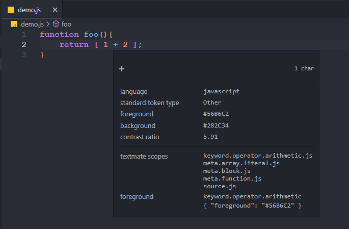
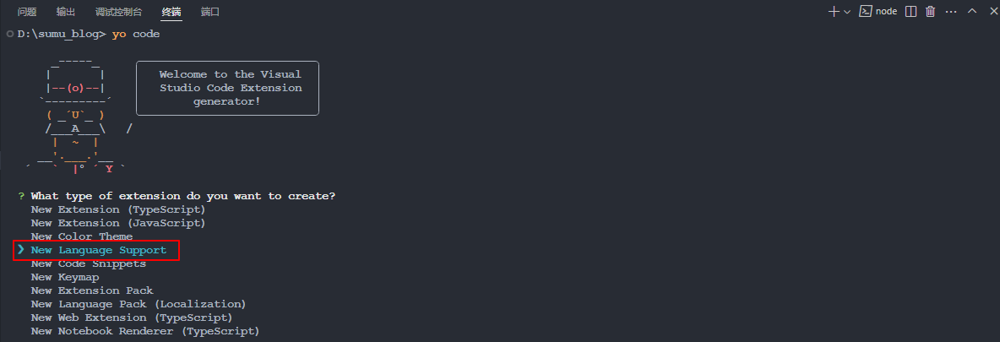
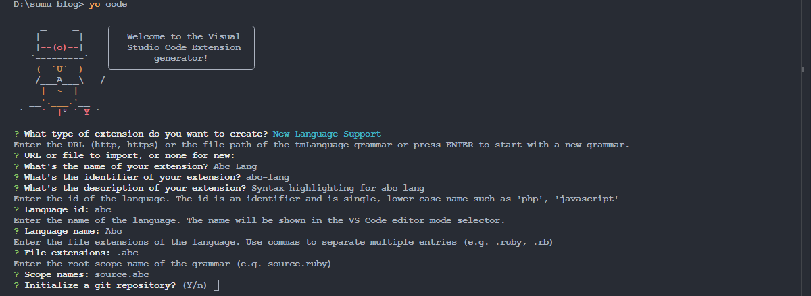
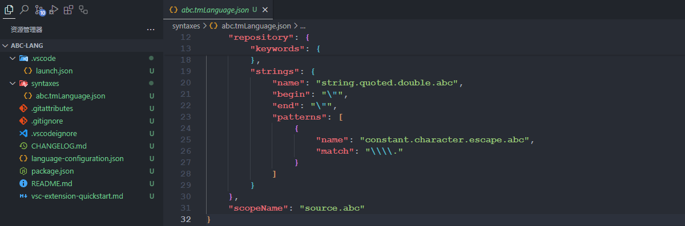
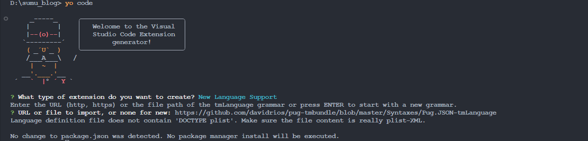
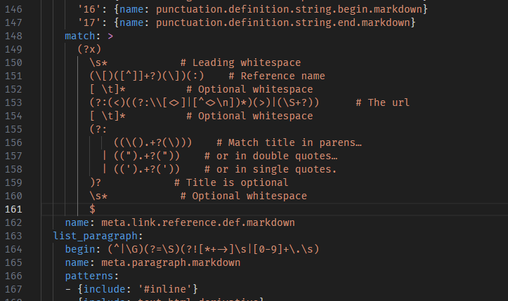
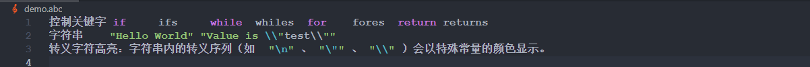
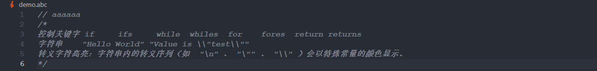

<!-- more -->

# [语法高亮指南](https://vscode.js.cn/api/language-extensions/syntax-highlight-guide)

语法高亮决定了 Visual Studio Code 编辑器中显示的源代码的颜色和样式。它负责将 JavaScript 中的 `if` 或 `for` 等关键字与字符串、注释和变量名区分开来并进行着色。

语法高亮有两个组成部分

- [分词（Tokenization）](https://vscode.js.cn/api/language-extensions/syntax-highlight-guide#tokenization)：将文本分解成令牌列表
- [主题化（Theming）](https://vscode.js.cn/api/language-extensions/syntax-highlight-guide#theming)：使用主题或用户设置将令牌映射到特定的颜色和样式

在深入细节之前，一个好的开始是使用[作用域检查器](https://vscode.js.cn/api/language-extensions/syntax-highlight-guide#scope-inspector)工具，探索源文件中存在哪些令牌以及它们匹配了哪些主题规则。要同时查看语义和语法令牌，请在 TypeScript 文件上使用内置主题（例如 Dark+）。

## 一、[分词](https://vscode.js.cn/api/language-extensions/syntax-highlight-guide#tokenization)

文本的分词是将文本分解成片段，并用令牌类型对每个片段进行分类。

VS Code 的分词引擎由 [TextMate 语法](https://macromates.com/manual/en/language_grammars)提供支持。TextMate 语法是结构化的正则表达式集合，以 plist (XML) 或 JSON 文件形式编写。VS Code 扩展可以通过 `grammars` 贡献点贡献语法。

TextMate 分词引擎在与渲染器相同的进程中运行，令牌会随着用户输入而更新。令牌用于语法高亮，但也用于将源代码分类为注释、字符串、正则表达式等区域。

从 1.43 版本开始，VS Code 还允许扩展通过[语义令牌提供程序](https://vscode.js.cn/api/references/vscode-api#DocumentSemanticTokensProvider)提供分词。语义提供程序通常由语言服务器实现，它们对源文件有更深入的理解，并可以在项目上下文中解析符号。例如，常量变量名可以在整个项目中以常量高亮显示，而不仅仅是在声明处。

基于语义令牌的高亮被视为对基于 TextMate 的语法高亮的补充。语义高亮位于语法高亮之上。由于语言服务器加载和分析项目可能需要一段时间，语义令牌高亮可能会在短时间延迟后出现。

本文重点介绍基于 TextMate 的分词。语义分词和主题化在[语义高亮指南](https://vscode.js.cn/api/language-extensions/semantic-highlight-guide)中解释。

### 1. [TextMate 语法](https://vscode.js.cn/api/language-extensions/syntax-highlight-guide#textmate-grammars)

VS Code 使用 [TextMate 语法](https://macromates.com/manual/en/language_grammars)作为语法分词引擎。它为 TextMate 编辑器而发明，由于开源社区创建和维护了大量的语言包，它已被许多其他编辑器和 IDE 采用。

TextMate 语法依赖于 [Oniguruma 正则表达式](https://macromates.com/manual/en/regular_expressions)，通常以 plist 或 JSON 编写。你可以在[这里](https://www.apeth.com/nonblog/stories/textmatebundle.html)找到 TextMate 语法的良好介绍，你也可以查看现有的 TextMate 语法以了解更多关于它们的工作原理。

### 2. [TextMate 令牌和作用域](https://vscode.js.cn/api/language-extensions/syntax-highlight-guide#textmate-tokens-and-scopes)

令牌是一个或多个字符，它们是相同程序元素的一部分。示例令牌包括运算符，如 `+` 和 `*`，变量名，如 `myVar`，或字符串，如 `"my string"`。

每个令牌都关联一个定义令牌上下文的作用域。作用域是一个由点分隔的标识符列表，指定当前令牌的上下文。例如，JavaScript 中的 `+` 运算符的作用域是 `keyword.operator.arithmetic.js`。

主题将作用域映射到颜色和样式以提供语法高亮。TextMate 提供了许多主题都针对的[常见作用域列表](https://macromates.com/manual/en/language_grammars)。为了使你的语法得到尽可能广泛的支持，请尝试在现有作用域的基础上构建，而不是定义新的作用域。

作用域是嵌套的，因此每个令牌也与一个父作用域列表关联。下面的示例使用[作用域检查器](https://vscode.js.cn/api/language-extensions/syntax-highlight-guide#scope-inspector)显示简单 JavaScript 函数中 `+` 运算符的作用域层次结构。最具体的范围列在顶部，更通用的父范围列在下方。



父作用域信息也用于主题化。当主题针对某个作用域时，所有具有该父作用域的令牌都将被着色，除非主题还为它们的单个作用域提供了更具体的着色。

### 3. [贡献一个基本语法](https://vscode.js.cn/api/language-extensions/syntax-highlight-guide#contributing-a-basic-grammar)

VS Code 支持 JSON TextMate 语法。这些语法通过 `grammars` [贡献点](https://vscode.js.cn/api/references/contribution-points)贡献。

每个语法贡献都指定：语法适用的语言标识符、语法令牌的顶级作用域名以及语法文件的相对路径。下面的示例显示了一个虚构的 `abc` 语言的语法贡献：

```json
{
  "contributes": {
    "languages": [
      {
        "id": "abc",
        "extensions": [".abc"]
      }
    ],
    "grammars": [
      {
        "language": "abc",
        "scopeName": "source.abc",
        "path": "./syntaxes/abc.tmGrammar.json"
      }
    ]
  }
}
```

语法文件本身包含一个顶级规则。这通常分为一个 `patterns` 部分，列出程序的顶级元素，以及一个 `repository`，定义每个元素。语法中的其他规则可以使用 `{ "include": "#id" }` 引用 `repository` 中的元素。

示例 `abc` 语法将字母 `a`、`b` 和 `c` 标记为关键字，并将括号的嵌套标记为表达式。

```json
{
  "scopeName": "source.abc",
  "patterns": [{ "include": "#expression" }],
  "repository": {
    "expression": {
      "patterns": [{ "include": "#letter" }, { "include": "#paren-expression" }]
    },
    "letter": {
      "match": "a|b|c",
      "name": "keyword.letter"
    },
    "paren-expression": {
      "begin": "\\(",
      "end": "\\)",
      "beginCaptures": {
        "0": { "name": "punctuation.paren.open" }
      },
      "endCaptures": {
        "0": { "name": "punctuation.paren.close" }
      },
      "name": "expression.group",
      "patterns": [{ "include": "#expression" }]
    }
  }
}
```

语法引擎将尝试连续地将 `expression` 规则应用于文档中的所有文本。对于一个简单的程序，例如：

```txt
a
(
    b
)
x
(
    (
        c
        xyz
    )
)
(
a
```

示例语法生成以下作用域（从左到右列出，从最具体到最不具体的作用域）：

```txt
a               keyword.letter, source.abc
(               punctuation.paren.open, expression.group, source.abc
    b           keyword.letter, expression.group, source.abc
)               punctuation.paren.close, expression.group, source.abc
x               source.abc
(               punctuation.paren.open, expression.group, source.abc
    (           punctuation.paren.open, expression.group, expression.group, source.abc
        c       keyword.letter, expression.group, expression.group, source.abc
        xyz     expression.group, expression.group, source.abc
    )           punctuation.paren.close, expression.group, expression.group, source.abc
)               punctuation.paren.close, expression.group, source.abc
(               punctuation.paren.open, expression.group, source.abc
a               keyword.letter, expression.group, source.abc
```

请注意，未被规则匹配的文本（例如字符串 `xyz`）被包含在当前作用域中。文件末尾的最后一个括号是 `expression.group` 的一部分，即使 `end` 规则未被匹配，因为在找到 `end` 规则之前找到了 `end-of-document`。

### 4. [嵌入式语言](https://vscode.js.cn/api/language-extensions/syntax-highlight-guide#embedded-languages)

如果你的语法在父语言中包含嵌入式语言，例如 HTML 中的 CSS 样式块，你可以使用 `embeddedLanguages` 贡献点告诉 VS Code 将嵌入式语言视为与父语言不同。这确保了括号匹配、注释和其他基本语言特性在嵌入式语言中按预期工作。

`embeddedLanguages` 贡献点将嵌入式语言中的作用域映射到顶级语言作用域。在下面的示例中，`meta.embedded.block.javascript` 作用域中的任何令牌都将被视为 JavaScript 内容。

```json
{
  "contributes": {
    "grammars": [
      {
        "path": "./syntaxes/abc.tmLanguage.json",
        "scopeName": "source.abc",
        "embeddedLanguages": {
          "meta.embedded.block.javascript": "javascript"
        }
      }
    ]
  }
}
```

现在，如果你尝试在标记为 `meta.embedded.block.javascript` 的一组令牌内注释代码或触发代码片段，它们将获得正确的 `//` JavaScript 风格注释和正确的 JavaScript 代码片段。

### 5. [开发新的语法扩展](https://vscode.js.cn/api/language-extensions/syntax-highlight-guide#developing-a-new-grammar-extension)

#### 5.1 创建新的语法扩展

要快速创建新的语法扩展，请使用 [VS Code 的 Yeoman 模板](https://vscode.js.cn/api/get-started/your-first-extension)运行 `yo code` 并选择 `New Language` 选项。



Yeoman 将引导你回答一些基本问题，以搭建新扩展的脚手架。创建新语法的重要问题是：

- `Language id` - 你语言的唯一标识符。
- `Language name` - 你语言的可读名称。
- `Scope names` - 你语法的根 TextMate 作用域名。



生成器假设你希望为该语言定义新的语言和新的语法。如果你正在为现有语言创建语法，只需填写目标语言的信息，并确保删除生成的 `package.json` 中的 `languages` 贡献点。

回答所有问题后，Yeoman 将创建一个具有以下结构的新扩展：



请记住，如果你正在为 VS Code 已知的语言贡献语法，请务必删除生成的 `package.json` 中的 `languages` 贡献点。

#### 5.2 转换现有 TextMate 语法

`yo code` 也可以帮助将现有的 TextMate 语法转换为 VS Code 扩展。同样，首先运行 `yo code` 并选择 `Language extension`。当被问及现有的语法文件时，提供 `.tmLanguage` 或 `.json` TextMate 语法文件的完整路径。



> Tips：不过我执行的时候这里好像有问题，但是官方文档也没写后面的打印情况，后面有用到再补充吧。

#### 5.3 使用 YAML 编写语法

随着语法变得越来越复杂，以 JSON 形式理解和维护它可能会变得困难。如果你发现自己正在编写复杂的正则表达式或需要添加注释来解释语法的各个方面，请考虑使用 YAML 来定义语法。

YAML 语法与基于 JSON 的语法结构完全相同，但允许你使用 YAML 更简洁的语法，以及多行字符串和注释等功能。



VS Code 只能加载 JSON 语法，因此基于 YAML 的语法必须转换为 JSON。[`js-yaml` 包](https://npmjs.net.cn/package/js-yaml)和命令行工具可以轻松完成此操作。

```bash
# Install js-yaml as a development only dependency in your extension
$ npm install js-yaml --save-dev

# Use the command-line tool to convert the yaml grammar to json
$ npx js-yaml syntaxes/abc.tmLanguage.yaml > syntaxes/abc.tmLanguage.json
```

### 6. [注入语法](https://vscode.js.cn/api/language-extensions/syntax-highlight-guide#injection-grammars)

注入语法允许你扩展现有语法。注入语法是一个常规的 TextMate 语法，它被注入到现有语法中的特定作用域内。注入语法的示例应用包括：

- 高亮注释中的关键字，如 `TODO`。
- 向现有语法添加更具体的范围信息。
- 为 Markdown 围栏代码块添加新语言的高亮。

#### 6.1 创建基本注入语法

注入语法通过 `package.json` 贡献，就像常规语法一样。但是，注入语法不指定 `language`，而是使用 `injectTo` 来指定要注入语法的目标语言作用域列表。

对于此示例，我们将创建一个简单的注入语法，将 JavaScript 注释中的 `TODO` 标记为关键字。要在 JavaScript 文件中应用我们的注入语法，我们在 `injectTo` 中使用 `source.js` 目标语言作用域。

```json
{
  "contributes": {
    "grammars": [
      {
        "path": "./syntaxes/injection.json",
        "scopeName": "todo-comment.injection",
        "injectTo": ["source.js"]
      }
    ]
  }
}
```

语法本身是标准的 TextMate 语法，除了顶层的 `injectionSelector` 条目。`injectionSelector` 是一个作用域选择器，它指定注入语法应该应用于哪些作用域。对于我们的示例，我们希望高亮所有 `//` 注释中的单词 `TODO`。使用[作用域检查器](https://vscode.js.cn/api/language-extensions/syntax-highlight-guide#scope-inspector)，我们发现 JavaScript 的双斜杠注释的作用域是 `comment.line.double-slash`，因此我们的注入选择器是 `L:comment.line.double-slash`。

```json
{
  "scopeName": "todo-comment.injection",
  "injectionSelector": "L:comment.line.double-slash",
  "patterns": [
    {
      "include": "#todo-keyword"
    }
  ],
  "repository": {
    "todo-keyword": {
      "match": "TODO",
      "name": "keyword.todo"
    }
  }
}
```

注入选择器中的 `L:` 意味着注入被添加到现有语法规则的左侧。这基本上意味着我们注入的语法规则将在任何现有语法规则之前应用。

#### 6.2 嵌入式语言

注入语法还可以为它们的父语法贡献嵌入式语言。就像普通语法一样，注入语法可以使用 `embeddedLanguages` 将嵌入式语言中的作用域映射到顶级语言作用域。

例如，一个高亮 JavaScript 字符串中 SQL 查询的扩展可以使用 `embeddedLanguages` 来确保字符串中标记为 `meta.embedded.inline.sql` 的所有令牌都被视为 SQL，以实现基本的语言功能，如括号匹配和代码片段选择。

```json
{
  "contributes": {
    "grammars": [
      {
        "path": "./syntaxes/injection.json",
        "scopeName": "sql-string.injection",
        "injectTo": ["source.js"],
        "embeddedLanguages": {
          "meta.embedded.inline.sql": "sql"
        }
      }
    ]
  }
}
```

#### 6.3 令牌类型和嵌入式语言

对于注入语言中的嵌入式语言，还有一个额外的复杂性：默认情况下，VS Code 将字符串中的所有令牌视为字符串内容，将注释中的所有令牌视为注释内容。由于字符串和注释内部禁用了括号匹配和自动闭合对等功能，如果嵌入式语言出现在字符串或注释内部，这些功能也将在嵌入式语言中被禁用。

要覆盖此行为，你可以使用 `meta.embedded.*` 作用域来重置 VS Code 对令牌的字符串或注释内容的标记。建议始终将嵌入式语言封装在 `meta.embedded.*` 作用域中，以确保 VS Code 正确处理嵌入式语言。

如果无法向语法添加 `meta.embedded.*` 作用域，你也可以在语法的贡献点中使用 `tokenTypes` 将特定作用域映射到内容模式。下面的 `tokenTypes` 部分确保 `my.sql.template.string` 作用域中的任何内容都被视为源代码。

```json
{
  "contributes": {
    "grammars": [
      {
        "path": "./syntaxes/injection.json",
        "scopeName": "sql-string.injection",
        "injectTo": ["source.js"],
        "embeddedLanguages": {
          "my.sql.template.string": "sql"
        },
        "tokenTypes": {
          "my.sql.template.string": "other"
        }
      }
    ]
  }
}
```

## 二、[主题](https://vscode.js.cn/api/language-extensions/syntax-highlight-guide#theming)

主题化是将颜色和样式分配给令牌。主题化规则在颜色主题中指定，但用户可以在用户设置中自定义主题化规则。

TextMate 主题规则在 `tokenColors` 中定义，并具有与常规 TextMate 主题相同的语法。每个规则定义一个 TextMate 作用域选择器以及结果的颜色和样式。

在评估令牌的颜色和样式时，当前令牌的作用域将与规则的选择器匹配，以找到每个样式属性（前景、粗体、斜体、下划线）最具体的规则。

[颜色主题指南](https://vscode.js.cn/api/extension-guides/color-theme#syntax-colors)描述了如何创建颜色主题。语义令牌的主题化在[语义高亮指南](https://vscode.js.cn/api/language-extensions/semantic-highlight-guide#theming)中解释。

## 三、[Scope Inspector（作用域检查器）](https://vscode.js.cn/api/language-extensions/syntax-highlight-guide#scope-inspector)

VS Code 的内置作用域检查器工具帮助调试语法和语义令牌。它显示文件中当前位置的令牌的作用域和语义令牌，以及有关哪些主题规则适用于该令牌的元数据。

通过命令面板使用 `Developer: Inspect Editor Tokens and Scopes` 命令触发作用域检查器，或者为其[创建快捷键](https://vscode.js.cn/docs/getstarted/keybindings)。

```json
{
  "key": "cmd+alt+shift+i",
  "command": "editor.action.inspectTMScopes"
}
```


作用域检查器显示以下信息：

（1）当前令牌。

（2）关于令牌的元数据及其计算外观的信息。如果你正在使用嵌入式语言，这里重要的条目是 `language` 和 `token type`。

（3）当当前语言存在语义令牌提供程序且当前主题支持语义高亮时，将显示语义令牌部分。它显示当前语义令牌类型和修饰符，以及匹配语义令牌类型和修饰符的主题规则。

（4）TextMate 部分显示当前 TextMate 令牌的作用域列表，最具体的范围在顶部。它还显示匹配这些范围的最具体主题规则。这只显示负责令牌当前样式的主题规则，不显示被覆盖的规则。如果存在语义令牌，则仅当主题规则与匹配语义令牌的规则不同时才显示。

## 四、默认新扩展解析

### 1. syntaxes/abc.tmLanguage.json

上面我们选择创建新的语法扩展，这里创建的默认的语法文件为：

```json
{
  "$schema": "https://raw.githubusercontent.com/martinring/tmlanguage/master/tmlanguage.json",
  "name": "Abc",
  "patterns": [
    {
      "include": "#keywords"
    },
    {
      "include": "#strings"
    }
  ],
  "repository": {
    "keywords": {
      "patterns": [
        {
          "name": "keyword.control.abc",
          "match": "\\b(if|while|for|return)\\b"
        }
      ]
    },
    "strings": {
      "name": "string.quoted.double.abc",
      "begin": "\"",
      "end": "\"",
      "patterns": [
        {
          "name": "constant.character.escape.abc",
          "match": "\\\\."
        }
      ]
    }
  },
  "scopeName": "source.abc"
}

```

我们来看一下这个语法文件会有什么效果。

#### 1.1 文件结构

（1）`$schema`: 定义了语法规则的 JSON schema，确保文件符合 TextMate 语法标准。

（2）`name`: 语法定义的名称，显示为 "Abc"，也就是右下角显示的语言模式。

（3）`scopeName`: 语法的作用域名称，`source.abc` 表示这是 ABC 语言的源代码。

（4）顶层 `patterns` 数组：定义了在 ABC 语言中应用的主要语法规则。目前包含两个主要规则：关键字 (keywords)和字符串 (strings)，这两个规则通过 `#keywords` 和 `#strings` 引用存储在 `repository` 中的具体定义。

（5）`repository` 包含了具体的语法规则定义，接下来就来详细看一些这个语法规则定义。

#### 1.2 语法规则仓库 (Repository)

`repository` 包含了具体的语法规则定义。

##### 1.2.1 关键字规则

```json
"keywords": {
  "patterns": [
    {
      "name": "keyword.control.abc",
      "match": "\\b(if|while|for|return)\\b"
    }
  ]
}
```

- `name`: 为匹配的文本分配作用域名称 `keyword.control.abc`，VSCode 使用此作用域来确定高亮颜色，具体是什么颜色就要看主题样式了。
- `match`: 正则表达式 `\b(if|while|for|return)\b` 匹配四个关键字：if、while、for 和 return。
- `\b` 是单词边界，确保只匹配完整的单词而不是其他单词的一部分。

在 VSCode 中，这些关键字会被高亮显示为控制关键字（通常是紫色或蓝色，具体取决于主题）。

##### 1.2.2 字符串规则

```json
"strings": {
  "name": "string.quoted.double.abc",
  "begin": "\"",
  "end": "\"",
  "patterns": [
    {
      "name": "constant.character.escape.abc",
      "match": "\\\\."
    }
  ]
}
```

字符串规则使用 `begin` 和 `end` 来定义多行结构：

- `name`: 整个字符串的作用域名称 `string.quoted.double.abc`。
- `begin`: 字符串开始标记，即双引号 `"`。
- `end`: 字符串结束标记，也是双引号 `"`。
- 内嵌的 `patterns` 定义了字符串内部的转义字符规则：
  - `name`: 转义字符的作用域名称 `constant.character.escape.abc`。
  - `match`: 正则表达式 `\\\\.` 匹配反斜杠后跟任意字符的转义序列。

在 VSCode 中，整个字符串会被高亮为字符串颜色（通常是绿色或橙色），而转义字符会有额外的高亮。

#### 1.3 语法高亮效果

当在 VSCode 中打开 `.abc` 文件时，该语法定义会产生以下高亮效果：



- 控制关键字高亮：`if`、`while`、`for`、`return` 等关键字会以控制关键字的颜色显示。

- 字符串高亮：双引号包围的文本会以字符串的颜色显示。例如：`"Hello World"` 或 `"Value is \\"test\\""`

- 转义字符高亮：字符串内的转义序列（如 `\n`、`\"`、`\\`）会以特殊常量的颜色显示。

### 2. language-configuration.json

`language-configuration.json` 是 Visual Studio Code 中用于定义语言特定编辑行为的配置文件。它与语法高亮文件 (`*.tmLanguage.json`) 配合使用，为 ABC 语言提供完整的编辑体验。该文件定义了注释样式、括号匹配、自动闭合等编辑器功能。

```json
{
    "comments": {
        // symbol used for single line comment. Remove this entry if your language does not support line comments
        "lineComment": "//",
        // symbols used for start and end a block comment. Remove this entry if your language does not support block comments
        "blockComment": [ "/*", "*/" ]
    },
    // symbols used as brackets
    "brackets": [
        ["{", "}"],
        ["[", "]"],
        ["(", ")"]
    ],
    // symbols that are auto closed when typing
    "autoClosingPairs": [
        ["{", "}"],
        ["[", "]"],
        ["(", ")"],
        ["\"", "\""],
        ["'", "'"]
    ],
    // symbols that can be used to surround a selection
    "surroundingPairs": [
        ["{", "}"],
        ["[", "]"],
        ["(", ")"],
        ["\"", "\""],
        ["'", "'"]
    ]
}
```

#### 2.1 文件结构解析

##### 2.1.1 注释配置 (Comments)

```json
"comments": {
    "lineComment": "//",
    "blockComment": [ "/*", "*/" ]
}
```

注释部分定义了 ABC 语言中两种类型的注释：

- **行注释 (Line Comments)**：

（1）使用 `//` 作为行注释符号

（2）在 VSCode 中，可以通过快捷键 (默认 Ctrl+/) 快速添加或移除行注释

- **块注释 (Block Comments)**：

（1）使用 `/*` 作为块注释开始符号，`*/` 作为块注释结束符号

（2）支持跨多行的注释

（3）在 VSCode 中，可以通过快捷键快速添加或移除块注释

这些配置使得 VSCode 能够正确识别和处理 ABC 语言的注释，提供相应的编辑功能。

##### 2.1.2 括号配置 (Brackets)

```json
"brackets": [
    ["{", "}"],
    ["[", "]"],
    ["(", ")"]
]
```

括号配置定义了 ABC 语言中三组基本括号对：

（1）大括号：`{` 和 `}`

（2）方括号：`[` 和 `]`

（3）圆括号：`(` 和 `)`

这些配置使 VSCode 能够：
- 正确匹配和高亮对应的括号对
- 在光标位于括号附近时显示匹配指示器
- 提供跳转到匹配括号的功能

##### 2.1.3 自动闭合对 (Auto Closing Pairs)

```json
"autoClosingPairs": [
    ["{", "}"],
    ["[", "]"],
    ["(", ")"],
    ["\"", "\""],
    ["'", "'"]
]
```

自动闭合对定义了在输入开始符号时自动插入结束符号的字符对：

（1）大括号：输入 `{` 时自动插入 `}`

（2）方括号：输入 `[` 时自动插入 `]`

（3）圆括号：输入 `(` 时自动插入 `)`

（4）双引号：输入 `"` 时自动插入 `"`

（5）单引号：输入 `'` 时自动插入 `'`

这些配置提升了编码效率，减少手动输入结束符号的需求，同时有助于避免括号不匹配的错误。

##### 2.1.4 环绕对 (Surrounding Pairs)

```json
"surroundingPairs": [
    ["{", "}"],
    ["[", "]"],
    ["(", ")"],
    ["\"", "\""],
    ["'", "'"]
]
```

环绕对定义了当选中文本并输入开始符号时，可以用该符号对包围选中文本的字符对：

（1）大括号：选中文本后输入 `{` 会用 `{}` 包围文本

（2）方括号：选中文本后输入 `[` 会用 `[]` 包围文本

（3）圆括号：选中文本后输入 `(` 会用 `()` 包围文本

（4）双引号：选中文本后输入 `"` 会用 `""` 包围文本

（5）单引号：选中文本后输入 `'` 会用 `''` 包围文本

这些配置使得重构代码更加便捷，可以轻松地用括号或引号包围现有代码片段。

### 3. 增加一个注释高亮

上面支持了 `//`和`/* */`两种注释，但是并没有为其进行高亮处理，我们在syntaxes/abc.tmLanguage.json中添加以下内容：

```json
{
  "$schema": "https://raw.githubusercontent.com/martinring/tmlanguage/master/tmlanguage.json",
  "name": "Abc",
  "patterns": [
    //......
    {
      "include": "#comments"
    }
  ],
  "repository": {
    //......
    "comments": {
      "patterns": [
        {
          "name": "comment.line.double-slash.abc",
          "match": "//.*$"
        },
        {
          "name": "comment.block.abc",
          "begin": "/\\*",
          "end": "\\*/"
        }
      ]
    }
  },
  "scopeName": "source.abc"
}
```

会得到以下效果：



具体效果是受到主题的影响的。

### 4. 支持多种语言

现在想要再支持txt文本文件的高亮，我们修改package.json如下：

```json
{
  "name": "abc-lang",
  "displayName": "Abc Lang",
  "description": "Syntax highlighting for abc lang",
  "version": "0.0.1",
  "engines": {
    "vscode": "^1.102.0"
  },
  "categories": [
    "Programming Languages"
  ],
  "contributes": {
    "languages": [
      {
        "id": "abc",
        "aliases": ["Abc", "abc"],
        "extensions": [".abc"],
        "configuration": "./language-configuration.json"
      },
      {
        "id": "txt",
        "aliases": ["TXT", "txt"],
        "extensions": [".txt"],
        "configuration": "./language-configuration-txt.json"
      }
    ],
    "grammars": [
      {
        "language": "abc",
        "scopeName": "source.abc",
        "path": "./syntaxes/abc.tmLanguage.json"
      },
      {
        "language": "txt",
        "scopeName": "source.txt",
        "path": "./syntaxes/txt.tmLanguage.json"
      }
    ]
  }
}
```

然后创建对应的文件，按上面的语法格式添加对应的规则即可。