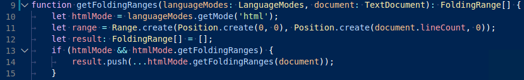

<!-- more -->

# [语义高亮指南](https://vscode.js.cn/api/language-extensions/semantic-highlight-guide)

语义高亮是语法高亮的补充，如[语法高亮指南](https://vscode.js.cn/api/language-extensions/syntax-highlight-guide)中所述。Visual Studio Code 使用 TextMate 语法作为主要的标记化引擎。TextMate 语法以单个文件作为输入，并根据正则表达式表示的词法规则对其进行分解。

语义标记化允许语言服务器根据其在项目上下文中解析符号的知识提供额外的令牌信息。主题可以选择使用语义令牌来改进和优化语法的语法高亮。编辑器将语义令牌的高亮应用于语法高亮之上。

以下是语义高亮可以添加的内容示例

没有语义高亮


有语义高亮



请注意基于语言服务符号理解的颜色差异

- 第 10 行：`languageModes` 被着色为参数
- 第 11 行：`Range` 和 `Position` 被着色为类，`document` 被着色为参数。
- 第 13 行：`getFoldingRanges` 被着色为函数。

## 一、[语义令牌提供程序](https://vscode.js.cn/api/language-extensions/semantic-highlight-guide#semantic-token-provider)

为了实现语义高亮，语言扩展可以通过文档语言和/或文件名注册一个`语义令牌提供程序`。当需要语义令牌时，编辑器将向这些提供程序发出请求。

```typescript
const tokenTypes = ['class', 'interface', 'enum', 'function', 'variable'];
const tokenModifiers = ['declaration', 'documentation'];
const legend = new vscode.SemanticTokensLegend(tokenTypes, tokenModifiers);

const provider: vscode.DocumentSemanticTokensProvider = {
  provideDocumentSemanticTokens(
    document: vscode.TextDocument
  ): vscode.ProviderResult<vscode.SemanticTokens> {
    // analyze the document and return semantic tokens

    const tokensBuilder = new vscode.SemanticTokensBuilder(legend);
    // on line 1, characters 1-5 are a class declaration
    tokensBuilder.push(
      new vscode.Range(new vscode.Position(1, 1), new vscode.Position(1, 5)),
      'class',
      ['declaration']
    );
    return tokensBuilder.build();
  }
};

const selector = { language: 'java', scheme: 'file' }; // register for all Java documents from the local file system

vscode.languages.registerDocumentSemanticTokensProvider(selector, provider, legend);
```

语义令牌提供程序 API 有两种形式，以适应语言服务器的能力

- `DocumentSemanticTokensProvider` - 始终将整个文档作为输入。
  - `provideDocumentSemanticTokens` - 提供文档的所有令牌。
  - `provideDocumentSemanticTokensEdits` - 以相对于先前响应的增量形式提供文档的所有令牌。
- `DocumentRangeSemanticTokensProvider` - 仅作用于一个范围。
  - `provideDocumentRangeSemanticTokens` - 提供文档范围内所有令牌。

提供程序返回的每个令牌都带有一个分类，该分类由令牌类型、任意数量的令牌修饰符和令牌语言组成。

如上例所示，提供程序在 `SemanticTokensLegend` 中命名它将使用的类型和修饰符。这允许 `provide` API 返回令牌类型和修饰符作为图例的索引。

## 二、[语义令牌分类](https://vscode.js.cn/api/language-extensions/semantic-highlight-guide#semantic-token-classification)

语义令牌提供程序的输出由令牌组成。每个令牌都有一个范围和一个令牌分类，描述该令牌所代表的语法元素类型。可选地，如果令牌是嵌入语言的一部分，分类还可以命名一种语言。

为了描述语法元素的类型，使用了语义令牌类型和修饰符。此信息类似于[语法高亮指南](https://vscode.js.cn/api/language-extensions/syntax-highlight-guide)中描述的 TextMate 作用域，但我们希望提出一个专用且更清晰的分类系统。

VS Code 提供了一套标准语义令牌类型和修饰符供所有语义令牌提供程序使用。但是，语义令牌提供程序可以自由定义新的类型和修饰符，并创建标准类型的子类型。

### 1. [标准令牌类型和修饰符](https://vscode.js.cn/api/language-extensions/semantic-highlight-guide#standard-token-types-and-modifiers)

标准类型和修饰符涵盖了许多语言使用的常见概念。尽管每种语言可能对某些类型和修饰符使用不同的术语，但通过遵循标准分类，主题作者将能够定义适用于多种语言的主题规则。

以下是 VS Code 预定义的标准语义令牌类型和语义令牌修饰符

标准令牌类型

| ID              | 描述                                                 |
| :-------------- | :--------------------------------------------------- |
| `namespace`     | 用于声明或引用命名空间、模块或包的标识符。           |
| `class`         | 用于声明或引用类类型的标识符。                       |
| `enum`          | 用于声明或引用枚举类型的标识符。                     |
| `interface`     | 用于声明或引用接口类型的标识符。                     |
| `struct`        | 用于声明或引用结构体类型的标识符。                   |
| `typeParameter` | 用于声明或引用类型参数的标识符。                     |
| `type`          | 用于声明或引用上述未涵盖类型的标识符。               |
| `parameter`     | 用于声明或引用函数或方法参数的标识符。               |
| `variable`      | 用于声明或引用局部或全局变量的标识符。               |
| `property`      | 用于声明或引用成员属性、成员字段或成员变量的标识符。 |
| `enumMember`    | 用于声明或引用枚举属性、常量或成员的标识符。         |
| `decorator`     | 用于声明或引用装饰器和注解的标识符。                 |
| `event`         | 用于声明事件属性的标识符。                           |
| `function`      | 用于声明函数的标识符。                               |
| `method`        | 用于声明成员函数或方法的标识符。                     |
| `macro`         | 用于声明宏的标识符。                                 |
| `label`         | 用于声明标签的标识符。                               |
| `comment`       | 用于表示注释的令牌。                                 |
| `字符串`        | 用于表示字符串字面量的令牌。                         |
| `keyword`       | 用于表示语言关键字的令牌。                           |
| `number`        | 用于表示数字字面量的令牌。                           |
| `regexp`        | 用于表示正则表达式字面量的令牌。                     |
| `operator`      | 用于表示运算符的令牌。                               |

标准令牌修饰符

| ID               | 描述                             |
| :--------------- | :------------------------------- |
| `declaration`    | 用于符号的声明。                 |
| `definition`     | 用于符号的定义，例如在头文件中。 |
| `readonly`       | 用于只读变量和成员字段（常量）。 |
| `static`         | 用于类成员（静态成员）。         |
| `deprecated`     | 用于不应再使用的符号。           |
| `abstract`       | 用于抽象类型和成员函数。         |
| `async`          | 用于标记为异步的函数。           |
| `modification`   | 用于变量被赋值的变量引用。       |
| `documentation`  | 用于文档中符号的出现。           |
| `defaultLibrary` | 用于属于标准库的符号。           |

除了标准类型和修饰符之外，VS Code 还定义了类型和修饰符到类似 TextMate 作用域的映射。这在[语义令牌作用域映射](https://vscode.js.cn/api/language-extensions/semantic-highlight-guide#semantic-token-scope-map)部分中有所介绍。

### 2. [自定义令牌类型和修饰符](https://vscode.js.cn/api/language-extensions/semantic-highlight-guide#custom-token-types-and-modifiers)

如有必要，扩展可以通过其扩展的 `package.json` 文件中的 `semanticTokenTypes` 和 `semanticTokenModifiers` 贡献点声明新的类型和修饰符，或创建现有类型的子类型。

```json
{
  "contributes": {
    "semanticTokenTypes": [
      {
        "id": "templateType",
        "superType": "type",
        "description": "A template type."
      }
    ],
    "semanticTokenModifiers": [
      {
        "id": "native",
        "description": "Annotates a symbol that is implemented natively"
      }
    ]
  }
}
```

在上面的示例中，一个扩展声明了一个新的类型 `templateType` 和一个新的修饰符 `native`。通过将 `type` 命名为超类型，`type` 的主题样式规则也将应用于 `templateType`。

```json
{
  "name": "Red Theme",
  "semanticTokenColors": {
    "type": "#ff0011"
  }
}
```

上面显示的 `semanticTokenColors` 值 `"#ff0011"` 适用于 `type` 及其所有子类型，包括 `templateType`。

除了自定义令牌类型之外，扩展还可以定义如何将它们映射到 TextMate 作用域。这在[自定义映射](https://vscode.js.cn/api/language-extensions/semantic-highlight-guide#custom-textmate-scope-mappings)部分中有所描述。请注意，自定义映射规则不会自动从超类型继承。相反，子类型需要重新定义映射，最好是映射到更具体的作用域。

## 三、[启用语义高亮](https://vscode.js.cn/api/language-extensions/semantic-highlight-guide#enablement-of-semantic-highlighting)

是否计算和高亮语义令牌由设置 `editor.semanticHighlighting.enabled` 决定。它可以有 `true`、`false` 和 `configuredByTheme` 三个值。

- `true` 和 `false` 分别为所有主题启用或禁用语义高亮。
- `configuredByTheme` 是默认值，它允许每个主题控制是否启用语义高亮。VS Code 附带的所有主题（例如，“Dark+”默认主题）都默认启用了语义高亮。

依赖语义令牌的语言扩展可以在其 `package.json` 中覆盖其语言的默认设置。

```json
{
  "configurationDefaults": {
    "[languageId]": {
      "editor.semanticHighlighting.enabled": true
    }
  }
}
```

## 四、[主题](https://vscode.js.cn/api/language-extensions/semantic-highlight-guide#theming)

主题化是关于为令牌分配颜色和样式。主题化规则在颜色主题文件（JSON 格式）中指定。用户还可以在用户设置中自定义主题化规则。

### 五、[颜色主题中的语义着色](https://vscode.js.cn/api/language-extensions/semantic-highlight-guide#semantic-coloring-in-color-themes)

颜色主题文件格式中添加了两个新属性，以支持基于语义令牌的高亮显示。

属性 `semanticHighlighting` 定义主题是否已准备好使用语义令牌进行高亮显示。它默认为 false，但我们鼓励所有主题启用它。当设置 `editor.semanticHighlighting.enabled` 设置为 `configuredByTheme` 时，将使用此属性。

属性 `semanticTokenColors` 允许主题定义新的着色规则，这些规则与语义令牌提供程序发出的语义令牌类型和修饰符匹配。

```json
{
  "name": "Red Theme",
  "tokenColors": [
    {
      "scope": "comment",
      "settings": {
        "foreground": "#dd0000",
        "fontStyle": "italic"
      }
    }
  ],
  "semanticHighlighting": true,
  "semanticTokenColors": {
    "variable.readonly:java": "#ff0011"
  }
}
```

`variable.readonly:java` 被称为选择器，其形式为 `(*|tokenType)(.tokenModifier)*(:tokenLanguage)?`。

如果规则匹配，该值描述了样式。它要么是一个字符串，表示前景色，要么是一个对象，其形式为 `{ foreground: string, bold: boolean, italic: boolean, underline: boolean }` 或 `{ foreground: string, fontStyle: string }`，与 `tokenColors` 中 TextMate 主题规则的用法相同。

前景色需要遵循[颜色格式](https://vscode.js.cn/api/references/theme-color#color-formats)中描述的颜色格式。不支持透明度。

以下是选择器和样式的其他示例

- `"*.declaration": { "bold": true } // 所有声明都加粗`
- `"class:java": { "foreground": "#0f0", "italic": true } // Java 中的类`

如果没有规则匹配，或者主题没有 `semanticTokenColors` 部分（但启用了 `semanticHighlighting`），VS Code 会使用[语义令牌作用域映射](https://vscode.js.cn/api/language-extensions/semantic-highlight-guide#semantic-token-scope-map)来评估给定语义令牌的 TextMate 作用域。该作用域将与主题在 `tokenColors` 中的 TextMate 主题规则进行匹配。

## 六、[语义令牌作用域映射](https://vscode.js.cn/api/language-extensions/semantic-highlight-guide#semantic-token-scope-map)

为了使语义高亮对未定义任何特定语义规则的主题生效，并作为自定义令牌类型和修饰符的备用方案，VS Code 维护着一个从语义令牌选择器到 TextMate 作用域的映射。

如果主题启用了语义高亮，但未包含给定语义令牌的规则，则会使用这些 TextMate 作用域来查找 TextMate 主题规则。

### 1. [预定义的 TextMate 作用域映射](https://vscode.js.cn/api/language-extensions/semantic-highlight-guide#predefined-textmate-scope-mappings)

下表列出了当前预定义的映射。

| 语义令牌选择器                     | 备用 TextMate 作用域                                |
| :--------------------------------- | :-------------------------------------------------- |
| `namespace`                        | `entity.name.namespace`                             |
| `type`                             | `entity.name.type`                                  |
| `type.defaultLibrary`              | `support.type`                                      |
| `struct`                           | `storage.type.struct`                               |
| `class`                            | `entity.name.type.class`                            |
| `class.defaultLibrary`             | `support.class`                                     |
| `interface`                        | `entity.name.type.interface`                        |
| `enum`                             | `entity.name.type.enum`                             |
| `function`                         | `entity.name.function`                              |
| `function.defaultLibrary`          | `support.function`                                  |
| `method`                           | `entity.name.function.member`                       |
| `macro`                            | `entity.name.function.preprocessor`                 |
| `variable`                         | `variable.other.readwrite` , `entity.name.variable` |
| `variable.readonly`                | `variable.other.constant`                           |
| `variable.readonly.defaultLibrary` | `support.constant`                                  |
| `parameter`                        | `variable.parameter`                                |
| `property`                         | `variable.other.property`                           |
| `property.readonly`                | `variable.other.constant.property`                  |
| `enumMember`                       | `variable.other.enummember`                         |
| `event`                            | `variable.other.event`                              |

### 2. [自定义 TextMate 作用域映射](https://vscode.js.cn/api/language-extensions/semantic-highlight-guide#custom-textmate-scope-mappings)

此映射可以通过扩展在其 `package.json` 文件中的 `semanticTokenScopes` 贡献点进行扩展。

扩展这样做有两种用例

- 定义自定义令牌类型和令牌修饰符的扩展在主题未定义新增语义令牌类型或修饰符的主题规则时，提供 TextMate 作用域作为备用。

  ```json
  {
    "contributes": {
      "semanticTokenScopes": [
        {
          "scopes": {
            "templateType": ["entity.name.type.template"]
          }
        }
      ]
    }
  }
  ```
  
- TextMate 语法提供程序可以描述特定于语言的作用域。这有助于包含特定语言主题规则的主题。

  ```json
  {
    "contributes": {
      "semanticTokenScopes": [
        {
          "language": "typescript",
          "scopes": {
            "property.readonly": ["variable.other.constant.property.ts"]
          }
        }
      ]
    }
  }
  ```

## 七、[试用](https://vscode.js.cn/api/language-extensions/semantic-highlight-guide#try-it-out)

我们有一个[语义令牌示例](https://github.com/microsoft/vscode-extension-samples/tree/main/semantic-tokens-sample)，它展示了如何创建语义令牌提供程序。

[作用域检查器](https://vscode.js.cn/api/language-extensions/syntax-highlight-guide#scope-inspector)工具允许你探索源文件中存在哪些语义令牌以及它们匹配哪些主题规则。要查看语义令牌，请在 TypeScript 文件上使用内置主题（例如，Dark+）。