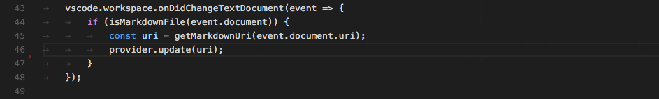
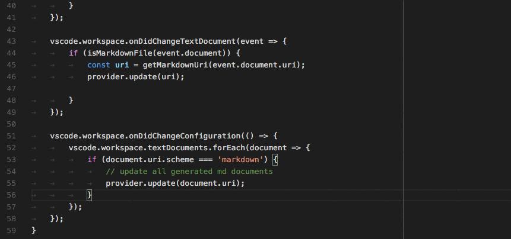

<!-- more -->

# [程序化语言特性](https://vscode.js.cn/api/language-extensions/programmatic-language-features)

程序化语言特性是一组由 [`vscode.languages.*`](https://vscode.js.cn/api/references/vscode-api#languages) API 提供支持的智能编辑功能。在 Visual Studio Code 中提供动态语言功能有两种常见方式。让我们以 [悬停](https://vscode.js.cn/api/language-extensions/programmatic-language-features#show-hovers) 为例。

```typescript
vscode.languages.registerHoverProvider('javascript', {
  provideHover(document, position, token) {
    return {
      contents: ['Hover Content']
    };
  }
});
```

如上所示，[`vscode.languages.registerHoverProvider`](https://vscode.js.cn/api/references/vscode-api#languages.registerHoverProvider) API 提供了一种简单的方式来为 JavaScript 文件提供悬停内容。此扩展激活后，无论何时您将鼠标悬停在 JavaScript 代码上，VS Code 都会查询所有针对 JavaScript 的 [`HoverProvider`](https://vscode.js.cn/api/references/vscode-api#HoverProvider)，并在悬停小部件中显示结果。[语言特性列表](https://vscode.js.cn/api/language-extensions/programmatic-language-features#language-features-listing)和下面插图的 GIF 提供了一种简单的方式，方便您查找扩展所需的 VS Code API / LSP 方法。

另一种方法是实现一个支持 [语言服务器协议](https://msdocs.cn/language-server-protocol/) 的语言服务器。它的工作方式如下：

- 一个扩展为 JavaScript 提供一个语言客户端和一个语言服务器。
- 语言客户端与任何其他 VS Code 扩展一样，在 Node.js 扩展主机上下文中运行。当它被激活时，它会在另一个进程中启动语言服务器，并通过 [语言服务器协议](https://msdocs.cn/language-server-protocol/) 与其通信。
- 您在 VS Code 中将鼠标悬停在 JavaScript 代码上。
- VS Code 将悬停信息告知语言客户端。
- 语言客户端向语言服务器查询悬停结果，并将其发送回 VS Code。
- VS Code 在悬停小部件中显示悬停结果。

这个过程看起来更复杂，但它提供了两个主要优势：

- 语言服务器可以用任何语言编写。
- 语言服务器可以重复使用，为多个编辑器提供智能编辑功能。

有关更深入的指南，请查阅[语言服务器扩展指南](https://vscode.js.cn/api/language-extensions/language-server-extension-guide)。

------

## [语言特性列表](https://vscode.js.cn/api/language-extensions/programmatic-language-features#language-features-listing)

此列表包含每个语言功能的以下项目：

- VS Code 中语言功能的图示
- 相关的 VS Code API
- 相关的 LSP 方法

| VS Code API                                                  | LSP 方法                                                     |
| :----------------------------------------------------------- | :----------------------------------------------------------- |
| [`createDiagnosticCollection`](https://vscode.js.cn/api/references/vscode-api#languages.createDiagnosticCollection) | [PublishDiagnostics](https://msdocs.cn/language-server-protocol/specification#textDocument_publishDiagnostics) |
| [`registerCompletionItemProvider`](https://vscode.js.cn/api/references/vscode-api#languages.registerCompletionItemProvider) | [Completion](https://msdocs.cn/language-server-protocol/specification#textDocument_completion) & [Completion Resolve](https://msdocs.cn/language-server-protocol/specification#completionItem_resolve) |
| [`registerHoverProvider`](https://vscode.js.cn/api/references/vscode-api#languages.registerHoverProvider) | [Hover](https://msdocs.cn/language-server-protocol/specification#textDocument_hover) |
| [`registerSignatureHelpProvider`](https://vscode.js.cn/api/references/vscode-api#languages.registerSignatureHelpProvider) | [SignatureHelp](https://msdocs.cn/language-server-protocol/specification#textDocument_signatureHelp) |
| [`registerDefinitionProvider`](https://vscode.js.cn/api/references/vscode-api#languages.registerDefinitionProvider) | [Definition](https://msdocs.cn/language-server-protocol/specification#textDocument_definition) |
| [`registerTypeDefinitionProvider`](https://vscode.js.cn/api/references/vscode-api#languages.registerTypeDefinitionProvider) | [TypeDefinition](https://msdocs.cn/language-server-protocol/specification#textDocument_typeDefinition) |
| [`registerImplementationProvider`](https://vscode.js.cn/api/references/vscode-api#languages.registerImplementationProvider) | [Implementation](https://msdocs.cn/language-server-protocol/specification#textDocument_implementation) |
| [`registerReferenceProvider`](https://vscode.js.cn/api/references/vscode-api#languages.registerReferenceProvider) | [参考](https://msdocs.cn/language-server-protocol/specification#textDocument_references) |
| [`registerDocumentHighlightProvider`](https://vscode.js.cn/api/references/vscode-api#languages.registerDocumentHighlightProvider) | [DocumentHighlight](https://msdocs.cn/language-server-protocol/specification#textDocument_documentHighlight) |
| [`registerDocumentSymbolProvider`](https://vscode.js.cn/api/references/vscode-api#languages.registerDocumentSymbolProvider) | [DocumentSymbol](https://msdocs.cn/language-server-protocol/specification#textDocument_documentSymbol) |
| [`registerCodeActionsProvider`](https://vscode.js.cn/api/references/vscode-api#languages.registerCodeActionsProvider) | [CodeAction](https://msdocs.cn/language-server-protocol/specification#textDocument_codeAction) |
| [`registerCodeLensProvider`](https://vscode.js.cn/api/references/vscode-api#languages.registerCodeLensProvider) | [CodeLens](https://msdocs.cn/language-server-protocol/specification#textDocument_codeLens) & [CodeLens Resolve](https://msdocs.cn/language-server-protocol/specification#codeLens_resolve) |
| [`registerDocumentLinkProvider`](https://vscode.js.cn/api/references/vscode-api#languages.registerDocumentLinkProvider) | [DocumentLink](https://msdocs.cn/language-server-protocol/specification#textDocument_documentLink) & [DocumentLink Resolve](https://msdocs.cn/language-server-protocol/specification#documentLink_resolve) |
| [`registerColorProvider`](https://vscode.js.cn/api/references/vscode-api#languages.registerColorProvider) | [DocumentColor](https://msdocs.cn/language-server-protocol/specification#textDocument_documentColor) & [Color Presentation](https://msdocs.cn/language-server-protocol/specification#textDocument_colorPresentation) |
| [`registerDocumentFormattingEditProvider`](https://vscode.js.cn/api/references/vscode-api#languages.registerDocumentFormattingEditProvider) | [格式化](https://msdocs.cn/language-server-protocol/specification#textDocument_formatting) |
| [`registerDocumentRangeFormattingEditProvider`](https://vscode.js.cn/api/references/vscode-api#languages.registerDocumentRangeFormattingEditProvider) | [RangeFormatting](https://msdocs.cn/language-server-protocol/specification#textDocument_rangeFormatting) |
| [`registerOnTypeFormattingEditProvider`](https://vscode.js.cn/api/references/vscode-api#languages.registerOnTypeFormattingEditProvider) | [OnTypeFormatting](https://msdocs.cn/language-server-protocol/specification#textDocument_onTypeFormatting) |
| [`registerRenameProvider`](https://vscode.js.cn/api/references/vscode-api#languages.registerRenameProvider) | [Rename](https://msdocs.cn/language-server-protocol/specification#textDocument_rename) & [Prepare Rename](https://msdocs.cn/language-server-protocol/specification#textDocument_prepareRename) |
| [`registerFoldingRangeProvider`](https://vscode.js.cn/api/references/vscode-api#languages.registerFoldingRangeProvider) | [FoldingRange](https://msdocs.cn/language-server-protocol/specification#textDocument_foldingRange) |

## [提供诊断](https://vscode.js.cn/api/language-extensions/programmatic-language-features#provide-diagnostics)

诊断是表示代码问题的方式。



### 语言服务器协议

您的语言服务器向语言客户端发送 `textDocument/publishDiagnostics` 消息。该消息为资源 URI 携带一个诊断项数组。

**注意**：客户端不向服务器请求诊断。服务器将诊断信息推送到客户端。

### 直接实现

```typescript
let diagnosticCollection: vscode.DiagnosticCollection;

export function activate(ctx: vscode.ExtensionContext): void {
  ...
  ctx.subscriptions.push(getDisposable());
  diagnosticCollection = vscode.languages.createDiagnosticCollection('go');
  ctx.subscriptions.push(diagnosticCollection);
  ...
}

function onChange() {
  let uri = document.uri;
  check(uri.fsPath, goConfig).then(errors => {
    diagnosticCollection.clear();
    let diagnosticMap: Map<string, vscode.Diagnostic[]> = new Map();
    errors.forEach(error => {
      let canonicalFile = vscode.Uri.file(error.file).toString();
      let range = new vscode.Range(error.line-1, error.startColumn, error.line-1, error.endColumn);
      let diagnostics = diagnosticMap.get(canonicalFile);
      if (!diagnostics) { diagnostics = []; }
      diagnostics.push(new vscode.Diagnostic(range, error.msg, error.severity));
      diagnosticMap.set(canonicalFile, diagnostics);
    });
    diagnosticMap.forEach((diags, file) => {
      diagnosticCollection.set(vscode.Uri.parse(file), diags);
    });
  })
}
```

> **基本**
>
> 为打开的编辑器报告诊断。最起码，这需要在每次保存时发生。更好的是，诊断应该根据编辑器中未保存的内容进行计算。

> **高级**
>
> 不仅为打开的编辑器，而且为开放文件夹中的所有资源报告诊断，无论它们是否曾在编辑器中打开过。

## [显示代码补全建议](https://vscode.js.cn/api/language-extensions/programmatic-language-features#show-code-completion-proposals)

代码补全为用户提供上下文敏感的建议。


### 语言服务器协议

在对 `initialize` 方法的响应中，您的语言服务器需要声明它提供补全功能，以及它是否支持 `completionItem\resolve` 方法来为计算出的补全项提供额外信息。

```typescript
{
    ...
    "capabilities" : {
        "completionProvider" : {
            "resolveProvider": "true",
            "triggerCharacters": [ '.' ]
        }
        ...
    }
}
```

### 直接实现

```typescript
class GoCompletionItemProvider implements vscode.CompletionItemProvider {
    public provideCompletionItems(
        document: vscode.TextDocument, position: vscode.Position, token: vscode.CancellationToken):
        Thenable<vscode.CompletionItem[]> {
    ...
    }
}

export function activate(ctx: vscode.ExtensionContext): void {
    ...
    ctx.subscriptions.push(getDisposable());
    ctx.subscriptions.push(
        vscode.languages.registerCompletionItemProvider(
            GO_MODE, new GoCompletionItemProvider(), '.', '\"'));
    ...
}
```

> **基本**
>
> 您不支持解析提供程序。

> **高级**
>
> 您支持解析提供程序，它们计算用户选择的补全建议的额外信息。此信息与选定项一起显示。

## [显示悬停信息](https://vscode.js.cn/api/language-extensions/programmatic-language-features#show-hovers)

悬停显示鼠标光标下方符号/对象的信息。这通常是符号的类型和描述。



### 语言服务器协议

在对 `initialize` 方法的响应中，您的语言服务器需要声明它提供悬停信息。

```json
{
    ...
    "capabilities" : {
        "hoverProvider" : "true",
        ...
    }
}
```

此外，您的语言服务器需要响应 `textDocument/hover` 请求。

### 直接实现

```typescript
class GoHoverProvider implements HoverProvider {
    public provideHover(
        document: TextDocument, position: Position, token: CancellationToken):
        Thenable<Hover> {
    ...
    }
}

export function activate(ctx: vscode.ExtensionContext): void {
    ...
    ctx.subscriptions.push(
        vscode.languages.registerHoverProvider(
            GO_MODE, new GoHoverProvider()));
    ...
}
```

> **基本**
>
> 显示类型信息，如果可用则包含文档。

> **高级**
>
> 以与代码着色相同的方式对方法签名进行着色。

## [帮助显示函数和方法签名](https://vscode.js.cn/api/language-extensions/programmatic-language-features#help-with-function-and-method-signatures)

当用户输入函数或方法时，显示正在调用的函数/方法的信息。


### 语言服务器协议

在对 `initialize` 方法的响应中，您的语言服务器需要声明它提供签名帮助。

```json
{
    ...
    "capabilities" : {
        "signatureHelpProvider" : {
            "triggerCharacters": [ '(' ]
        }
        ...
    }
}
```

此外，您的语言服务器需要响应 `textDocument/signatureHelp` 请求。

### 直接实现

```typescript
class GoSignatureHelpProvider implements SignatureHelpProvider {
    public provideSignatureHelp(
        document: TextDocument, position: Position, token: CancellationToken):
        Promise<SignatureHelp> {
    ...
    }
}

export function activate(ctx: vscode.ExtensionContext): void {
    ...
    ctx.subscriptions.push(
        vscode.languages.registerSignatureHelpProvider(
            GO_MODE, new GoSignatureHelpProvider(), '(', ','));
    ...
}
```

> **基本**
>
> 确保签名帮助包含函数或方法参数的文档。

> **高级**
>
> 没有额外的内容。

## [显示符号定义](https://vscode.js.cn/api/language-extensions/programmatic-language-features#show-definitions-of-a-symbol)

允许用户直接在变量/函数/方法被使用的地方查看变量/函数/方法的定义。


### 语言服务器协议

在对 `initialize` 方法的响应中，您的语言服务器需要声明它提供转到定义的位置。

```json
{
    ...
    "capabilities" : {
        "definitionProvider" : "true"
        ...
    }
}
```

此外，您的语言服务器需要响应 `textDocument/definition` 请求。

### 直接实现

```typescript
class GoDefinitionProvider implements vscode.DefinitionProvider {
    public provideDefinition(
        document: vscode.TextDocument, position: vscode.Position, token: vscode.CancellationToken):
        Thenable<vscode.Location> {
    ...
    }
}

export function activate(ctx: vscode.ExtensionContext): void {
    ...
    ctx.subscriptions.push(
        vscode.languages.registerDefinitionProvider(
            GO_MODE, new GoDefinitionProvider()));
    ...
}
```

> **基本**
>
> 如果一个符号是多义的，您可以显示多个定义。

> **高级**
>
> 没有额外的内容。

## [查找符号的所有引用](https://vscode.js.cn/api/language-extensions/programmatic-language-features#find-all-references-to-a-symbol)

允许用户查看特定变量/函数/方法/符号被使用的所有源代码位置。


### 语言服务器协议

在对 `initialize` 方法的响应中，您的语言服务器需要声明它提供符号引用位置。

```json
{
    ...
    "capabilities" : {
        "referencesProvider" : "true"
        ...
    }
}
```

此外，您的语言服务器需要响应 `textDocument/references` 请求。

### 直接实现

```typescript
class GoReferenceProvider implements vscode.ReferenceProvider {
    public provideReferences(
        document: vscode.TextDocument, position: vscode.Position,
        options: { includeDeclaration: boolean }, token: vscode.CancellationToken):
        Thenable<vscode.Location[]> {
    ...
    }
}

export function activate(ctx: vscode.ExtensionContext): void {
    ...
    ctx.subscriptions.push(
        vscode.languages.registerReferenceProvider(
            GO_MODE, new GoReferenceProvider()));
    ...
}
```

> **基本**
>
> 返回所有引用的位置（资源 URI 和范围）。

> **高级**
>
> 没有额外的内容。

## [高亮显示文档中符号的所有出现](https://vscode.js.cn/api/language-extensions/programmatic-language-features#highlight-all-occurrences-of-a-symbol-in-a-document)

允许用户查看开放编辑器中符号的所有出现。


### 语言服务器协议

在对 `initialize` 方法的响应中，您的语言服务器需要声明它提供符号文档位置。

```json
{
    ...
    "capabilities" : {
        "documentHighlightProvider" : "true"
        ...
    }
}
```

此外，您的语言服务器需要响应 `textDocument/documentHighlight` 请求。

### 直接实现

```typescript
class GoDocumentHighlightProvider implements vscode.DocumentHighlightProvider {
    public provideDocumentHighlights(
        document: vscode.TextDocument, position: vscode.Position, token: vscode.CancellationToken):
        vscode.DocumentHighlight[] | Thenable<vscode.DocumentHighlight[]>;
    ...
    }
}

export function activate(ctx: vscode.ExtensionContext): void {
    ...
    ctx.subscriptions.push(
        vscode.languages.registerDocumentHighlightProvider(
            GO_MODE, new GoDocumentHighlightProvider()));
    ...
}
```

> **基本**
>
> 您返回在编辑器文档中找到引用的范围。

> **高级**
>
> 没有额外的内容。

## [显示文档中所有符号定义](https://vscode.js.cn/api/language-extensions/programmatic-language-features#show-all-symbol-definitions-within-a-document)

允许用户快速导航到开放编辑器中的任何符号定义。


### 语言服务器协议

在对 `initialize` 方法的响应中，您的语言服务器需要声明它提供符号文档位置。

```json
{
    ...
    "capabilities" : {
        "documentSymbolProvider" : "true"
        ...
    }
}
```

此外，您的语言服务器需要响应 `textDocument/documentSymbol` 请求。

### 直接实现

```typescript
class GoDocumentSymbolProvider implements vscode.DocumentSymbolProvider {
    public provideDocumentSymbols(
        document: vscode.TextDocument, token: vscode.CancellationToken):
        Thenable<vscode.SymbolInformation[]> {
    ...
    }
}

export function activate(ctx: vscode.ExtensionContext): void {
    ...
    ctx.subscriptions.push(
        vscode.languages.registerDocumentSymbolProvider(
            GO_MODE, new GoDocumentSymbolProvider()));
    ...
}
```

> **基本**
>
> 返回文档中的所有符号。定义符号的类型，例如变量、函数、类、方法等。

> **高级**
>
> 没有额外的内容。

## [显示文件夹中所有符号定义](https://vscode.js.cn/api/language-extensions/programmatic-language-features#show-all-symbol-definitions-in-folder)

允许用户快速导航到 VS Code 中打开的文件夹（工作区）中任何地方的符号定义。


### 语言服务器协议

在对 `initialize` 方法的响应中，您的语言服务器需要声明它提供全局符号位置。

```json
{
    ...
    "capabilities" : {
        "workspaceSymbolProvider" : "true"
        ...
    }
}
```

此外，您的语言服务器需要响应 `workspace/symbol` 请求。

### 直接实现

```typescript
class GoWorkspaceSymbolProvider implements vscode.WorkspaceSymbolProvider {
    public provideWorkspaceSymbols(
        query: string, token: vscode.CancellationToken):
        Thenable<vscode.SymbolInformation[]> {
    ...
    }
}

export function activate(ctx: vscode.ExtensionContext): void {
    ...
    ctx.subscriptions.push(
        vscode.languages.registerWorkspaceSymbolProvider(
            new GoWorkspaceSymbolProvider()));
    ...
}
```

> **基本**
>
> 返回开放文件夹中源代码定义的所有符号。定义符号的类型，例如变量、函数、类、方法等。

> **高级**
>
> 没有额外的内容。

## [错误或警告的可能操作](https://vscode.js.cn/api/language-extensions/programmatic-language-features#possible-actions-on-errors-or-warnings)

在错误或警告旁边为用户提供可能的纠正措施。如果有可用操作，错误或警告旁边会出现一个灯泡。当用户点击灯泡时，会显示一个可用代码操作的列表。


### 语言服务器协议

在对 `initialize` 方法的响应中，您的语言服务器需要声明它提供代码操作。

```json
{
    ...
    "capabilities" : {
        "codeActionProvider" : "true"
        ...
    }
}
```

此外，您的语言服务器需要响应 `textDocument/codeAction` 请求。

### 直接实现

```typescript
class GoCodeActionProvider implements vscode.CodeActionProvider<vscode.CodeAction> {
    public provideCodeActions(
        document: vscode.TextDocument, range: vscode.Range | vscode.Selection,
        context: vscode.CodeActionContext, token: vscode.CancellationToken):
        Thenable<vscode.CodeAction[]> {
    ...
    }
}

export function activate(ctx: vscode.ExtensionContext): void {
    ...
    ctx.subscriptions.push(
        vscode.languages.registerCodeActionsProvider(
            GO_MODE, new GoCodeActionProvider()));
    ...
}
```

> **基本**
>
> 为错误/警告纠正操作提供代码操作。

> **高级**
>
> 此外，提供源代码操作，例如重构。例如，**提取方法**。

## [CodeLens - 在源代码中显示可操作的上下文信息](https://vscode.js.cn/api/language-extensions/programmatic-language-features#codelens-show-actionable-context-information-within-source-code)

为用户提供可操作的、上下文相关的信息，这些信息与源代码交错显示。


### 语言服务器协议

在对 `initialize` 方法的响应中，您的语言服务器需要声明它提供 CodeLens 结果，以及它是否支持 `codeLens\resolve` 方法来将 CodeLens 绑定到其命令。

```json
{
    ...
    "capabilities" : {
        "codeLensProvider" : {
            "resolveProvider": "true"
        }
        ...
    }
}
```

此外，您的语言服务器需要响应 `textDocument/codeLens` 请求。

### 直接实现

```typescript
class GoCodeLensProvider implements vscode.CodeLensProvider {
    public provideCodeLenses(document: TextDocument, token: CancellationToken):
        CodeLens[] | Thenable<CodeLens[]> {
    ...
    }

    public resolveCodeLens?(codeLens: CodeLens, token: CancellationToken):
         CodeLens | Thenable<CodeLens> {
    ...
    }
}

export function activate(ctx: vscode.ExtensionContext): void {
    ...
    ctx.subscriptions.push(
        vscode.languages.registerCodeLensProvider(
            GO_MODE, new GoCodeLensProvider()));
    ...
}
```

> **基本**
>
> 定义文档可用的 CodeLens 结果。

> **高级**
>
> 通过响应 `codeLens/resolve` 将 CodeLens 结果绑定到命令。

## [显示颜色装饰器](https://vscode.js.cn/api/language-extensions/programmatic-language-features#show-color-decorators)

允许用户预览和修改文档中的颜色。


### 语言服务器协议

在对 `initialize` 方法的响应中，您的语言服务器需要声明它提供颜色信息。

```json
{
    ...
    "capabilities" : {
        "colorProvider" : "true"
        ...
    }
}
```

此外，您的语言服务器需要响应 `textDocument/documentColor` 和 `textDocument/colorPresentation` 请求。

### 直接实现

```typescript
class GoColorProvider implements vscode.DocumentColorProvider {
    public provideDocumentColors(
        document: vscode.TextDocument, token: vscode.CancellationToken):
        Thenable<vscode.ColorInformation[]> {
    ...
    }
    public provideColorPresentations(
        color: Color, context: { document: TextDocument, range: Range }, token: vscode.CancellationToken):
        Thenable<vscode.ColorPresentation[]> {
    ...
    }
}

export function activate(ctx: vscode.ExtensionContext): void {
    ...
    ctx.subscriptions.push(
        vscode.languages.registerColorProvider(
            GO_MODE, new GoColorProvider()));
    ...
}
```

> **基本**
>
> 返回文档中的所有颜色引用。为支持的颜色格式提供颜色呈现（例如 rgb(...)、hsl(...)）。

> **高级**
>
> 没有额外的内容。

## [在编辑器中格式化源代码](https://vscode.js.cn/api/language-extensions/programmatic-language-features#format-source-code-in-an-editor)

为用户提供格式化整个文档的支持。


### 语言服务器协议

在对 `initialize` 方法的响应中，您的语言服务器需要声明它提供文档格式化。

```json
{
    ...
    "capabilities" : {
        "documentFormattingProvider" : "true"
        ...
    }
}
```

此外，您的语言服务器需要响应 `textDocument/formatting` 请求。

### 直接实现

```typescript
class GoDocumentFormatter implements vscode.DocumentFormattingEditProvider {
    provideDocumentFormattingEdits(
        document: vscode.TextDocument, options: vscode.FormattingOptions, token: vscode.CancellationToken)
        : vscode.ProviderResult<vscode.TextEdit[]> {
    ...
    }
}

export function activate(ctx: vscode.ExtensionContext): void {
    ...
    ctx.subscriptions.push(
        vscode.languages.registerDocumentFormattingEditProvider(
            GO_MODE, new GoDocumentFormatter()));
    ...
}
```

> **基本**
>
> 不提供格式化支持。

> **高级**
>
> 您应该始终返回最小的文本编辑，以使源代码被格式化。这对于确保正确调整标记（例如诊断结果）并且不会丢失至关重要。

## [格式化编辑器中选定的行](https://vscode.js.cn/api/language-extensions/programmatic-language-features#format-the-selected-lines-in-an-editor)

为用户提供格式化文档中选定行范围的支持。


### 语言服务器协议

在对 `initialize` 方法的响应中，您的语言服务器需要声明它提供行范围的格式化支持。

```json
{
    ...
    "capabilities" : {
        "documentRangeFormattingProvider" : "true"
        ...
    }
}
```

此外，您的语言服务器需要响应 `textDocument/rangeFormatting` 请求。

### 直接实现

```typescript
class GoDocumentRangeFormatter implements vscode.DocumentRangeFormattingEditProvider{
    public provideDocumentRangeFormattingEdits(
        document: vscode.TextDocument, range: vscode.Range,
        options: vscode.FormattingOptions, token: vscode.CancellationToken):
        vscode.ProviderResult<vscode.TextEdit[]> {
    ...
    }
}

export function activate(ctx: vscode.ExtensionContext): void {
    ...
    ctx.subscriptions.push(
        vscode.languages.registerDocumentRangeFormattingEditProvider(
            GO_MODE, new GoDocumentRangeFormatter()));
    ...
}
```

> **基本**
>
> 不提供格式化支持。

> **高级**
>
> 您应该始终返回最小的文本编辑，以使源代码被格式化。这对于确保正确调整标记（例如诊断结果）并且不会丢失至关重要。

## [在用户输入时增量格式化代码](https://vscode.js.cn/api/language-extensions/programmatic-language-features#incrementally-format-code-as-the-user-types)

为用户提供在他们输入时格式化文本的支持。

**注意**：用户[设置](https://vscode.js.cn/docs/getstarted/settings) `editor.formatOnType` 控制是否在用户输入时格式化源代码。


### 语言服务器协议

在对 `initialize` 方法的响应中，您的语言服务器需要声明它在用户输入时提供格式化功能。它还需要告知客户端在哪些字符上应触发格式化。`moreTriggerCharacters` 是可选的。

```json
{
    ...
    "capabilities" : {
        "documentOnTypeFormattingProvider" : {
            "firstTriggerCharacter": "}",
            "moreTriggerCharacter": [";", ","]
        }
        ...
    }
}
```

此外，您的语言服务器需要响应 `textDocument/onTypeFormatting` 请求。

### 直接实现

```typescript
class GoOnTypingFormatter implements vscode.OnTypeFormattingEditProvider{
    public provideOnTypeFormattingEdits(
        document: vscode.TextDocument, position: vscode.Position,
        ch: string, options: vscode.FormattingOptions, token: vscode.CancellationToken):
        vscode.ProviderResult<vscode.TextEdit[]> {
    ...
    }
}

export function activate(ctx: vscode.ExtensionContext): void {
    ...
    ctx.subscriptions.push(
        vscode.languages.registerOnTypeFormattingEditProvider(
            GO_MODE, new GoOnTypingFormatter()));
    ...
}
```

> **基本**
>
> 不提供格式化支持。

> **高级**
>
> 您应该始终返回最小的文本编辑，以使源代码被格式化。这对于确保正确调整标记（例如诊断结果）并且不会丢失至关重要。

## [重命名符号](https://vscode.js.cn/api/language-extensions/programmatic-language-features#rename-symbols)

允许用户重命名符号并更新对该符号的所有引用。


### 语言服务器协议

在对 `initialize` 方法的响应中，您的语言服务器需要声明它提供重命名功能。

```json
{
    ...
    "capabilities" : {
        "renameProvider" : "true"
        ...
    }
}
```

此外，您的语言服务器需要响应 `textDocument/rename` 请求。

### 直接实现

```typescript
class GoRenameProvider implements vscode.RenameProvider {
    public provideRenameEdits(
        document: vscode.TextDocument, position: vscode.Position,
        newName: string, token: vscode.CancellationToken):
        Thenable<vscode.WorkspaceEdit> {
    ...
    }
}

export function activate(ctx: vscode.ExtensionContext): void {
    ...
    ctx.subscriptions.push(
        vscode.languages.registerRenameProvider(
            GO_MODE, new GoRenameProvider()));
    ...
}
```

> **基本**
>
> 不提供重命名支持。

> **高级**
>
> 返回需要执行的所有工作区编辑列表，例如所有文件中包含符号引用的所有编辑。

