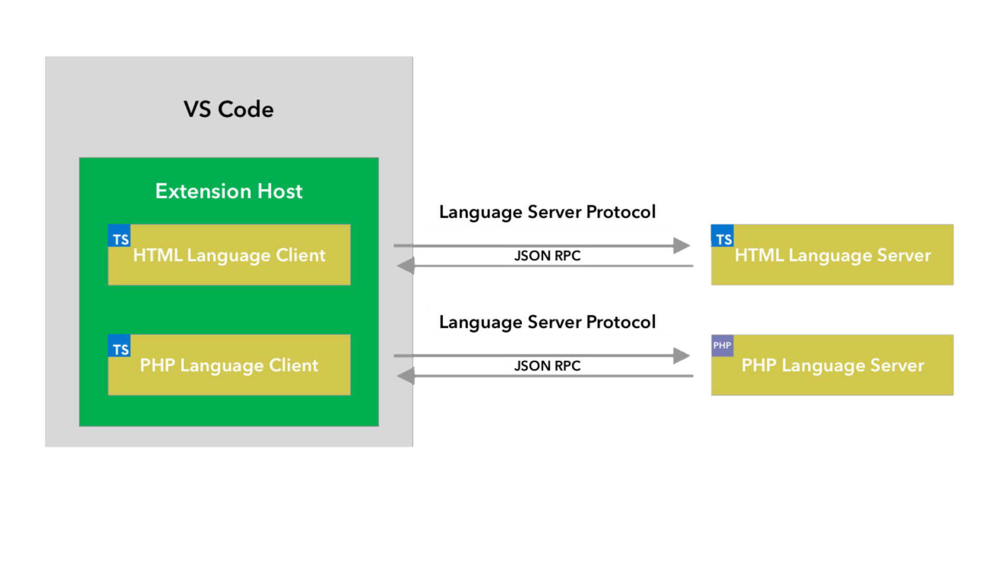
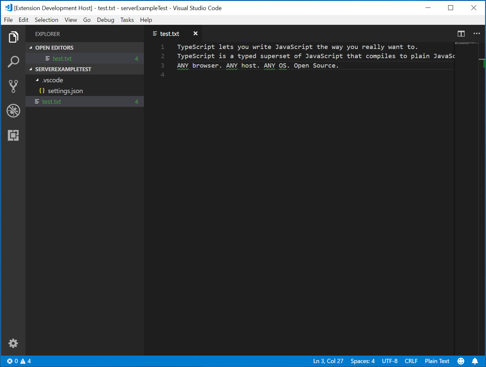
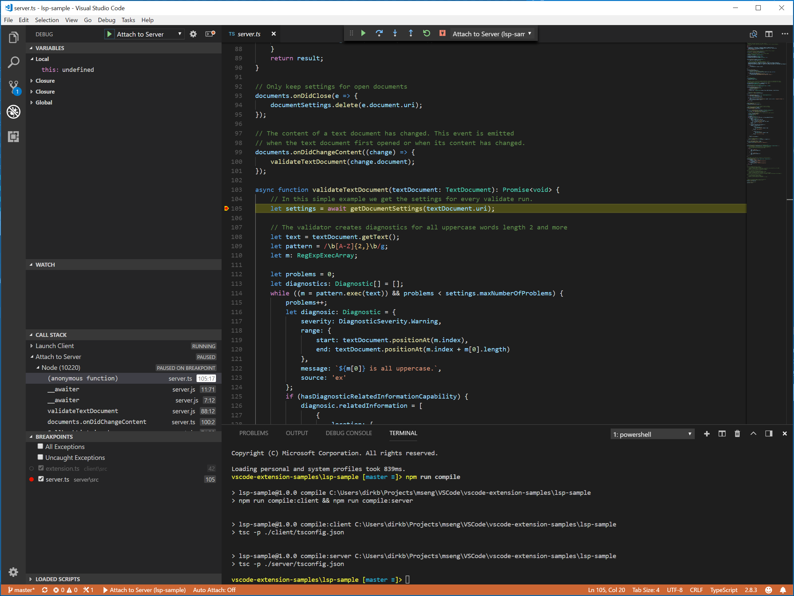
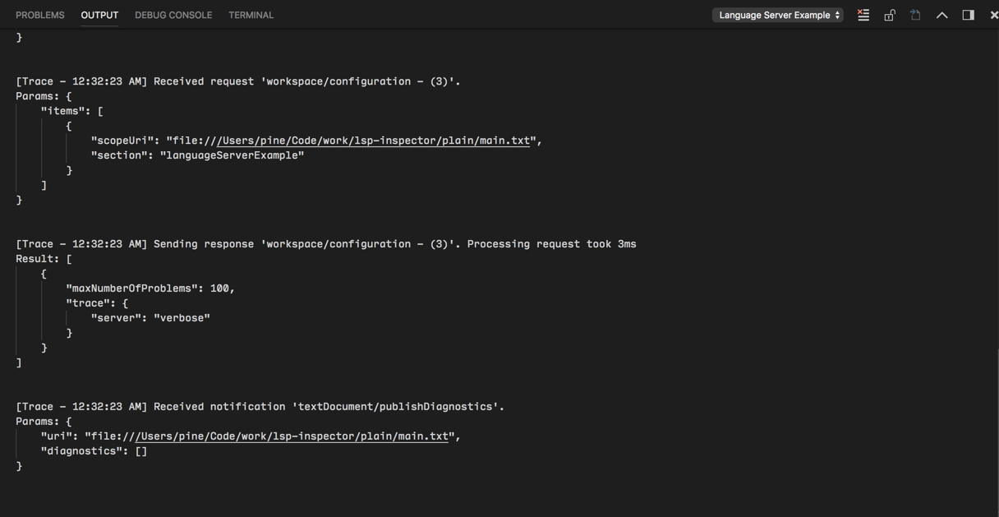
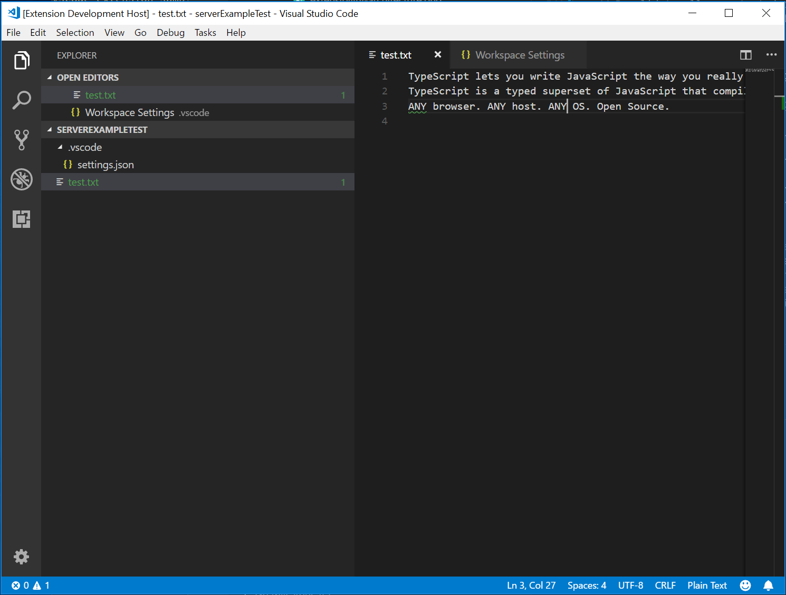

<!-- more -->

# [语言服务器扩展指南](https://vscode.js.cn/api/language-extensions/language-server-extension-guide)

如你在[程序化语言特性](https://vscode.js.cn/api/language-extensions/programmatic-language-features)主题中所见，可以通过直接使用 `languages.*` API 来实现语言特性。然而，语言服务器扩展提供了一种实现此类语言支持的替代方法。

本主题

- 解释语言服务器扩展的优势。
- 引导你使用 [`Microsoft/vscode-languageserver-node`](https://github.com/microsoft/vscode-languageserver-node) 库构建语言服务器。你也可以直接跳转到 [lsp-sample](https://github.com/microsoft/vscode-extension-samples/tree/main/lsp-sample) 中的代码。

## [为什么选择语言服务器？](https://vscode.js.cn/api/language-extensions/language-server-extension-guide#why-language-server)

语言服务器是一种特殊的 Visual Studio Code 扩展，它为许多编程语言的编辑体验提供支持。通过语言服务器，你可以实现自动完成、错误检查（诊断）、跳转到定义以及 VS Code 中支持的许多其他[语言特性](https://vscode.js.cn/api/language-extensions/programmatic-language-features)。

然而，在 VS Code 中实现语言特性支持时，我们发现了三个常见问题

首先，语言服务器通常用其原生编程语言实现，这给将其与具有 Node.js 运行时的 VS Code 集成带来了挑战。

此外，语言特性可能资源密集。例如，为了正确验证文件，语言服务器需要解析大量文件，为它们构建抽象语法树并执行静态程序分析。这些操作可能导致显著的 CPU 和内存使用，我们需要确保 VS Code 的性能不受影响。

最后，将多种语言工具与多种代码编辑器集成可能涉及巨大的工作量。从语言工具的角度来看，它们需要适应具有不同 API 的代码编辑器。从代码编辑器的角度来看，它们不能期望语言工具提供任何统一的 API。这使得在 `N` 个代码编辑器中实现 `M` 种语言的语言支持成为 `M * N` 的工作。

为了解决这些问题，微软制定了[语言服务器协议](https://msdocs.cn/language-server-protocol)，该协议规范了语言工具和代码编辑器之间的通信。通过这种方式，语言服务器可以用任何语言实现，并在自己的进程中运行以避免性能开销，因为它们通过语言服务器协议与代码编辑器通信。此外，任何符合 LSP 的语言工具都可以与多个符合 LSP 的代码编辑器集成，任何符合 LSP 的代码编辑器都可以轻松支持多个符合 LSP 的语言工具。LSP 对语言工具提供商和代码编辑器供应商来说都是一个胜利！


在本指南中，我们将

- 解释如何使用提供的[Node SDK](https://github.com/microsoft/vscode-languageserver-node)在 VS Code 中构建语言服务器扩展。
- 解释如何运行、调试、记录和测试语言服务器扩展。
- 为你指出一些关于语言服务器的高级主题。

## 一、[实现语言服务器](https://vscode.js.cn/api/language-extensions/language-server-extension-guide#implementing-a-language-server)

### 1. [概述](https://vscode.js.cn/api/language-extensions/language-server-extension-guide#overview)

在 VS Code 中，语言服务器包含两部分

- 语言客户端：一个用 JavaScript / TypeScript 编写的普通 VS Code 扩展。此扩展可以访问所有[VS Code 命名空间 API](https://vscode.js.cn/api/references/vscode-api)。
- 语言服务器：一个在单独进程中运行的语言分析工具。

如上所述，在单独进程中运行语言服务器有两个好处

- 只要分析工具能够遵循语言服务器协议与语言客户端通信，它就可以用任何语言实现。
- 由于语言分析工具通常占用大量 CPU 和内存资源，在单独进程中运行它们可以避免性能开销。

下图展示了 VS Code 运行两个语言服务器扩展的情况。HTML 语言客户端和 PHP 语言客户端是使用 TypeScript 编写的普通 VS Code 扩展。它们各自实例化一个相应的语言服务器，并通过 LSP 与其通信。尽管 PHP 语言服务器是用 PHP 编写的，它仍然可以通过 LSP 与 PHP 语言客户端通信。



本指南将教你如何使用我们的[Node SDK](https://github.com/microsoft/vscode-languageserver-node)构建语言客户端/服务器。文档的其余部分假设你熟悉 VS Code [扩展 API](https://vscode.js.cn/api)。

### 2. [LSP 示例 - 一个用于纯文本文件的简单语言服务器](https://vscode.js.cn/api/language-extensions/language-server-extension-guide#lsp-sample-a-simple-language-server-for-plain-text-files)

让我们构建一个简单的语言服务器扩展，它为纯文本文件实现自动完成和诊断功能。我们还将介绍客户端/服务器之间配置的同步。

如果你更喜欢直接查看代码

- **[lsp-sample](https://github.com/microsoft/vscode-extension-samples/tree/main/lsp-sample)**：本指南的详细文档化源代码。
- **[lsp-multi-server-sample](https://github.com/microsoft/vscode-extension-samples/tree/main/lsp-multi-server-sample)**：一个文档详细、更高级的 **lsp-sample** 版本，它为每个工作区文件夹启动一个不同的服务器实例，以支持 VS Code 中的[多根工作区](https://vscode.js.cn/docs/editor/multi-root-workspaces)功能。

克隆仓库 [Microsoft/vscode-extension-samples](https://github.com/microsoft/vscode-extension-samples) 并打开示例

```
> git clone https://github.com/microsoft/vscode-extension-samples.git
> cd vscode-extension-samples/lsp-sample
> npm install
> npm run compile
> code .
```

以上操作将安装所有依赖项并打开包含客户端和服务器代码的 **lsp-sample** 工作区。以下是 **lsp-sample** 结构的大致概览

```
.
├── client // Language Client
│   ├── src
│   │   ├── test // End to End tests for Language Client / Server
│   │   └── extension.ts // Language Client entry point
├── package.json // The extension manifest
└── server // Language Server
    └── src
        └── server.ts // Language Server entry point
```

### 3. [解释“语言客户端”](https://vscode.js.cn/api/language-extensions/language-server-extension-guide#explaining-the-language-client)

我们首先来看看 `/package.json`，它描述了语言客户端的功能。其中有两个有趣的部分

首先，查看[`configuration`](https://vscode.js.cn/api/references/contribution-points#contributes.configuration)部分

```json
"configuration": {
    "type": "object",
    "title": "Example configuration",
    "properties": {
        "languageServerExample.maxNumberOfProblems": {
            "scope": "resource",
            "type": "number",
            "default": 100,
            "description": "Controls the maximum number of problems produced by the server."
        }
    }
}
```

此部分将 `configuration` 设置贡献给 VS Code。本例将解释这些设置如何在启动时以及每次更改设置时发送到语言服务器。

> **注意**：如果你的扩展与 VS Code 1.74.0 之前的版本兼容，你必须在 `/package.json` 的 [`activationEvents`](https://vscode.js.cn/api/references/activation-events) 字段中声明 `onLanguage:plaintext`，以告知 VS Code 在打开纯文本文件（例如扩展名为 `.txt` 的文件）时立即激活该扩展。
>
> ```json
> "activationEvents": []
> ```

实际的语言客户端源代码和相应的 `package.json` 位于 `/client` 文件夹中。`/client/package.json` 文件中有趣的部分是它通过 `engines` 字段引用 `vscode` 扩展宿主 API 并添加了对 `vscode-languageclient` 库的依赖。

```json
"engines": {
    "vscode": "^1.52.0"
},
"dependencies": {
    "vscode-languageclient": "^7.0.0"
}
```

如前所述，客户端作为普通的 VS Code 扩展实现，并且可以访问所有 VS Code 命名空间 API。

下面是对应的 extension.ts 文件的内容，它是 **lsp-sample** 扩展的入口

```typescript
import * as path from 'path';
import { workspace, ExtensionContext } from 'vscode';

import {
  LanguageClient,
  LanguageClientOptions,
  ServerOptions,
  TransportKind
} from 'vscode-languageclient/node';

let client: LanguageClient;

export function activate(context: ExtensionContext) {
  // The server is implemented in node
  let serverModule = context.asAbsolutePath(path.join('server', 'out', 'server.js'));
  // The debug options for the server
  // --inspect=6009: runs the server in Node's Inspector mode so VS Code can attach to the server for debugging
  let debugOptions = { execArgv: ['--nolazy', '--inspect=6009'] };

  // If the extension is launched in debug mode then the debug server options are used
  // Otherwise the run options are used
  let serverOptions: ServerOptions = {
    run: { module: serverModule, transport: TransportKind.ipc },
    debug: {
      module: serverModule,
      transport: TransportKind.ipc,
      options: debugOptions
    }
  };

  // Options to control the language client
  let clientOptions: LanguageClientOptions = {
    // Register the server for plain text documents
    documentSelector: [{ scheme: 'file', language: 'plaintext' }],
    synchronize: {
      // Notify the server about file changes to '.clientrc files contained in the workspace
      fileEvents: workspace.createFileSystemWatcher('**/.clientrc')
    }
  };

  // Create the language client and start the client.
  client = new LanguageClient(
    'languageServerExample',
    'Language Server Example',
    serverOptions,
    clientOptions
  );

  // Start the client. This will also launch the server
  client.start();
}

export function deactivate(): Thenable<void> | undefined {
  if (!client) {
    return undefined;
  }
  return client.stop();
}
```

### 4. [解释“语言服务器”](https://vscode.js.cn/api/language-extensions/language-server-extension-guide#explaining-the-language-server)

> **注意：** 从 GitHub 仓库克隆的“服务器”实现包含最终的演练实现。要遵循演练，你可以创建一个新的 `server.ts` 或修改克隆版本的内容。

在示例中，服务器也是用 TypeScript 实现的，并使用 Node.js 执行。由于 VS Code 已经附带了 Node.js 运行时，除非你对运行时有特定要求，否则无需提供自己的运行时。

语言服务器的源代码位于 `/server`。服务器的 `package.json` 文件中有趣的部分是

```json
"dependencies": {
    "vscode-languageserver": "^7.0.0",
    "vscode-languageserver-textdocument": "^1.0.1"
}
```

这会引入 `vscode-languageserver` 库。

下面是一个服务器实现，它使用提供的文本文档管理器，该管理器通过始终将增量变化从 VS Code 发送到服务器来同步文本文档。

```typescript
import {
  createConnection,
  TextDocuments,
  Diagnostic,
  DiagnosticSeverity,
  ProposedFeatures,
  InitializeParams,
  DidChangeConfigurationNotification,
  CompletionItem,
  CompletionItemKind,
  TextDocumentPositionParams,
  TextDocumentSyncKind,
  InitializeResult
} from 'vscode-languageserver/node';

import { TextDocument } from 'vscode-languageserver-textdocument';

// Create a connection for the server, using Node's IPC as a transport.
// Also include all preview / proposed LSP features.
let connection = createConnection(ProposedFeatures.all);

// Create a simple text document manager.
let documents: TextDocuments<TextDocument> = new TextDocuments(TextDocument);

let hasConfigurationCapability: boolean = false;
let hasWorkspaceFolderCapability: boolean = false;
let hasDiagnosticRelatedInformationCapability: boolean = false;

connection.onInitialize((params: InitializeParams) => {
  let capabilities = params.capabilities;

  // Does the client support the `workspace/configuration` request?
  // If not, we fall back using global settings.
  hasConfigurationCapability = !!(
    capabilities.workspace && !!capabilities.workspace.configuration
  );
  hasWorkspaceFolderCapability = !!(
    capabilities.workspace && !!capabilities.workspace.workspaceFolders
  );
  hasDiagnosticRelatedInformationCapability = !!(
    capabilities.textDocument &&
    capabilities.textDocument.publishDiagnostics &&
    capabilities.textDocument.publishDiagnostics.relatedInformation
  );

  const result: InitializeResult = {
    capabilities: {
      textDocumentSync: TextDocumentSyncKind.Incremental,
      // Tell the client that this server supports code completion.
      completionProvider: {
        resolveProvider: true
      }
    }
  };
  if (hasWorkspaceFolderCapability) {
    result.capabilities.workspace = {
      workspaceFolders: {
        supported: true
      }
    };
  }
  return result;
});

connection.onInitialized(() => {
  if (hasConfigurationCapability) {
    // Register for all configuration changes.
    connection.client.register(DidChangeConfigurationNotification.type, undefined);
  }
  if (hasWorkspaceFolderCapability) {
    connection.workspace.onDidChangeWorkspaceFolders(_event => {
      connection.console.log('Workspace folder change event received.');
    });
  }
});

// The example settings
interface ExampleSettings {
  maxNumberOfProblems: number;
}

// The global settings, used when the `workspace/configuration` request is not supported by the client.
// Please note that this is not the case when using this server with the client provided in this example
// but could happen with other clients.
const defaultSettings: ExampleSettings = { maxNumberOfProblems: 1000 };
let globalSettings: ExampleSettings = defaultSettings;

// Cache the settings of all open documents
let documentSettings: Map<string, Thenable<ExampleSettings>> = new Map();

connection.onDidChangeConfiguration(change => {
  if (hasConfigurationCapability) {
    // Reset all cached document settings
    documentSettings.clear();
  } else {
    globalSettings = <ExampleSettings>(
      (change.settings.languageServerExample || defaultSettings)
    );
  }

  // Revalidate all open text documents
  documents.all().forEach(validateTextDocument);
});

function getDocumentSettings(resource: string): Thenable<ExampleSettings> {
  if (!hasConfigurationCapability) {
    return Promise.resolve(globalSettings);
  }
  let result = documentSettings.get(resource);
  if (!result) {
    result = connection.workspace.getConfiguration({
      scopeUri: resource,
      section: 'languageServerExample'
    });
    documentSettings.set(resource, result);
  }
  return result;
}

// Only keep settings for open documents
documents.onDidClose(e => {
  documentSettings.delete(e.document.uri);
});

// The content of a text document has changed. This event is emitted
// when the text document first opened or when its content has changed.
documents.onDidChangeContent(change => {
  validateTextDocument(change.document);
});

async function validateTextDocument(textDocument: TextDocument): Promise<void> {
  // In this simple example we get the settings for every validate run.
  let settings = await getDocumentSettings(textDocument.uri);

  // The validator creates diagnostics for all uppercase words length 2 and more
  let text = textDocument.getText();
  let pattern = /\b[A-Z]{2,}\b/g;
  let m: RegExpExecArray | null;

  let problems = 0;
  let diagnostics: Diagnostic[] = [];
  while ((m = pattern.exec(text)) && problems < settings.maxNumberOfProblems) {
    problems++;
    let diagnostic: Diagnostic = {
      severity: DiagnosticSeverity.Warning,
      range: {
        start: textDocument.positionAt(m.index),
        end: textDocument.positionAt(m.index + m[0].length)
      },
      message: `${m[0]} is all uppercase.`,
      source: 'ex'
    };
    if (hasDiagnosticRelatedInformationCapability) {
      diagnostic.relatedInformation = [
        {
          location: {
            uri: textDocument.uri,
            range: Object.assign({}, diagnostic.range)
          },
          message: 'Spelling matters'
        },
        {
          location: {
            uri: textDocument.uri,
            range: Object.assign({}, diagnostic.range)
          },
          message: 'Particularly for names'
        }
      ];
    }
    diagnostics.push(diagnostic);
  }

  // Send the computed diagnostics to VS Code.
  connection.sendDiagnostics({ uri: textDocument.uri, diagnostics });
}

connection.onDidChangeWatchedFiles(_change => {
  // Monitored files have change in VS Code
  connection.console.log('We received a file change event');
});

// This handler provides the initial list of the completion items.
connection.onCompletion(
  (_textDocumentPosition: TextDocumentPositionParams): CompletionItem[] => {
    // The pass parameter contains the position of the text document in
    // which code complete got requested. For the example we ignore this
    // info and always provide the same completion items.
    return [
      {
        label: 'TypeScript',
        kind: CompletionItemKind.Text,
        data: 1
      },
      {
        label: 'JavaScript',
        kind: CompletionItemKind.Text,
        data: 2
      }
    ];
  }
);

// This handler resolves additional information for the item selected in
// the completion list.
connection.onCompletionResolve(
  (item: CompletionItem): CompletionItem => {
    if (item.data === 1) {
      item.detail = 'TypeScript details';
      item.documentation = 'TypeScript documentation';
    } else if (item.data === 2) {
      item.detail = 'JavaScript details';
      item.documentation = 'JavaScript documentation';
    }
    return item;
  }
);

// Make the text document manager listen on the connection
// for open, change and close text document events
documents.listen(connection);

// Listen on the connection
connection.listen();
```

### 5. [添加简单验证](https://vscode.js.cn/api/language-extensions/language-server-extension-guide#adding-a-simple-validation)

要向服务器添加文档验证，我们向文本文档管理器添加一个监听器，每当文本文档内容更改时都会调用该监听器。然后由服务器决定何时是验证文档的最佳时机。在示例实现中，服务器验证纯文本文档并标记所有使用全部大写字母的单词。相应的代码片段如下所示

```typescript
// The content of a text document has changed. This event is emitted
// when the text document first opened or when its content has changed.
documents.onDidChangeContent(async change => {
  let textDocument = change.document;
  // In this simple example we get the settings for every validate run.
  let settings = await getDocumentSettings(textDocument.uri);

  // The validator creates diagnostics for all uppercase words length 2 and more
  let text = textDocument.getText();
  let pattern = /\b[A-Z]{2,}\b/g;
  let m: RegExpExecArray | null;

  let problems = 0;
  let diagnostics: Diagnostic[] = [];
  while ((m = pattern.exec(text)) && problems < settings.maxNumberOfProblems) {
    problems++;
    let diagnostic: Diagnostic = {
      severity: DiagnosticSeverity.Warning,
      range: {
        start: textDocument.positionAt(m.index),
        end: textDocument.positionAt(m.index + m[0].length)
      },
      message: `${m[0]} is all uppercase.`,
      source: 'ex'
    };
    if (hasDiagnosticRelatedInformationCapability) {
      diagnostic.relatedInformation = [
        {
          location: {
            uri: textDocument.uri,
            range: Object.assign({}, diagnostic.range)
          },
          message: 'Spelling matters'
        },
        {
          location: {
            uri: textDocument.uri,
            range: Object.assign({}, diagnostic.range)
          },
          message: 'Particularly for names'
        }
      ];
    }
    diagnostics.push(diagnostic);
  }

  // Send the computed diagnostics to VS Code.
  connection.sendDiagnostics({ uri: textDocument.uri, diagnostics });
});
```

### 6. [诊断提示和技巧](https://vscode.js.cn/api/language-extensions/language-server-extension-guide#diagnostics-tips-and-tricks)

- 如果起始位置和结束位置相同，VS Code 将在该位置的单词下显示波浪线。
- 如果你想让波浪线一直持续到行尾，则将结束位置的字符设置为 Number.MAX_VALUE。

要运行语言服务器，请执行以下步骤

- 按下 Ctrl+Shift+B 启动构建任务。该任务会编译客户端和服务器。
- 打开**运行**视图，选择**启动客户端**启动配置，然后按下**开始调试**按钮，以启动一个额外的 VS Code **扩展开发主机**实例来执行扩展代码。
- 在根文件夹中创建一个 `test.txt` 文件并粘贴以下内容

```
TypeScript lets you write JavaScript the way you really want to.
TypeScript is a typed superset of JavaScript that compiles to plain JavaScript.
ANY browser. ANY host. ANY OS. Open Source.
```

然后，**扩展开发主机**实例将如下所示



### 7. [调试客户端和服务器](https://vscode.js.cn/api/language-extensions/language-server-extension-guide#debugging-both-client-and-server)

调试客户端代码就像调试普通扩展一样简单。在客户端代码中设置一个断点，然后按下 F5 即可调试扩展。


由于服务器是由扩展（客户端）中运行的 `LanguageClient` 启动的，我们需要将调试器附加到运行中的服务器。为此，切换到**运行和调试**视图，选择启动配置**附加到服务器**，然后按下 F5。这会将调试器附加到服务器。



### 8. [语言服务器的日志支持](https://vscode.js.cn/api/language-extensions/language-server-extension-guide#logging-support-for-language-server)

如果你使用 `vscode-languageclient` 来实现客户端，你可以指定一个设置 `[langId].trace.server`，它会指示客户端将语言客户端/服务器之间的通信记录到语言客户端 `name` 的通道中。

对于 **lsp-sample**，你可以设置此选项：`"languageServerExample.trace.server": "verbose"`。现在前往“Language Server Example”通道。你应该能看到日志



### 9. [在服务器中使用配置设置](https://vscode.js.cn/api/language-extensions/language-server-extension-guide#using-configuration-settings-in-the-server)

在编写扩展的客户端部分时，我们已经定义了一个设置来控制报告的最大问题数量。我们还在服务器端编写了代码，从客户端读取这些设置

```typescript
function getDocumentSettings(resource: string): Thenable<ExampleSettings> {
  if (!hasConfigurationCapability) {
    return Promise.resolve(globalSettings);
  }
  let result = documentSettings.get(resource);
  if (!result) {
    result = connection.workspace.getConfiguration({
      scopeUri: resource,
      section: 'languageServerExample'
    });
    documentSettings.set(resource, result);
  }
  return result;
}
```

现在我们唯一需要做的就是监听服务器端的配置更改，如果设置发生变化，则重新验证打开的文本文档。为了能够重用文档更改事件处理的验证逻辑，我们将代码提取到一个 `validateTextDocument` 函数中，并修改代码以尊重 `maxNumberOfProblems` 变量

```typescript
async function validateTextDocument(textDocument: TextDocument): Promise<void> {
  // In this simple example we get the settings for every validate run.
  let settings = await getDocumentSettings(textDocument.uri);

  // The validator creates diagnostics for all uppercase words length 2 and more
  let text = textDocument.getText();
  let pattern = /\b[A-Z]{2,}\b/g;
  let m: RegExpExecArray | null;

  let problems = 0;
  let diagnostics: Diagnostic[] = [];
  while ((m = pattern.exec(text)) && problems < settings.maxNumberOfProblems) {
    problems++;
    let diagnostic: Diagnostic = {
      severity: DiagnosticSeverity.Warning,
      range: {
        start: textDocument.positionAt(m.index),
        end: textDocument.positionAt(m.index + m[0].length)
      },
      message: `${m[0]} is all uppercase.`,
      source: 'ex'
    };
    if (hasDiagnosticRelatedInformationCapability) {
      diagnostic.relatedInformation = [
        {
          location: {
            uri: textDocument.uri,
            range: Object.assign({}, diagnostic.range)
          },
          message: 'Spelling matters'
        },
        {
          location: {
            uri: textDocument.uri,
            range: Object.assign({}, diagnostic.range)
          },
          message: 'Particularly for names'
        }
      ];
    }
    diagnostics.push(diagnostic);
  }

  // Send the computed diagnostics to VS Code.
  connection.sendDiagnostics({ uri: textDocument.uri, diagnostics });
}
```

配置更改的处理是通过向连接添加配置更改通知处理程序来完成的。相应的代码如下所示

```typescript
connection.onDidChangeConfiguration(change => {
  if (hasConfigurationCapability) {
    // Reset all cached document settings
    documentSettings.clear();
  } else {
    globalSettings = <ExampleSettings>(
      (change.settings.languageServerExample || defaultSettings)
    );
  }

  // Revalidate all open text documents
  documents.all().forEach(validateTextDocument);
});
```

再次启动客户端并将设置更改为最多报告 1 个问题，将导致以下验证结果



### 10. [添加更多语言特性](https://vscode.js.cn/api/language-extensions/language-server-extension-guide#adding-additional-language-features)

语言服务器通常实现的第一个有趣特性是文档验证。从这个意义上说，即使是 linter 也算作语言服务器，在 VS Code 中 linter 通常以语言服务器的形式实现（例如请参阅 [eslint](https://github.com/microsoft/vscode-eslint) 和 [jshint](https://github.com/microsoft/vscode-jshint)）。但语言服务器还有更多功能。它们可以提供代码补全、查找所有引用或跳转到定义。下面的示例代码为服务器添加了代码补全功能。它建议了“TypeScript”和“JavaScript”这两个词。

```typescript
// This handler provides the initial list of the completion items.
connection.onCompletion(
  (_textDocumentPosition: TextDocumentPositionParams): CompletionItem[] => {
    // The pass parameter contains the position of the text document in
    // which code complete got requested. For the example we ignore this
    // info and always provide the same completion items.
    return [
      {
        label: 'TypeScript',
        kind: CompletionItemKind.Text,
        data: 1
      },
      {
        label: 'JavaScript',
        kind: CompletionItemKind.Text,
        data: 2
      }
    ];
  }
);

// This handler resolves additional information for the item selected in
// the completion list.
connection.onCompletionResolve(
  (item: CompletionItem): CompletionItem => {
    if (item.data === 1) {
      item.detail = 'TypeScript details';
      item.documentation = 'TypeScript documentation';
    } else if (item.data === 2) {
      item.detail = 'JavaScript details';
      item.documentation = 'JavaScript documentation';
    }
    return item;
  }
);
```

`data` 字段用于在解析处理程序中唯一标识一个补全项。数据属性对于协议是透明的。由于底层的消息传递协议是基于 JSON 的，因此数据字段应仅包含可以序列化为 JSON 和从 JSON 反序列化的数据。

现在唯一缺少的就是告诉 VS Code 服务器支持代码补全请求。为此，请在初始化处理程序中标记相应的功能

```typescript
connection.onInitialize((params): InitializeResult => {
    ...
    return {
        capabilities: {
            ...
            // Tell the client that the server supports code completion
            completionProvider: {
                resolveProvider: true
            }
        }
    };
});
```

下面的屏幕截图显示了在纯文本文件上运行的已完成代码


### 11. [测试语言服务器](https://vscode.js.cn/api/language-extensions/language-server-extension-guide#testing-the-language-server)

为了创建高质量的语言服务器，我们需要构建一个覆盖其功能的良好测试套件。测试语言服务器有两种常见方法

- 单元测试：这在你想通过模拟发送给语言服务器的所有信息来测试其特定功能时非常有用。VS Code 的 [HTML](https://github.com/microsoft/vscode-html-languageservice) / [CSS](https://github.com/microsoft/vscode-css-languageservice) / [JSON](https://github.com/microsoft/vscode-json-languageservice) 语言服务器都采用这种测试方法。LSP npm 模块也使用此方法。有关使用 npm 协议模块编写的一些单元测试，请参阅[此处](https://github.com/microsoft/vscode-languageserver-node/blob/main/protocol/src/node/test/connection.test.ts)。
- 端到端测试：这类似于[VS Code 扩展测试](https://vscode.js.cn/api/working-with-extensions/testing-extension)。这种方法的优点是它通过实例化一个带有工作区的 VS Code 实例、打开文件、激活语言客户端/服务器以及运行[VS Code 命令](https://vscode.js.cn/api/references/commands)来运行测试。如果你的文件、设置或依赖项（例如 `node_modules`）难以或不可能模拟，则此方法更优。流行的 [Python](https://github.com/microsoft/vscode-python) 扩展采用这种测试方法。

你可以在任何你选择的测试框架中进行单元测试。这里我们描述如何对语言服务器扩展进行端到端测试。

打开 `.vscode/launch.json`，你可以找到一个 `E2E` 测试目标

```json
{
  "name": "Language Server E2E Test",
  "type": "extensionHost",
  "request": "launch",
  "runtimeExecutable": "${execPath}",
  "args": [
    "--extensionDevelopmentPath=${workspaceRoot}",
    "--extensionTestsPath=${workspaceRoot}/client/out/test/index",
    "${workspaceRoot}/client/testFixture"
  ],
  "outFiles": ["${workspaceRoot}/client/out/test/**/*.js"]
}
```

如果你运行此调试目标，它将启动一个以 `client/testFixture` 作为活动工作区的 VS Code 实例。然后 VS Code 将继续执行 `client/src/test` 中的所有测试。作为调试提示，你可以在 `client/src/test` 中的 TypeScript 文件中设置断点，它们将被命中。

让我们来看看 `completion.test.ts` 文件

```typescript
import * as vscode from 'vscode';
import * as assert from 'assert';
import { getDocUri, activate } from './helper';

suite('Should do completion', () => {
  const docUri = getDocUri('completion.txt');

  test('Completes JS/TS in txt file', async () => {
    await testCompletion(docUri, new vscode.Position(0, 0), {
      items: [
        { label: 'JavaScript', kind: vscode.CompletionItemKind.Text },
        { label: 'TypeScript', kind: vscode.CompletionItemKind.Text }
      ]
    });
  });
});

async function testCompletion(
  docUri: vscode.Uri,
  position: vscode.Position,
  expectedCompletionList: vscode.CompletionList
) {
  await activate(docUri);

  // Executing the command `vscode.executeCompletionItemProvider` to simulate triggering completion
  const actualCompletionList = (await vscode.commands.executeCommand(
    'vscode.executeCompletionItemProvider',
    docUri,
    position
  )) as vscode.CompletionList;

  assert.ok(actualCompletionList.items.length >= 2);
  expectedCompletionList.items.forEach((expectedItem, i) => {
    const actualItem = actualCompletionList.items[i];
    assert.equal(actualItem.label, expectedItem.label);
    assert.equal(actualItem.kind, expectedItem.kind);
  });
}
```

在此测试中，我们

- 激活扩展。
- 使用 URI 和位置运行命令 `vscode.executeCompletionItemProvider`，以模拟补全触发。
- 断言返回的补全项与我们预期的补全项一致。

让我们深入了解一下 `activate(docURI)` 函数。它定义在 `client/src/test/helper.ts` 中

```
import * as vscode from 'vscode';
import * as path from 'path';

export let doc: vscode.TextDocument;
export let editor: vscode.TextEditor;
export let documentEol: string;
export let platformEol: string;

/**
 * Activates the vscode.lsp-sample extension
 */
export async function activate(docUri: vscode.Uri) {
  // The extensionId is `publisher.name` from package.json
  const ext = vscode.extensions.getExtension('vscode-samples.lsp-sample')!;
  await ext.activate();
  try {
    doc = await vscode.workspace.openTextDocument(docUri);
    editor = await vscode.window.showTextDocument(doc);
    await sleep(2000); // Wait for server activation
  } catch (e) {
    console.error(e);
  }
}

async function sleep(ms: number) {
  return new Promise(resolve => setTimeout(resolve, ms));
}
```

在激活部分，我们

- 使用 `package.json` 中定义的 `{publisher.name}.{extensionId}` 获取扩展。
- 打开指定文档，并在活动文本编辑器中显示它。
- 暂停 2 秒，以确保语言服务器已实例化。

准备就绪后，我们可以运行与每个语言特性对应的[VS Code 命令](https://vscode.js.cn/api/references/commands)，并断言返回的结果。

还有一个测试涵盖了我们刚刚实现的诊断功能。请在 `client/src/test/diagnostics.test.ts` 中查看。

## 二、[高级主题](https://vscode.js.cn/api/language-extensions/language-server-extension-guide#advanced-topics)

到目前为止，本指南涵盖了

- 语言服务器和语言服务器协议的简要概述。
- VS Code 中语言服务器扩展的架构
- **lsp-sample** 扩展，以及如何开发/调试/检查/测试它。

本指南中未能涵盖一些更高级的主题。我们将提供这些资源的链接，以便进一步学习语言服务器开发。

### 1. [其他语言服务器功能](https://vscode.js.cn/api/language-extensions/language-server-extension-guide#additional-language-server-features)

除了代码补全，语言服务器目前还支持以下语言特性

- *文档高亮*：高亮显示文本文档中所有“相同”的符号。
- *悬停*：为文本文档中选定的符号提供悬停信息。
- *签名帮助*：为文本文档中选定的符号提供签名帮助。
- *跳转到定义*：为文本文档中选定的符号提供跳转到定义支持。
- *跳转到类型定义*：为文本文档中选定的符号提供跳转到类型/接口定义支持。
- *跳转到实现*：为文本文档中选定的符号提供跳转到实现定义支持。
- *查找引用*：查找文本文档中选定符号的所有项目范围引用。
- *列出文档符号*：列出文本文档中定义的所有符号。
- *列出工作区符号*：列出所有项目范围的符号。
- *代码操作*：计算要运行的命令（通常是美化/重构）针对给定文本文档和范围。
- *CodeLens*：计算给定文本文档的 CodeLens 统计信息。
- *文档格式化*：包括整个文档、文档范围和输入时格式化。
- *重命名*：符号的项目范围重命名。
- *文档链接*：计算和解析文档中的链接。
- *文档颜色*：计算并解析文档中的颜色，以便在编辑器中提供颜色选择器。

[程序化语言特性](https://vscode.js.cn/api/language-extensions/programmatic-language-features)主题描述了上述每种语言特性，并提供了如何通过语言服务器协议或直接从扩展使用可扩展性 API 实现它们的指导。

### 2. [增量文本文档同步](https://vscode.js.cn/api/language-extensions/language-server-extension-guide#incremental-text-document-synchronization)

该示例使用 `vscode-languageserver` 模块提供的简单文本文档管理器在 VS Code 和语言服务器之间同步文档。

这有两个缺点

- 由于文本文档的整个内容会重复发送到服务器，因此会传输大量数据。
- 如果使用现有的语言库，此类库通常支持增量文档更新，以避免不必要的解析和抽象语法树创建。

因此，该协议也支持增量文档同步。

要使用增量文档同步，服务器需要安装三个通知处理程序

- *onDidOpenTextDocument*：在 VS Code 中打开文本文档时调用。
- *onDidChangeTextDocument*：在 VS Code 中文本文档内容更改时调用。
- *onDidCloseTextDocument*：在 VS Code 中关闭文本文档时调用。

下面是一个代码片段，演示了如何将这些通知处理程序挂接到连接上，以及如何在初始化时返回正确的功能

```typescript
connection.onInitialize((params): InitializeResult => {
    ...
    return {
        capabilities: {
            // Enable incremental document sync
            textDocumentSync: TextDocumentSyncKind.Incremental,
            ...
        }
    };
});

connection.onDidOpenTextDocument((params) => {
    // A text document was opened in VS Code.
    // params.uri uniquely identifies the document. For documents stored on disk, this is a file URI.
    // params.text the initial full content of the document.
});

connection.onDidChangeTextDocument((params) => {
    // The content of a text document has change in VS Code.
    // params.uri uniquely identifies the document.
    // params.contentChanges describe the content changes to the document.
});

connection.onDidCloseTextDocument((params) => {
    // A text document was closed in VS Code.
    // params.uri uniquely identifies the document.
});

/*
Make the text document manager listen on the connection
for open, change and close text document events.

Comment out this line to allow `connection.onDidOpenTextDocument`,
`connection.onDidChangeTextDocument`, and `connection.onDidCloseTextDocument` to handle the events
*/
// documents.listen(connection);
```

### 3. [直接使用 VS Code API 实现语言特性](https://vscode.js.cn/api/language-extensions/language-server-extension-guide#using-vs-code-api-directly-to-implement-language-features)

尽管语言服务器具有许多优点，但它们并不是扩展 VS Code 编辑功能的唯一选择。如果你想为某种文档添加一些简单的语言特性，可以考虑使用 `vscode.languages.register[LANGUAGE_FEATURE]Provider` 作为一个选项。

这是一个 [`completions-sample`](https://github.com/microsoft/vscode-extension-samples/tree/main/completions-sample)，它使用 `vscode.languages.registerCompletionItemProvider` 为纯文本文件添加了一些代码片段作为补全。

更多演示 VS Code API 用法的示例可以在 https://github.com/microsoft/vscode-extension-samples 找到。

### 4. [语言服务器的容错解析器](https://vscode.js.cn/api/language-extensions/language-server-extension-guide#error-tolerant-parser-for-language-server)

大多数情况下，编辑器中的代码是不完整且语法不正确的，但开发者仍然希望自动完成和其他语言特性能够正常工作。因此，语言服务器需要一个容错解析器：解析器从部分完整的代码中生成有意义的 AST，然后语言服务器基于 AST 提供语言特性。

当我们改进 VS Code 中的 PHP 支持时，我们意识到官方的 PHP 解析器不容错，不能直接在语言服务器中重用。因此，我们开发了 [Microsoft/tolerant-php-parser](https://github.com/microsoft/tolerant-php-parser) 并留下了详细的[说明](https://github.com/microsoft/tolerant-php-parser/blob/master/docs/HowItWorks.md)，这可能会帮助需要实现容错解析器的语言服务器作者。

## 三、[常见问题](https://vscode.js.cn/api/language-extensions/language-server-extension-guide#common-questions)

### [当我尝试附加到服务器时，收到“无法连接到运行时进程（5000 毫秒后超时）”的错误？](https://vscode.js.cn/api/language-extensions/language-server-extension-guide#when-i-try-to-attach-to-the-server-i-get-cannot-connect-to-runtime-process-timeout-after-5000-ms)

如果在尝试附加调试器时服务器未运行，你将看到此超时错误。客户端会启动语言服务器，因此请确保你已启动客户端以使服务器运行。如果客户端断点干扰服务器启动，你可能还需要禁用它们。

### [我已经阅读了本指南和LSP 规范，但我仍有一些未解决的问题。我在哪里可以获得帮助？](https://vscode.js.cn/api/language-extensions/language-server-extension-guide#i-have-read-through-this-guide-and-the-lsp-specificationhttpsmicrosoft.github.iolanguageserverprotocol-but-i-still-have-unresolved-questions.-where-can-i-get-help)

请在 https://github.com/microsoft/language-server-protocol 提交一个问题。
