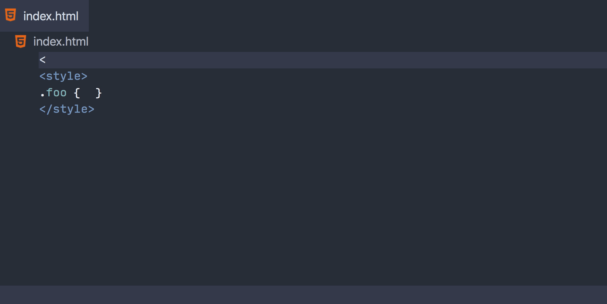

<!-- more -->

# [嵌入式编程语言](https://vscode.js.cn/api/language-extensions/embedded-languages)

Visual Studio Code 为编程语言提供了丰富的语言特性。如您在[语言服务器扩展指南](https://vscode.js.cn/api/language-extensions/language-server-extension-guide)中读到的，您可以编写语言服务器来支持任何编程语言。但是，为嵌入式语言启用此类支持需要付出更多努力。

如今，嵌入式语言的数量越来越多，例如：

- HTML 中的 JavaScript 和 CSS
- JavaScript 中的 JSX
- 模板语言中的插值，例如 Vue、Handlebars 和 Razor
- PHP 中的 HTML

本指南侧重于为嵌入式语言实现语言特性。如果您对为嵌入式语言提供语法高亮感兴趣，可以在[语法高亮指南](https://vscode.js.cn/api/language-extensions/syntax-highlight-guide#embedded-languages)中找到相关信息。

本指南包含两个示例，它们说明了构建此类语言服务器的两种方法：**语言服务**和**请求转发**。我们将回顾这两个示例，并总结每种方法的优缺点。

这两个示例的源代码可在以下位置找到：

- [使用语言服务的嵌入式语言语言服务器](https://github.com/microsoft/vscode-extension-samples/tree/main/lsp-embedded-language-service)
- [使用请求转发的嵌入式语言语言服务器](https://github.com/microsoft/vscode-extension-samples/tree/main/lsp-embedded-request-forwarding)

这是我们将要构建的嵌入式语言服务器：



这两个示例都为了演示目的贡献了一种新语言 `html1`。您可以创建一个 `.html1` 文件并测试以下功能：

- HTML 标签的补全
- `<style>` 标签中 CSS 的补全
- CSS 的诊断（仅在语言服务示例中）

## [语言服务](https://vscode.js.cn/api/language-extensions/embedded-languages#language-services)

**语言服务**是一个实现单一语言的[程序化语言特性](https://vscode.js.cn/api/language-extensions/programmatic-language-features)的库。**语言服务器**可以嵌入语言服务来处理嵌入式语言。

以下是 VS Code HTML 支持的概述：

- 内置的 [html 扩展](https://github.com/microsoft/vscode/tree/main/extensions/html)仅为 HTML 提供语法高亮和语言配置。
- 内置的 [html-language-features 扩展](https://github.com/microsoft/vscode/tree/main/extensions/html-language-features)包含一个 HTML 语言服务器，为 HTML 提供程序化语言特性。
- HTML 语言服务器使用 [vscode-html-languageservice](https://github.com/microsoft/vscode-html-languageservice) 来支持 HTML。
- CSS 语言服务器使用 [vscode-css-languageservice](https://github.com/microsoft/vscode-css-languageservice) 来支持 HTML 中的 CSS。

HTML 语言服务器分析 HTML 文档，将其分解为语言区域，并使用相应的语言服务处理语言服务器请求。

例如

- 对于 `<|` 处的自动补全请求，HTML 语言服务器使用 HTML 语言服务提供 HTML 补全。
- 对于 `<style>.foo { | }</style>` 处的自动补全请求，HTML 语言服务器使用 CSS 语言服务提供 CSS 补全。

让我们检查一下 [lsp-embedded-language-service](https://github.com/microsoft/vscode-extension-samples/tree/main/lsp-embedded-language-service) 示例，它是 HTML 语言服务器的简化版本，实现了 HTML 和 CSS 的自动补全，以及 CSS 的诊断错误。

### [语言服务示例](https://vscode.js.cn/api/language-extensions/embedded-languages#language-services-sample)

> **注意**：本示例假定您已了解[程序化语言特性主题](https://vscode.js.cn/api/language-extensions/programmatic-language-features)和[语言服务器扩展指南](https://vscode.js.cn/api/language-extensions/language-server-extension-guide)。代码基于 [lsp-sample](https://github.com/microsoft/vscode-extension-samples/tree/main/lsp-sample) 构建。

源代码可在 [microsoft/vscode-extension-samples](https://github.com/microsoft/vscode-extension-samples/tree/main/lsp-embedded-language-service) 找到。

与 [lsp-sample](https://github.com/microsoft/vscode-extension-samples/tree/main/lsp-sample) 相比，客户端代码是相同的。

如上所述，服务器将文档分解为不同的语言区域来处理嵌入内容。

这是一个简单的例子：

```html
<div></div>
<style>.foo { }</style>
```

在这种情况下，服务器检测到 `<style>` 标签，并将 `.foo { }` 标记为 CSS 区域。

给定特定位置的自动补全请求，服务器使用以下逻辑计算响应：

- 如果位置落在任何区域内：
  - 使用带有该区域语言的虚拟文档进行处理，同时将所有其他区域替换为空白
- 如果位置落在任何区域之外：
  - 使用 HTML 虚拟文档进行处理，同时将所有区域替换为空白

例如，在此位置进行自动补全时：

```html
<div></div>
<style>.foo { | }</style>
```

服务器确定该位置在区域内，并计算一个内容如下的虚拟 CSS 文档（█ 代表空格）：

```html
███████████
███████.foo { | }████████
```

然后，服务器使用 `vscode-css-languageservice` 分析此文档并计算补全项列表。由于内容现在不包含 HTML，CSS 语言服务可以毫无问题地处理它。通过将所有非 CSS 内容替换为空白，我们省去了手动偏移位置的麻烦。

处理补全请求的服务器代码：

```typescript
connection.onCompletion(async (textDocumentPosition, token) => {
  const document = documents.get(textDocumentPosition.textDocument.uri);
  if (!document) {
    return null;
  }

  const mode = languageModes.getModeAtPosition(document, textDocumentPosition.position);
  if (!mode || !mode.doComplete) {
    return CompletionList.create();
  }
  const doComplete = mode.doComplete!;

  return doComplete(document, textDocumentPosition.position);
});
```

负责处理落在 CSS 区域内的所有语言服务器请求的 CSS 模式：

```typescript
export function getCSSMode(
  cssLanguageService: CSSLanguageService,
  documentRegions: LanguageModelCache<HTMLDocumentRegions>
): LanguageMode {
  return {
    getId() {
      return 'css';
    },
    doComplete(document: TextDocument, position: Position) {
      // Get virtual CSS document, with all non-CSS code replaced with whitespace
      const embedded = documentRegions.get(document).getEmbeddedDocument('css');
      // Compute a response with vscode-css-languageservice
      const stylesheet = cssLanguageService.parseStylesheet(embedded);
      return cssLanguageService.doComplete(embedded, position, stylesheet);
    }
  };
}
```

这是一种处理嵌入式语言的简单有效的方法。但是，这种方法有一些缺点：

- 您必须不断更新您的语言服务器所依赖的语言服务。
- 包含与您的语言服务器编写语言不同的语言服务可能具有挑战性。例如，用 PHP 编写的 PHP 语言服务器会发现包含用 TypeScript 编写的 `vscode-css-languageservice` 很麻烦。

我们现在将介绍**请求转发**，它将解决上述问题。

## [请求转发](https://vscode.js.cn/api/language-extensions/embedded-languages#request-forwarding)

简而言之，请求转发的工作方式与语言服务类似。请求转发方法也接收语言服务器请求，计算虚拟内容，并计算响应。

主要区别在于：

- 语言服务方法使用库来计算语言服务器响应，而请求转发将请求发送回 VS Code，以使用已激活并已为嵌入式语言注册补全提供程序的扩展。

这是再次的简单示例：

```html
<div></div>
<style>.foo { | }</style>
```

自动补全通过以下方式发生：

- 语言客户端使用 `workspace.registerTextDocumentContentProvider` 为 `embedded-content` 文档注册一个虚拟文本文档提供程序。

- 语言客户端劫持 `<FILE_URI>` 的补全请求。

- 语言客户端确定请求位置落在 CSS 区域内。

- 语言客户端构造一个新的 URI，例如 `embedded-content://css/<FILE_URI>.css`。

- 然后语言客户端调用`commands.executeCommand('vscode.executeCompletionItemProvider', ...)`

  - VS Code 的 CSS 语言服务器响应此提供程序请求。
- 虚拟文本文档提供程序为 CSS 语言服务器提供虚拟内容，其中所有非 CSS 代码都替换为空白。
  - 语言客户端从 VS Code 接收响应并将其作为响应发送。

通过这种方法，即使我们的代码不包含任何理解 CSS 的库，我们也能够计算 CSS 自动补全。随着 VS Code 更新其 CSS 语言服务器，我们可以获得最新的 CSS 语言支持，而无需更新我们的代码。

现在让我们回顾一下示例代码。

### [请求转发示例](https://vscode.js.cn/api/language-extensions/embedded-languages#request-forwarding-sample)

> **注意**：本示例假定您已了解[程序化语言特性主题](https://vscode.js.cn/api/language-extensions/programmatic-language-features)和[语言服务器扩展指南](https://vscode.js.cn/api/language-extensions/language-server-extension-guide)。代码基于 [lsp-sample](https://github.com/microsoft/vscode-extension-samples/tree/main/lsp-sample) 构建。

源代码可在 [microsoft/vscode-extension-samples](https://github.com/microsoft/vscode-extension-samples/tree/main/lsp-embedded-request-forwarding) 找到。

在文档 URI 及其虚拟文档之间保持映射，并为相应的请求提供它们

```typescript
const virtualDocumentContents = new Map<string, string>();

workspace.registerTextDocumentContentProvider('embedded-content', {
  provideTextDocumentContent: uri => {
    // Remove leading `/` and ending `.css` to get original URI
    const originalUri = uri.path.slice(1).slice(0, -4);
    const decodedUri = decodeURIComponent(originalUri);
    return virtualDocumentContents.get(decodedUri);
  }
});
```

通过使用语言客户端的 `middleware` 选项，我们劫持了自动补全请求

```typescript
let clientOptions: LanguageClientOptions = {
  documentSelector: [{ scheme: 'file', language: 'html' }],
  middleware: {
    provideCompletionItem: async (document, position, context, token, next) => {
      // If not in `<style>`, do not perform request forwarding
      if (
        !isInsideStyleRegion(
          htmlLanguageService,
          document.getText(),
          document.offsetAt(position)
        )
      ) {
        return await next(document, position, context, token);
      }

      const originalUri = document.uri.toString(true);
      virtualDocumentContents.set(
        originalUri,
        getCSSVirtualContent(htmlLanguageService, document.getText())
      );

      const vdocUriString = `embedded-content://css/${encodeURIComponent(originalUri)}.css`;
      const vdocUri = Uri.parse(vdocUriString);
      return await commands.executeCommand<CompletionList>(
        'vscode.executeCompletionItemProvider',
        vdocUri,
        position,
        context.triggerCharacter
      );
    }
  }
};
```

## [潜在问题](https://vscode.js.cn/api/language-extensions/embedded-languages#potential-issues)

在实现嵌入式语言服务器时，我们遇到了许多问题。尽管我们还没有完美的解决方案，但我们希望提醒您，您很可能也会遇到这些问题。

### [难以实现语言特性](https://vscode.js.cn/api/language-extensions/embedded-languages#hard-to-implement-language-features)

通常，跨语言区域边界工作的语言特性更难实现。例如，自动补全或悬停内容很容易实现，因为您可以检测嵌入内容的语言并根据嵌入内容计算响应。但是，格式化或重命名等语言特性可能需要特殊处理。在格式化的情况下，您需要在单个文档中处理多个区域的缩进和格式化设置。对于重命名，使其在不同文档中的不同区域之间工作可能具有挑战性。

### [语言服务可能是有状态的且难以嵌入](https://vscode.js.cn/api/language-extensions/embedded-languages#language-services-can-be-stateful-and-hard-to-embed)

VS Code 的 HTML 支持提供 HTML、CSS 和 JavaScript 语言特性。尽管 HTML 和 CSS 语言服务是无状态的，但支持 JavaScript 语言特性的 TypeScript 服务器是有状态的。我们仅在 HTML 文档中提供基本的 JavaScript 支持，因为它很难通知 TypeScript 项目的状态。例如，如果您包含一个指向 CDN 上托管的 `lodash` 库的 `<script>` 标签，您将无法在 `<script>` 标签内获得 `_.` 补全。

### [编码和解码](https://vscode.js.cn/api/language-extensions/embedded-languages#encoding-and-decoding)

文档的主要语言可能与其嵌入式语言具有不同的编码或转义规则。例如，根据 [HTML 规范](https://www.w3.org/TR/html401/appendix/notes.html#h-B.3.2)，此 HTML 文档是无效的：

```html
<SCRIPT type="text/javascript">
  document.write ("<EM>This won't work</EM>")
</SCRIPT>
```

在这种情况下，如果嵌入式 JavaScript 的语言服务器返回的结果包含 `</`，则应将其转义为 `<\/`。

## [结论](https://vscode.js.cn/api/language-extensions/embedded-languages#conclusion)

两种方法各有优缺点。

语言服务

- \+ 对语言服务器和用户体验有完全的控制。
- \+ 不依赖其他语言服务器。所有代码都在一个仓库中。
- \+ 语言服务器可以在所有[符合 LSP 的代码编辑器](https://msdocs.cn/language-server-protocol/implementors/tools/)中重用。
- \- 嵌入用其他语言编写的语言服务可能很困难。
- \- 需要持续维护才能从语言服务依赖项中获取新功能。

请求转发

- \+ 避免了嵌入非语言服务器语言编写的语言服务的问题（例如，在 Razor 语言服务器中嵌入 C# 编译器以支持 C#）。
- \+ 无需维护即可从其他语言服务上游获取新功能。
- \- 不适用于诊断错误。VS Code API 不支持可以“拉取”（请求）诊断的诊断提供程序。
- \- 由于缺乏控制，难以与其他语言服务器共享状态。
- \- 跨语言功能可能难以实现（例如，当存在 `<div class="foo">` 时为 `.foo` 提供 CSS 补全）。

总的来说，我们建议通过嵌入语言服务来构建语言服务器，因为这种方法可以为您提供对用户体验的更多控制，并且服务器可用于任何符合 LSP 的编辑器。但是，如果您的用例很简单，嵌入内容可以轻松处理而无需上下文或语言服务器状态，或者如果捆绑 Node.js 库对您来说是个问题，您可以考虑请求转发方法。
