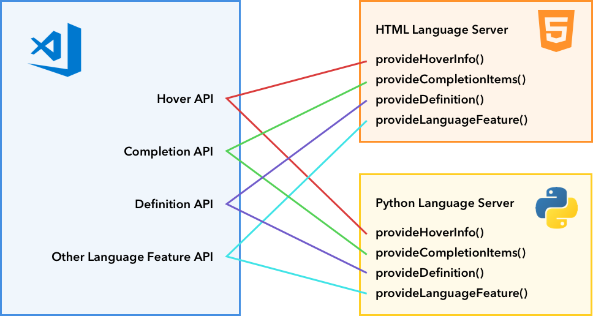
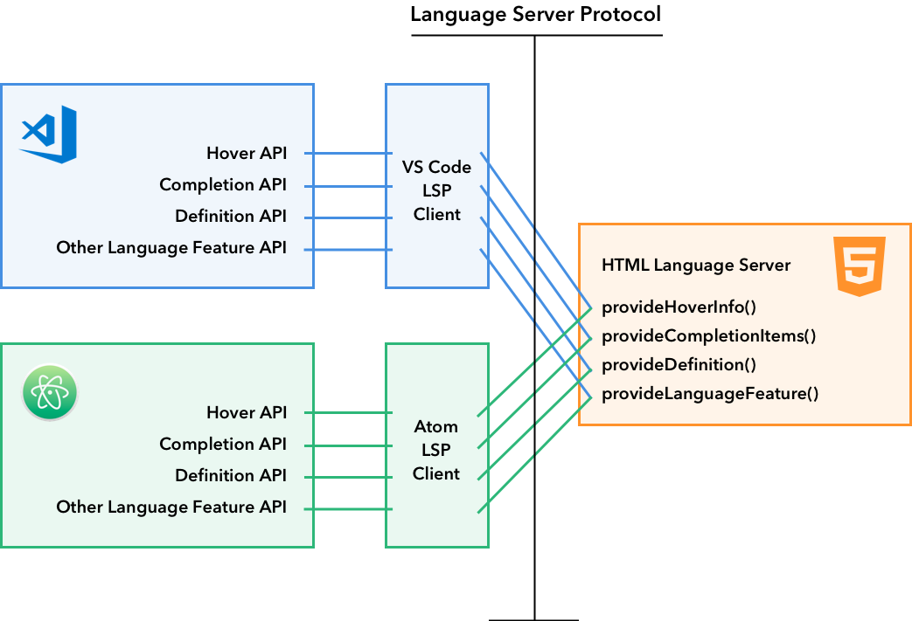

<!-- more -->

# 概述——语言扩展

Visual Studio Code 通过语言扩展为不同的编程语言提供智能编辑功能。VS Code 的核心编辑器不提供内置语言支持，但提供了一组 API，可实现丰富的语言功能。

例如，[HTML](https://github.com/microsoft/vscode/tree/main/extensions/html) 扩展使用这些 API 为 HTML 文件显示语法高亮。同样，当您键入 `console.` 并在 IntelliSense 中出现 `log` 时，这是 [Typescript 语言特性](https://github.com/microsoft/vscode/tree/main/extensions/typescript-language-features)扩展在起作用。

VS Code 将其中一些扩展与编辑器捆绑在一起，以便从一开始就为您提供丰富的语言支持。

语言特性大致可分为两类：

## [声明式语言特性](https://vscode.js.cn/api/language-extensions/overview#declarative-language-features)

声明式语言特性在配置文件中定义。示例包括与 VS Code 捆绑的 [html](https://github.com/microsoft/vscode/tree/main/extensions/html)、[css](https://github.com/microsoft/vscode/tree/main/extensions/css) 和 [typescript-basic](https://github.com/microsoft/vscode/tree/main/extensions/typescript-basics) 扩展，它们提供以下声明式语言特性的一部分：

- 语法高亮
- 片段补全
- 括号匹配
- 括号自动闭合
- 括号自动环绕
- 注释切换
- 自动缩进
- 折叠（通过标记）

我们有三份指南，用于编写提供声明式语言特性的语言扩展。

- [语法高亮指南](https://vscode.js.cn/api/language-extensions/syntax-highlight-guide)：VS Code 使用 TextMate 语法进行语法高亮。本指南将引导您编写一个简单的 TextMate 语法并将其转换为 VS Code 扩展。
- [片段补全指南](https://vscode.js.cn/api/language-extensions/snippet-guide)：本指南解释了如何将一组片段捆绑到扩展中。
- [语言配置指南](https://vscode.js.cn/api/language-extensions/language-configuration-guide)：VS Code 允许扩展为任何编程语言定义一个**语言配置**。此文件控制基本的编辑功能，例如注释切换、括号匹配/环绕以及区域折叠（旧版）。

## [编程式语言特性](https://vscode.js.cn/api/language-extensions/overview#programmatic-language-features)

编程式语言特性包括自动补全、错误检查和跳转到定义。这些特性通常由语言服务器提供支持，语言服务器是分析您的项目以提供动态特性的程序。一个例子是 VS Code 中捆绑的 [`typescript-language-features`](https://github.com/microsoft/vscode/tree/main/extensions/typescript-language-features) 扩展。它利用 [TypeScript 语言服务](https://github.com/microsoft/TypeScript/wiki/Using-the-Language-Service-API)来提供编程式语言特性，例如：

- 悬停信息 ([`vscode.languages.registerHoverProvider`](https://vscode.js.cn/api/references/vscode-api#languages.registerHoverProvider))
- 自动补全 ([`vscode.languages.registerCompletionItemProvider`](https://vscode.js.cn/api/references/vscode-api#languages.registerCompletionItemProvider))
- 跳转到定义 ([`vscode.languages.registerDefinitionProvider`](https://vscode.js.cn/api/references/vscode-api#languages.registerDefinitionProvider))
- 错误检查
- 格式化
- 重构
- 折叠

这里是 [编程式语言特性](https://vscode.js.cn/api/language-extensions/programmatic-language-features) 的完整列表。

## [语言服务器协议](https://vscode.js.cn/api/language-extensions/overview#language-server-protocol)

通过标准化语言服务器（一个静态代码分析工具）和语言客户端（通常是源代码编辑器）之间的通信，[语言服务器协议](https://msdocs.cn/language-server-protocol/) 允许扩展作者编写一个代码分析程序并在多个编辑器中重复使用。

在 [编程式语言特性](https://vscode.js.cn/api/language-extensions/programmatic-language-features) 列表中，您可以找到所有 VS Code 语言特性及其如何映射到 [语言服务器协议规范](https://msdocs.cn/language-server-protocol/specification) 的列表。

我们提供了一份深入指南，解释了如何在 VS Code 中实现语言服务器扩展。

- [语言服务器扩展指南](https://vscode.js.cn/api/language-extensions/language-server-extension-guide)

## [特殊情况](https://vscode.js.cn/api/language-extensions/overview#special-cases)

### [多根工作区支持](https://vscode.js.cn/api/language-extensions/overview#multiroot-workspace-support)

当用户打开一个 [多根工作区](https://vscode.js.cn/docs/editor/multi-root-workspaces) 时，您可能需要相应地调整您的语言服务器扩展。本主题讨论了支持多根工作区的多种方法。

### [嵌入式语言](https://vscode.js.cn/api/language-extensions/overview#embedded-languages)

嵌入式语言在 Web 开发中很常见。例如，HTML 中的 CSS/JavaScript，以及 JavaScript/TypeScript 中的 GraphQL。[嵌入式语言](https://vscode.js.cn/api/language-extensions/embedded-languages) 主题讨论了如何让语言特性可用于嵌入式语言。
