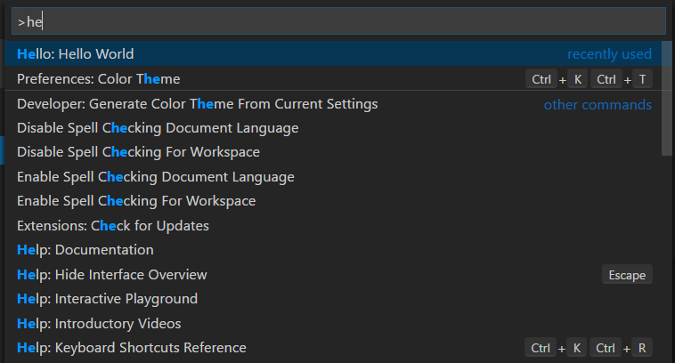
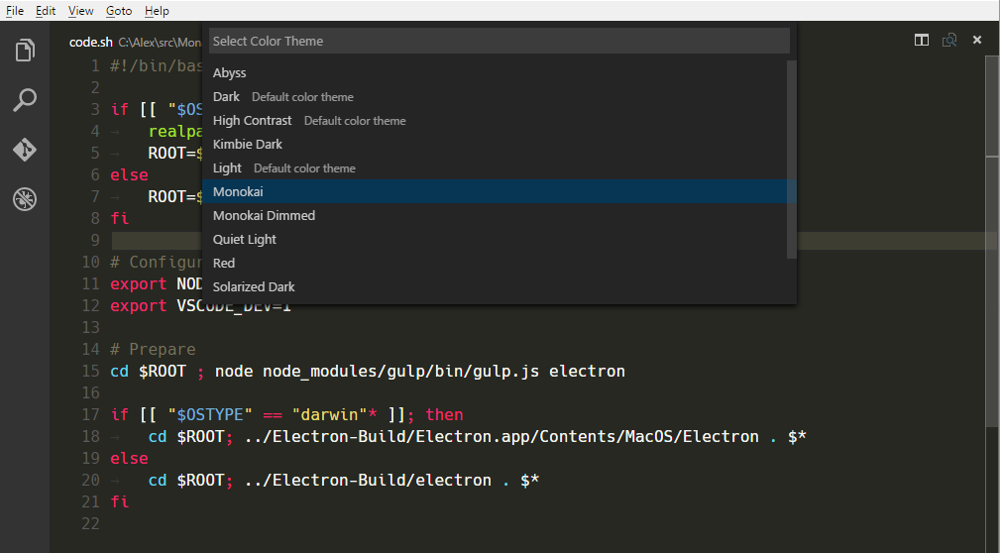

<!-- more -->

# [贡献点](https://vscode.js.cn/api/references/contribution-points)

**贡献点**是您在 `package.json` 文件的 `contributes` 字段中进行的一组 JSON 声明，用于[扩展清单](https://vscode.js.cn/api/references/extension-manifest)。您的扩展通过注册**贡献点**来扩展 Visual Studio Code 中的各种功能。以下是所有可用**贡献点**的列表

- [`认证`](https://vscode.js.cn/api/references/contribution-points#contributes.authentication)
- [`断点`](https://vscode.js.cn/api/references/contribution-points#contributes.breakpoints)
- [`颜色`](https://vscode.js.cn/api/references/contribution-points#contributes.colors)
- [`命令`](https://vscode.js.cn/api/references/contribution-points#contributes.commands)
- [`配置`](https://vscode.js.cn/api/references/contribution-points#contributes.configuration)
- [`默认配置`](https://vscode.js.cn/api/references/contribution-points#contributes.configurationDefaults)
- [`自定义编辑器`](https://vscode.js.cn/api/references/contribution-points#contributes.customEditors)
- [`调试器`](https://vscode.js.cn/api/references/contribution-points#contributes.debuggers)
- [`语法`](https://vscode.js.cn/api/references/contribution-points#contributes.grammars)
- [`图标`](https://vscode.js.cn/api/references/contribution-points#contributes.icons)
- [`图标主题`](https://vscode.js.cn/api/references/contribution-points#contributes.iconThemes)
- [`JSON 验证`](https://vscode.js.cn/api/references/contribution-points#contributes.jsonValidation)
- [`键盘快捷方式`](https://vscode.js.cn/api/references/contribution-points#contributes.keybindings)
- [`语言`](https://vscode.js.cn/api/references/contribution-points#contributes.languages)
- [`菜单`](https://vscode.js.cn/api/references/contribution-points#contributes.menus)
- [`问题匹配器`](https://vscode.js.cn/api/references/contribution-points#contributes.problemMatchers)
- [`问题模式`](https://vscode.js.cn/api/references/contribution-points#contributes.problemPatterns)
- [`产品图标主题`](https://vscode.js.cn/api/references/contribution-points#contributes.productIconThemes)
- [`资源标签格式化程序`](https://vscode.js.cn/api/references/contribution-points#contributes.resourceLabelFormatters)
- [`语义令牌修饰符`](https://vscode.js.cn/api/references/contribution-points#contributes.semanticTokenModifiers)
- [`语义令牌作用域`](https://vscode.js.cn/api/references/contribution-points#contributes.semanticTokenScopes)
- [`语义令牌类型`](https://vscode.js.cn/api/references/contribution-points#contributes.semanticTokenTypes)
- [`代码片段`](https://vscode.js.cn/api/references/contribution-points#contributes.snippets)
- [`子菜单`](https://vscode.js.cn/api/references/contribution-points#contributes.submenus)
- [`任务定义`](https://vscode.js.cn/api/references/contribution-points#contributes.taskDefinitions)
- [`终端`](https://vscode.js.cn/api/references/contribution-points#contributes.terminal)
- [`主题`](https://vscode.js.cn/api/references/contribution-points#contributes.themes)
- [`TypeScript 服务器插件`](https://vscode.js.cn/api/references/contribution-points#contributes.typescriptServerPlugins)
- [`视图`](https://vscode.js.cn/api/references/contribution-points#contributes.views)
- [`视图容器`](https://vscode.js.cn/api/references/contribution-points#contributes.viewsContainers)
- [`视图欢迎页`](https://vscode.js.cn/api/references/contribution-points#contributes.viewsWelcome)
- [`引导页`](https://vscode.js.cn/api/references/contribution-points#contributes.walkthroughs)

## [contributes.authentication](https://vscode.js.cn/api/references/contribution-points#contributes.authentication)

贡献一个认证提供程序。这将为您的提供程序设置一个激活事件，并将其显示在您的扩展功能中。

```json
{
  "contributes": {
    "authentication": [
      {
        "label": "Azure Dev Ops",
        "id": "azuredevops"
      }
    ]
  }
}
```

## [contributes.breakpoints](https://vscode.js.cn/api/references/contribution-points#contributes.breakpoints)

通常，调试器扩展也会有一个 `contributes.breakpoints` 条目，其中扩展列出了可以设置断点的语言文件类型。

```json
{
  "contributes": {
    "breakpoints": [
      {
        "language": "javascript"
      },
      {
        "language": "javascriptreact"
      }
    ]
  }
}
```

## [contributes.colors](https://vscode.js.cn/api/references/contribution-points#contributes.colors)

贡献新的可主题化颜色。这些颜色可用于扩展中的编辑器装饰器和状态栏。定义后，用户可以在 `workspace.colorCustomization` 设置中自定义颜色，用户主题也可以设置颜色值。

```json
{
  "contributes": {
    "colors": [
      {
        "id": "superstatus.error",
        "description": "Color for error message in the status bar.",
        "defaults": {
          "dark": "errorForeground",
          "light": "errorForeground",
          "highContrast": "#010203",
          "highContrastLight": "#feedc3"
        }
      }
    ]
  }
}
```

颜色的默认值可以为亮色、暗色和高对比度主题定义，并且可以是现有颜色的引用，也可以是[颜色十六进制值](https://vscode.js.cn/api/references/theme-color#color-formats)。

扩展可以使用 `ThemeColor` API 使用新的和现有主题颜色

```typescript
const errorColor = new vscode.ThemeColor('superstatus.error');
```

## [contributes.commands](https://vscode.js.cn/api/references/contribution-points#contributes.commands)

贡献命令的 UI，包含标题和（可选）图标、类别以及启用状态。启用状态通过[when 子句](https://vscode.js.cn/api/references/when-clause-contexts)表示。默认情况下，命令显示在**命令面板**中（Ctrl+Shift+P），但它们也可以显示在其他[菜单](https://vscode.js.cn/api/references/contribution-points#contributes.menus)中。

贡献命令的呈现方式取决于其所属的菜单。例如，**命令面板**会使用命令的 `category` 作为前缀，便于分组。但是，**命令面板**不显示图标，也不显示已禁用的命令。另一方面，编辑器上下文菜单会显示已禁用的项目，但不显示类别标签。

> **注意：**当命令被调用时（通过键盘快捷方式、**命令面板**、任何其他菜单或以编程方式），VS Code 将发出一个激活事件 `onCommand:${command}`。

> **注意：**当使用[产品图标](https://vscode.js.cn/api/references/icons-in-labels#icon-listing)中的图标时，设置 `light` 和 `dark` 将禁用该图标。正确的语法是 `"icon": "$(book)"`

### [命令示例](https://vscode.js.cn/api/references/contribution-points#command-example)

```json
{
  "contributes": {
    "commands": [
      {
        "command": "extension.sayHello",
        "title": "Hello World",
        "category": "Hello",
        "icon": {
          "light": "path/to/light/icon.svg",
          "dark": "path/to/dark/icon.svg"
        }
      }
    ]
  }
}
```

请参阅[命令扩展指南](https://vscode.js.cn/api/extension-guides/command)，了解如何在 VS Code 扩展中使用命令。



### [命令图标规范](https://vscode.js.cn/api/references/contribution-points#Command-icon-specifications)

- `大小：` 图标应为 16x16 像素，带有 1 像素的填充（图像为 14x14 像素），并居中。
- `颜色：` 图标应使用单一颜色。
- `格式：` 建议图标为 SVG 格式，但也接受任何图像文件类型。


## [contributes.configuration](https://vscode.js.cn/api/references/contribution-points#contributes.configuration)

贡献将暴露给用户的设置。用户可以在“设置”编辑器中或通过直接编辑 settings.json 文件来设置这些配置选项。

本节可以是一个单独的对象，表示一类设置，也可以是对象的数组，表示多类设置。如果有多个设置类别，“设置”编辑器将在该扩展的目录中显示一个子菜单，并且标题键将用作子菜单条目名称。

### [配置示例](https://vscode.js.cn/api/references/contribution-points#Configuration-example)

```json
{
  "contributes": {
    "configuration": {
      "title": "Settings Editor Test Extension",
      "type": "object",
      "properties": {
        "settingsEditorTestExtension.booleanExample": {
          "type": "boolean",
          "default": true,
          "description": "Boolean Example"
        },
        "settingsEditorTestExtension.stringExample": {
          "type": "string",
          "default": "Hello World",
          "description": "String Example"
        }
      }
    }
  }
}
```


您可以使用 `vscode.workspace.getConfiguration('myExtension')` 从扩展中读取这些值。

### [配置模式](https://vscode.js.cn/api/references/contribution-points#Configuration-schema)

您的配置条目既用于在 JSON 编辑器中编辑设置时提供智能感知，也用于定义它们在设置 UI 中的显示方式。


#### 标题

类别的 `title` 1️⃣️ 是该类别所使用的标题。

```json
{
  "configuration": {
    "title": "GitMagic"
  }
}
```

对于具有多个设置类别的扩展，如果其中一个类别的标题与扩展的显示名称相同，则设置 UI 将把该类别视为“默认类别”，忽略该类别的 `order` 字段，并将其设置放在主扩展标题下方。

对于 `title` 和 `displayName` 字段，像“扩展”、“配置”和“设置”这样的词是多余的。

- ✔ `"title": "GitMagic"`
- ❌ `"title": "GitMagic Extension"`
- ❌ `"title": "GitMagic Configuration"`
- ❌ `"title": "GitMagic Extension Configuration Settings"`

#### 属性

`configuration` 对象中的 `properties` 2️⃣ 将构成一个字典，其中键是设置 ID，值提供有关设置的更多信息。尽管一个扩展可以包含多个设置类别，但扩展的每个设置仍必须有其自己的唯一 ID。设置 ID 不能是另一个设置 ID 的完整前缀。

没有显式 `order` 字段的属性将在设置 UI 中按字典顺序显示（**而不是**它们在清单中列出的顺序）。

### [设置标题](https://vscode.js.cn/api/references/contribution-points#Setting-titles)

在设置 UI 中，将使用多个字段为每个设置构建显示标题。键中的大写字母用于指示单词分隔。

#### 单类别和默认类别配置的显示标题

如果配置只有一个设置类别，或者该类别的标题与扩展的显示名称相同，则对于该类别内的设置，设置 UI 将使用设置 ID 和扩展的 `name` 字段来确定显示标题。

例如，对于设置 ID `gitMagic.blame.dateFormat` 和扩展名 `authorName.gitMagic`，由于设置 ID 的前缀与扩展名的后缀匹配，设置 ID 中的 `gitMagic` 部分将在显示标题中被删除：“Blame: **Date Format**”。

#### 多类别配置的显示标题

如果配置有多个设置类别，并且该类别标题与扩展的显示名称不同，则对于该类别内的设置，设置 UI 将使用设置 ID 和类别 `id` 字段来确定显示标题。

例如，对于设置 ID `css.completion.completePropertyWithSemicolon` 和类别 ID `css`，由于设置 ID 的前缀与类别 ID 的后缀匹配，设置 ID 中的 `css` 部分将在设置 UI 中被删除，并且为该设置生成的标题将是“Completion: **Complete Property With Semicolon**”。

### [配置属性模式](https://vscode.js.cn/api/references/contribution-points#Configuration-property-schema)

配置键是使用[JSON Schema](https://json-schema.fullstack.org.cn/overview/what-is-jsonschema)的超集定义的。

#### description / markdownDescription

您的 `description` 3️⃣ 出现在标题之后和输入字段之前，但布尔类型除外，对于布尔类型，描述用作复选框的标签。6️⃣

```json
{
  "gitMagic.blame.heatMap.enabled": {
    "description": "Specifies whether to provide a heatmap indicator in the gutter blame annotations"
  }
}
```

如果您使用 `markdownDescription` 而不是 `description`，您的设置描述将在设置 UI 中解析为 Markdown。

```json
{
  "gitMagic.blame.dateFormat": {
    "markdownDescription": "Specifies how to format absolute dates (e.g. using the `${date}` token) in gutter blame annotations. See the [Moment.js docs](https://moment.js.cn/docs/#/displaying/format/) for valid formats"
  }
}
```

对于 `markdownDescription`，为了添加换行符或多个段落，请使用字符串 `\n\n` 来分隔段落，而不是仅仅使用 `\n`。

#### 类型

类型为 `number` 4️⃣ 、`string` 5️⃣ 、`boolean` 6️⃣ 的条目可以直接在设置 UI 中编辑。

```json
{
  "gitMagic.views.pageItemLimit": {
    "type": "number",
    "default": 20,
    "markdownDescription": "Specifies the number of items to show in each page when paginating a view list. Use 0 to specify no limit"
  }
}
```

如果配置条目设置了 `"editPresentation": "multilineText"`，字符串设置可以呈现为多行文本输入。

对于 `boolean` 条目，`markdownDescription`（如果未指定 `markdownDescription`，则为 `description`）将用作复选框旁边的标签。

```json
{
  "gitMagic.blame.compact": {
    "type": "boolean",
    "description": "Specifies whether to compact (deduplicate) matching adjacent gutter blame annotations"
  }
}
```

一些 `object` 和 `array` 类型的设置将在设置 UI 中呈现。简单的 `number`、`string` 或 `boolean` 数组将呈现为可编辑列表。具有 `string`、`number`、`integer` 和/或 `boolean` 类型属性的对象将呈现为可编辑的键值网格。对象设置还应将 `additionalProperties` 设置为 `false` 或具有适当 `type` 属性的对象，以便在 UI 中呈现。

如果 `object` 或 `array` 类型的设置还可以包含其他类型，例如嵌套对象、数组或 null，则该值将不会在设置 UI 中呈现，只能通过直接编辑 JSON 进行修改。用户将看到一个指向**在 settings.json 中编辑**的链接，如上图所示。8️⃣

#### 顺序

类别及其内部的设置都可以接受一个整数类型的 `order` 属性，它提供了关于它们相对于其他类别和/或设置应如何排序的参考。

如果两个类别都有 `order` 属性，则具有较小顺序号的类别排在前面。如果一个类别没有给定 `order` 属性，它将出现在给定该属性的类别之后。

如果同一类别中的两个设置都有 `order` 属性，则具有较小顺序号的设置排在前面。如果同一类别中的另一个设置没有给定 `order` 属性，它将出现在该类别中给定该属性的设置之后。

如果两个类别具有相同的 `order` 属性值，或者同一类别中的两个设置具有相同的 `order` 属性值，则它们将在设置 UI 中按字典升序排序。

#### enum / enumDescriptions / markdownEnumDescriptions / enumItemLabels

如果您在 `enum` 7️⃣ 属性下提供一个项目数组，设置 UI 将呈现这些项目的下拉菜单。

您还可以提供 `enumDescriptions` 属性，这是一个与 `enum` 属性长度相同的字符串数组。`enumDescriptions` 属性在设置 UI 的下拉菜单底部提供与每个 `enum` 项目对应的描述。
您还可以使用 `markdownEnumDescriptions` 而不是 `enumDescriptions`，并且您的描述将解析为 Markdown。`markdownEnumDescriptions` 优先于 `enumDescriptions`。
为了在设置 UI 中自定义下拉选项名称，您可以使用 `enumItemLabels`。

示例

```json
{
  "settingsEditorTestExtension.enumSetting": {
    "type": "string",
    "enum": ["first", "second", "third"],
    "markdownEnumDescriptions": [
      "The *first* enum",
      "The *second* enum",
      "The *third* enum"
    ],
    "enumItemLabels": ["1st", "2nd", "3rd"],
    "default": "first",
    "description": "Example setting with an enum"
  }
}
```


#### deprecationMessage / markdownDeprecationMessage

如果您设置 `deprecationMessage` 或 `markdownDeprecationMessage`，设置将显示一条带有您指定消息的警告下划线。此外，除非用户配置，否则该设置将从设置 UI 中隐藏。如果您设置 `markdownDeprecationMessage`，Markdown 将不会在设置悬停或问题视图中呈现。如果您同时设置这两个属性，`deprecationMessage` 将显示在悬停和问题视图中，并且 `markdownDeprecationMessage` 将在设置 UI 中以 Markdown 形式呈现。

示例

```json
{
  "json.colorDecorators.enable": {
    "type": "boolean",
    "description": "Enables or disables color decorators",
    "markdownDeprecationMessage": "**Deprecated**: Please use `#editor.colorDecorators#` instead.",
    "deprecationMessage": "Deprecated: Please use editor.colorDecorators instead."
  }
}
```

#### 其他 JSON Schema 属性

您可以使用任何验证 JSON Schema 属性来描述配置值的其他约束

- `default` 用于定义属性的默认值
- `minimum` 和 `maximum` 用于限制数值
- `maxLength`、`minLength` 用于限制字符串长度
- `pattern` 用于将字符串限制为给定的正则表达式
- `patternErrorMessage` 用于在模式不匹配时提供定制的错误消息。
- `format` 用于将字符串限制为已知格式，例如 `date`、`time`、`ipv4`、`email` 和 `uri`
- `maxItems`、`minItems` 用于限制数组长度
- `editPresentation` 用于控制在“设置”编辑器中字符串设置是呈现为单行输入框还是多行文本区域

#### 不支持的 JSON Schema 属性

配置部分不支持以下内容

- `$ref` 和 `definition`：配置模式需要是自包含的，并且不能假设聚合的设置 JSON 模式文档的外观。

有关这些及其他功能的更多详细信息，请参阅[JSON Schema 参考](https://json-schema.fullstack.org.cn/overview/what-is-jsonschema)。

#### 范围

配置设置可以具有以下范围之一

- `application` - 适用于所有 VS Code 实例的设置，只能在用户设置中配置。
- `machine` - 机器特定的设置，只能在用户设置或远程设置中设置。例如，不应跨机器共享的安装路径。这些设置的值将不会同步。
- `machine-overridable` - 机器特定的设置，可以通过工作区或文件夹设置覆盖。这些设置的值将不会同步。
- `window` - 窗口（实例）特定的设置，可以在用户、工作区或远程设置中配置。
- `resource` - 资源设置，适用于文件和文件夹，可以在所有设置级别（甚至文件夹设置）中配置。
- `language-overridable` - 可以在语言级别覆盖的资源设置。

配置范围决定了设置何时通过“设置”编辑器向用户可用以及该设置是否适用。如果未声明 `scope`，则默认为 `window`。

以下是内置 Git 扩展的配置范围示例

```json
{
  "contributes": {
    "configuration": {
      "title": "Git",
      "properties": {
        "git.alwaysSignOff": {
          "type": "boolean",
          "scope": "resource",
          "default": false,
          "description": "%config.alwaysSignOff%"
        },
        "git.ignoredRepositories": {
          "type": "array",
          "default": [],
          "scope": "window",
          "description": "%config.ignoredRepositories%"
        },
        "git.autofetch": {
          "type": ["boolean", "string"],
          "enum": [true, false, "all"],
          "scope": "resource",
          "markdownDescription": "%config.autofetch%",
          "default": false,
          "tags": ["usesOnlineServices"]
        }
      }
    }
  }
}
```

您可以看到 `git.alwaysSignOff` 具有 `resource` 范围，可以按用户、工作区或文件夹设置，而带有 `window` 范围的忽略存储库列表则更全局地适用于 VS Code 窗口或工作区（可能是多根工作区）。

#### ignoreSync

您可以将 `ignoreSync` 设置为 `true`，以防止设置与用户设置同步。这对于非用户特定的设置很有用。例如，`remoteTunnelAccess.machineName` 设置并非用户特定，不应同步。请注意，如果您已将 `scope` 设置为 `machine` 或 `machine-overridable`，则无论 `ignoreSync` 的值如何，该设置都不会同步。

```json
{
  "contributes": {
    "configuration": {
      "properties": {
        "remoteTunnelAccess.machineName": {
          "type": "string",
          "default": "",
          "ignoreSync": true
        }
      }
    }
  }
}

```json
{
  "remoteTunnelAccess.machineName": {
    "type": "string",
    "default": '',
    "ignoreSync": true
  }
}
```

#### 链接到设置

您可以使用 markdown 类型属性中的特殊语法 ``#target.setting.id#`` 插入指向另一个设置的链接，该链接将在设置 UI 中呈现为可点击的链接。这适用于 `markdownDescription`、`markdownEnumDescriptions` 和 `markdownDeprecationMessage`。示例

```json
  "files.autoSaveDelay": {
    "markdownDescription": "Controls the delay in ms after which a dirty editor is saved automatically. Only applies when `#files.autoSave#` is set to `afterDelay`.",
    // ...
  }
```

在设置 UI 中，这呈现为


## [contributes.configurationDefaults](https://vscode.js.cn/api/references/contribution-points#contributes.configurationDefaults)

贡献其他已注册配置的默认值并覆盖其默认值。

以下示例将 `files.autoSave` 设置的默认行为覆盖为在焦点更改时自动保存文件。

```json
"configurationDefaults": {
      "files.autoSave": "onFocusChange"
}
```

您还可以为提供的语言贡献默认编辑器配置。例如，以下代码片段贡献了 `markdown` 语言的默认编辑器配置

```json
{
  "contributes": {
    "configurationDefaults": {
      "[markdown]": {
        "editor.wordWrap": "on",
        "editor.quickSuggestions": {
          "comments": "off",
          "strings": "off",
          "other": "off"
        }
      }
    }
  }
}
```

## [contributes.customEditors](https://vscode.js.cn/api/references/contribution-points#contributes.customEditors)

`customEditors` 贡献点是您的扩展告知 VS Code 其提供的自定义编辑器的方式。例如，VS Code 需要知道您的自定义编辑器适用于哪些类型的文件，以及如何在任何 UI 中识别您的自定义编辑器。

以下是[自定义编辑器扩展示例](https://github.com/microsoft/vscode-extension-samples/tree/main/custom-editor-sample)的基本 `customEditor` 贡献

```json
"contributes": {
  "customEditors": [
    {
      "viewType": "catEdit.catScratch",
      "displayName": "Cat Scratch",
      "selector": [
        {
          "filenamePattern": "*.cscratch"
        }
      ],
      "priority": "default"
    }
  ]
}
```

`customEditors` 是一个数组，因此您的扩展可以贡献多个自定义编辑器。

- `viewType` - 自定义编辑器的唯一标识符。

  这是 VS Code 将 `package.json` 中的自定义编辑器贡献与代码中的自定义编辑器实现关联起来的方式。这在所有扩展中必须是唯一的，因此请确保使用对您的扩展唯一的 `viewType`，例如 `"viewType": "myAmazingExtension.svgPreview"`，而不是通用的 `"preview"`。

- `displayName` - 在 VS Code UI 中标识自定义编辑器的名称。

  显示名称在 VS Code UI 中显示给用户，例如**视图：重新打开方式**下拉菜单。

- `selector` - 指定自定义编辑器对哪些文件激活。

  `selector` 是一个包含一个或多个[glob 模式](https://vscode.js.cn/docs/editor/glob-patterns)的数组。这些 glob 模式与文件名匹配，以确定自定义编辑器是否可以用于它们。诸如 `*.png` 的 `filenamePattern` 将为所有 PNG 文件启用自定义编辑器。

  您还可以创建更具体的模式来匹配文件或目录名称，例如 `**/translations/*.json`。

- `priority` – （可选）指定何时使用自定义编辑器。

  `priority` 控制在资源打开时何时使用自定义编辑器。可能的值有

  - `"default"` – 尝试对所有匹配自定义编辑器 `selector` 的文件使用自定义编辑器。如果给定文件有多个自定义编辑器，用户将不得不选择他们想要使用的自定义编辑器。
  - `"option"` – 默认情况下不使用自定义编辑器，但允许用户切换到它或将其配置为默认编辑器。

您可以在[自定义编辑器](https://vscode.js.cn/api/extension-guides/custom-editors)扩展指南中了解更多信息。

## [contributes.debuggers](https://vscode.js.cn/api/references/contribution-points#contributes.debuggers)

为 VS Code 贡献一个调试器。调试器贡献具有以下属性

- `type` 是一个唯一 ID，用于在启动配置中标识此调试器。
- `label` 是此调试器在 UI 中用户可见的名称。
- `program` 调试适配器的路径，该适配器针对实际调试器或运行时实现 VS Code 调试协议。
- `runtime` 如果调试适配器的路径不是可执行文件，但需要运行时。
- `configurationAttributes` 是此调试器特有的启动配置参数的模式。请注意，不支持 JSON 模式构造 `$ref` 和 `definition`。
- `initialConfigurations` 列出了用于填充初始 launch.json 的启动配置。
- `configurationSnippets` 列出了在编辑 launch.json 时可通过 IntelliSense 获得的启动配置。
- `variables` 引入了替换变量，并将其绑定到调试器扩展实现的命令。
- `languages` 调试扩展可以被视为“默认调试器”的那些语言。

### [调试器示例](https://vscode.js.cn/api/references/contribution-points#debugger-example)

```json
{
  "contributes": {
    "debuggers": [
      {
        "type": "node",
        "label": "Node Debug",

        "program": "./out/node/nodeDebug.js",
        "runtime": "node",

        "languages": ["javascript", "typescript", "javascriptreact", "typescriptreact"],

        "configurationAttributes": {
          "launch": {
            "required": ["program"],
            "properties": {
              "program": {
                "type": "string",
                "description": "The program to debug."
              }
            }
          }
        },

        "initialConfigurations": [
          {
            "type": "node",
            "request": "launch",
            "name": "Launch Program",
            "program": "${workspaceFolder}/app.js"
          }
        ],

        "configurationSnippets": [
          {
            "label": "Node.js: Attach Configuration",
            "description": "A new configuration for attaching to a running node program.",
            "body": {
              "type": "node",
              "request": "attach",
              "name": "${2:Attach to Port}",
              "port": 9229
            }
          }
        ],

        "variables": {
          "PickProcess": "extension.node-debug.pickNodeProcess"
        }
      }
    ]
  }
}
```

有关如何集成 `debugger` 的完整演练，请参阅[调试器扩展](https://vscode.js.cn/api/extension-guides/debugger-extension)。

## [contributes.grammars](https://vscode.js.cn/api/references/contribution-points#contributes.grammars)

为语言贡献 TextMate 语法。您必须提供此语法适用的 `language`、语法的 TextMate `scopeName` 和文件路径。

> **注意：**包含语法的文件的格式可以是 JSON（文件名以 .json 结尾）或 XML plist 格式（所有其他文件）。

### [语法示例](https://vscode.js.cn/api/references/contribution-points#grammar-example)

```json
{
  "contributes": {
    "grammars": [
      {
        "language": "markdown",
        "scopeName": "text.html.markdown",
        "path": "./syntaxes/markdown.tmLanguage.json",
        "embeddedLanguages": {
          "meta.embedded.block.frontmatter": "yaml"
        }
      }
    ]
  }
}
```

请参阅[语法高亮指南](https://vscode.js.cn/api/language-extensions/syntax-highlight-guide)，了解如何注册与语言关联的 TextMate 语法以实现语法高亮。


## [contributes.icons](https://vscode.js.cn/api/references/contribution-points#contributes.icons)

通过 ID 贡献新图标，以及一个默认图标。然后，扩展（或任何依赖于该扩展的其他扩展）可以在任何可以使用 `ThemeIcon` 的地方使用该图标 ID，例如 `new ThemeIcon("iconId")`，在[Markdown 字符串](https://vscode.js.cn/api/references/icons-in-labels#icon-in-labels)中（`$(iconId)`），以及作为某些贡献点中的图标。

```json
{
  "contributes": {
    "icons": {
      "distro-ubuntu": {
        "description": "Ubuntu icon",
        "default": {
          "fontPath": "./distroicons.woff",
          "fontCharacter": "\\E001"
        }
      },
      "distro-fedora": {
        "description": "Ubuntu icon",
        "default": {
          "fontPath": "./distroicons.woff",
          "fontCharacter": "\\E002"
        }
      }
    }
  }
}
```

## [contributes.iconThemes](https://vscode.js.cn/api/references/contribution-points#contributes.iconThemes)

为 VS Code 贡献一个文件图标主题。文件图标显示在文件名旁边，指示文件类型。

您必须指定一个 ID（在设置中使用）、一个标签以及文件图标定义文件的路径。

### [文件图标主题示例](https://vscode.js.cn/api/references/contribution-points#file-icon-theme-example)

```json
{
  "contributes": {
    "iconThemes": [
      {
        "id": "my-cool-file-icons",
        "label": "Cool File Icons",
        "path": "./fileicons/cool-file-icon-theme.json"
      }
    ]
  }
}
```


请参阅[文件图标主题指南](https://vscode.js.cn/api/extension-guides/file-icon-theme)，了解如何创建文件图标主题。

## [contributes.jsonValidation](https://vscode.js.cn/api/references/contribution-points#contributes.jsonValidation)

贡献特定类型 `json` 文件的验证模式。`url` 值可以是扩展中包含的模式文件的本地路径，也可以是远程服务器 URL，例如[JSON 模式存储](https://www.schemastore.org/json)。

```json
{
  "contributes": {
    "jsonValidation": [
      {
        "fileMatch": ".jshintrc",
        "url": "https://json.schemastore.org/jshintrc"
      }
    ]
  }
}
```

## [contributes.keybindings](https://vscode.js.cn/api/references/contribution-points#contributes.keybindings)

贡献一个键盘快捷方式规则，定义当用户按下组合键时应调用哪个命令。请参阅[键盘快捷方式](https://vscode.js.cn/docs/getstarted/keybindings)主题，其中详细解释了键盘快捷方式。

贡献键盘快捷方式将导致“默认键盘快捷方式”显示您的规则，并且命令的每个 UI 表示现在都将显示您添加的键盘快捷方式。当然，当用户按下组合键时，该命令将被调用。

> **注意：**由于 VS Code 在 Windows、macOS 和 Linux 上运行，这些平台上的修饰键有所不同，您可以使用“key”设置默认组合键，并使用特定平台覆盖它。

> **注意：**当命令被调用时（通过键盘快捷方式或命令面板），VS Code 将发出一个激活事件 `onCommand:${command}`。

### [键盘快捷方式示例](https://vscode.js.cn/api/references/contribution-points#keybinding-example)

定义 Windows 和 Linux 下的 Ctrl+F1 以及 macOS 下的 Cmd+F1 触发 `"extension.sayHello"` 命令

```json
{
  "contributes": {
    "keybindings": [
      {
        "command": "extension.sayHello",
        "key": "ctrl+f1",
        "mac": "cmd+f1",
        "when": "editorTextFocus"
      }
    ]
  }
}
```


## [contributes.languages](https://vscode.js.cn/api/references/contribution-points#contributes.languages)

贡献编程语言的定义。这将引入一种新语言或丰富 VS Code 对某种语言的认知。

`contributes.languages` 的主要作用是

- 定义一个`languageId`，可以在 VS Code API 的其他部分重用，例如`vscode.TextDocument.languageId`和`onLanguage`激活事件。

  - 您可以使用 `aliases` 字段贡献一个人类可读的名称。列表中的第一项将用作人类可读的标签。

- 将文件扩展名 (`extensions`)、文件名 (`filenames`)、文件名[glob 模式](https://vscode.js.cn/docs/editor/glob-patterns) (`filenamePatterns`)、以特定行（如 hashbang）开头的文件 (`firstLine`) 和 `mimetypes` 与该 `languageId` 关联。

- 为贡献的语言贡献一组[声明性语言功能](https://vscode.js.cn/api/language-extensions/overview#declarative-language-features)。在[语言配置指南](https://vscode.js.cn/api/language-extensions/language-configuration-guide)中了解有关可配置编辑功能的更多信息。

- 贡献一个图标，如果主题不包含该语言的图标，则该图标可用作文件图标主题

### [语言示例](https://vscode.js.cn/api/references/contribution-points#language-example)

```json
{
  "contributes": {
    "languages": [
      {
        "id": "python",
        "extensions": [".py"],
        "aliases": ["Python", "py"],
        "filenames": [],
        "firstLine": "^#!/.*\\bpython[0-9.-]*\\b",
        "configuration": "./language-configuration.json",
        "icon": {
          "light": "./icons/python-light.png",
          "dark": "./icons/python-dark.png"
        }
      }
    ]
  }
}
```

## [contributes.menus](https://vscode.js.cn/api/references/contribution-points#contributes.menus)

为编辑器或资源管理器贡献一个命令菜单项。菜单项定义包含选中时应调用的命令以及项目应显示的条件。后者由 `when` 子句定义，该子句使用键盘快捷方式的[when 子句上下文](https://vscode.js.cn/api/references/when-clause-contexts)。

`command` 属性指示选择菜单项时要运行哪个命令。`submenu` 属性指示在此位置呈现哪个子菜单。

在声明 `command` 菜单项时，也可以使用 `alt` 属性定义备用命令。在打开菜单时按住 Alt 键会显示并调用它。在 Windows 和 Linux 上，按住 Shift 键也会这样做，这在 Alt 键会触发窗口菜单栏的情况下很有用。

最后，`group` 属性定义了菜单项的排序和分组。`navigation` 组是特殊的，因为它总是被排在菜单的顶部/开头。

> **请注意**，`when` 子句适用于菜单，而 `enablement` 子句适用于命令。`enablement` 适用于所有菜单甚至键盘快捷方式，而 `when` 仅适用于单个菜单。

目前，扩展作者可以贡献到

- `commandPalette` - 全局命令面板
- `comments/comment/title` - 注释标题菜单栏
- `comments/comment/context` - 注释上下文菜单
- `comments/commentThread/title` - 注释线程标题菜单栏
- `comments/commentThread/context` - 注释线程上下文菜单
- `debug/callstack/context` - 调试调用堆栈视图上下文菜单
- `debug/callstack/context` 组 `inline` - 调试调用堆栈视图内联操作
- `debug/toolBar` - 调试视图工具栏
- `debug/variables/context` - 调试变量视图上下文菜单
- `editor/context` - 编辑器上下文菜单
- `editor/lineNumber/context` - 编辑器行号上下文菜单
- `editor/title` - 编辑器标题菜单栏
- `editor/title/context` - 编辑器标题上下文菜单
- `editor/title/run` - 编辑器标题菜单栏上的运行子菜单
- `explorer/context` - 资源管理器视图上下文菜单
- `extension/context` - 扩展视图上下文菜单
- `file/newFile` - “文件”菜单和欢迎页中的“新建文件”项
- `interactive/toolbar` - 交互式窗口工具栏
- `interactive/cell/title` - 交互式窗口单元格标题菜单栏
- `notebook/toolbar` - 笔记本工具栏
- `notebook/cell/title` - 笔记本单元格标题菜单栏
- `notebook/cell/execute` - 笔记本单元格执行菜单
- `scm/title` - [SCM 标题菜单](https://vscode.js.cn/api/extension-guides/scm-provider#menus)
- `scm/resourceGroup/context` - [SCM 资源组](https://vscode.js.cn/api/extension-guides/scm-provider#menus)菜单
- `scm/resourceFolder/context` - [SCM 资源文件夹](https://vscode.js.cn/api/extension-guides/scm-provider#menus)菜单
- `scm/resourceState/context` - [SCM 资源](https://vscode.js.cn/api/extension-guides/scm-provider#menus)菜单
- `scm/change/title` - [SCM 更改标题](https://vscode.js.cn/api/extension-guides/scm-provider#menus)菜单
- `scm/sourceControl` - [SCM 源代码控制菜单](https://vscode.js.cn/api/extension-guides/scm-provider#menus)
- `terminal/context` - 终端上下文菜单
- `terminal/title/context` - 终端标题上下文菜单
- `testing/item/context` - 测试资源管理器项上下文菜单
- `testing/item/gutter` - 测试项的行号槽装饰菜单
- `timeline/title` - 时间线视图标题菜单栏
- `timeline/item/context` - 时间线视图项上下文菜单
- `touchBar` - macOS 触控栏
- `view/title` - [视图标题菜单](https://vscode.js.cn/api/references/contribution-points#contributes.views)
- `view/item/context` - [视图项上下文菜单](https://vscode.js.cn/api/references/contribution-points#contributes.views)
- `webview/context` - 任意[Webview](https://vscode.js.cn/api/extension-guides/webview) 上下文菜单
- 任何[贡献的子菜单](https://vscode.js.cn/api/references/contribution-points#contributes.submenus)

> **注意 1：**当从（上下文）菜单调用命令时，VS Code 会尝试推断当前选定的资源，并在调用命令时将其作为参数传递。例如，资源管理器中的菜单项会传递所选资源的 URI，编辑器中的菜单项会传递文档的 URI。

> **注意 2：**贡献到 `editor/lineNumber/context` 的菜单项的命令也会传递行号。此外，这些项目可以在其 `when` 子句中引用 `editorLineNumber` 上下文键，例如通过使用 `in` 或 `not in` 运算符来针对扩展管理的数组值上下文键对其进行测试。

除了标题外，贡献的命令还可以指定图标，当调用菜单项以按钮形式显示时，VS Code 将显示该图标，例如在标题菜单栏上。

### [菜单示例](https://vscode.js.cn/api/references/contribution-points#menu-example)

这是一个命令菜单项

```json
{
  "contributes": {
    "menus": {
      "editor/title": [
        {
          "when": "resourceLangId == markdown",
          "command": "markdown.showPreview",
          "alt": "markdown.showPreviewToSide",
          "group": "navigation"
        }
      ]
    }
  }
}
```


同样，这是一个添加到特定视图的命令菜单项。下面的示例贡献到任意视图，例如终端

```json
{
  "contributes": {
    "menus": {
      "view/title": [
        {
          "command": "terminalApi.sendText",
          "when": "view == terminal",
          "group": "navigation"
        }
      ]
    }
  }
}
```


这是一个子菜单项

```json
{
  "contributes": {
    "menus": {
      "scm/title": [
        {
          "submenu": "git.commit",
          "group": "2_main@1",
          "when": "scmProvider == git"
        }
      ]
    }
  }
}
```


### [命令面板菜单项的上下文特定可见性](https://vscode.js.cn/api/references/contribution-points#Context-specific-visibility-of-Command-Palette-menu-items)

在 `package.json` 中注册命令时，它们将自动显示在**命令面板**中（Ctrl+Shift+P）。为了更好地控制命令可见性，有一个 `commandPalette` 菜单项。它允许您定义一个 `when` 条件来控制命令是否应在**命令面板**中可见。

以下代码片段使“Hello World”命令仅在编辑器中选择内容时才在**命令面板**中可见

```json
{
  "commands": [
    {
      "command": "extension.sayHello",
      "title": "Hello World"
    }
  ],
  "menus": {
    "commandPalette": [
      {
        "command": "extension.sayHello",
        "when": "editorHasSelection"
      }
    ]
  }
}
```

### [组排序](https://vscode.js.cn/api/references/contribution-points#Sorting-of-groups)

菜单项可以分为组。它们按照以下默认值/规则以字典顺序排序。您可以将菜单项添加到这些组中，或在这些组之间、下方或上方添加新的菜单项组。

**编辑器上下文菜单**具有以下默认组

- `navigation` - `navigation` 组在所有情况下都排在第一位。
- `1_modification` - 此组接下来，包含修改代码的命令。
- `9_cutcopypaste` - 倒数第二个默认组，包含基本编辑命令。
- `z_commands` - 最后一个默认组，其中包含打开命令面板的条目。


**资源管理器上下文菜单**具有以下默认组

- `navigation` - 与 VS Code 导航相关的命令。此组在所有情况下都排在第一位。
- `2_workspace` - 与工作区操作相关的命令。
- `3_compare` - 与在差异编辑器中比较文件相关的命令。
- `4_search` - 与在搜索视图中搜索相关的命令。
- `5_cutcopypaste` - 与剪切、复制和粘贴文件相关的命令。
- `6_copypath` - 与复制文件路径相关的命令。
- `7_modification` - 与文件修改相关的命令。

**编辑器标签页上下文菜单**具有以下默认组

- `1_close` - 与关闭编辑器相关的命令。
- `3_preview` - 与固定编辑器相关的命令。

**编辑器标题菜单**具有以下默认组

- `navigation` - 与导航相关的命令。
- `1_run` - 与运行和调试编辑器相关的命令。
- `1_diff` - 与使用差异编辑器相关的命令。
- `3_open` - 与打开编辑器相关的命令。
- `5_close` - 与关闭编辑器相关的命令。

`navigation` 和 `1_run` 显示在主要编辑器标题区域。其他组显示在次要区域 - 在 `...` 菜单下。

**终端标签页上下文菜单**具有以下默认组

- `1_create` - 与创建终端相关的命令。
- `3_run` - 与在终端中运行/执行某些操作相关的命令。
- `5_manage` - 与管理终端相关的命令。
- `7_configure` - 与终端配置相关的命令。

**终端上下文菜单**具有以下默认组

- `1_create` - 与创建终端相关的命令。
- `3_edit` - 与操作文本、选择或剪贴板相关的命令。
- `5_clear` - 与清除终端相关的命令。
- `7_kill` - 与关闭/终止终端相关的命令。
- `9_config` - 与终端配置相关的命令。

**时间线视图项上下文菜单**具有以下默认组

- `inline` - 重要或常用时间线项命令。以工具栏形式呈现。
- `1_actions` - 与时间线项操作相关的命令。
- `5_copy` - 与复制时间线项信息相关的命令。

**扩展视图上下文菜单**具有以下默认组

- `1_copy` - 与复制扩展信息相关的命令。
- `2_configure` - 与配置扩展相关的命令。

### [组内排序](https://vscode.js.cn/api/references/contribution-points#Sorting-inside-groups)

组内的顺序取决于标题或 order 属性。菜单项的组内顺序通过在组标识符后附加 `@<number>` 来指定，如下所示

```json
{
  "editor/title": [
    {
      "when": "editorHasSelection",
      "command": "extension.Command",
      "group": "myGroup@1"
    }
  ]
}
```

## [contributes.problemMatchers](https://vscode.js.cn/api/references/contribution-points#contributes.problemMatchers)

贡献问题匹配器模式。这些贡献在输出面板运行器和终端运行器中都有效。以下是为扩展中的 gcc 编译器贡献问题匹配器的示例

```json
{
  "contributes": {
    "problemMatchers": [
      {
        "name": "gcc",
        "owner": "cpp",
        "fileLocation": ["relative", "${workspaceFolder}"],
        "pattern": {
          "regexp": "^(.*):(\\d+):(\\d+):\\s+(warning|error):\\s+(.*)$",
          "file": 1,
          "line": 2,
          "column": 3,
          "severity": 4,
          "message": 5
        }
      }
    ]
  }
}
```

这个问题匹配器现在可以通过名称引用 `$gcc` 在 `tasks.json` 文件中使用。示例如下

```json
{
  "version": "2.0.0",
  "tasks": [
    {
      "label": "build",
      "command": "gcc",
      "args": ["-Wall", "helloWorld.c", "-o", "helloWorld"],
      "problemMatcher": "$gcc"
    }
  ]
}
```

另请参阅：[定义问题匹配器](https://vscode.js.cn/docs/debugtest/tasks#_defining-a-problem-matcher)

## [contributes.problemPatterns](https://vscode.js.cn/api/references/contribution-points#contributes.problemPatterns)

贡献可以在问题匹配器中使用的命名问题模式（见上文）。

## [contributes.productIconThemes](https://vscode.js.cn/api/references/contribution-points#contributes.productIconThemes)

为 VS Code 贡献一个产品图标主题。产品图标是 VS Code 中使用的所有图标，文件图标和扩展贡献的图标除外。

您必须指定一个 ID（在设置中使用）、一个标签以及图标定义文件的路径。

### [产品图标主题示例](https://vscode.js.cn/api/references/contribution-points#product-icon-theme-example)

```json
{
  "contributes": {
    "productIconThemes": [
      {
        "id": "elegant",
        "label": "Elegant Icon Theme",
        "path": "./producticons/elegant-product-icon-theme.json"
      }
    ]
  }
}
```


请参阅[产品图标主题指南](https://vscode.js.cn/api/extension-guides/product-icon-theme)，了解如何创建产品图标主题。

## [contributes.resourceLabelFormatters](https://vscode.js.cn/api/references/contribution-points#contributes.resourceLabelFormatters)

贡献资源标签格式化程序，指定如何在工作台中显示 URI。例如，以下是扩展如何为 scheme 为 `remotehub` 的 URI 贡献格式化程序的示例

```json
{
  "contributes": {
    "resourceLabelFormatters": [
      {
        "scheme": "remotehub",
        "formatting": {
          "label": "${path}",
          "separator": "/",
          "workspaceSuffix": "GitHub"
        }
      }
    ]
  }
}
```

这意味着所有 scheme 为 `remotehub` 的 URI 都将通过仅显示 URI 的 `path` 段来呈现，并且分隔符将是 `/`。具有 `remotehub` URI 的工作区将在其标签中带有 GitHub 后缀。

## [contributes.semanticTokenModifiers](https://vscode.js.cn/api/references/contribution-points#contributes.semanticTokenModifiers)

贡献可以通过主题规则高亮显示的新语义令牌修饰符。

```json
{
  "contributes": {
    "semanticTokenModifiers": [
      {
        "id": "native",
        "description": "Annotates a symbol that is implemented natively"
      }
    ]
  }
}
```

请参阅[语义高亮指南](https://vscode.js.cn/api/language-extensions/semantic-highlight-guide)，了解有关语义高亮的更多信息。

## [contributes.semanticTokenScopes](https://vscode.js.cn/api/references/contribution-points#contributes.semanticTokenScopes)

贡献语义令牌类型和修饰符与作用域之间的映射，可作为回退或支持特定语言的主题。

```json
{
  "contributes": {
    "semanticTokenScopes": [
      {
        "language": "typescript",
        "scopes": {
          "property.readonly": ["variable.other.constant.property.ts"]
        }
      }
    ]
  }
}
```

请参阅[语义高亮指南](https://vscode.js.cn/api/language-extensions/semantic-highlight-guide)，了解有关语义高亮的更多信息。

## [contributes.semanticTokenTypes](https://vscode.js.cn/api/references/contribution-points#contributes.semanticTokenTypes)

贡献可以通过主题规则高亮显示的新语义令牌类型。

```json
{
  "contributes": {
    "semanticTokenTypes": [
      {
        "id": "templateType",
        "superType": "type",
        "description": "A template type."
      }
    ]
  }
}
```

请参阅[语义高亮指南](https://vscode.js.cn/api/language-extensions/semantic-highlight-guide)，了解有关语义高亮的更多信息。

## [contributes.snippets](https://vscode.js.cn/api/references/contribution-points#contributes.snippets)

为特定语言贡献代码片段。`language` 属性是[语言标识符](https://vscode.js.cn/docs/languages/identifiers)，`path` 是代码片段文件的相对路径，该文件以[VS Code 代码片段格式](https://vscode.js.cn/docs/editing/userdefinedsnippets#_snippet-syntax)定义代码片段。

以下示例展示了为 Go 语言添加代码片段。

```json
{
  "contributes": {
    "snippets": [
      {
        "language": "go",
        "path": "./snippets/go.json"
      }
    ]
  }
}
```

## [contributes.submenus](https://vscode.js.cn/api/references/contribution-points#contributes.submenus)

贡献一个子菜单作为占位符，可以将菜单项贡献到其上。子菜单需要在父菜单中显示一个 `label`。

除了标题外，命令还可以定义图标，VS Code 将在编辑器标题菜单栏中显示这些图标。

### [子菜单示例](https://vscode.js.cn/api/references/contribution-points#submenu-example)

```json
{
  "contributes": {
    "submenus": [
      {
        "id": "git.commit",
        "label": "Commit"
      }
    ]
  }
}
```


## [contributes.taskDefinitions](https://vscode.js.cn/api/references/contribution-points#contributes.taskDefinitions)

贡献并定义了一个对象字面量结构，允许在系统中唯一标识一个贡献的任务。任务定义至少具有一个 `type` 属性，但通常会定义其他属性。例如，代表 package.json 文件中脚本的任务定义如下所示

```json
{
  "taskDefinitions": [
    {
      "type": "npm",
      "required": ["script"],
      "properties": {
        "script": {
          "type": "string",
          "description": "The script to execute"
        },
        "path": {
          "type": "string",
          "description": "The path to the package.json file. If omitted the package.json in the root of the workspace folder is used."
        }
      }
    }
  ]
}
```

任务定义使用 JSON 模式语法定义 `required` 和 `properties` 属性。`type` 属性定义任务类型。如果上面的示例是

- `"type": "npm"` 将任务定义与 npm 任务关联起来
- `"required": [ "script" ]` 定义 `script` 属性为强制性。`path` 属性是可选的。
- `"properties" : { ... }` 定义了附加属性及其类型。

当扩展实际创建一个任务时，它需要传递一个符合 package.json 文件中贡献的任务定义的 `TaskDefinition`。对于 `npm` 示例，在 package.json 文件中创建测试脚本任务如下所示

```typescript
let task = new vscode.Task({ type: 'npm', script: 'test' }, ....);
```

## [contributes.terminal](https://vscode.js.cn/api/references/contribution-points#contributes.terminal)

为 VS Code 贡献终端配置文件，允许扩展处理配置文件的创建。定义后，配置文件在创建终端配置文件时应显示

```json
{
  "activationEvents": ["onTerminalProfile:my-ext.terminal-profile"],
  "contributes": {
    "terminal": {
      "profiles": [
        {
          "title": "Profile from extension",
          "id": "my-ext.terminal-profile"
        }
      ]
    }
  }
}
```

定义后，配置文件将显示在终端配置文件选择器中。激活后，通过返回终端选项来处理配置文件的创建

```typescript
vscode.window.registerTerminalProfileProvider('my-ext.terminal-profile', {
  provideTerminalProfile(
    token: vscode.CancellationToken
  ): vscode.ProviderResult<vscode.TerminalOptions | vscode.ExtensionTerminalOptions> {
    return { name: 'Profile from extension', shellPath: 'bash' };
  }
});
```

## [contributes.themes](https://vscode.js.cn/api/references/contribution-points#contributes.themes)

为 VS Code 贡献一个颜色主题，定义编辑器中语法令牌的工作台颜色和样式。

您必须指定一个标签、主题是深色主题还是浅色主题（以便 VS Code 的其余部分随您的主题更改），以及文件的路径（JSON 格式）。

### [主题示例](https://vscode.js.cn/api/references/contribution-points#theme-example)

```json
{
  "contributes": {
    "themes": [
      {
        "label": "Monokai",
        "uiTheme": "vs-dark",
        "path": "./themes/monokai-color-theme.json"
      }
    ]
  }
}
```



请参阅[颜色主题指南](https://vscode.js.cn/api/extension-guides/color-theme)，了解如何创建颜色主题。

## [contributes.typescriptServerPlugins](https://vscode.js.cn/api/references/contribution-points#contributes.typescriptServerPlugins)

贡献[TypeScript 服务器插件](https://github.com/microsoft/TypeScript/wiki/Writing-a-Language-Service-Plugin)，以增强 VS Code 对 JavaScript 和 TypeScript 的支持

```json
{
  "contributes": {
    "typescriptServerPlugins": [
      {
        "name": "typescript-styled-plugin"
      }
    ]
  }
}
```

上述示例扩展贡献了[`typescript-styled-plugin`](https://github.com/microsoft/typescript-styled-plugin)，它为 JavaScript 和 TypeScript 添加了 styled-component IntelliSense。此插件将从扩展中加载，并且必须作为常规 NPM `dependency` 安装在扩展中

```json
{
  "dependencies": {
    "typescript-styled-plugin": "*"
  }
}
```

当用户使用 VS Code 版本的 TypeScript 时，TypeScript 服务器插件会为所有 JavaScript 和 TypeScript 文件加载。如果用户使用工作区版本的 TypeScript，它们不会被激活，除非插件明确设置 `"enableForWorkspaceTypeScriptVersions": true`。

```json
{
  "contributes": {
    "typescriptServerPlugins": [
      {
        "name": "typescript-styled-plugin",
        "enableForWorkspaceTypeScriptVersions": true
      }
    ]
  }
}
```

### [插件配置](https://vscode.js.cn/api/references/contribution-points#Plugin-configuration)

扩展可以通过 VS Code 内置 TypeScript 扩展提供的 API 向贡献的 TypeScript 插件发送配置数据

```typescript
// In your VS Code extension

export async function activate(context: vscode.ExtensionContext) {
  // Get the TS extension
  const tsExtension = vscode.extensions.getExtension('vscode.typescript-language-features');
  if (!tsExtension) {
    return;
  }

  await tsExtension.activate();

  // Get the API from the TS extension
  if (!tsExtension.exports || !tsExtension.exports.getAPI) {
    return;
  }

  const api = tsExtension.exports.getAPI(0);
  if (!api) {
    return;
  }

  // Configure the 'my-typescript-plugin-id' plugin
  api.configurePlugin('my-typescript-plugin-id', {
    someValue: process.env['SOME_VALUE']
  });
}
```

TypeScript 服务器插件通过 `onConfigurationChanged` 方法接收配置数据

```typescript
// In your TypeScript plugin

import * as ts_module from 'typescript/lib/tsserverlibrary';

export = function init({ typescript }: { typescript: typeof ts_module }) {
  return {
    create(info: ts.server.PluginCreateInfo) {
      // Create new language service
    },
    onConfigurationChanged(config: any) {
      // Receive configuration changes sent from VS Code
    }
  };
};
```

此 API 允许 VS Code 扩展将 VS Code 设置与 TypeScript 服务器插件同步，或动态更改插件的行为。查看[TypeScript TSLint 插件](https://github.com/microsoft/vscode-typescript-tslint-plugin/blob/main/src/index.ts)和[lit-html](https://github.com/mjbvz/vscode-lit-html/blob/master/src/index.ts) 扩展，了解此 API 在实践中的使用方式。

## [contributes.views](https://vscode.js.cn/api/references/contribution-points#contributes.views)

为 VS Code 贡献一个视图。您必须为视图指定一个标识符和名称。您可以贡献到以下视图容器

- `explorer`：活动栏中的资源管理器视图容器
- `scm`：活动栏中的源代码管理 (SCM) 视图容器
- `debug`：活动栏中的运行和调试视图容器
- `test`：活动栏中的测试视图容器
- 扩展贡献的[自定义视图容器](https://vscode.js.cn/api/references/contribution-points#contributes.viewsContainers)。

当用户打开视图时，VS Code 将发出一个激活事件 `onView:${viewId}`（对于下面的示例，是 `onView:nodeDependencies`）。您还可以通过提供 `when` 上下文值来控制视图的可见性。指定的 `icon` 将在标题无法显示时使用（例如，当视图被拖到活动栏时）。当视图从其默认视图容器移出并需要额外上下文时，将使用 `contextualTitle`。

```json
{
  "contributes": {
    "views": {
      "explorer": [
        {
          "id": "nodeDependencies",
          "name": "Node Dependencies",
          "when": "workspaceHasPackageJSON",
          "icon": "media/dep.svg",
          "contextualTitle": "Package Explorer"
        }
      ]
    }
  }
}
```


视图的内容可以通过两种方式填充

- 通过 `createTreeView` API 提供[数据提供程序](https://vscode.js.cn/api/references/vscode-api#TreeDataProvider)或通过 `registerTreeDataProvider` API 直接注册[数据提供程序](https://vscode.js.cn/api/references/vscode-api#TreeDataProvider)来使用[TreeView](https://vscode.js.cn/api/references/vscode-api#TreeView) 填充数据。TreeViews 非常适合显示分层数据和列表。请参阅[tree-view-sample](https://github.com/microsoft/vscode-extension-samples/tree/main/tree-view-sample)。
- 通过使用 `registerWebviewViewProvider` 注册[提供程序](https://vscode.js.cn/api/references/vscode-api#WebviewViewProvider)来使用[WebviewView](https://vscode.js.cn/api/references/vscode-api#WebviewView)。Webview 视图允许在视图中呈现任意 HTML。有关更多详细信息，请参阅[Webview 视图示例扩展](https://github.com/microsoft/vscode-extension-samples/tree/main/webview-view-sample)。

## [contributes.viewsContainers](https://vscode.js.cn/api/references/contribution-points#contributes.viewsContainers)

贡献一个视图容器，可以将[自定义视图](https://vscode.js.cn/api/references/contribution-points#contributes.views)贡献到其中。您必须为视图容器指定一个标识符、标题和图标。目前，您可以将它们贡献到活动栏 (`activitybar`) 和面板 (`panel`)。下面的示例展示了如何将 `Package Explorer` 视图容器贡献到活动栏以及如何将视图贡献到其中。

```json
{
  "contributes": {
    "viewsContainers": {
      "activitybar": [
        {
          "id": "package-explorer",
          "title": "Package Explorer",
          "icon": "resources/package-explorer.svg"
        }
      ]
    },
    "views": {
      "package-explorer": [
        {
          "id": "package-dependencies",
          "name": "Dependencies"
        },
        {
          "id": "package-outline",
          "name": "Outline"
        }
      ]
    }
  }
}
```


### [图标规范](https://vscode.js.cn/api/references/contribution-points#Icon-specifications)

- `大小：` 图标应为 24x24 像素并居中。

- `颜色：` 图标应使用单一颜色。

- `格式：` 建议图标为 SVG 格式，但也接受任何图像文件类型。

- `状态：` 所有图标继承以下状态样式

  | 状态   | 不透明度 |
  | :----- | :------- |
  | 默认值 | 60%      |
  | 悬停   | 100%     |
  | 激活   | 100%     |

## [contributes.viewsWelcome](https://vscode.js.cn/api/references/contribution-points#contributes.viewsWelcome)

为[自定义视图](https://vscode.js.cn/api/references/contribution-points#contributes.views)贡献欢迎内容。欢迎内容仅适用于空树视图。如果树没有子节点且没有 `TreeView.message`，则视图被视为空。按照惯例，任何单独成行的命令链接都显示为按钮。您可以使用 `view` 属性指定欢迎内容应应用于的视图。欢迎内容的可见性可以通过 `when` 上下文值控制。要显示为欢迎内容的文本通过 `contents` 属性设置。

```json
{
  "contributes": {
    "viewsWelcome": [
      {
        "view": "scm",
        "contents": "In order to use git features, you can open a folder containing a git repository or clone from a URL.\n[Open Folder](command:vscode.openFolder)\n[Clone Repository](command:git.clone)\nTo learn more about how to use git and source control in VS Code [read our docs](https://aka.ms/vscode-scm).",
        "when": "config.git.enabled && git.state == initialized && workbenchState == empty"
      }
    ]
  }
}
```


多个欢迎内容项可以贡献到一个视图。发生这种情况时，来自 VS Code 核心的内容优先，其次是来自内置扩展的内容，最后是来自所有其他扩展的内容。

## [contributes.walkthroughs](https://vscode.js.cn/api/references/contribution-points#contributes.walkthroughs)

[示例扩展](https://github.com/microsoft/vscode-extension-samples/tree/main/getting-started-sample)

贡献引导页，使其出现在“入门”页面上。引导页在安装您的扩展时自动打开，并提供一种便捷的方式向用户介绍您的扩展功能。

引导页包括标题、描述、ID 和一系列步骤。此外，可以设置一个 `when` 条件，根据上下文键来隐藏或显示引导页。例如，解释 Linux 平台设置的引导页可以设置为 `when: "isLinux"`，使其仅在 Linux 机器上显示。

引导页中的每个步骤都包含标题、描述、ID 和媒体元素（可以是图像或 Markdown 内容），以及一组可选的事件，这些事件将导致该步骤被标记为完成（如下例所示）。步骤描述是 Markdown 内容，支持 `**粗体**`、`__下划线__` 和 ```代码``` 渲染，以及链接。与引导页类似，步骤可以根据上下文键设置 `when` 条件来隐藏或显示。

鉴于 SVG 的可伸缩性及其对 VS Code 主题颜色的支持，建议图像使用 SVG 格式。使用 [Visual Studio Code Color Mapper](https://www.figma.com/community/plugin/1218260433851630449) Figma 插件可以轻松在 SVG 中引用主题颜色。

```json
{
  "contributes": {
    "walkthroughs": [
      {
        "id": "sample",
        "title": "Sample",
        "description": "A sample walkthrough",
        "steps": [
          {
            "id": "runcommand",
            "title": "Run Command",
            "description": "This step will run a command and check off once it has been run.\n[Run Command](command:getting-started-sample.runCommand)",
            "media": { "image": "media/image.png", "altText": "Empty image" },
            "completionEvents": ["onCommand:getting-started-sample.runCommand"]
          },
          {
            "id": "changesetting",
            "title": "Change Setting",
            "description": "This step will change a setting and check off when the setting has changed\n[Change Setting](command:getting-started-sample.changeSetting)",
            "media": { "markdown": "media/markdown.md" },
            "completionEvents": ["onSettingChanged:getting-started-sample.sampleSetting"]
          }
        ]
      }
    ]
  }
}
```


### [完成事件](https://vscode.js.cn/api/references/contribution-points#Completion-events)

默认情况下，如果没有提供 `completionEvents` 事件，当步骤的任何按钮被点击时，或如果步骤没有按钮，当它被打开时，该步骤将被标记为完成。如果需要更精细的控制，可以提供一个 `completionEvents` 列表。

可用的完成事件包括

- `onCommand:myCommand.id`：当命令已运行时，标记步骤为完成。
- `onSettingChanged:mySetting.id`：一旦给定设置被修改，标记步骤为完成。
- `onContext:contextKeyExpression`：当上下文键表达式评估为 true 时，标记步骤为完成。
- `extensionInstalled:myExt.id`：如果给定扩展已安装，标记步骤为完成。
- `onView:myView.id`：一旦给定视图变得可见，标记步骤为完成。
- `onLink:https://...`：一旦给定链接通过引导页打开，标记步骤为完成。

一旦步骤被标记为完成，它将保持完成状态，直到用户明确取消标记该步骤或重置其进度（通过**入门：重置进度**命令）。
