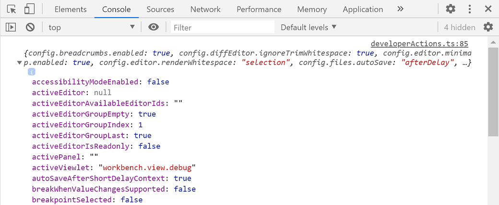

<!-- more -->

# [when 子句上下文](https://vscode.js.cn/api/references/when-clause-contexts)

Visual Studio Code 会根据 VS Code UI 中哪些元素可见和活跃来设置各种上下文键和特定值。这些上下文可用于有选择地启用或禁用扩展命令和 UI 元素，例如菜单和视图。

例如，VS Code 使用 when 子句来启用或禁用命令键绑定，您可以在默认键绑定 JSON 中看到这些内容（**首选项：打开默认键盘快捷方式 (JSON)**）

```json
{ "key": "f5",  "command": "workbench.action.debug.start",
                   "when": "debuggersAvailable && !inDebugMode" },
```

如上所示，内置的**启动调试**命令的键盘快捷方式是 F5，仅当有合适的调试器可用（上下文键 `debuggersAvailable` 为 true）且编辑器未处于调试模式（上下文键 `inDebugMode` 为 false）时才启用。

## [条件运算符](https://vscode.js.cn/api/references/when-clause-contexts#conditional-operators)

when 子句可以由一个上下文键（例如 `inDebugMode`）组成，也可以使用各种运算符来表达更细微的编辑器状态。

### [逻辑运算符](https://vscode.js.cn/api/references/when-clause-contexts#logical-operators)

逻辑运算符允许组合简单的上下文键或 when 子句表达式，这些表达式可以包含其他逻辑、相等、比较、匹配、`in`/`not in` 运算符或括号表达式。

| 运算符 | 符号 | 示例                                                        |
| :----- | :--- | :---------------------------------------------------------- |
| 非     | `!`  | `"!editorReadonly"` 或 `"!(editorReadonly || inDebugMode)"` |
| 与     | `&&` | `"textInputFocus && !editorReadonly"`                       |
| 或     | `||` | `"isLinux`` || ``isWindows"`                                |

关于逻辑运算符优先级：上表按从高到低的顺序排列运算符。示例

| 写作                   | 解释为                            |
| :--------------------- | :-------------------------------- |
| `!foo && bar`          | `(!foo) && bar`                   |
| `!foo || bar`          | `(!foo) || bar`                   |
| `foo || bar && baz`    | `foo || (bar && baz)`             |
| `!foo && bar || baz`   | `(!foo && bar) || baz`            |
| `!(foo || bar) && baz` | `(保持不变) !(foo || bar) && baz` |

### [相等运算符](https://vscode.js.cn/api/references/when-clause-contexts#equality-operators)

您可以检查上下文键的值是否与指定值相等。请注意，右侧是一个值，不解释为上下文键，这意味着它不会在上下文中查找。

| 运算符 | 符号 | 示例                                                         |
| :----- | :--- | :----------------------------------------------------------- |
| 相等   | `==` | `"editorLangId == typescript"` 或 `"editorLangId == 'typescript'"` |
| 不等   | `!=` | `"resourceExtname != .js"` 或 `"resourceExtname != '.js'"`   |

备注

- 如果右侧的值是包含空格的字符串，则必须用单引号括起来 - `"resourceFilename == 'My New File.md'"`。
- `===` 的行为与 `==` 相同，`!==` 的行为与 `!=` 相同

### [比较运算符](https://vscode.js.cn/api/references/when-clause-contexts#comparison-operators)

您可以将上下文键的值与数字进行比较。请注意，运算符的左侧和右侧必须用空格隔开 - `foo < 1`，但不能是 `foo<1`。

| 运算符 | 符号      | 示例                                                         |
| :----- | :-------- | :----------------------------------------------------------- |
| 大于   | `>`, `>=` | `"gitOpenRepositoryCount >= 1"` 但不是 `"gitOpenRepositoryCount>=1"` |
| 小于   | `<`, `<=` | `"workspaceFolderCount < 2"` 但不是 `"workspaceFolderCount<2"` |

### [匹配运算符](https://vscode.js.cn/api/references/when-clause-contexts#match-operator)

（以前的名称：键值对匹配运算符）

| 运算符 | 符号 | 示例                                      |
| :----- | :--- | :---------------------------------------- |
| 匹配   | `=~` | `"resourceScheme =~ /^untitled$|^file$/"` |

when 子句中有一个匹配运算符 (`=~`)。表达式 `key =~ regularExpressionLiteral` 将右侧视为正则表达式字面量，用于匹配左侧。例如，要为所有 Docker 文件贡献上下文菜单项，可以使用

```json
   "when": "resourceFilename =~ /docker/"
```

备注

- `=~` 运算符的右侧遵循 JavaScript 中正则表达式字面量相同的规则（[参考](https://mdn.org.cn/docs/Web/JavaScript/Guide/Regular_Expressions#creating_a_regular_expression)），只是字符需要同时遵循 JSON 字符串和正则表达式的转义规则。例如，匹配子字符串 `file://` 的正则表达式字面量在 JavaScript 中是 `/file:\/\//`，但在 when 子句中是 `/file:\\/\\//`，因为反斜杠需要在 JSON 字符串中转义，斜杠需要在正则表达式模式中转义。
- 不存在运算符 `!=~`，但您可以否定匹配表达式 - `!(foo =~ /baz/)`。

#### 正则表达式标志

可以使用标志与正则表达式字面量。例如，`resourceFilename =~ /json/i` 或 `myContextKey =~ /baz/si`。

支持的标志：`i`、`s`、`m`、`u`。

忽略的标志：`g`、`y`。

### ['in' 和 'not in' 条件运算符](https://vscode.js.cn/api/references/when-clause-contexts#in-and-not-in-conditional-operators)

when 子句的 `in` 运算符允许在另一个上下文键的值中动态查找上下文键的值。例如，如果您想为包含特定类型文件（或无法静态确定的内容）的文件夹添加上下文菜单命令，现在可以使用 `in` 运算符来实现。您可以使用 `not in` 运算符来检查相反的条件。

| 运算符 | 符号     | 示例                                         |
| :----- | :------- | :------------------------------------------- |
| 在     | `in`     | `"resourceFilename in supportedFolders"`     |
| 不在   | `not in` | `"resourceFilename not in supportedFolders"` |

首先，确定哪些文件夹应支持该命令，并将文件夹名称添加到数组中。然后，使用[`setContext` 命令](https://vscode.js.cn/api/references/when-clause-contexts#add-a-custom-when-clause-context)将数组转换为上下文键

```typescript
vscode.commands.executeCommand('setContext', 'ext.supportedFolders', [
  'test',
  'foo',
  'bar'
]);

// or

// Note in this case (using an object), the value doesn't matter, it is based on the existence of the key in the object
// The value must be of a simple type
vscode.commands.executeCommand('setContext', 'ext.supportedFolders', {
  test: true,
  foo: 'anything',
  bar: false
});
```

然后，在 `package.json` 中，您可以为 `explorer/context` 菜单添加菜单贡献

```json
// Note, this assumes you have already defined a command called ext.doSpecial
"menus": {
  "explorer/context": [
    {
      "command": "ext.doSpecial",
      "when": "explorerResourceIsFolder && resourceFilename in ext.supportedFolders"
    }
  ]
}
```

在该示例中，我们获取 `resourceFilename` 的值（在这种情况下是文件夹名称），并检查它是否存在于 `ext.supportedFolders` 的值中。如果存在，将显示菜单。这个强大的运算符应该允许更丰富的条件和动态贡献，以支持 `when` 子句，例如菜单、视图等。

## [可用上下文键](https://vscode.js.cn/api/references/when-clause-contexts#available-context-keys)

以下是一些可用上下文键，它们计算为布尔值 true/false。

这里的列表并不详尽，您可以通过在键盘快捷方式编辑器中搜索和过滤（**首选项：打开键盘快捷方式**）或查看默认键绑定 JSON 文件（**首选项：打开默认键盘快捷方式 (JSON)**）来查找其他 when 子句上下文。您还可以使用[检查上下文键实用工具](https://vscode.js.cn/api/references/when-clause-contexts#inspect-context-keys-utility)来识别您感兴趣的上下文键。

| 上下文名称                         | 为 True 时                                                   |
| :--------------------------------- | :----------------------------------------------------------- |
| **编辑器上下文**                   |                                                              |
| `editorFocus`                      | 编辑器有焦点，无论是文本还是小部件。                         |
| `editorTextFocus`                  | 编辑器中的文本有焦点（光标闪烁）。                           |
| `textInputFocus`                   | 任何编辑器有焦点（普通编辑器、调试 REPL 等）。               |
| `inputFocus`                       | 任何文本输入区域有焦点（编辑器或文本框）。                   |
| `editorTabMovesFocus`              | Tab 键是否会将焦点移出编辑器。                               |
| `editorHasSelection`               | 编辑器中选择了文本。                                         |
| `editorHasMultipleSelections`      | 选择了多个文本区域（多光标）。                               |
| `editorReadonly`                   | 编辑器是只读的。                                             |
| `editorLangId`                     | 当编辑器的关联[语言 ID](https://vscode.js.cn/docs/languages/identifiers) 匹配时为 True。 示例：`"editorLangId == typescript"`。 |
| `isInDiffEditor`                   | 活动编辑器是差异编辑器。                                     |
| `isInEmbeddedEditor`               | 当焦点位于嵌入式编辑器内时为 True。                          |
| **操作系统上下文**                 |                                                              |
| `isLinux`                          | 当操作系统是 Linux 时为 True。                               |
| `isMac`                            | 当操作系统是 macOS 时为 True。                               |
| `isWindows`                        | 当操作系统是 Windows 时为 True。                             |
| `isWeb`                            | 通过 Web 访问编辑器时为 True。                               |
| **列表上下文**                     |                                                              |
| `listFocus`                        | 列表有焦点。                                                 |
| `listSupportsMultiselect`          | 列表支持多选。                                               |
| `listHasSelectionOrFocus`          | 列表有选中项或焦点。                                         |
| `listDoubleSelection`              | 列表选中了 2 个元素。                                        |
| `listMultiSelection`               | 列表选中了多个元素。                                         |
| **模式上下文**                     |                                                              |
| `inSnippetMode`                    | 编辑器处于代码片段模式。                                     |
| `inQuickOpen`                      | 快速打开下拉列表有焦点。                                     |
| **资源上下文**                     |                                                              |
| `resourceScheme`                   | 当资源 URI 方案匹配时为 True。 示例：`"resourceScheme == file"` |
| `resourceFilename`                 | 当资源管理器或编辑器文件名匹配时为 True。 示例：`"resourceFilename == gulpfile.js"` |
| `resourceExtname`                  | 当资源管理器或编辑器文件名扩展名匹配时为 True。 示例：`"resourceExtname == .js"` |
| `resourceDirname`                  | 当资源管理器或编辑器的资源绝对文件夹路径匹配时为 True。 示例：`"resourceDirname == /users/alice/project/src"` |
| `resourcePath`                     | 当资源管理器或编辑器的资源绝对路径匹配时为 True。 示例：`"resourcePath == /users/alice/project/gulpfile.js"` |
| `resourceLangId`                   | 当资源管理器或编辑器标题[语言 ID](https://vscode.js.cn/docs/languages/identifiers) 匹配时为 True。 示例：`"resourceLangId == markdown"` |
| `isFileSystemResource`             | 当资源管理器或编辑器文件是文件系统提供程序可以处理的文件系统资源时为 True。 |
| `resourceSet`                      | 当资源管理器或编辑器文件已设置时为 True。                    |
| `resource`                         | 资源管理器或编辑器文件的完整 URI。                           |
| **资源管理器上下文**               |                                                              |
| `explorerViewletVisible`           | 如果资源管理器视图可见，则为 True。                          |
| `explorerViewletFocus`             | 如果资源管理器视图具有键盘焦点，则为 True。                  |
| `filesExplorerFocus`               | 如果文件资源管理器部分具有键盘焦点，则为 True。              |
| `openEditorsFocus`                 | 如果“打开的编辑器”部分具有键盘焦点，则为 True。              |
| `explorerResourceIsFolder`         | 如果在资源管理器中选择了文件夹，则为 True。                  |
| **编辑器小部件上下文**             |                                                              |
| `findWidgetVisible`                | 编辑器查找小部件可见。                                       |
| `suggestWidgetVisible`             | 建议小部件（IntelliSense）可见。                             |
| `suggestWidgetMultipleSuggestions` | 显示多个建议。                                               |
| `renameInputVisible`               | 重命名输入文本框可见。                                       |
| `referenceSearchVisible`           | “查看引用”速览窗口已打开。                                   |
| `inReferenceSearchEditor`          | “查看引用”速览窗口编辑器有焦点。                             |
| `config.editor.stablePeek`         | 保持速览编辑器打开（由 `editor.stablePeek` 设置控制）。      |
| `codeActionMenuVisible`            | 代码操作菜单可见。                                           |
| `parameterHintsVisible`            | 参数提示可见（由 `editor.parameterHints.enabled` 设置控制）。 |
| `parameterHintsMultipleSignatures` | 显示多个参数提示。                                           |
| **调试器上下文**                   |                                                              |
| `debuggersAvailable`               | 有可用的相应调试器扩展。                                     |
| `inDebugMode`                      | 正在运行调试会话。                                           |
| `debugState`                       | 活动调试器状态。 可能的值是 `inactive`、`initializing`、`stopped`、`running`。 |
| `debugType`                        | 当调试类型匹配时为 True。 示例：`"debugType == 'node'"`。    |
| `inDebugRepl`                      | 焦点在调试控制台 REPL 中。                                   |
| **集成终端上下文**                 |                                                              |
| `terminalFocus`                    | 集成终端有焦点。                                             |
| `terminalIsOpen`                   | 集成终端已打开。                                             |
| **时间线视图上下文**               |                                                              |
| `timelineFollowActiveEditor`       | 如果时间线视图正在跟随活动编辑器，则为 True。                |
| **时间线视图项上下文**             |                                                              |
| `timelineItem`                     | 当时间线项的上下文值匹配时为 True。 示例：`"timelineItem =~ /git:file:commit\\b/"`。 |
| **扩展上下文**                     |                                                              |
| `extension`                        | 当扩展 ID 匹配时为 True。 示例：`"extension == eamodio.gitlens"`。 |
| `extensionStatus`                  | 当扩展已安装时为 True。 示例：`"extensionStatus == installed"`。 |
| `extensionHasConfiguration`        | 如果扩展有配置，则为 True。                                  |
| **全局 UI 上下文**                 |                                                              |
| `notificationFocus`                | 通知具有键盘焦点。                                           |
| `notificationCenterVisible`        | 通知中心在 VS Code 右下角可见。                              |
| `notificationToastsVisible`        | 通知 Toast 在 VS Code 右下角可见。                           |
| `searchViewletVisible`             | 搜索视图已打开。                                             |
| `sideBarVisible`                   | 侧边栏已显示。                                               |
| `sideBarFocus`                     | 侧边栏有焦点。                                               |
| `panelFocus`                       | 面板有焦点。                                                 |
| `inZenMode`                        | 窗口处于 Zen 模式。                                          |
| `isCenteredLayout`                 | 编辑器处于居中布局模式。                                     |
| `workbenchState`                   | 可以是 `empty`、`folder`（1 个文件夹）或 `workspace`。       |
| `workspaceFolderCount`             | 工作区文件夹的数量。                                         |
| `replaceActive`                    | 搜索视图的替换文本框已打开。                                 |
| `view`                             | 对于 `view/title` 和 `view/item/context`，显示命令的视图。 示例：`"view == myViewsExplorerID"`。 |
| `viewItem`                         | 对于 `view/item/context`，来自树项的 `contextValue`。 示例：`"viewItem == someContextValue"`。 |
| `webviewId`                        | 对于 `webview/context`，显示命令的 webview ID。 示例：`"webviewId == catCoding"`。 |
| `isFullscreen`                     | 窗口处于全屏模式时为 True。                                  |
| `focusedView`                      | 当前聚焦视图的标识符。                                       |
| `canNavigateBack`                  | 如果可以向后导航，则为 True。                                |
| `canNavigateForward`               | 如果可以向前导航，则为 True。                                |
| `canNavigateToLastEditLocation`    | 如果可以导航到上次编辑位置，则为 True。                      |
| **全局编辑器 UI 上下文**           |                                                              |
| `textCompareEditorVisible`         | 至少一个差异（比较）编辑器可见。                             |
| `textCompareEditorActive`          | 差异（比较）编辑器处于活动状态。                             |
| `editorIsOpen`                     | 如果一个编辑器已打开，则为 True。                            |
| `groupEditorsCount`                | 组中的编辑器数量。                                           |
| `activeEditorGroupEmpty`           | 如果活动编辑器组没有编辑器，则为 True。                      |
| `activeEditorGroupIndex`           | 一个从 `1` 开始的数字，反映编辑器组在编辑器网格中的位置。 索引为 `1` 的组将是左上角的第一个。 |
| `activeEditorGroupLast`            | 对于编辑器网格中的最后一个编辑器组，将为 `true`。            |
| `multipleEditorGroups`             | 当存在多个编辑器组时为 True。                                |
| `activeEditor`                     | 组中活动编辑器的标识符。                                     |
| `activeEditorIsDirty`              | 当组中活动编辑器是脏文件时为 True。                          |
| `activeEditorIsNotPreview`         | 当组中活动编辑器不是预览模式时为 True。                      |
| `activeEditorIsPinned`             | 当组中活动编辑器已固定时为 True。                            |
| `inSearchEditor`                   | 当焦点在搜索编辑器内时为 True。                              |
| `activeWebviewPanelId`             | 当前活动的[webview 面板](https://vscode.js.cn/api/extension-guides/webview)的 ID。 |
| `activeCustomEditorId`             | 当前活动的[自定义编辑器](https://vscode.js.cn/api/extension-guides/custom-editors)的 ID。 |
| **配置设置上下文**                 |                                                              |
| `config.editor.minimap.enabled`    | 当设置 `editor.minimap.enabled` 为 `true` 时为 True。        |

> **注意**：您可以在此处使用任何计算为布尔值的用户或工作区设置，并加上前缀 `"config."`。

## [可见/聚焦视图的 when 子句上下文](https://vscode.js.cn/api/references/when-clause-contexts#visiblefocused-view-when-clause-context)

您可以有一个 when 子句，用于检查特定[视图](https://vscode.js.cn/api/ux-guidelines/views)是否可见或聚焦。

| 上下文名称               | 为 True 时                                                   |
| :----------------------- | :----------------------------------------------------------- |
| `view.${viewId}.visible` | 当特定视图可见时为 True。 示例：`"view.workbench.explorer.fileView.visible"` |
| `focusedView`            | 当特定视图有焦点时为 True。 示例：`"focusedView == 'workbench.explorer.fileView'"` |

视图标识符

- `workbench.explorer.fileView` - 文件资源管理器
- `workbench.explorer.openEditorsView` - 打开的编辑器
- `outline` - 大纲视图
- `timeline` - 时间线视图
- `workbench.scm` - 源代码管理
- `workbench.scm.repositories` - 源代码管理存储库
- `workbench.debug.variablesView` - 变量
- `workbench.debug.watchExpressionsView` - 监视
- `workbench.debug.callStackView` - 调用堆栈
- `workbench.debug.loadedScriptsView` - 加载的脚本
- `workbench.debug.breakPointsView` - 断点
- `workbench.debug.disassemblyView` - 反汇编
- `workbench.views.extensions.installed` - 已安装的扩展
- `extensions.recommendedList` - 推荐的扩展
- `workbench.panel.markers.view` - 问题
- `workbench.panel.output` - 输出
- `workbench.panel.repl.view` - 调试控制台
- `terminal` - 集成终端
- `workbench.panel.comments` - 评论

## [可见视图容器的 when 子句上下文](https://vscode.js.cn/api/references/when-clause-contexts#visible-view-container-when-clause-context)

您可以有一个 when 子句，用于检查特定[视图容器](https://vscode.js.cn/api/ux-guidelines/views#view-containers)是否可见

| 上下文名称        | 为 True 时                                                   |
| :---------------- | :----------------------------------------------------------- |
| `activeViewlet`   | 当视图容器在侧边栏中可见时为 True。 示例：`"activeViewlet == 'workbench.view.explorer'"` |
| `activePanel`     | 当视图容器在面板中可见时为 True。 示例：`"activePanel == 'workbench.panel.output'"` |
| `activeAuxiliary` | 当视图容器在辅助侧边栏中可见时为 True。 示例：`"activeAuxiliary == 'workbench.view.debug'"` |

视图容器标识符

- `workbench.view.explorer` - 文件资源管理器
- `workbench.view.search` - 搜索
- `workbench.view.scm` - 源代码管理
- `workbench.view.debug` - 运行
- `workbench.view.extensions` - 扩展
- `workbench.panel.markers` - 问题
- `workbench.panel.output` - 输出
- `workbench.panel.repl` - 调试控制台
- `terminal` - 集成终端
- `workbench.panel.comments` - 评论

如果您希望当特定视图容器具有焦点时才启用 when 子句，请结合使用 `sideBarFocus` 或 `panelFocus` 或 `auxiliaryBarFocus` 和 `activeViewlet` 或 `activePanel` 或 `activeAuxiliary` 上下文键。

例如，以下 when 子句仅在文件资源管理器具有焦点时为 True

```
"sideBarFocus && activeViewlet == 'workbench.view.explorer'"
```

## [在 when 子句中检查设置](https://vscode.js.cn/api/references/when-clause-contexts#check-a-setting-in-a-when-clause)

在 when 子句中，可以通过前缀 `config.` 来引用配置（设置）值，例如 `config.editor.tabCompletion` 或 `config.breadcrumbs.enabled`。

## [添加自定义 when 子句上下文](https://vscode.js.cn/api/references/when-clause-contexts#add-a-custom-when-clause-context)

如果您正在编写自己的 VS Code 扩展，并且需要使用 when 子句上下文来启用/禁用命令、菜单或视图，而现有键都不适合您的需求，则可以使用 `setContext` 命令添加自己的上下文键。

下面的第一个示例将键 `myExtension.showMyCommand` 设置为 true，您可以在启用命令或与 `when` 属性一起使用。第二个示例存储一个值，您可以与 when 子句一起使用，以检查打开的酷炫事物的数量是否大于 2。

```typescript
vscode.commands.executeCommand('setContext', 'myExtension.showMyCommand', true);

vscode.commands.executeCommand('setContext', 'myExtension.numberOfCoolOpenThings', 4);
```

## [检查上下文键实用工具](https://vscode.js.cn/api/references/when-clause-contexts#inspect-context-keys-utility)

如果您想查看所有当前活动的上下文键，可以使用命令面板中的**开发人员：检查上下文键**命令（Ctrl+Shift+P）。**检查上下文键**将在 VS Code 开发人员工具的**控制台**选项卡中显示上下文键及其值（**帮助** > **切换开发人员工具**）。

运行**开发人员：检查上下文键**后，光标将突出显示 VS Code UI 中的元素，当您单击某个元素时，当前上下文键及其状态将作为对象输出到控制台。



活动上下文键的列表很长，可能包含您已安装的扩展的[自定义上下文键](https://vscode.js.cn/api/references/when-clause-contexts#add-a-custom-when-clause-context)。

> **注意**：某些上下文键用于 VS Code 内部使用，将来可能会更改。

