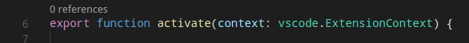
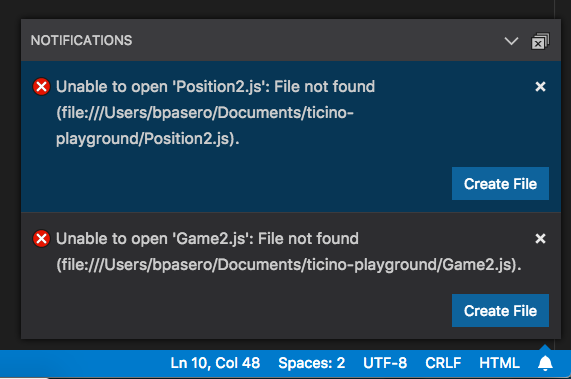

<!-- more -->

# [主题颜色](https://vscode.js.cn/api/references/theme-color)

你可以使用 `workbench.colorCustomizations` 用户[设置](https://vscode.js.cn/docs/getstarted/settings)，自定义你当前的 Visual Studio Code [颜色主题](https://vscode.js.cn/docs/getstarted/themes)。

```json
{
  "workbench.colorCustomizations": {
    "activityBar.background": "#00AA00"
  }
}
```

**注意**：如果你想使用现有的颜色主题，请参阅[颜色主题](https://vscode.js.cn/docs/getstarted/themes)，你将在此了解如何通过**首选项：颜色主题**下拉菜单来设置当前颜色主题（Ctrl+K Ctrl+T）。

主题颜色在[Webview](https://vscode.js.cn/api/extension-guides/webview)中作为 CSS 变量提供，并且有[一个扩展](https://marketplace.visualstudio.com/items?itemName=connor4312.css-theme-completions)提供了它们的智能感知功能。

## [颜色格式](https://vscode.js.cn/api/references/theme-color#color-formats)

颜色值可以在 RGB 颜色模型中定义，带有用于透明度的 Alpha 通道。支持以下十六进制格式：`#RGB`、`#RGBA`、`#RRGGBB` 和 `#RRGGBBAA`。R (红)、G (绿)、B (蓝) 和 A (Alpha) 均为十六进制字符 (0-9, a-f 或 A-F)。三位表示法 (`#RGB`) 是六位形式 (`#RRGGBB`) 的简写版本，四位 RGB 表示法 (`#RGBA`) 是八位形式 (`#RRGGBBAA`) 的简写版本。例如，`#e35f` 与 `#ee3355ff` 是相同的颜色。

如果未定义 Alpha 值，则默认为 `ff`（不透明，无透明度）。如果 Alpha 设置为 `00`，则颜色完全透明。

某些颜色不应不透明，以免覆盖其他注解。请查阅颜色描述以了解哪些颜色适用此规则。

## [对比色](https://vscode.js.cn/api/references/theme-color#contrast-colors)

对比色通常仅为高对比度主题设置。如果设置，它们会在 UI 中的项目周围添加额外的边框以增加对比度。

- `contrastActiveBorder`：活动元素周围的额外边框，用于将其与其他元素区分开来，以获得更高的对比度。
- `contrastBorder`：元素周围的额外边框，用于将其与其他元素区分开来，以获得更高的对比度。

## [基本颜色](https://vscode.js.cn/api/references/theme-color#base-colors)

- `focusBorder`：聚焦元素的整体边框颜色。此颜色仅在未被组件覆盖时使用。
- `foreground`：整体前景色。此颜色仅在未被组件覆盖时使用。
- `disabledForeground`：禁用元素的整体前景色。此颜色仅在未被组件覆盖时使用。
- `widget.border`：编辑器内查找/替换等小部件的边框颜色。
- `widget.shadow`：编辑器内查找/替换等小部件的阴影颜色。
- `selection.background`：工作台中文本选区的背景颜色（用于输入字段或文本区域，不适用于编辑器和终端内的选区）。
- `descriptionForeground`：提供附加信息（例如标签）的描述文本的前景色。
- `errorForeground`：错误消息的整体前景色（此颜色仅在未被组件覆盖时使用）。
- `icon.foreground`：工作台中图标的默认颜色。
- `sash.hoverBorder`：可拖动分隔条的悬停边框颜色。

## [窗口边框](https://vscode.js.cn/api/references/theme-color#window-border)

VS Code 窗口边框的主题颜色。

- `window.activeBorder`：活动（聚焦）窗口的边框颜色。
- `window.inactiveBorder`：非活动（未聚焦）窗口的边框颜色。

窗口边框颜色仅在 macOS 和 Linux 上受支持（Windows 不支持），并且仅当启用自定义标题栏时（`"window.titleBarStyle": "custom"`）才可用。

## [文本颜色](https://vscode.js.cn/api/references/theme-color#text-colors)

文本文档内的颜色，例如欢迎页面。

- `textBlockQuote.background`：文本中引用块的背景颜色。
- `textBlockQuote.border`：文本中引用块的边框颜色。
- `textCodeBlock.background`：文本中代码块的背景颜色。
- `textLink.activeForeground`：文本中链接在点击和鼠标悬停时的前景色。
- `textLink.foreground`：文本中链接的前景色。
- `textPreformat.foreground`：预格式化文本片段的前景色。
- `textPreformat.background`：预格式化文本片段的背景颜色。
- `textSeparator.foreground`：文本分隔符的颜色。

## [操作颜色](https://vscode.js.cn/api/references/theme-color#action-colors)

一组颜色，用于控制工作台中与操作的交互。

- `toolbar.hoverBackground`：鼠标悬停在操作上时工具栏的背景颜色
- `toolbar.hoverOutline`：鼠标悬停在操作上时工具栏的轮廓颜色
- `toolbar.activeBackground`：鼠标按住操作时工具栏的背景颜色
- `editorActionList.background`：操作列表的背景颜色。
- `editorActionList.foreground`：操作列表的前景色。
- `editorActionList.focusForeground`：操作列表中聚焦项的前景色。
- `editorActionList.focusBackground`：操作列表中聚焦项的背景颜色。

## [按钮控件](https://vscode.js.cn/api/references/theme-color#button-control)

一组用于按钮小部件的颜色，例如新窗口资源管理器中的**打开文件夹**按钮。


- `button.background`：按钮背景颜色。
- `button.foreground`：按钮前景色。
- `button.border`：按钮边框颜色。
- `button.separator`：按钮分隔符颜色。
- `button.hoverBackground`：按钮悬停时的背景颜色。
- `button.secondaryForeground`：辅助按钮前景色。
- `button.secondaryBackground`：辅助按钮背景颜色。
- `button.secondaryHoverBackground`：辅助按钮悬停时的背景颜色。
- `checkbox.background`：复选框小部件的背景颜色。
- `checkbox.foreground`：复选框小部件的前景色。
- `checkbox.disabled.background`：禁用复选框的背景颜色。
- `checkbox.disabled.foreground`：禁用复选框的前景色。
- `checkbox.border`：复选框小部件的边框颜色。
- `checkbox.selectBackground`：复选框小部件在所处元素被选中时的背景颜色。
- `checkbox.selectBorder`：复选框小部件在所处元素被选中时的边框颜色。
- `radio.activeForeground`：活动单选选项的前景色。
- `radio.activeBackground`：活动单选选项的背景颜色。
- `radio.activeBorder`：活动单选选项的边框颜色。
- `radio.inactiveForeground`：非活动单选选项的前景色。
- `radio.inactiveBackground`：非活动单选选项的背景颜色。
- `radio.inactiveBorder`：非活动单选选项的边框颜色。
- `radio.inactiveHoverBackground`：非活动单选选项悬停时的背景颜色。

## [下拉控件](https://vscode.js.cn/api/references/theme-color#dropdown-control)

一组用于所有下拉小部件的颜色，例如集成终端或输出面板中的下拉小部件。请注意，目前 macOS 上不使用下拉控件。


- `dropdown.background`：下拉菜单背景。
- `dropdown.listBackground`：下拉列表背景。
- `dropdown.border`：下拉菜单边框。
- `dropdown.foreground`：下拉菜单前景色。

## [输入控件](https://vscode.js.cn/api/references/theme-color#input-control)

输入控件的颜色，例如搜索视图或查找/替换对话框中的控件。


- `input.background`：输入框背景。
- `input.border`：输入框边框。
- `input.foreground`：输入框前景色。
- `input.placeholderForeground`：输入框占位符文本的前景色。
- `inputOption.activeBackground`：输入字段中已激活选项的背景颜色。
- `inputOption.activeBorder`：输入字段中已激活选项的边框颜色。
- `inputOption.activeForeground`：输入字段中已激活选项的前景色。
- `inputOption.hoverBackground`：输入字段中已激活选项的背景颜色。
- `inputValidation.errorBackground`：错误严重级别输入验证的背景颜色。
- `inputValidation.errorForeground`：错误严重级别输入验证的前景色。
- `inputValidation.errorBorder`：错误严重级别输入验证的边框颜色。
- `inputValidation.infoBackground`：信息严重级别输入验证的背景颜色。
- `inputValidation.infoForeground`：信息严重级别输入验证的前景色。
- `inputValidation.infoBorder`：信息严重级别输入验证的边框颜色。
- `inputValidation.warningBackground`：警告严重级别输入验证的背景颜色。
- `inputValidation.warningForeground`：警告严重级别输入验证的前景色。
- `inputValidation.warningBorder`：警告严重级别输入验证的边框颜色。

## [滚动条控件](https://vscode.js.cn/api/references/theme-color#scrollbar-control)

- `scrollbar.shadow`：滚动条滑块阴影，指示视图已滚动。
- `scrollbarSlider.activeBackground`：滚动条滑块被点击时的背景颜色。
- `scrollbarSlider.background`：滚动条滑块的背景颜色。
- `scrollbarSlider.hoverBackground`：滚动条滑块悬停时的背景颜色。

## [徽章](https://vscode.js.cn/api/references/theme-color#badge)

徽章是小型信息标签，例如搜索结果计数。

- `badge.foreground`：徽章前景色。
- `badge.background`：徽章背景颜色。

## [进度条](https://vscode.js.cn/api/references/theme-color#progress-bar)

- `progressBar.background`：长时间运行操作时显示的进度条的背景颜色。

## [列表和树](https://vscode.js.cn/api/references/theme-color#lists-and-trees)

列表和树（如文件资源管理器）的颜色。活动列表/树具有键盘焦点，非活动列表/树没有。

- `list.activeSelectionBackground`：列表/树在活动时选中项的背景颜色。
- `list.activeSelectionForeground`：列表/树在活动时选中项的前景色。
- `list.activeSelectionIconForeground`：列表/树在活动时选中项的图标前景色。活动列表/树具有键盘焦点，非活动列表/树没有。
- `list.dropBackground`：使用鼠标移动项目时列表/树的拖放背景。
- `list.focusBackground`：列表/树在活动时聚焦项的背景颜色。
- `list.focusForeground`：列表/树在活动时聚焦项的前景色。活动列表/树具有键盘焦点，非活动列表/树没有。
- `list.focusHighlightForeground`：在列表/树中搜索时，活动聚焦项上匹配高亮的前景色。
- `list.focusOutline`：列表/树在活动时聚焦项的轮廓颜色。活动列表/树具有键盘焦点，非活动列表/树没有。
- `list.focusAndSelectionOutline`：列表/树在活动且选中时聚焦项的轮廓颜色。活动列表/树具有键盘焦点，非活动列表/树没有。
- `list.highlightForeground`：在列表/树中搜索时，匹配高亮的前景色。
- `list.hoverBackground`：鼠标悬停在列表/树项目上时的背景颜色。
- `list.hoverForeground`：鼠标悬停在列表/树项目上时的前景色。
- `list.inactiveSelectionBackground`：列表/树在非活动时选中项的背景颜色。
- `list.inactiveSelectionForeground`：列表/树在非活动时选中项的前景色。活动列表/树具有键盘焦点，非活动列表/树没有。
- `list.inactiveSelectionIconForeground`：列表/树在非活动时选中项的图标前景色。活动列表/树具有键盘焦点，非活动列表/树没有。
- `list.inactiveFocusBackground`：列表在非活动时聚焦项的背景颜色。活动列表具有键盘焦点，非活动列表没有。目前仅在列表中支持。
- `list.inactiveFocusOutline`：列表/树在非活动时聚焦项的轮廓颜色。活动列表/树具有键盘焦点，非活动列表/树没有。
- `list.invalidItemForeground`：列表/树中无效项目的前景色，例如资源管理器中未解析的根目录。
- `list.errorForeground`：包含错误的列表项的前景色。
- `list.warningForeground`：包含警告的列表项的前景色。
- `listFilterWidget.background`：在列表/树中搜索时，筛选器小部件中输入文本的背景颜色。
- `listFilterWidget.outline`：在列表/树中搜索时，筛选器小部件中输入文本的轮廓颜色。
- `listFilterWidget.noMatchesOutline`：在列表/树中搜索时，筛选器小部件中输入文本未找到匹配项时的轮廓颜色。
- `listFilterWidget.shadow`：列表和树中类型筛选器小部件的阴影颜色。
- `list.filterMatchBackground`：列表和树中筛选匹配项的背景颜色。
- `list.filterMatchBorder`：列表和树中筛选匹配项的边框颜色。
- `list.deemphasizedForeground`：列表/树中弱化项的前景色。
- `list.dropBetweenBackground`：使用鼠标在项目之间移动时，列表/树拖放的边框颜色。
- `tree.indentGuidesStroke`：树小部件中缩进指南的描边颜色。
- `tree.inactiveIndentGuidesStroke`：树中非活动缩进指南的描边颜色。
- `tree.tableColumnsBorder`：树表格列的边框颜色。
- `tree.tableOddRowsBackground`：奇数表格行的背景颜色。

## [活动栏](https://vscode.js.cn/api/references/theme-color#activity-bar)

活动栏通常显示在工作台的最左侧或最右侧，允许在侧边栏视图之间快速切换。

- `activityBar.background`：活动栏背景颜色。
- `activityBar.dropBorder`：活动栏项目的拖放反馈颜色。活动栏显示在最左侧或最右侧，并允许在侧边栏视图之间切换。
- `activityBar.foreground`：活动栏前景色（例如用于图标）。
- `activityBar.inactiveForeground`：活动栏项目在非活动时的前景色。
- `activityBar.border`：活动栏与侧边栏的边框颜色。
- `activityBarBadge.background`：活动通知徽章背景颜色。
- `activityBarBadge.foreground`：活动通知徽章前景色。
- `activityBar.activeBorder`：活动栏活动指示器边框颜色。
- `activityBar.activeBackground`：活动栏中活动元素的可选背景颜色。
- `activityBar.activeFocusBorder`：活动栏中活动项目的聚焦边框颜色。
- `activityBarTop.foreground`：活动栏项目在顶部时的活动前景色。活动栏允许在侧边栏视图之间切换。
- `activityBarTop.activeBorder`：活动栏项目在顶部时的活动项目的聚焦边框颜色。活动栏允许在侧边栏视图之间切换。
- `activityBarTop.inactiveForeground`：活动栏项目在顶部时的非活动前景色。活动栏允许在侧边栏视图之间切换。
- `activityBarTop.dropBorder`：活动栏项目在顶部时的拖放反馈颜色。活动栏允许在侧边栏视图之间切换。
- `activityBarTop.background`：活动栏设置为顶部/底部时的背景颜色。
- `activityBarTop.activeBackground`：活动栏项目在顶部/底部时的活动项目的背景颜色。活动栏允许在侧边栏视图之间切换。
- `activityWarningBadge.foreground`：警告活动徽章的前景色
- `activityWarningBadge.background`：警告活动徽章的背景颜色
- `activityErrorBadge.foreground`：错误活动徽章的前景色
- `activityErrorBadge.background`：错误活动徽章的背景颜色

## [配置文件](https://vscode.js.cn/api/references/theme-color#profiles)

- `profileBadge.background`：配置文件徽章背景颜色。配置文件徽章显示在活动栏设置齿轮图标的顶部。
- `profileBadge.foreground`：配置文件徽章前景色。配置文件徽章显示在活动栏设置齿轮图标的顶部。
- `profiles.sashBorder`：配置文件编辑器分割视图分隔条的边框颜色。

## [侧边栏](https://vscode.js.cn/api/references/theme-color#side-bar)

侧边栏包含资源管理器和搜索等视图。

- `sideBar.background`：侧边栏背景颜色。
- `sideBar.foreground`：侧边栏前景色。侧边栏是资源管理器和搜索等视图的容器。
- `sideBar.border`：侧边栏与编辑器分隔侧的边框颜色。
- `sideBar.dropBackground`：侧边栏部分的拖放反馈颜色。该颜色应具有透明度，以便侧边栏部分仍能透出。
- `sideBarTitle.foreground`：侧边栏标题前景色。
- `sideBarSectionHeader.background`：侧边栏章节标题背景颜色。
- `sideBarSectionHeader.foreground`：侧边栏章节标题前景色。
- `sideBarSectionHeader.border`：侧边栏章节标题边框颜色。
- `sideBarActivityBarTop.border`：顶部/底部活动栏与视图之间的边框颜色。
- `sideBarTitle.background`：侧边栏标题背景颜色。侧边栏是资源管理器和搜索等视图的容器。
- `sideBarTitle.border`：侧边栏标题底部的边框颜色，用于将标题与视图分隔开。侧边栏是资源管理器和搜索等视图的容器。
- `sideBarStickyScroll.background`：侧边栏中粘性滚动条的背景颜色。
- `sideBarStickyScroll.border`：侧边栏中粘性滚动条的边框颜色。
- `sideBarStickyScroll.shadow`：侧边栏中粘性滚动条的阴影颜色。

## [迷你地图](https://vscode.js.cn/api/references/theme-color#minimap)

迷你地图显示当前文件的缩小版本。

- `minimap.findMatchHighlight`：文件内搜索匹配项的高亮颜色。
- `minimap.selectionHighlight`：编辑器选区的高亮颜色。
- `minimap.errorHighlight`：编辑器内错误的高亮颜色。
- `minimap.warningHighlight`：编辑器内警告的高亮颜色。
- `minimap.background`：迷你地图背景颜色。
- `minimap.selectionOccurrenceHighlight`：迷你地图中重复编辑器选区的标记颜色。
- `minimap.foregroundOpacity`：迷你地图中前景元素的透明度。例如，"#000000c0" 将以 75% 的透明度渲染元素。
- `minimap.infoHighlight`：迷你地图中信息标记的颜色。
- `minimap.chatEditHighlight`：迷你地图中待处理编辑区域的颜色。
- `minimapSlider.background`：迷你地图滑块的背景颜色。
- `minimapSlider.hoverBackground`：迷你地图滑块悬停时的背景颜色。
- `minimapSlider.activeBackground`：迷你地图滑块被点击时的背景颜色。
- `minimapGutter.addedBackground`：迷你地图槽中新增内容的颜色。
- `minimapGutter.modifiedBackground`：迷你地图槽中修改内容的颜色。
- `minimapGutter.deletedBackground`：迷你地图槽中删除内容的颜色。
- `editorMinimap.inlineChatInserted`：迷你地图中行内聊天插入内容的标记颜色。

## [编辑器组和选项卡](https://vscode.js.cn/api/references/theme-color#editor-groups-tabs)

编辑器组是编辑器的容器。可以有多个编辑器组。选项卡是编辑器的容器。一个编辑器组中可以打开多个选项卡。

- `editorGroup.border`：分隔多个编辑器组的颜色。

  

- `editorGroup.dropBackground`：拖动编辑器时的背景颜色。

  

- `editorGroupHeader.noTabsBackground`：使用单个选项卡时（设置 `"workbench.editor.showTabs": "single"`）编辑器组标题头部的背景颜色。

  

- `editorGroupHeader.tabsBackground`：选项卡容器的背景颜色。

  

- `editorGroupHeader.tabsBorder`：启用选项卡时编辑器选项卡控件下方的边框颜色。

  

- `editorGroupHeader.border`：编辑器组标题和编辑器之间的边框颜色（如果启用面包屑，则在面包屑下方）。

- `editorGroup.emptyBackground`：空编辑器组的背景颜色。

- `editorGroup.focusedEmptyBorder`：聚焦的空编辑器组的边框颜色。

- `editorGroup.dropIntoPromptForeground`：拖动文件时在编辑器上方显示的文本的前景色。此文本告知用户可以按住 Shift 键将文件拖放到编辑器中。

- `editorGroup.dropIntoPromptBackground`：拖动文件时在编辑器上方显示的文本的背景颜色。此文本告知用户可以按住 Shift 键将文件拖放到编辑器中。

- `editorGroup.dropIntoPromptBorder`：拖动文件时在编辑器上方显示的文本的边框颜色。此文本告知用户可以按住 Shift 键将文件拖放到编辑器中。

- `tab.activeBackground`：活动组中活动选项卡的背景颜色。

- `tab.unfocusedActiveBackground`：非活动编辑器组中活动选项卡的背景颜色。

- `tab.activeForeground`：活动组中活动选项卡的前景色。

- `tab.border`：分隔选项卡之间的边框。

- `tab.activeBorder`：活动选项卡的下边框。

- `tab.selectedBorderTop`：选中选项卡顶部的边框。选项卡是编辑器区域中编辑器的容器。一个编辑器组中可以打开多个选项卡。可以有多个编辑器组。

- `tab.selectedBackground`：选中选项卡的背景。选项卡是编辑器区域中编辑器的容器。一个编辑器组中可以打开多个选项卡。可以有多个编辑器组。

- `tab.selectedForeground`：选中选项卡的前景色。选项卡是编辑器区域中编辑器的容器。一个编辑器组中可以打开多个选项卡。可以有多个编辑器组。

- `tab.dragAndDropBorder`：选项卡之间的边框，指示可以在两个选项卡之间插入选项卡。选项卡是编辑器区域中编辑器的容器。一个编辑器组中可以打开多个选项卡。可以有多个编辑器组。

- `tab.unfocusedActiveBorder`：非活动编辑器组中活动选项卡的下边框。

- `tab.activeBorderTop`：活动选项卡的顶部边框。

- `tab.unfocusedActiveBorderTop`：非活动编辑器组中活动选项卡的顶部边框

- `tab.lastPinnedBorder`：最后一个固定编辑器右侧的边框，用于与未固定编辑器分隔。

- `tab.inactiveBackground`：非活动选项卡的背景颜色。

- `tab.unfocusedInactiveBackground`：未聚焦组中非活动选项卡的背景颜色

- `tab.inactiveForeground`：活动组中非活动选项卡的前景色。

- `tab.unfocusedActiveForeground`：非活动编辑器组中活动选项卡的前景色。

- `tab.unfocusedInactiveForeground`：非活动编辑器组中非活动选项卡的前景色。

- `tab.hoverBackground`：选项卡悬停时的背景颜色

- `tab.unfocusedHoverBackground`：未聚焦组中选项卡悬停时的背景颜色

- `tab.hoverForeground`：选项卡悬停时的前景色

- `tab.unfocusedHoverForeground`：未聚焦组中选项卡悬停时的前景色

- `tab.hoverBorder`：悬停时高亮选项卡的边框

- `tab.unfocusedHoverBorder`：未聚焦组中选项卡悬停时高亮选项卡的边框

- `tab.activeModifiedBorder`：活动组中已修改（脏）活动选项卡顶部的边框。

- `tab.inactiveModifiedBorder`：活动组中已修改（脏）非活动选项卡顶部的边框。

- `tab.unfocusedActiveModifiedBorder`：未聚焦组中已修改（脏）活动选项卡顶部的边框。

- `tab.unfocusedInactiveModifiedBorder`：未聚焦组中已修改（脏）非活动选项卡顶部的边框。

- `editorPane.background`：居中编辑器布局左右两侧可见的编辑器窗格的背景颜色。

- `sideBySideEditor.horizontalBorder`：在编辑器组中从上到下并排显示两个编辑器时，用于分隔它们的颜色。

- `sideBySideEditor.verticalBorder`：在编辑器组中从左到右并排显示两个编辑器时，用于分隔它们的颜色。

## [编辑器颜色](https://vscode.js.cn/api/references/theme-color#editor-colors)

最主要的编辑器颜色是用于语法高亮的标记颜色，它们基于已安装的语言语法。这些颜色由颜色主题定义，但也可以通过 `editor.tokenColorCustomizations` 设置进行自定义。有关更新颜色主题和可用标记类型的详细信息，请参阅[自定义颜色主题](https://vscode.js.cn/docs/getstarted/themes#customizing-a-color-theme)。

所有其他编辑器颜色在此列出

- `editor.background`：编辑器背景颜色。
- `editor.foreground`：编辑器默认前景色。
- `editorLineNumber.foreground`：编辑器行号的颜色。
- `editorLineNumber.activeForeground`：活动编辑器行号的颜色。
- `editorLineNumber.dimmedForeground`：当 editor.renderFinalNewline 设置为 dimmed 时，最后一行编辑器行号的颜色。
- `editorCursor.background`：编辑器光标的背景颜色。允许自定义被块状光标覆盖的字符的颜色。
- `editorCursor.foreground`：编辑器光标的颜色。
- `editorMultiCursor.primary.foreground`：存在多个光标时主编辑器光标的颜色。
- `editorMultiCursor.primary.background`：存在多个光标时主编辑器光标的背景颜色。允许自定义被块状光标覆盖的字符的颜色。
- `editorMultiCursor.secondary.foreground`：存在多个光标时辅助编辑器光标的颜色。
- `editorMultiCursor.secondary.background`：存在多个光标时辅助编辑器光标的背景颜色。允许自定义被块状光标覆盖的字符的颜色。
- `editor.placeholder.foreground`：编辑器中占位符文本的前景色。
- `editor.compositionBorder`：IME 组合的边框颜色。

选择颜色在选择一个或多个字符时可见。除了选择之外，所有具有相同内容的区域也会被高亮显示。


- `editor.selectionBackground`：编辑器选区的颜色。
- `editor.selectionForeground`：高对比度选中文本的颜色。
- `editor.inactiveSelectionBackground`：非活动编辑器中选区的颜色。该颜色不能不透明，以免隐藏底层装饰。
- `editor.selectionHighlightBackground`：与选区内容相同的区域的颜色。该颜色不能不透明，以免隐藏底层装饰。
- `editor.selectionHighlightBorder`：与选区内容相同的区域的边框颜色。

当光标位于符号或单词内部时，单词高亮颜色可见。根据文件类型可用的语言支持，所有匹配的引用和声明都会被高亮显示，并且读写访问会获得不同的颜色。如果文档符号语言支持不可用，则会回退到单词高亮。


- `editor.wordHighlightBackground`：读取访问期间符号的背景颜色，例如读取变量时。该颜色不能不透明，以免隐藏底层装饰。
- `editor.wordHighlightBorder`：读取访问期间符号的边框颜色，例如读取变量时。
- `editor.wordHighlightStrongBackground`：写入访问期间符号的背景颜色，例如写入变量时。该颜色不能不透明，以免隐藏底层装饰。
- `editor.wordHighlightStrongBorder`：写入访问期间符号的边框颜色，例如写入变量时。
- `editor.wordHighlightTextBackground`：符号文本出现处的背景颜色。该颜色不能不透明，以免隐藏底层装饰。
- `editor.wordHighlightTextBorder`：符号文本出现处的边框颜色。

查找颜色取决于查找/替换对话框中当前的查找字符串。


- `editor.findMatchBackground`：当前搜索匹配项的颜色。
- `editor.findMatchForeground`：当前搜索匹配项的文本颜色。
- `editor.findMatchHighlightForeground`：其他搜索匹配项的前景色。
- `editor.findMatchHighlightBackground`：其他搜索匹配项的颜色。该颜色不能不透明，以免隐藏底层装饰。
- `editor.findRangeHighlightBackground`：限制搜索范围的颜色（在查找小部件中启用“在选中内容中查找”）。该颜色不能不透明，以免隐藏底层装饰。
- `editor.findMatchBorder`：当前搜索匹配项的边框颜色。
- `editor.findMatchHighlightBorder`：其他搜索匹配项的边框颜色。
- `editor.findRangeHighlightBorder`：限制搜索范围的边框颜色（在查找小部件中启用“在选中内容中查找”）。

搜索颜色用于搜索视图的全局搜索结果。


- `search.resultsInfoForeground`：搜索视图完成消息中文本的颜色。例如，此颜色用于显示“`在 {y} 个文件中找到 {x} 个结果`”的文本。

搜索编辑器颜色高亮显示搜索编辑器中的结果。这可以与其他的查找匹配项分开配置，以便更好地区分同一编辑器中不同类别的匹配项。


- `searchEditor.findMatchBackground`：编辑器结果的颜色。
- `searchEditor.findMatchBorder`：编辑器结果的边框颜色。
- `searchEditor.textInputBorder`：搜索编辑器文本输入框的边框。

悬停高亮显示在悬停显示的符号后面。


- `editor.hoverHighlightBackground`：悬停显示的单词下方的背景颜色。该颜色不能不透明，以免隐藏底层装饰。

当前行通常显示为背景高亮或边框（不能两者兼有）。


- `editor.lineHighlightBackground`：光标位置行高亮的背景颜色。
- `editor.lineHighlightBorder`：光标位置行周围边框的背景颜色。

编辑器水印的颜色

- `editorWatermark.foreground`：编辑器水印中标签的前景色。

Unicode 高亮的颜色

- `editorUnicodeHighlight.border`：用于高亮显示 Unicode 字符的边框颜色。
- `editorUnicodeHighlight.background`：用于高亮显示 Unicode 字符的背景颜色。

链接颜色在点击链接时可见。


- `editorLink.activeForeground`：活动链接的颜色。

范围高亮在选择搜索结果时可见。


- `editor.rangeHighlightBackground`：高亮范围的背景颜色，由快速打开、文件中符号和查找功能使用。该颜色不能不透明，以免隐藏底层装饰。
- `editor.rangeHighlightBorder`：高亮范围周围边框的背景颜色。

当通过**转到定义**等命令导航到符号时，符号高亮可见。

- `editor.symbolHighlightBackground`：高亮符号的背景颜色。该颜色不能不透明，以免隐藏底层装饰。
- `editor.symbolHighlightBorder`：高亮符号周围边框的背景颜色。

要查看编辑器中的空白字符，请启用**切换渲染空白**。

- `editorWhitespace.foreground`：编辑器中空白字符的颜色。

要查看编辑器缩进指南，请设置 `"editor.guides.indentation": true` 和 `"editor.guides.highlightActiveIndentation": true`。

- `editorIndentGuide.background`：编辑器缩进指南的颜色。
- `editorIndentGuide.background1`：编辑器缩进指南 (1) 的颜色。
- `editorIndentGuide.background2`：编辑器缩进指南 (2) 的颜色。
- `editorIndentGuide.background3`：编辑器缩进指南 (3) 的颜色。
- `editorIndentGuide.background4`：编辑器缩进指南 (4) 的颜色。
- `editorIndentGuide.background5`：编辑器缩进指南 (5) 的颜色。
- `editorIndentGuide.background6`：编辑器缩进指南 (6) 的颜色。
- `editorIndentGuide.activeBackground`：活动编辑器缩进指南的颜色。
- `editorIndentGuide.activeBackground1`：活动编辑器缩进指南 (1) 的颜色。
- `editorIndentGuide.activeBackground2`：活动编辑器缩进指南 (2) 的颜色。
- `editorIndentGuide.activeBackground3`：活动编辑器缩进指南 (3) 的颜色。
- `editorIndentGuide.activeBackground4`：活动编辑器缩进指南 (4) 的颜色。
- `editorIndentGuide.activeBackground5`：活动编辑器缩进指南 (5) 的颜色。
- `editorIndentGuide.activeBackground6`：活动编辑器缩进指南 (6) 的颜色。

要查看编辑器行内提示，请设置 `"editor.inlineSuggest.enabled": true`。

- `editorInlayHint.background`：行内提示的背景颜色。
- `editorInlayHint.foreground`：行内提示的前景色。
- `editorInlayHint.typeForeground`：类型的行内提示前景色
- `editorInlayHint.typeBackground`：类型的行内提示背景颜色
- `editorInlayHint.parameterForeground`：参数的行内提示前景色
- `editorInlayHint.parameterBackground`：参数的行内提示背景颜色

要查看编辑器标尺，请使用 `"editor.rulers"` 定义它们的位置

- `editorRuler.foreground`：编辑器标尺的颜色。
- `editor.linkedEditingBackground`：编辑器处于链接编辑模式时的背景颜色。

代码透镜



- `editorCodeLens.foreground`：编辑器代码透镜的前景色。

灯泡

- `editorLightBulb.foreground`：用于灯泡操作图标的颜色。
- `editorLightBulbAutoFix.foreground`：用于灯泡自动修复操作图标的颜色。
- `editorLightBulbAi.foreground`：用于灯泡 AI 图标的颜色。

括号匹配


- `editorBracketMatch.background`：匹配括号后面的背景颜色。
- `editorBracketMatch.border`：匹配括号框的颜色。

括号对彩色化

- `editorBracketHighlight.foreground1`：括号 (1) 的前景色。需要启用括号对彩色化。
- `editorBracketHighlight.foreground2`：括号 (2) 的前景色。需要启用括号对彩色化。
- `editorBracketHighlight.foreground3`：括号 (3) 的前景色。需要启用括号对彩色化。
- `editorBracketHighlight.foreground4`：括号 (4) 的前景色。需要启用括号对彩色化。
- `editorBracketHighlight.foreground5`：括号 (5) 的前景色。需要启用括号对彩色化。
- `editorBracketHighlight.foreground6`：括号 (6) 的前景色。需要启用括号对彩色化。
- `editorBracketHighlight.unexpectedBracket.foreground`：意外括号的前景色。

括号对指南

- `editorBracketPairGuide.activeBackground1`：活动括号对指南 (1) 的背景颜色。需要启用括号对指南。
- `editorBracketPairGuide.activeBackground2`：活动括号对指南 (2) 的背景颜色。需要启用括号对指南。
- `editorBracketPairGuide.activeBackground3`：活动括号对指南 (3) 的背景颜色。需要启用括号对指南。
- `editorBracketPairGuide.activeBackground4`：活动括号对指南 (4) 的背景颜色。需要启用括号对指南。
- `editorBracketPairGuide.activeBackground5`：活动括号对指南 (5) 的背景颜色。需要启用括号对指南。
- `editorBracketPairGuide.activeBackground6`：活动括号对指南 (6) 的背景颜色。需要启用括号对指南。
- `editorBracketPairGuide.background1`：非活动括号对指南 (1) 的背景颜色。需要启用括号对指南。
- `editorBracketPairGuide.background2`：非活动括号对指南 (2) 的背景颜色。需要启用括号对指南。
- `editorBracketPairGuide.background3`：非活动括号对指南 (3) 的背景颜色。需要启用括号对指南。
- `editorBracketPairGuide.background4`：非活动括号对指南 (4) 的背景颜色。需要启用括号对指南。
- `editorBracketPairGuide.background5`：非活动括号对指南 (5) 的背景颜色。需要启用括号对指南。
- `editorBracketPairGuide.background6`：非活动括号对指南 (6) 的背景颜色。需要启用括号对指南。

折叠

- `editor.foldBackground`：折叠区域的背景颜色。该颜色不能不透明，以免隐藏底层装饰。
- `editor.foldPlaceholderForeground`：折叠区域第一行之后折叠文本的颜色。

概览标尺

此标尺位于编辑器右侧边缘滚动条下方，提供编辑器中装饰的概览。

- `editorOverviewRuler.background`：编辑器概览标尺的背景颜色。仅当启用迷你地图并将其放置在编辑器右侧时使用。
- `editorOverviewRuler.border`：概览标尺的边框颜色。
- `editorOverviewRuler.findMatchForeground`：概览标尺中查找匹配项的标记颜色。该颜色不能不透明，以免隐藏底层装饰。
- `editorOverviewRuler.rangeHighlightForeground`：概览标尺中高亮范围（如由快速打开、文件中符号和查找功能使用）的标记颜色。该颜色不能不透明，以免隐藏底层装饰。
- `editorOverviewRuler.selectionHighlightForeground`：概览标尺中选区高亮的标记颜色。该颜色不能不透明，以免隐藏底层装饰。
- `editorOverviewRuler.wordHighlightForeground`：概览标尺中符号高亮的标记颜色。该颜色不能不透明，以免隐藏底层装饰。
- `editorOverviewRuler.wordHighlightStrongForeground`：概览标尺中写入访问符号高亮的标记颜色。该颜色不能不透明，以免隐藏底层装饰。
- `editorOverviewRuler.wordHighlightTextForeground`：概览标尺中符号文本出现处的标记颜色。该颜色不能不透明，以免隐藏底层装饰。
- `editorOverviewRuler.modifiedForeground`：概览标尺中修改内容的标记颜色。
- `editorOverviewRuler.addedForeground`：概览标尺中新增内容的标记颜色。
- `editorOverviewRuler.deletedForeground`：概览标尺中删除内容的标记颜色。
- `editorOverviewRuler.errorForeground`：概览标尺中错误的标记颜色。
- `editorOverviewRuler.warningForeground`：概览标尺中警告的标记颜色。
- `editorOverviewRuler.infoForeground`：概览标尺中信息的标记颜色。
- `editorOverviewRuler.bracketMatchForeground`：概览标尺中匹配括号的标记颜色。
- `editorOverviewRuler.inlineChatInserted`：概览标尺中行内聊天插入内容的标记颜色。
- `editorOverviewRuler.inlineChatRemoved`：概览标尺中行内聊天删除内容的标记颜色。

错误和警告

- `editorError.foreground`：编辑器中错误波浪线的前景色。
- `editorError.border`：编辑器中错误框的边框颜色。
- `editorError.background`：编辑器中错误文本的背景颜色。该颜色不能不透明，以免隐藏底层装饰。
- `editorWarning.foreground`：编辑器中警告波浪线的前景色。
- `editorWarning.border`：编辑器中警告框的边框颜色。
- `editorWarning.background`：编辑器中警告文本的背景颜色。该颜色不能不透明，以免隐藏底层装饰。
- `editorInfo.foreground`：编辑器中信息波浪线的前景色。
- `editorInfo.border`：编辑器中信息框的边框颜色。
- `editorInfo.background`：编辑器中信息文本的背景颜色。该颜色不能不透明，以免隐藏底层装饰。
- `editorHint.foreground`：编辑器中提示的前景色。
- `editorHint.border`：编辑器中提示框的边框颜色。
- `problemsErrorIcon.foreground`：用于问题错误图标的颜色。
- `problemsWarningIcon.foreground`：用于问题警告图标的颜色。
- `problemsInfoIcon.foreground`：用于问题信息图标的颜色。

未使用的源代码

- `editorUnnecessaryCode.border`：编辑器中不必要（未使用）源代码的边框颜色。
- `editorUnnecessaryCode.opacity`：编辑器中不必要（未使用）源代码的透明度。例如，`"#000000c0"` 将以 75% 的透明度渲染代码。对于高对比度主题，请使用 `"editorUnnecessaryCode.border"` 主题颜色来强调不必要代码，而不是使其淡出。

槽包含字形边距和行号

- `editorGutter.background`：编辑器槽的背景颜色。槽包含字形边距和行号。
- `editorGutter.modifiedBackground`：编辑器槽中已修改行的背景颜色。
- `editorGutter.modifiedSecondaryBackground`：编辑器槽中已修改行的辅助背景颜色。
- `editorGutter.addedBackground`：编辑器槽中新增行的背景颜色。
- `editorGutter.addedSecondaryBackground`：编辑器槽中新增行的辅助背景颜色。
- `editorGutter.deletedBackground`：编辑器槽中已删除行的背景颜色。
- `editorGutter.deletedSecondaryBackground`：编辑器槽中已删除行的辅助背景颜色。
- `editorGutter.commentRangeForeground`：编辑器槽中注释范围的装饰颜色。
- `editorGutter.commentGlyphForeground`：编辑器槽中注释字形的装饰颜色。
- `editorGutter.commentUnresolvedGlyphForeground`：编辑器槽中未解决注释线程的注释字形的装饰颜色。
- `editorGutter.foldingControlForeground`：编辑器槽中折叠控件的颜色。
- `editorGutter.itemGlyphForeground`：编辑器槽中槽项目字形的装饰颜色。
- `editorGutter.itemBackground`：编辑器槽中槽项目背景的装饰颜色。此颜色应不透明。

在审查拉取请求时可以看到编辑器注释小部件

- `editorCommentsWidget.resolvedBorder`：已解决注释的边框和箭头的颜色。
- `editorCommentsWidget.unresolvedBorder`：未解决注释的边框和箭头的颜色。
- `editorCommentsWidget.rangeBackground`：注释范围的背景颜色。
- `editorCommentsWidget.rangeActiveBackground`：当前选中或悬停的注释范围的背景颜色。
- `editorCommentsWidget.replyInputBackground`：注释回复输入框的背景颜色。

使用 Copilot 建议下一步更改时，可以看到编辑器行内编辑。

- `inlineEdit.gutterIndicator.primaryBorder`：主行内编辑槽指示器的边框颜色。
- `inlineEdit.gutterIndicator.primaryForeground`：主行内编辑槽指示器的前景色。
- `inlineEdit.gutterIndicator.primaryBackground`：主行内编辑槽指示器的背景颜色。
- `inlineEdit.gutterIndicator.secondaryBorder`：辅助行内编辑槽指示器的边框颜色。
- `inlineEdit.gutterIndicator.secondaryForeground`：辅助行内编辑槽指示器的前景色。
- `inlineEdit.gutterIndicator.secondaryBackground`：辅助行内编辑槽指示器的背景颜色。
- `inlineEdit.gutterIndicator.successfulBorder`：成功行内编辑槽指示器的边框颜色。
- `inlineEdit.gutterIndicator.successfulForeground`：成功行内编辑槽指示器的前景色。
- `inlineEdit.gutterIndicator.successfulBackground`：成功行内编辑槽指示器的背景颜色。
- `inlineEdit.gutterIndicator.background`：行内编辑槽指示器的背景颜色。
- `inlineEdit.originalBackground`：行内编辑中原始文本的背景颜色。
- `inlineEdit.modifiedBackground`：行内编辑中修改文本的背景颜色。
- `inlineEdit.originalChangedLineBackground`：行内编辑原始文本中更改行的背景颜色。
- `inlineEdit.originalChangedTextBackground`：行内编辑原始文本中更改文本的覆盖颜色。
- `inlineEdit.modifiedChangedLineBackground`：行内编辑修改文本中更改行的背景颜色。
- `inlineEdit.modifiedChangedTextBackground`：行内编辑修改文本中更改文本的覆盖颜色。
- `inlineEdit.originalBorder`：行内编辑中原始文本的边框颜色。
- `inlineEdit.modifiedBorder`：行内编辑中修改文本的边框颜色。
- `inlineEdit.tabWillAcceptModifiedBorder`：当 Tab 键接受时，行内编辑小部件的修改边框颜色。
- `inlineEdit.tabWillAcceptOriginalBorder`：当 Tab 键接受时，行内编辑小部件在原始文本上方的原始边框颜色。

## [差异编辑器颜色](https://vscode.js.cn/api/references/theme-color#diff-editor-colors)

对于插入和删除的文本着色，请使用背景颜色或边框颜色，但不要同时使用两者。

- `diffEditor.insertedTextBackground`：已插入文本的背景颜色。该颜色不能不透明，以免隐藏底层装饰。
- `diffEditor.insertedTextBorder`：已插入文本的轮廓颜色。
- `diffEditor.removedTextBackground`：已删除文本的背景颜色。该颜色不能不透明，以免隐藏底层装饰。
- `diffEditor.removedTextBorder`：已删除文本的轮廓颜色。
- `diffEditor.border`：两个文本编辑器之间的边框颜色。
- `diffEditor.diagonalFill`：差异编辑器对角填充的颜色。对角填充用于并排差异视图。
- `diffEditor.insertedLineBackground`：已插入行的背景颜色。该颜色不能不透明，以免隐藏底层装饰。
- `diffEditor.removedLineBackground`：已删除行的背景颜色。该颜色不能不透明，以免隐藏底层装饰。
- `diffEditorGutter.insertedLineBackground`：插入行所在边距的背景颜色。
- `diffEditorGutter.removedLineBackground`：删除行所在边距的背景颜色。
- `diffEditorOverview.insertedForeground`：差异概览标尺中插入内容的前景色。
- `diffEditorOverview.removedForeground`：差异概览标尺中删除内容的前景色。
- `diffEditor.unchangedRegionBackground`：差异编辑器中未更改块的颜色。
- `diffEditor.unchangedRegionForeground`：差异编辑器中未更改块的前景色。
- `diffEditor.unchangedRegionShadow`：未更改区域小部件周围阴影的颜色。
- `diffEditor.unchangedCodeBackground`：差异编辑器中未更改代码的背景颜色。
- `diffEditor.move.border`：差异编辑器中已移动文本的边框颜色。
- `diffEditor.moveActive.border`：差异编辑器中已移动文本的活动边框颜色。
- `multiDiffEditor.headerBackground`：差异编辑器头部的背景颜色
- `multiDiffEditor.background`：多文件差异编辑器的背景颜色
- `multiDiffEditor.border`：多文件差异编辑器的边框颜色

## [聊天颜色](https://vscode.js.cn/api/references/theme-color#chat-colors)

- `chat.requestBorder`：聊天请求的边框颜色。
- `chat.requestBackground`：聊天请求的背景颜色。
- `chat.slashCommandBackground`：聊天斜杠命令的背景颜色。
- `chat.slashCommandForeground`：聊天斜杠命令的前景色。
- `chat.avatarBackground`：聊天头像的背景颜色。
- `chat.avatarForeground`：聊天头像的前景色。
- `chat.editedFileForeground`：已编辑文件列表中聊天已编辑文件的前景色。
- `chat.linesAddedForeground`：聊天代码块中新增行的前景色。
- `chat.linesRemovedForeground`：聊天代码块中删除行的前景色。
- `chat.requestCodeBorder`：聊天请求气泡中代码块的边框颜色。
- `chat.requestBubbleBackground`：聊天请求气泡的背景颜色。
- `chat.requestBubbleHoverBackground`：聊天请求气泡悬停时的背景颜色。

## [行内聊天颜色](https://vscode.js.cn/api/references/theme-color#inline-chat-colors)

- `inlineChat.background`：交互式编辑器小部件的背景颜色。
- `inlineChat.foreground`：交互式编辑器小部件的前景色
- `inlineChat.border`：交互式编辑器小部件的边框颜色。
- `inlineChat.shadow`：交互式编辑器小部件的阴影颜色。
- `inlineChatInput.border`：交互式编辑器输入的边框颜色。
- `inlineChatInput.focusBorder`：交互式编辑器输入聚焦时的边框颜色。
- `inlineChatInput.placeholderForeground`：交互式编辑器输入占位符的前景色。
- `inlineChatInput.background`：交互式编辑器输入的背景颜色。
- `inlineChatDiff.inserted`：交互式编辑器输入中插入文本的背景颜色。
- `inlineChatDiff.removed`：交互式编辑器输入中删除文本的背景颜色。

## [面板聊天颜色](https://vscode.js.cn/api/references/theme-color#panel-chat-colors)

- `interactive.activeCodeBorder`：当编辑器具有焦点时，当前交互式代码单元格的边框颜色。
- `interactive.inactiveCodeBorder`：当编辑器没有焦点时，当前交互式代码单元格的边框颜色。

## [编辑器小部件颜色](https://vscode.js.cn/api/references/theme-color#editor-widget-colors)

编辑器小部件显示在编辑器内容的前面。例如，查找/替换对话框、建议小部件和编辑器悬停。

- `editorWidget.foreground`：编辑器小部件（如查找/替换）的前景色。
- `editorWidget.background`：编辑器小部件（如查找/替换）的背景颜色。
- `editorWidget.border`：编辑器小部件的边框颜色，除非该小部件不包含边框或定义了自己的边框颜色。
- `editorWidget.resizeBorder`：编辑器小部件调整大小栏的边框颜色。仅当小部件选择具有调整大小边框且颜色未被小部件覆盖时才使用此颜色。
- `editorSuggestWidget.background`：建议小部件的背景颜色。
- `editorSuggestWidget.border`：建议小部件的边框颜色。
- `editorSuggestWidget.foreground`：建议小部件的前景色。
- `editorSuggestWidget.focusHighlightForeground`：当项目聚焦时，建议小部件中匹配高亮的前景色。
- `editorSuggestWidget.highlightForeground`：建议小部件中匹配高亮的前景色。
- `editorSuggestWidget.selectedBackground`：建议小部件中选中条目的背景颜色。
- `editorSuggestWidget.selectedForeground`：建议小部件中选中条目的前景色。
- `editorSuggestWidget.selectedIconForeground`：建议小部件中选中条目的图标前景色。
- `editorSuggestWidgetStatus.foreground`：建议小部件状态的前景色。
- `editorHoverWidget.foreground`：编辑器悬停的前景色。
- `editorHoverWidget.background`：编辑器悬停的背景颜色。
- `editorHoverWidget.border`：编辑器悬停的边框颜色。
- `editorHoverWidget.highlightForeground`：参数提示中活动项目的前景色。
- `editorHoverWidget.statusBarBackground`：编辑器悬停状态栏的背景颜色。
- `editorGhostText.border`：行内补全提供程序和建议预览显示的幽灵文本的边框颜色。
- `editorGhostText.background`：编辑器中幽灵文本的背景颜色。
- `editorGhostText.foreground`：行内补全提供程序和建议预览显示的幽灵文本的前景色。
- `editorStickyScroll.background`：编辑器粘性滚动条背景颜色。
- `editorStickyScroll.border`：编辑器中粘性滚动条的边框颜色。
- `editorStickyScroll.shadow`：编辑器中粘性滚动条的阴影颜色。
- `editorStickyScrollGutter.background`：编辑器中粘性滚动条槽部分的背景颜色。
- `editorStickyScrollHover.background`：编辑器粘性滚动条悬停时的背景颜色。

调试异常小部件是一个速览视图，当调试在异常处停止时，它会在编辑器中显示。

- `debugExceptionWidget.background`：异常小部件背景颜色。
- `debugExceptionWidget.border`：异常小部件边框颜色。

当在编辑器中导航到错误和警告时（**转到下一个错误或警告**命令），编辑器标记视图会显示。

- `editorMarkerNavigation.background`：编辑器标记导航小部件背景。
- `editorMarkerNavigationError.background`：编辑器标记导航小部件错误颜色。
- `editorMarkerNavigationWarning.background`：编辑器标记导航小部件警告颜色。
- `editorMarkerNavigationInfo.background`：编辑器标记导航小部件信息颜色。
- `editorMarkerNavigationError.headerBackground`：编辑器标记导航小部件错误标题背景。
- `editorMarkerNavigationWarning.headerBackground`：编辑器标记导航小部件警告标题背景。
- `editorMarkerNavigationInfo.headerBackground`：编辑器标记导航小部件信息标题背景。

## [速览视图颜色](https://vscode.js.cn/api/references/theme-color#peek-view-colors)

速览视图用于在编辑器内显示引用和声明。


- `peekView.border`：速览视图边框和箭头的颜色。
- `peekViewEditor.background`：速览视图编辑器的背景颜色。
- `peekViewEditorGutter.background`：速览视图编辑器中槽的背景颜色。
- `peekViewEditor.matchHighlightBackground`：速览视图编辑器中匹配高亮的背景颜色。
- `peekViewEditor.matchHighlightBorder`：速览视图编辑器中匹配高亮的边框颜色。
- `peekViewResult.background`：速览视图结果列表的背景颜色。
- `peekViewResult.fileForeground`：速览视图结果列表中文件节点的前景色。
- `peekViewResult.lineForeground`：速览视图结果列表中行节点的前景色。
- `peekViewResult.matchHighlightBackground`：速览视图结果列表中匹配高亮的背景颜色。
- `peekViewResult.selectionBackground`：速览视图结果列表中选中条目的背景颜色。
- `peekViewResult.selectionForeground`：速览视图结果列表中选中条目的前景色。
- `peekViewTitle.background`：速览视图标题区域的背景颜色。
- `peekViewTitleDescription.foreground`：速览视图标题信息的颜色。
- `peekViewTitleLabel.foreground`：速览视图标题的颜色。
- `peekViewEditorStickyScroll.background`：速览视图编辑器中粘性滚动条的背景颜色。
- `peekViewEditorStickyScrollGutter.background`：速览视图编辑器中粘性滚动条槽部分的背景颜色。

## [合并冲突颜色](https://vscode.js.cn/api/references/theme-color#merge-conflicts-colors)

当编辑器包含特殊差异范围时，会显示合并冲突装饰。


- `merge.currentHeaderBackground`：行内合并冲突中当前头部的背景颜色。该颜色不能不透明，以免隐藏底层装饰。
- `merge.currentContentBackground`：行内合并冲突中当前内容的背景颜色。该颜色不能不透明，以免隐藏底层装饰。
- `merge.incomingHeaderBackground`：行内合并冲突中传入头部的背景颜色。该颜色不能不透明，以免隐藏底层装饰。
- `merge.incomingContentBackground`：行内合并冲突中传入内容的背景颜色。该颜色不能不透明，以免隐藏底层装饰。
- `merge.border`：行内合并冲突中头部和分隔条的边框颜色。
- `merge.commonContentBackground`：行内合并冲突中共同祖先内容的背景颜色。该颜色不能不透明，以免隐藏底层装饰。
- `merge.commonHeaderBackground`：行内合并冲突中共同祖先头部的背景颜色。该颜色不能不透明，以免隐藏底层装饰。
- `editorOverviewRuler.currentContentForeground`：概览标尺中当前内容在行内合并冲突中的前景色。
- `editorOverviewRuler.incomingContentForeground`：概览标尺中传入内容在行内合并冲突中的前景色。
- `editorOverviewRuler.commonContentForeground`：概览标尺中共同祖先内容在行内合并冲突中的前景色。
- `editorOverviewRuler.commentForeground`：编辑器概览标尺中已解决注释的装饰颜色。此颜色应不透明。
- `editorOverviewRuler.commentUnresolvedForeground`：编辑器概览标尺中未解决注释的装饰颜色。此颜色应不透明。
- `mergeEditor.change.background`：更改的背景颜色。
- `mergeEditor.change.word.background`：单词更改的背景颜色。
- `mergeEditor.conflict.unhandledUnfocused.border`：未处理未聚焦冲突的边框颜色。
- `mergeEditor.conflict.unhandledFocused.border`：未处理聚焦冲突的边框颜色。
- `mergeEditor.conflict.handledUnfocused.border`：已处理未聚焦冲突的边框颜色。
- `mergeEditor.conflict.handledFocused.border`：已处理聚焦冲突的边框颜色。
- `mergeEditor.conflict.handled.minimapOverViewRuler`：输入 1 中更改的前景色。
- `mergeEditor.conflict.unhandled.minimapOverViewRuler`：输入 1 中更改的前景色。
- `mergeEditor.conflictingLines.background`：“冲突行”文本的背景颜色。
- `mergeEditor.changeBase.background`：基础更改的背景颜色。
- `mergeEditor.changeBase.word.background`：基础单词更改的背景颜色。
- `mergeEditor.conflict.input1.background`：输入 1 中装饰的背景颜色。
- `mergeEditor.conflict.input2.background`：输入 2 中装饰的背景颜色。

## [面板颜色](https://vscode.js.cn/api/references/theme-color#panel-colors)

面板显示在编辑器区域下方，包含“输出”和“集成终端”等视图。

- `panel.background`：面板背景颜色。
- `panel.border`：面板与编辑器分隔的边框颜色。
- `panel.dropBorder`：面板标题的拖放反馈颜色。面板显示在编辑器区域下方，包含“输出”和“集成终端”等视图。
- `panelTitle.activeBorder`：活动面板标题的边框颜色。
- `panelTitle.activeForeground`：活动面板的标题颜色。
- `panelTitle.inactiveForeground`：非活动面板的标题颜色。
- `panelTitle.border`：面板标题底部的边框颜色，用于将标题与视图分隔开。面板显示在编辑器区域下方，包含“输出”和“集成终端”等视图。
- `panelTitleBadge.background`：面板标题徽章背景颜色。面板显示在编辑器区域下方，包含“输出”和“集成终端”等视图。
- `panelTitleBadge.foreground`：面板标题徽章前景色。面板显示在编辑器区域下方，包含“输出”和“集成终端”等视图。
- `panelInput.border`：面板中输入框的边框。
- `panelSection.border`：当面板中多个视图水平堆叠时使用的面板章节边框颜色。面板显示在编辑器区域下方，包含“输出”和“集成终端”等视图。
- `panelSection.dropBackground`：面板章节的拖放反馈颜色。该颜色应具有透明度，以便面板章节仍能透出。面板显示在编辑器区域下方，包含“输出”和“集成终端”等视图。
- `panelSectionHeader.background`：面板章节标题背景颜色。面板显示在编辑器区域下方，包含“输出”和“集成终端”等视图。
- `panelSectionHeader.foreground`：面板章节标题前景色。面板显示在编辑器区域下方，包含“输出”和“集成终端”等视图。
- `panelStickyScroll.background`：面板中粘性滚动条的背景颜色。
- `panelStickyScroll.border`：面板中粘性滚动条的边框颜色。
- `panelStickyScroll.shadow`：面板中粘性滚动条的阴影颜色。
- `panelSectionHeader.border`：面板中多个视图垂直堆叠时使用的面板章节标题边框颜色。面板显示在编辑器区域下方，包含“输出”和“集成终端”等视图。
- `outputView.background`：输出视图背景颜色。
- `outputViewStickyScroll.background`：输出视图粘性滚动条背景颜色。

## [状态栏颜色](https://vscode.js.cn/api/references/theme-color#status-bar-colors)

状态栏显示在工作台底部。

- `statusBar.background`：标准状态栏背景颜色。
- `statusBar.foreground`：状态栏前景色。
- `statusBar.border`：状态栏与编辑器分隔的边框颜色。
- `statusBar.debuggingBackground`：程序调试时的状态栏背景颜色。
- `statusBar.debuggingForeground`：程序调试时的状态栏前景色。
- `statusBar.debuggingBorder`：程序调试时状态栏与编辑器分隔的边框颜色。
- `statusBar.noFolderForeground`：未打开文件夹时的状态栏前景色。
- `statusBar.noFolderBackground`：未打开文件夹时的状态栏背景颜色。
- `statusBar.noFolderBorder`：未打开文件夹时状态栏与编辑器分隔的边框颜色。
- `statusBarItem.activeBackground`：点击状态栏项目时的背景颜色。
- `statusBarItem.hoverForeground`：状态栏项目悬停时的前景色。状态栏显示在窗口底部。
- `statusBarItem.hoverBackground`：状态栏项目悬停时的背景颜色。
- `statusBarItem.prominentForeground`：状态栏突出显示项目的前景色。
- `statusBarItem.prominentBackground`：状态栏突出显示项目的背景颜色。
- `statusBarItem.prominentHoverForeground`：状态栏突出项在悬停时的前景颜色。突出项在其他状态栏条目中脱颖而出，以指示重要性。状态栏显示在窗口底部。
- `statusBarItem.prominentHoverBackground`：状态栏突出项在悬停时的背景颜色。
- `statusBarItem.remoteBackground`：状态栏上远程指示器的背景颜色。
- `statusBarItem.remoteForeground`：状态栏上远程指示器的前景颜色。
- `statusBarItem.remoteHoverBackground`：状态栏上远程指示器在悬停时的背景颜色。
- `statusBarItem.remoteHoverForeground`：状态栏上远程指示器在悬停时的前景颜色。
- `statusBarItem.errorBackground`：状态栏错误项的背景颜色。错误项在其他状态栏条目中脱颖而出，以指示错误情况。
- `statusBarItem.errorForeground`：状态栏错误项的前景颜色。错误项在其他状态栏条目中脱颖而出，以指示错误情况。
- `statusBarItem.errorHoverBackground`：状态栏错误项在悬停时的背景颜色。错误项在其他状态栏条目中脱颖而出，以指示错误情况。状态栏显示在窗口底部。
- `statusBarItem.errorHoverForeground`：状态栏错误项在悬停时的前景颜色。错误项在其他状态栏条目中脱颖而出，以指示错误情况。状态栏显示在窗口底部。
- `statusBarItem.warningBackground`：状态栏警告项的背景颜色。警告项在其他状态栏条目中脱颖而出，以指示警告情况。状态栏显示在窗口底部。
- `statusBarItem.warningForeground`：状态栏警告项的前景颜色。警告项在其他状态栏条目中脱颖而出，以指示警告情况。状态栏显示在窗口底部。
- `statusBarItem.warningHoverBackground`：状态栏警告项在悬停时的背景颜色。警告项在其他状态栏条目中脱颖而出，以指示警告情况。状态栏显示在窗口底部。
- `statusBarItem.warningHoverForeground`：状态栏警告项在悬停时的前景颜色。警告项在其他状态栏条目中脱颖而出，以指示警告情况。状态栏显示在窗口底部。
- `statusBarItem.compactHoverBackground`：状态栏项在悬停包含两个悬停的项时的背景颜色。状态栏显示在窗口底部。
- `statusBarItem.focusBorder`：状态栏项在键盘导航聚焦时的边框颜色。状态栏显示在窗口底部。
- `statusBar.focusBorder`：状态栏在键盘导航聚焦时的边框颜色。状态栏显示在窗口底部。
- `statusBarItem.offlineBackground`：工作台离线时状态栏项的背景颜色。
- `statusBarItem.offlineForeground`：工作台离线时状态栏项的前景颜色。
- `statusBarItem.offlineHoverForeground`：工作台离线时状态栏项的前景悬停颜色。
- `statusBarItem.offlineHoverBackground`：工作台离线时状态栏项的背景悬停颜色。

突出项在其他状态栏条目中脱颖而出，以指示重要性。一个例子是**切换 Tab 键移动焦点**命令的模式更改指示器。

## [标题栏颜色](https://vscode.js.cn/api/references/theme-color#title-bar-colors)

- `titleBar.activeBackground`：窗口处于活动状态时标题栏的背景。
- `titleBar.activeForeground`：窗口处于活动状态时标题栏的前景。
- `titleBar.inactiveBackground`：窗口处于非活动状态时标题栏的背景。
- `titleBar.inactiveForeground`：窗口处于非活动状态时标题栏的前景。
- `titleBar.border`：标题栏边框颜色。

## [菜单栏颜色](https://vscode.js.cn/api/references/theme-color#menu-bar-colors)

- `menubar.selectionForeground`：菜单栏中选中菜单项的前景颜色。
- `menubar.selectionBackground`：菜单栏中选中菜单项的背景颜色。
- `menubar.selectionBorder`：菜单栏中选中菜单项的边框颜色。
- `menu.foreground`：菜单项的前景颜色。
- `menu.background`：菜单项的背景颜色。
- `menu.selectionForeground`：菜单中选中菜单项的前景颜色。
- `menu.selectionBackground`：菜单中选中菜单项的背景颜色。
- `menu.selectionBorder`：菜单中选中菜单项的边框颜色。
- `menu.separatorBackground`：菜单中分隔符菜单项的颜色。
- `menu.border`：菜单的边框颜色。

## [命令中心颜色](https://vscode.js.cn/api/references/theme-color#command-center-colors)

- `commandCenter.foreground`：命令中心的前景颜色。
- `commandCenter.activeForeground`：命令中心的活动前景颜色。
- `commandCenter.background`：命令中心的背景颜色。
- `commandCenter.activeBackground`：命令中心的活动背景颜色。
- `commandCenter.border`：命令中心的边框颜色。
- `commandCenter.inactiveForeground`：窗口处于非活动状态时命令中心的前景颜色。
- `commandCenter.inactiveBorder`：窗口处于非活动状态时命令中心的边框颜色。
- `commandCenter.activeBorder`：命令中心的活动边框颜色。
- `commandCenter.debuggingBackground`：程序调试时命令中心的背景颜色。

## [通知颜色](https://vscode.js.cn/api/references/theme-color#notification-colors)

通知弹窗从工作台右下方滑出。


在通知中心打开后，它们会以带标题的列表形式显示。



- `notificationCenter.border`：通知中心边框颜色。
- `notificationCenterHeader.foreground`：通知中心标题前景颜色。
- `notificationCenterHeader.background`：通知中心标题背景颜色。
- `notificationToast.border`：通知弹窗边框颜色。
- `notifications.foreground`：通知前景颜色。
- `notifications.background`：通知背景颜色。
- `notifications.border`：通知边框颜色，用于在通知中心将本通知与其他通知分隔开。
- `notificationLink.foreground`：通知链接前景颜色。
- `notificationsErrorIcon.foreground`：通知错误图标的颜色。
- `notificationsWarningIcon.foreground`：通知警告图标的颜色。
- `notificationsInfoIcon.foreground`：通知信息图标的颜色。

## [横幅颜色](https://vscode.js.cn/api/references/theme-color#banner-colors)

横幅在标题栏下方显示，并在可见时横跨整个工作台宽度。

- `banner.background`：横幅背景颜色。
- `banner.foreground`：横幅前景颜色。
- `banner.iconForeground`：横幅文本前图标的颜色。

## [扩展颜色](https://vscode.js.cn/api/references/theme-color#extensions-colors)

- `extensionButton.prominentForeground`：扩展视图按钮前景颜色（例如**安装**按钮）。
- `extensionButton.prominentBackground`：扩展视图按钮背景颜色。
- `extensionButton.prominentHoverBackground`：扩展视图按钮悬停背景颜色。
- `extensionButton.background`：扩展操作的按钮背景颜色。
- `extensionButton.foreground`：扩展操作的按钮前景颜色。
- `extensionButton.hoverBackground`：扩展操作的按钮悬停背景颜色。
- `extensionButton.separator`：扩展操作的按钮分隔符颜色。
- `extensionBadge.remoteBackground`：扩展视图中远程徽章的背景颜色。
- `extensionBadge.remoteForeground`：扩展视图中远程徽章的前景颜色。
- `extensionIcon.starForeground`：扩展评级的图标颜色。
- `extensionIcon.verifiedForeground`：扩展已验证发布者的图标颜色。
- `extensionIcon.preReleaseForeground`：预发布扩展的图标颜色。
- `extensionIcon.sponsorForeground`：扩展赞助商的图标颜色。
- `extensionIcon.privateForeground`：私有扩展的图标颜色。

## [快速选择器颜色](https://vscode.js.cn/api/references/theme-color#quick-picker-colors)

- `pickerGroup.border`：快速选择器（快速打开）中分组边框的颜色。
- `pickerGroup.foreground`：快速选择器（快速打开）中分组标签的颜色。
- `quickInput.background`：快速输入背景颜色。快速输入小组件是颜色主题选择器等视图的容器。
- `quickInput.foreground`：快速输入前景颜色。快速输入小组件是颜色主题选择器等视图的容器。
- `quickInputList.focusBackground`：快速选择器中聚焦项的背景颜色。
- `quickInputList.focusForeground`：快速选择器中聚焦项的前景颜色。
- `quickInputList.focusIconForeground`：快速选择器中聚焦项的图标前景颜色。
- `quickInputTitle.background`：快速选择器标题背景颜色。快速选择器小组件是命令面板等选择器的容器。

## [按键绑定标签颜色](https://vscode.js.cn/api/references/theme-color#keybinding-label-colors)

当命令关联有快捷键时，会显示快捷键标签。例如，在命令面板中可以看到快捷键标签。


快捷键标签的用法包括（但不限于）：

- 命令面板
- 键盘快捷键编辑器
- 键盘快捷键录制器模态窗口
- 扩展市场页面上的“功能贡献”部分

以下自定义项可用：

- `keybindingLabel.background`：快捷键标签背景颜色。快捷键标签用于表示键盘快捷方式。
- `keybindingLabel.foreground`：快捷键标签前景颜色。快捷键标签用于表示键盘快捷方式。
- `keybindingLabel.border`：快捷键标签边框颜色。快捷键标签用于表示键盘快捷方式。
- `keybindingLabel.bottomBorder`：快捷键标签底部边框颜色。快捷键标签用于表示键盘快捷方式。

## [键盘快捷方式表颜色](https://vscode.js.cn/api/references/theme-color#keyboard-shortcut-table-colors)

- `keybindingTable.headerBackground`：键盘快捷键表格标题的背景颜色。
- `keybindingTable.rowsBackground`：键盘快捷键表格交替行的背景颜色。

## [集成终端颜色](https://vscode.js.cn/api/references/theme-color#integrated-terminal-colors)

- `terminal.background`：集成终端视口的背景。
- `terminal.border`：终端内分隔拆分窗格的边框颜色。默认为 panel.border。
- `terminal.foreground`：集成终端的默认前景颜色。
- `terminal.ansiBlack`：终端中的“黑色”ANSI 颜色。
- `terminal.ansiBlue`：终端中的“蓝色”ANSI 颜色。
- `terminal.ansiBrightBlack`：终端中的“亮黑色”ANSI 颜色。
- `terminal.ansiBrightBlue`：终端中的“亮蓝色”ANSI 颜色。
- `terminal.ansiBrightCyan`：终端中的“亮青色”ANSI 颜色。
- `terminal.ansiBrightGreen`：终端中的“亮绿色”ANSI 颜色。
- `terminal.ansiBrightMagenta`：终端中的“亮洋红色”ANSI 颜色。
- `terminal.ansiBrightRed`：终端中的“亮红色”ANSI 颜色。
- `terminal.ansiBrightWhite`：终端中的“亮白色”ANSI 颜色。
- `terminal.ansiBrightYellow`：终端中的“亮黄色”ANSI 颜色。
- `terminal.ansiCyan`：终端中的“青色”ANSI 颜色。
- `terminal.ansiGreen`：终端中的“绿色”ANSI 颜色。
- `terminal.ansiMagenta`：终端中的“洋红色”ANSI 颜色。
- `terminal.ansiRed`：终端中的“红色”ANSI 颜色。
- `terminal.ansiWhite`：终端中的“白色”ANSI 颜色。
- `terminal.ansiYellow`：终端中的“黄色”ANSI 颜色。
- `terminal.selectionBackground`：终端的选择背景颜色。
- `terminal.selectionForeground`：终端的选择前景颜色。当此值为 null 时，将保留选择前景并应用最小对比度功能。
- `terminal.inactiveSelectionBackground`：终端未聚焦时的选择背景颜色。
- `terminal.findMatchBackground`：终端中当前搜索匹配的颜色。颜色必须不透明，以免隐藏底层终端内容。
- `terminal.findMatchBorder`：终端中当前搜索匹配的边框颜色。
- `terminal.findMatchHighlightBackground`：终端中其他搜索匹配的颜色。颜色必须不透明，以免隐藏底层终端内容。
- `terminal.findMatchHighlightBorder`：终端中其他搜索匹配的边框颜色。
- `terminal.hoverHighlightBackground`：在终端中悬停链接时的突出显示颜色。
- `terminalCursor.background`：终端光标的背景颜色。允许自定义被块光标覆盖的字符的颜色。
- `terminalCursor.foreground`：终端光标的前景颜色。
- `terminal.dropBackground`：在终端上方拖动时的背景颜色。该颜色应具有透明度，以便终端内容仍然可以透视。
- `terminal.tab.activeBorder`：面板中终端标签页侧边的边框。默认为 `tab.activeBorder`。
- `terminalCommandDecoration.defaultBackground`：默认终端命令装饰的背景颜色。
- `terminalCommandDecoration.successBackground`：成功命令的终端命令装饰背景颜色。
- `terminalCommandDecoration.errorBackground`：错误命令的终端命令装饰背景颜色。
- `terminalOverviewRuler.cursorForeground`：概览标尺光标颜色。
- `terminalOverviewRuler.findMatchForeground`：终端中查找匹配项的概览标尺标记颜色。
- `terminalStickyScroll.background`：终端中粘性滚动覆盖层的背景颜色。
- `terminalStickyScroll.border`：终端中粘性滚动覆盖层的边框。
- `terminalStickyScrollHover.background`：终端中粘性滚动覆盖层在悬停时的背景颜色。
- `terminal.initialHintForeground`：终端初始提示的前景颜色。
- `terminalOverviewRuler.border`：概览标尺左侧边框颜色。
- `terminalCommandGuide.foreground`：终端命令指南的前景颜色，该指南在命令及其输出悬停时显示在命令左侧。
- `terminalSymbolIcon.aliasForeground`：别名图标的前景颜色。这些图标将显示在终端建议小组件中。
- `terminalSymbolIcon.flagForeground`：标志图标的前景颜色。这些图标将显示在终端建议小组件中。
- `terminalSymbolIcon.optionForeground`：选项图标的前景颜色。这些图标将显示在终端建议小组件中。
- `terminalSymbolIcon.optionValueForeground`：枚举成员图标的前景颜色。这些图标将显示在终端建议小组件中。
- `terminalSymbolIcon.methodForeground`：方法图标的前景颜色。这些图标将显示在终端建议小组件中。
- `terminalSymbolIcon.argumentForeground`：参数图标的前景颜色。这些图标将显示在终端建议小组件中。
- `terminalSymbolIcon.inlineSuggestionForeground`：行内建议图标的前景颜色。这些图标将显示在终端建议小组件中。
- `terminalSymbolIcon.fileForeground`：文件图标的前景颜色。这些图标将显示在终端建议小组件中。
- `terminalSymbolIcon.folderForeground`：文件夹图标的前景颜色。这些图标将显示在终端建议小组件中。
- `terminalSymbolIcon.symbolicLinkFileForeground`：符号链接文件图标的前景颜色。这些图标将显示在终端建议小组件中。
- `terminalSymbolIcon.symbolicLinkFolderForeground`：符号链接文件夹图标的前景颜色。这些图标将显示在终端建议小组件中。

## [调试颜色](https://vscode.js.cn/api/references/theme-color#debug-colors)

- `debugToolBar.background`：调试工具栏背景颜色。
- `debugToolBar.border`：调试工具栏边框颜色。
- `editor.stackFrameHighlightBackground`：编辑器中顶部堆栈帧突出显示的背景颜色。
- `editor.focusedStackFrameHighlightBackground`：编辑器中聚焦堆栈帧突出显示的背景颜色。
- `editor.inlineValuesForeground`：调试行内值文本的颜色。
- `editor.inlineValuesBackground`：调试行内值背景的颜色。
- `debugView.exceptionLabelForeground`：调试器在异常处中断时，调用堆栈视图中显示的标签的前景颜色。
- `debugView.exceptionLabelBackground`：调试器在异常处中断时，调用堆栈视图中显示的标签的背景颜色。
- `debugView.stateLabelForeground`：调用堆栈视图中显示当前会话或线程状态的标签的前景颜色。
- `debugView.stateLabelBackground`：调用堆栈视图中显示当前会话或线程状态的标签的背景颜色。
- `debugView.valueChangedHighlight`：用于突出显示调试视图中（例如变量视图）值变化的颜色。
- `debugTokenExpression.name`：调试视图中（例如变量视图或监视视图）显示的令牌名称的前景颜色。
- `debugTokenExpression.value`：调试视图中显示的令牌值的前景颜色。
- `debugTokenExpression.string`：调试视图中字符串的前景颜色。
- `debugTokenExpression.boolean`：调试视图中布尔值的前景颜色。
- `debugTokenExpression.number`：调试视图中数字的前景颜色。
- `debugTokenExpression.error`：调试视图中表达式错误的前景颜色。
- `debugTokenExpression.type`：调试视图中（例如变量视图或监视视图）显示的令牌类型的前景颜色。

## [测试颜色](https://vscode.js.cn/api/references/theme-color#testing-colors)

- `testing.runAction`：编辑器中“运行”图标的颜色。
- `testing.iconErrored`：测试资源管理器中“错误”图标的颜色。
- `testing.iconFailed`：测试资源管理器中“失败”图标的颜色。
- `testing.iconPassed`：测试资源管理器中“通过”图标的颜色。
- `testing.iconQueued`：测试资源管理器中“排队”图标的颜色。
- `testing.iconUnset`：测试资源管理器中“未设置”图标的颜色。
- `testing.iconSkipped`：测试资源管理器中“跳过”图标的颜色。
- `testing.iconErrored.retired`：测试资源管理器中“错误”图标的已弃用颜色。
- `testing.iconFailed.retired`：测试资源管理器中“失败”图标的已弃用颜色。
- `testing.iconPassed.retired`：测试资源管理器中“通过”图标的已弃用颜色。
- `testing.iconQueued.retired`：测试资源管理器中“排队”图标的已弃用颜色。
- `testing.iconUnset.retired`：测试资源管理器中“未设置”图标的已弃用颜色。
- `testing.iconSkipped.retired`：测试资源管理器中“跳过”图标的已弃用颜色。
- `testing.peekBorder`：速览视图边框和箭头的颜色。
- `testing.peekHeaderBackground`：速览视图边框和箭头的颜色。
- `testing.message.error.lineBackground`：编辑器中行内显示的错误消息旁边的边距颜色。
- `testing.message.info.decorationForeground`：编辑器中行内显示的测试信息消息的文本颜色。
- `testing.message.info.lineBackground`：编辑器中行内显示的信息消息旁边的边距颜色。
- `testing.messagePeekBorder`：速览日志消息时，速览视图边框和箭头的颜色。
- `testing.messagePeekHeaderBackground`：速览日志消息时，速览视图边框和箭头的颜色。
- `testing.coveredBackground`：已覆盖代码文本的背景颜色。
- `testing.coveredBorder`：已覆盖代码文本的边框颜色。
- `testing.coveredGutterBackground`：代码已覆盖区域的行号边距颜色。
- `testing.uncoveredBranchBackground`：未覆盖分支显示小组件的背景。
- `testing.uncoveredBackground`：未覆盖代码文本的背景颜色。
- `testing.uncoveredBorder`：未覆盖代码文本的边框颜色。
- `testing.uncoveredGutterBackground`：代码未覆盖区域的行号边距颜色。
- `testing.coverCountBadgeBackground`：指示执行计数的徽章背景。
- `testing.coverCountBadgeForeground`：指示执行计数的徽章前景。
- `testing.message.error.badgeBackground`：编辑器中行内显示的测试错误消息徽章背景颜色。
- `testing.message.error.badgeBorder`：编辑器中行内显示的测试错误消息徽章边框颜色。
- `testing.message.error.badgeForeground`：编辑器中行内显示的测试错误消息徽章文本颜色。

## [欢迎页面颜色](https://vscode.js.cn/api/references/theme-color#welcome-page-colors)

- `welcomePage.background`：欢迎页面的背景颜色。
- `welcomePage.progress.background`：欢迎页面进度条的前景颜色。
- `welcomePage.progress.foreground`：欢迎页面进度条的背景颜色。
- `welcomePage.tileBackground`：欢迎页面磁贴的背景颜色。
- `welcomePage.tileHoverBackground`：欢迎页面磁贴的悬停背景颜色。
- `welcomePage.tileBorder`：欢迎页面磁贴的边框颜色。
- `walkThrough.embeddedEditorBackground`：交互式 Playground 中嵌入式编辑器的背景颜色。
- `walkthrough.stepTitle.foreground`：每个演练步骤标题的前景颜色。

## [Git 颜色](https://vscode.js.cn/api/references/theme-color#git-colors)

- `gitDecoration.addedResourceForeground`：已添加 Git 资源的颜色。用于文件标签和 SCM 视图。
- `gitDecoration.modifiedResourceForeground`：已修改 Git 资源的颜色。用于文件标签和 SCM 视图。
- `gitDecoration.deletedResourceForeground`：已删除 Git 资源的颜色。用于文件标签和 SCM 视图。
- `gitDecoration.renamedResourceForeground`：已重命名或复制 Git 资源的颜色。用于文件标签和 SCM 视图。
- `gitDecoration.stageModifiedResourceForeground`：暂存修改 Git 装饰的颜色。用于文件标签和 SCM 视图。
- `gitDecoration.stageDeletedResourceForeground`：暂存删除 Git 装饰的颜色。用于文件标签和 SCM 视图。
- `gitDecoration.untrackedResourceForeground`：未跟踪 Git 资源的颜色。用于文件标签和 SCM 视图。
- `gitDecoration.ignoredResourceForeground`：已忽略 Git 资源的颜色。用于文件标签和 SCM 视图。
- `gitDecoration.conflictingResourceForeground`：冲突 Git 资源的颜色。用于文件标签和 SCM 视图。
- `gitDecoration.submoduleResourceForeground`：子模块资源的颜色。
- `git.blame.editorDecorationForeground`：责怪编辑器装饰的颜色。

## [源代码管理图颜色](https://vscode.js.cn/api/references/theme-color#source-control-graph-colors)

- `scmGraph.historyItemHoverLabelForeground`：历史项悬停标签的前景颜色。
- `scmGraph.foreground1`：源代码管理图表前景颜色 (1)。
- `scmGraph.foreground2`：源代码管理图表前景颜色 (2)。
- `scmGraph.foreground3`：源代码管理图表前景颜色 (3)。
- `scmGraph.foreground4`：源代码管理图表前景颜色 (4)。
- `scmGraph.foreground5`：源代码管理图表前景颜色 (5)。
- `scmGraph.historyItemHoverAdditionsForeground`：历史项悬停添加的前景颜色。
- `scmGraph.historyItemHoverDeletionsForeground`：历史项悬停删除的前景颜色。
- `scmGraph.historyItemRefColor`：历史项引用颜色。
- `scmGraph.historyItemRemoteRefColor`：历史项远程引用颜色。
- `scmGraph.historyItemBaseRefColor`：历史项基础引用颜色。
- `scmGraph.historyItemHoverDefaultLabelForeground`：历史项悬停默认标签的前景颜色。
- `scmGraph.historyItemHoverDefaultLabelBackground`：历史项悬停默认标签的背景颜色。

## [设置编辑器颜色](https://vscode.js.cn/api/references/theme-color#settings-editor-colors)

**注意：** 这些颜色适用于 GUI 设置编辑器，可以通过 `Preferences: Open Settings (UI)` 命令打开。

- `settings.headerForeground`：节标题或活动标题的前景颜色。
- `settings.modifiedItemIndicator`：指示已修改设置的线条。
- `settings.dropdownBackground`：下拉菜单背景。
- `settings.dropdownForeground`：下拉菜单前景。
- `settings.dropdownBorder`：下拉菜单边框。
- `settings.dropdownListBorder`：下拉列表边框。
- `settings.checkboxBackground`：复选框背景。
- `settings.checkboxForeground`：复选框前景。
- `settings.checkboxBorder`：复选框边框。
- `settings.rowHoverBackground`：设置行悬停时的背景颜色。
- `settings.textInputBackground`：文本输入框背景。
- `settings.textInputForeground`：文本输入框前景。
- `settings.textInputBorder`：文本输入框边框。
- `settings.numberInputBackground`：数字输入框背景。
- `settings.numberInputForeground`：数字输入框前景。
- `settings.numberInputBorder`：数字输入框边框。
- `settings.focusedRowBackground`：聚焦设置行的背景颜色。
- `settings.focusedRowBorder`：行聚焦时，该行的顶部和底部边框颜色。
- `settings.headerBorder`：标题容器边框的颜色。
- `settings.sashBorder`：设置编辑器分屏视图分隔条的边框颜色。
- `settings.settingsHeaderHoverForeground`：节标题或悬停标题的前景颜色。

## [面包屑颜色](https://vscode.js.cn/api/references/theme-color#breadcrumbs-colors)

面包屑导航的主题颜色

- `breadcrumb.foreground`：面包屑项的颜色。
- `breadcrumb.background`：面包屑项的背景颜色。
- `breadcrumb.focusForeground`：聚焦面包屑项的颜色。
- `breadcrumb.activeSelectionForeground`：选中面包屑项的颜色。
- `breadcrumbPicker.background`：面包屑项选择器的背景颜色。

## [代码片段颜色](https://vscode.js.cn/api/references/theme-color#snippets-colors)

代码片段的主题颜色

- `editor.snippetTabstopHighlightBackground`：代码片段制表位的高亮背景颜色。
- `editor.snippetTabstopHighlightBorder`：代码片段制表位的高亮边框颜色。
- `editor.snippetFinalTabstopHighlightBackground`：代码片段最终制表位的高亮背景颜色。
- `editor.snippetFinalTabstopHighlightBorder`：代码片段最终制表位的高亮边框颜色。

## [符号图标颜色](https://vscode.js.cn/api/references/theme-color#symbol-icons-colors)

大纲视图、面包屑导航和建议小组件中显示的符号图标的主题颜色

- `symbolIcon.arrayForeground`：数组符号的前景颜色。
- `symbolIcon.booleanForeground`：布尔符号的前景颜色。
- `symbolIcon.classForeground`：类符号的前景颜色。
- `symbolIcon.colorForeground`：颜色符号的前景颜色。
- `symbolIcon.constantForeground`：常量符号的前景颜色。
- `symbolIcon.constructorForeground`：构造函数符号的前景颜色。
- `symbolIcon.enumeratorForeground`：枚举器符号的前景颜色。
- `symbolIcon.enumeratorMemberForeground`：枚举成员符号的前景颜色。
- `symbolIcon.eventForeground`：事件符号的前景颜色。
- `symbolIcon.fieldForeground`：字段符号的前景颜色。
- `symbolIcon.fileForeground`：文件符号的前景颜色。
- `symbolIcon.folderForeground`：文件夹符号的前景颜色。
- `symbolIcon.functionForeground`：函数符号的前景颜色。
- `symbolIcon.interfaceForeground`：接口符号的前景颜色。
- `symbolIcon.keyForeground`：键符号的前景颜色。
- `symbolIcon.keywordForeground`：关键字符号的前景颜色。
- `symbolIcon.methodForeground`：方法符号的前景颜色。
- `symbolIcon.moduleForeground`：模块符号的前景颜色。
- `symbolIcon.namespaceForeground`：命名空间符号的前景颜色。
- `symbolIcon.nullForeground`：Null 符号的前景颜色。
- `symbolIcon.numberForeground`：数字符号的前景颜色。
- `symbolIcon.objectForeground`：对象符号的前景颜色。
- `symbolIcon.operatorForeground`：运算符符号的前景颜色。
- `symbolIcon.packageForeground`：包符号的前景颜色。
- `symbolIcon.propertyForeground`：属性符号的前景颜色。
- `symbolIcon.referenceForeground`：引用符号的前景颜色。
- `symbolIcon.snippetForeground`：代码片段符号的前景颜色。
- `symbolIcon.stringForeground`：字符串符号的前景颜色。
- `symbolIcon.structForeground`：结构体符号的前景颜色。
- `symbolIcon.textForeground`：文本符号的前景颜色。
- `symbolIcon.typeParameterForeground`：类型参数符号的前景颜色。
- `symbolIcon.unitForeground`：单元符号的前景颜色。
- `symbolIcon.variableForeground`：变量符号的前景颜色。

## [调试图标颜色](https://vscode.js.cn/api/references/theme-color#debug-icons-colors)

- `debugIcon.breakpointForeground`：断点图标颜色。
- `debugIcon.breakpointDisabledForeground`：禁用断点图标颜色。
- `debugIcon.breakpointUnverifiedForeground`：未验证断点图标颜色。
- `debugIcon.breakpointCurrentStackframeForeground`：当前断点堆栈帧图标颜色。
- `debugIcon.breakpointStackframeForeground`：所有断点堆栈帧图标颜色。
- `debugIcon.startForeground`：调试工具栏中“开始调试”图标。
- `debugIcon.pauseForeground`：调试工具栏中“暂停”图标。
- `debugIcon.stopForeground`：调试工具栏中“停止”图标。
- `debugIcon.disconnectForeground`：调试工具栏中“断开连接”图标。
- `debugIcon.restartForeground`：调试工具栏中“重新启动”图标。
- `debugIcon.stepOverForeground`：调试工具栏中“跳过”图标。
- `debugIcon.stepIntoForeground`：调试工具栏中“步入”图标。
- `debugIcon.stepOutForeground`：调试工具栏中“步出”图标。
- `debugIcon.continueForeground`：调试工具栏中“继续”图标。
- `debugIcon.stepBackForeground`：调试工具栏中“后退一步”图标。
- `debugConsole.infoForeground`：调试 REPL 控制台中信息消息的前景颜色。
- `debugConsole.warningForeground`：调试 REPL 控制台中警告消息的前景颜色。
- `debugConsole.errorForeground`：调试 REPL 控制台中错误消息的前景颜色。
- `debugConsole.sourceForeground`：调试 REPL 控制台中源文件名的前景颜色。
- `debugConsoleInputIcon.foreground`：调试控制台输入标记图标的前景颜色。

## [笔记本颜色](https://vscode.js.cn/api/references/theme-color#notebook-colors)

- `notebook.editorBackground`：笔记本背景颜色。
- `notebook.cellBorderColor`：笔记本单元格的边框颜色。
- `notebook.cellHoverBackground`：单元格悬停时的背景颜色。
- `notebook.cellInsertionIndicator`：笔记本单元格插入指示器的颜色。
- `notebook.cellStatusBarItemHoverBackground`：笔记本单元格状态栏项的背景颜色。
- `notebook.cellToolbarSeparator`：单元格底部工具栏中分隔符的颜色。
- `notebook.cellEditorBackground`：笔记本单元格编辑器背景的颜色。
- `notebook.focusedCellBackground`：单元格聚焦时的背景颜色。
- `notebook.focusedCellBorder`：单元格聚焦时，单元格焦点指示器边框的颜色。
- `notebook.focusedEditorBorder`：笔记本单元格编辑器边框的颜色。
- `notebook.inactiveFocusedCellBorder`：当单元格聚焦但主焦点位于编辑器外部时，单元格的顶部和底部边框颜色。
- `notebook.inactiveSelectedCellBorder`：选择多个单元格时，单元格边框的颜色。
- `notebook.outputContainerBackgroundColor`：笔记本输出容器的背景颜色。
- `notebook.outputContainerBorderColor`：笔记本输出容器的边框颜色。
- `notebook.selectedCellBackground`：单元格选中时的背景颜色。
- `notebook.selectedCellBorder`：单元格选中但未聚焦时，单元格的顶部和底部边框颜色。
- `notebook.symbolHighlightBackground`：高亮单元格的背景颜色。
- `notebookScrollbarSlider.activeBackground`：笔记本滚动条滑块被点击时的背景颜色。
- `notebookScrollbarSlider.background`：笔记本滚动条滑块的背景颜色。
- `notebookScrollbarSlider.hoverBackground`：笔记本滚动条滑块悬停时的背景颜色。
- `notebookStatusErrorIcon.foreground`：单元格状态栏中笔记本单元格的错误图标颜色。
- `notebookStatusRunningIcon.foreground`：单元格状态栏中笔记本单元格的运行图标颜色。
- `notebookStatusSuccessIcon.foreground`：单元格状态栏中笔记本单元格的成功图标颜色。
- `notebookEditorOverviewRuler.runningCellForeground`：笔记本编辑器概览标尺中运行中单元格装饰的颜色。

## [图表颜色](https://vscode.js.cn/api/references/theme-color#chart-colors)

- `charts.foreground`：图表中文本的对比颜色。
- `charts.lines`：图表中线条的颜色。
- `charts.red`：图表中红色元素的颜色。
- `charts.blue`：图表中蓝色元素的颜色。
- `charts.yellow`：图表中黄色元素的颜色。
- `charts.orange`：图表中橙色元素的颜色。
- `charts.green`：图表中绿色元素的颜色。
- `charts.purple`：图表中紫色元素的颜色。
- `chart.line`：图表的线条颜色。
- `chart.axis`：图表的轴颜色。
- `chart.guide`：图表的参考线。

## [端口颜色](https://vscode.js.cn/api/references/theme-color#ports-colors)

- `ports.iconRunningProcessForeground`：具有关联运行进程的端口图标的颜色。

## [注释视图颜色](https://vscode.js.cn/api/references/theme-color#comments-view-colors)

- `commentsView.resolvedIcon`：已解决评论的图标颜色。
- `commentsView.unresolvedIcon`：未解决评论的图标颜色。

## [操作栏颜色](https://vscode.js.cn/api/references/theme-color#action-bar-colors)

- `actionBar.toggledBackground`：操作栏中已切换操作项的背景颜色。

## [简单查找小部件颜色](https://vscode.js.cn/api/references/theme-color#simple-find-widget-colors)

- `simpleFindWidget.sashBorder`：简易查找小组件分隔条的边框颜色。

## [仪表颜色](https://vscode.js.cn/api/references/theme-color#gauge-colors)

- `gauge.background`：仪表背景颜色。
- `gauge.foreground`：仪表前景颜色。
- `gauge.border`：仪表边框颜色。
- `gauge.warningBackground`：仪表警告背景颜色。
- `gauge.warningForeground`：仪表警告前景颜色。
- `gauge.errorBackground`：仪表错误背景颜色。
- `gauge.errorForeground`：仪表错误前景颜色。

## [扩展颜色](https://vscode.js.cn/api/references/theme-color#extension-colors)

颜色 ID 也可以通过扩展通过[颜色贡献点](https://vscode.js.cn/api/references/contribution-points#contributes.colors)贡献。在使用 `workbench.colorCustomizations` 设置和颜色主题定义文件中的代码完成时，这些颜色也会出现。用户可以在[扩展贡献](https://vscode.js.cn/docs/configure/extensions/extension-marketplace#extension-details)选项卡中查看扩展定义的颜色。
