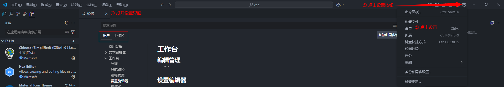
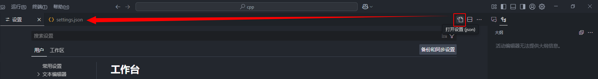
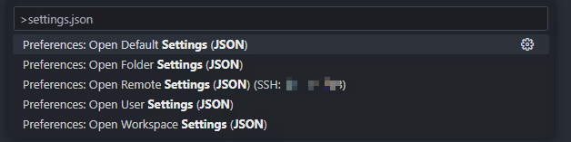
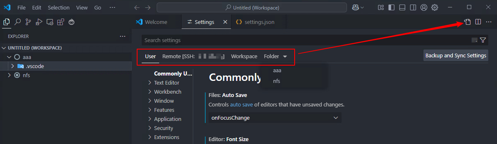
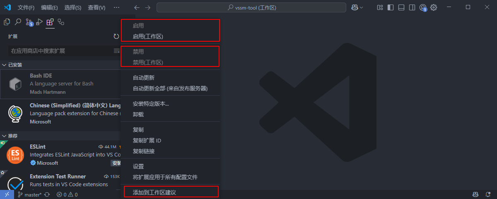

## 一、vscode设置界面与文件

### 1. 怎么打开设置？



不管界面怎么样，就找【齿轮】的图标，这个就是设置，点开之后打开设置，就可以看到下面有两个选项，一个是用户，一个是工作区。

### 2. 打开设置文件

vscode支持界面配置，界面进行的配置也可以用配置文件来实现。怎么打开配置文件？上面设置界面，我们看到旁边有这样一个图标：



点完这个就会切换到配置文件，用户配置对应的是这个文件：

```shell
# user settings
C:\Users\<user_name>\AppData\Roaming\Code\User\settings.json
```

### 3. 变量引用

> 参考资料：[Variables reference](https://code.visualstudio.com/docs/reference/variables-reference)或者[变量参考 - VSCode 编辑器](https://vscode.js.cn/docs/reference/variables-reference)

在vscode中有一些预定义的变量，后面对插件配置可能会有用，这里直接看实例吧：[Predefined variables example](https://code.visualstudio.com/docs/reference/variables-reference#_predefined-variables-example)或者[变量参考 - VSCode 编辑器](https://vscode.js.cn/docs/reference/variables-reference#_predefined-variables-example)

假设我们在编辑器中打开了一个文件：`/home/your-username/your-project/folder/file.ext` ，目录`/home/your-username/your-project`作为根工作区打开。那么每个变量的值如下：

```shell
- ${userHome}       : `/home/your-username`
- ${workspaceFolder}: `/home/your-username/your-project`
- ${workspaceFolderBasename}: `your-project`
- ${file}           : `/home/your-username/your-project/folder/file.ext`
- ${fileWorkspaceFolder}: `/home/your-username/your-project`
- ${relativeFile}   : `folder/file.ext`
- ${relativeFileDirname}: `folder`
- ${fileBasename}   : `file.ext`
- ${fileBasenameNoExtension}: `file`
- ${fileExtname}    : `.ext`
- ${fileDirname}    : `/home/your-username/your-project/folder`
- ${fileDirnameBasename}: `folder`
- ${lineNumber}     : line number of the cursor
- ${columnNumber}   : column number of the cursor
- ${selectedText}   : text selected in your code editor
- ${execPath}       : location of Code.exe
- ${pathSeparator}  : `/` on macOS or linux, `\` on Windows
```

## 二、vscode工作区

### 1. 什么是工作区

直接看vscode官方文档吧：[What is a VS Code workspace?](https://code.visualstudio.com/docs/editing/workspaces/workspaces)或者[什么是 VS Code 工作区？ - VSCode 编辑器](https://vscode.js.cn/docs/editing/workspaces/workspaces)

### 2. 工作区设置

工作区文件中配置格式如下：

```json
{
	"folders": [
		{
			"path": "."
		}
	],
	"settings": {
        "editor.fontSize": 16,          // 控制字体大小
    }
}
```

### 3. 在工作区中屏蔽文件

工作区是管理这个工程目录的，在这里可以针对工作做一些配置，例如屏蔽一些不需要的目录和文件：

```json
{
	"folders": [
		{
			"path": "."
		}
	],
	"settings": {
		// 搜索时不想显示的文件可按以下格式屏蔽(为 true 时屏蔽)
		"search.exclude": {
            "**/*.o":true,
            "**/*.su":true,
            "**/*.cmd":true,
		},
		// 不想在工作区显示的文件可按以下格式屏蔽(为 true 时屏蔽)
		"files.exclude": {
			"**/*.o":true,
            "**/*.su":true,
            "**/*.cmd":true,
		},
	}
}
```

这里面是可以使用通配符的，具体的可以看这里：[Glob Patterns Reference](https://code.visualstudio.com/docs/editor/glob-patterns)或者[Glob 模式参考 - VSCode 编辑器](https://vscode.js.cn/docs/editor/glob-patterns)

<table>
    <tr><td align="center">正则表达式</td><td align="center">匹配内容</td></tr>
    <tr><td align="center">\</td><td align="left">特殊符号转义，如"*" ，转义后匹配的是字符"*"， “(” 匹配的是括号"("</td></tr>
    <tr><td align="center">[字符序列]</td><td align="left">匹配[ ]中的任意字符，如[ae]，字符a和字符e均匹配</td></tr>
    <tr><td align="center">[^字符序列]</td><td align="left">匹配不在[ ]中的任意字符，如[^ae]除了a和e，其他字符都匹配</td></tr>
    <tr><td align="center">[字符1-字符2]</td><td align="left">匹配在[ ]之间的任意字符，如[a-x]，就是匹配a和x之间的所有字符（包括a和x）</td></tr>
    <tr><td align="center">.</td><td align="left">匹配任意单个字符(除了\n)</td></tr>
    <tr><td align="center">\w</td><td align="left">匹配所有单词字符（如"a"，“3”，“E”，但不匹配"?"，"."等）</td></tr>
    <tr><td align="center">\W</td><td align="left">和\w相反，匹配所有非单词字符</td></tr>
    <tr><td align="center">\s</td><td align="left">匹配空格</td></tr>
    <tr><td align="center">\S</td><td align="left">和\s相反，匹配非空格</td></tr>
    <tr><td align="center">\d</td><td align="left">匹配数字字符，如"1"，“4”，"9"等</td></tr>
    <tr><td align="center">\D</td><td align="left">和\d相反，匹配除了数字字符外的其他字符</td></tr>
    <tr><td align="center">*</td><td align="left">将前面的元素匹配0到多次，如"\d*.\d"，可以匹配"19.9"，".0",“129.9”</td></tr>
    <tr><td align="center">+</td><td align="left">将前面的元素匹配1到多次，如"be+"，可以匹配"be"， “beeeeee”</td></tr>
    <tr><td align="center">？</td><td align="left">将前面的元素匹配0次或者一次，如"rai?n" 可以且只可以匹配 “ran” 或者 “rain”</td></tr>
    <tr><td align="center">{n}</td><td align="left">    n是个数字，将前面的元素匹配n次，如"be{3}“可以且只可以匹配 ”beee”</td></tr>
    <tr><td align="center">{n, m}</td><td align="left">将前面的元素匹配至少n次，最多m次，如"be{1,3}" 可以且只可以匹配"be",“bee”, “beee”</td></tr>
</table>

## 三、设置文件总结

### 1. 哪些设置？

vscode配置的层次关系：

```txt
系统默认设置(不可修改) - 用户设置 - 远程设置 - 工作区设置 - 文件夹设置
```

后者的设置会覆盖前者的设置，若没有设置某一项，将继续使用前者的设置。一共就是有这五种配置文件：



我们在【vscode】&rarr;【设置面板】最多可以看到这些类型设置：



### 2. 设置说明

- 默认设置：VS Code的默认值不可编辑修改，当没有提供其它设置的值时候或者提供的是无效值的时候，VS Code提供的默认设置生效；
- 用户设置：一般是`%APPDATA%/Code/User/settings.json`，此设置对所有项目生效，如果提供了有效设置会覆盖比它权重低的设置；
- 远程设置：一般是`~/.vscode-server/data/Machine/settings.json`，如果使用了VS Code的远程开发功能将会显示此Tab，此设置对该远程机器生效，如果提供了有效设置会覆盖比它权重低的设置；
- 工作区设置：一般是`*.code-workspace.settings`或者`%APPDATA%/Code/Workspaces/xxx/workspace.json`，默认情况下每打开一个文件夹就是一个工作区，如果提供了有效设置会覆盖比它权重低的设置；
- 文件夹设置：`.vscode/settings.json`，如果启用了多根工作区就会展示此设置，可以为工作区下面的每个文件夹添加独立设置，如果提供了有效设置会覆盖比它权重低的设置，这个设置也是权限最高的设置因为就在当前文件夹下。

### 3. 工作区设置和文件夹设置

关于工作区设置和文件夹设置，还有不同的情况：

（1）工作区文件不存在，并且这个工作区中只有一个文件夹时，我们打开的工作区设置其实就是文件夹设置，会打开`.vscode/settings.json`。

（2）工作区文件不存在，并且这个工作区有多个文件夹时，每个文件夹都可以有自己的文件夹设置，都可以有一个`.vscode/settings.json`，这个时候，工作区设置是`%APPDATA%/Code/Workspaces/xxx/workspace.json`。这个xxx是一个临时目录，当vscode关闭时若是没保存工作区，这个目录自动删除。

（3）工作区文件存在，这个工作区不管有几个文件夹，工作区设置就是`*.code-workspace.settings`，文件夹设置就是各个文件夹下的`.vscode/settings.json`。

（4）工作区文件存在，工作区只有一个文件夹，但是没有打开工作区，这个时候工作区设置其实也就是文件夹设置，也会打开`.vscode/settings.json`。

### 4. 扩展禁用

我们可以为每个工作区设置自己的扩展，我们安装完扩展，扩展右边会有一个设置图标，里面会有这几项配置：



- 选项“启用/禁用”为我们的用户设置
- 选项“启用/禁用（工作区）”为工作区设置
- 添加到工作区建议（可以添加到工作区文件夹，也可以添加到整个工作区文件中）

> Tips：在工作区中启用和禁用的插件由VS Code 内部保存相关状态，并不会保存在VS Code的工作区设置文件中，所以目前并不能共享，这点和 **工作区建议** 是不同的。**工作区建议**是存储在工作区的设置中，是可以共享的。

此设置会只应用到当前工作区下，不会影响用户设置和其他工作区的设置，文件夹无此设置。建议在用户设置（即非打开工作区的情况下）关闭大多数插件，留下常用的，在不同的工作区下再开启，这样可以避免vscode过多造成卡顿。

