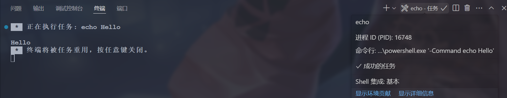
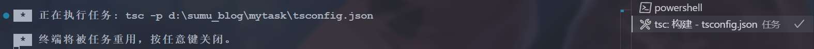
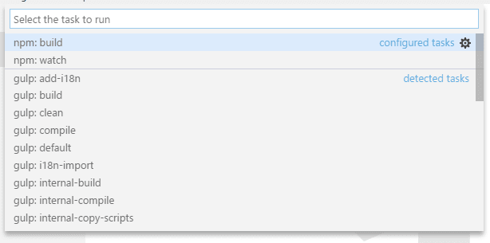
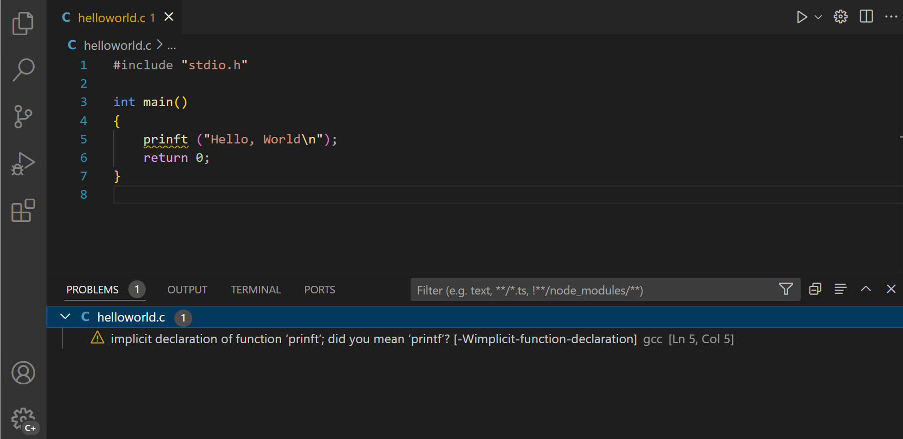

这一节来了解下vscode中的任务，这里以。

<!-- more -->

> 参考资料：
> 
>[通过任务与外部工具集成 - VSCode 编辑器](https://vscode.js.cn/docs/debugtest/tasks)/[Integrate with External Tools via Tasks](https://code.visualstudio.com/docs/debugtest/tasks)
>
> [附录 - VSCode 编辑器](https://vscode.js.cn/docs/reference/tasks-appendix#_schema-for-tasksjson)/[Appendix](https://code.visualstudio.com/docs/reference/tasks-appendix#_schema-for-tasksjson)

## 一、概述

### 1. 任务简介

任务指的是在开发过程中需要自动化执行的一系列操作，例如编译代码、运行测试、打包项目等。在 Visual Studio Code(VS Code)中，tasks.json 文件是用来定义和配置任务(Tasks)的。通过配置 tasks.json，我们可以简化这些操作，使其可以一键执行，提高效率。

> vscode 能利用task的地方就是快捷键功能， tasks.json 可以配合 Task Buttons 扩展功能，在vscode下方自定义快捷按钮，实现快捷操作，比如自动化命令

- 定义和管理各种任务，包括编译、测试、打包、部署等。这样可以避免在不同项目中重复编写类似的命令行脚本，提高代码复用性和组织性。
- 快捷执行：通过键盘快捷键或任务面板快速选择并运行任务，无需切换到命令提示符或终端手动输入命令。
- 与VSCode生态集成：任务可以与VSCode的其他功能紧密结合，如调试(launch.json)、版本控制、代码片段等，形成一体化的工作流。例如可以配置一个任务在调试前先构建项目，或者在保存文件时自动触发格式化任务。
- 跨平台一致性：对于跨平台开发，VSCode的任务配文件(tasks.json)可以确保在不同操作系统(Windows、macOs、Linux)上执行一致的构建或开发流程，减少了平台差异带来的困扰。

### 2. 创建任务

- 方式一：点击 【终端】 &rarr; 【配置任务/配置生成默认任务】
- 方式二：在 .vscode 目录中创建 tasks.json 文件，文件基本架构可以参考这里：[附录 - VSCode 编辑器](https://vscode.js.cn/docs/reference/tasks-appendix#_schema-for-tasksjson)

我们可以通过方式一创建一个生成默认任务：

```json
{
  // See https://go.microsoft.com/fwlink/?LinkId=733558
  // for the documentation about the tasks.json format
  "version": "2.0.0",
  "tasks": [
    {
      "label": "echo",
      "type": "shell",
      "command": "echo Hello",
      "problemMatcher": [],
      "group": {
        "kind": "build",
        "isDefault": true
      }
    }
  ]
}
```

### 3. 运行任务

- 【终端】&rarr;【运行任务/运行生成任务】&rarr;【选择要运行的任务】即可运行：



- 除了全局菜单栏，任务命令还可以通过**命令面板** (Ctrl+Shift+P) 访问。可以筛选“task”并查看各种与任务相关的命令。


### 4. 任务的架构

现在先来看一下任务的架构，我们可以参考[附录 - VSCode 编辑器](https://vscode.js.cn/docs/reference/tasks-appendix#_schema-for-tasksjson)/[Appendix](https://code.visualstudio.com/docs/reference/tasks-appendix#_schema-for-tasksjson)。

>**注意**：某些任务选项由 VS Code 扩展提供。我们可以使用 `tasks.json` IntelliSense 查找完整列表，通过“**触发建议**”命令（Ctrl+Space）。

## 二、[TypeScript Hello World](https://vscode.js.cn/docs/debugtest/tasks#_typescript-hello-world)

我们从一个简单的“Hello World”TypeScript 程序开始，我们想把它编译成 JavaScript。创建一个空文件夹“mytask”，生成一个 `tsconfig.json` 文件，并从该文件夹启动 VS Code。

```bash
mkdir mytask
cd mytask
tsc --init # 全局安装好tsc命令，npm install -g typescript
code .
```

按下 Ctrl+Shift+B 或从全局**终端**菜单运行**运行构建任务**，会显示以下选择器：


第一个条目执行 TypeScript 编译器并将 TypeScript 文件转换为 JavaScript 文件。当编译器完成后，应该有一个 `HelloWorld.js` 文件。第二个条目以监视模式启动 TypeScript 编译器。每次保存 `HelloWorld.ts` 文件都会重新生成 `HelloWorld.js` 文件。

还可以将 TypeScript 构建或监视任务定义为默认构建任务，以便在触发**运行构建任务**（Ctrl+Shift+B）时直接执行。为此，请从全局**终端**菜单中选择**配置默认构建任务**。这会显示一个包含可用构建任务的选择器。选择**tsc: build**或**tsc: watch**，VS Code 将生成一个 `tasks.json` 文件。下面显示的文件将**tsc: build**任务设置为默认构建任务：

```json
{
  "version": "2.0.0",
  "tasks": [
    {
      "type": "typescript",
      "tsconfig": "tsconfig.json",
      "problemMatcher": [
        "$tsc"
      ],
      "group": {
        "kind": "build",
        "isDefault": true
      },
      "label": "tsc: 构建 - tsconfig.json"
    }
  ]
}
```

上面的 `tasks.json` 示例没有定义新任务。它只是注释了由 VS Code 的 TypeScript 扩展贡献的 **tsc: build** 任务，使其成为默认构建任务。现在可以通过按下 Ctrl+Shift+B 来执行 TypeScript 编译器。



## 三、[任务自动检测](https://vscode.js.cn/docs/debugtest/tasks#_task-autodetection)

VS Code 目前自动检测以下系统的任务：Gulp、Grunt、Jake 和 npm。如果使用 Node.js 作为运行时开发 JavaScript 应用程序，通常会有一个 `package.json` 文件，描述项目依赖项和要运行的脚本。如果克隆了 [eslint-starter](https://github.com/spicydonuts/eslint-starter) 示例，那么从全局菜单执行**运行任务**会显示以下列表：


如果尚未安装，需要通过运行 `npm install` 安装必要的 npm 模块。现在打开 `server.js` 文件并在语句末尾添加一个分号（请注意 ESLint 启动器假设语句没有分号），然后再次执行**运行任务**。这次选择 **npm: lint** 任务。当提示使用问题匹配器时，选择 **ESLint stylish**


此外，VS Code 还创建了一个 `.vscode/tasks.json` 文件，内容如下

```typescript
{
  // See https://go.microsoft.com/fwlink/?LinkId=733558
  // for the documentation about the tasks.json format
  "version": "2.0.0",
  "tasks": [
    {
      "type": "npm",
      "script": "lint",
      "problemMatcher": ["$eslint-stylish"]
    }
  ]
}

```

这指示 VS Code 使用 ESLint stylish 格式扫描 **npm lint** 脚本的输出以查找问题。对于 Gulp、Grunt 和 Jake，任务自动检测的工作方式相同。下面是为 [vscode-node-debug](https://github.com/microsoft/vscode-node-debug) 扩展检测到的任务示例。



> **提示：**可以通过输入“task”、空格 和命令名称（在本例中为“task lint”）来通过**快速打开** (Ctrl+P) 运行我们的任务。

可以使用以下设置禁用任务自动检测：

```json
// settings.json
{
  "typescript.tsc.autoDetect": "off",
  "grunt.autoDetect": "off",
  "jake.autoDetect": "off",
  "gulp.autoDetect": "off",
  "npm.autoDetect": "off"
}

```

## 四、自定义任务

### 1. 怎么创建？

并非所有任务或脚本都可以在我们的工作区中自动检测。有时需要定义自己的自定义任务。假设我们有一个脚本可以运行我们的测试，以正确设置某些环境。该脚本存储在工作区内的脚本文件夹中，在 Linux 和 macOS 上名为 `test.sh`，在 Windows 上名为 `test.cmd`。从全局**终端**菜单运行**配置任务**并选择**从模板创建 tasks.json 文件**条目。这会打开以下选择器


> **注意：**如果没有看到任务运行器模板列表，那么文件夹中可能已经有一个 `tasks.json` 文件，其内容将在编辑器中打开。关闭该文件，并为本例删除或重命名它。

vscode正在开发更多的自动检测支持，因此这个列表将来会越来越小。由于我们想编写自己的自定义任务，可以从列表中选择**其他**。这会打开一个带有任务骨架的 `tasks.json` 文件。将其内容替换为以下内容

```json
{
  // See https://go.microsoft.com/fwlink/?LinkId=733558
  // for the documentation about the tasks.json format
  "version": "2.0.0",
  "tasks": [
    {
      "label": "Run tests",
      "type": "shell",
      "command": "./scripts/test.sh",
      "windows": {
        "command": ".\\scripts\\test.cmd"
      },
      "group": "test",
      "presentation": {
        "reveal": "always",
        "panel": "new"
      }
    }
  ]
}
```

任务的属性具有以下语义

- **label**：在用户界面中使用的任务标签。
- **type**：任务的类型。对于自定义任务，可以是 `shell` 或 `process`。如果指定 `shell`，则命令解释为 shell 命令（例如：bash、cmd 或 PowerShell）。如果指定 `process`，则命令解释为要执行的进程。
- **command**：要执行的实际命令。
- **windows**：任何 Windows 特定属性。当命令在 Windows 操作系统上执行时，将使用它而不是默认属性。
- **group**：定义任务所属的组。在示例中，它属于 `test` 组。属于测试组的任务可以通过从**命令面板**运行**运行测试任务**来执行。
- **presentation**：定义任务输出在用户界面中的处理方式。在此示例中，显示输出的集成终端将始终显示，并且每次任务运行时都会创建一个新终端。
- **options**：覆盖 `cwd`（当前工作目录）、`env`（环境变量）或 `shell`（默认 shell）的默认值。选项可以按任务设置，也可以全局或按平台设置。在此处配置的环境变量只能在您的任务脚本或进程中引用，如果它们是您的参数、命令或其他任务属性的一部分，则不会被解析。
- **runOptions**：定义任务何时以及如何运行。
- **hide**：在“运行任务快速选择”中隐藏任务，这对于复合任务中不能独立运行的元素很有用。

我们可以在 `tasks.json` 文件中使用 IntelliSense 查看完整的任务属性和值。通过**触发建议**（Ctrl+Space）调出建议，并悬停或使用**阅读更多...**（“i”）浮出框阅读说明，也可以查阅 [tasks.json 架构](https://vscode.js.cn/docs/reference/tasks-appendix)。

当命令和参数包含空格或其他特殊字符（如 `$`）时，Shell 命令需要特殊处理。默认情况下，任务系统支持以下行为

（1）如果提供单个命令，任务系统会将命令按原样传递给底层 shell。如果命令需要引号或转义才能正常工作，则命令需要包含正确的引号或转义字符。例如，要列出名称中包含空格的文件夹的目录，在 bash 中执行的命令应如下所示：`dir 'folder with spaces'`。

```json
{
  "version": "2.0.0",
  "tasks": [
    {
      "label": "dir",
      "type": "shell",
      "command": "dir 'folder with spaces'"
    }
  ]
}
```

（2）如果提供了命令和参数，如果命令或参数包含空格，任务系统将使用单引号。对于 `cmd.exe`，使用双引号。像下面这样的 shell 命令将在 PowerShell 中执行为 `dir 'folder with spaces'`。

```bash
{
  "version": "2.0.0",
  "tasks": [
    {
      "label": "dir",
      "type": "shell",
      "command": "dir",
      "args": ["folder with spaces"]
    }
  ]
}

```

（3）如果想控制参数如何加引号，参数可以是指定值和加引号样式的字面量。下面的示例对包含空格的参数使用转义而不是加引号。

```bash
{
  "version": "2.0.0",
  "tasks": [
    {
      "label": "dir",
      "type": "shell",
      "command": "dir",
      "args": [
        {
          "value": "folder with spaces",
          "quoting": "escape"
        }
      ]
    }
  ]
}
```

除了转义，还支持以下值

- **strong**：使用 shell 的强引用机制，该机制抑制字符串中的所有求值。在 PowerShell 以及 Linux 和 macOS 的 shell 下，使用单引号 (`'`)。对于 cmd.exe，使用 `"`。
- **weak**：使用 shell 的弱引用机制，该机制仍会求值字符串中的表达式（例如，环境变量）。在 PowerShell 以及 Linux 和 macOS 的 shell 下，使用双引号 (`"`)。cmd.exe 不支持弱引用，因此 VS Code 也使用 `"`。

### 2. 复合任务

我们还可以使用 `dependsOn` 属性将更简单的任务组合成复合任务。例如，如果工作区包含客户端和服务器文件夹，并且两者都包含构建脚本，我们可以创建一个任务，在单独的终端中启动这两个构建脚本。如果在 `dependsOn` 属性中列出多个任务，它们默认会并行执行。`tasks.json` 文件如下所示：

```json
{
  "version": "2.0.0",
  "tasks": [
    {
      "label": "Client Build",
      "command": "gulp",
      "args": ["build"],
      "options": {
        "cwd": "${workspaceFolder}/client"
      }
    },
    {
      "label": "Server Build",
      "command": "gulp",
      "args": ["build"],
      "options": {
        "cwd": "${workspaceFolder}/server"
      }
    },
    {
      "label": "Build",
      "dependsOn": ["Client Build", "Server Build"]
    }
  ]
}

```

如果指定 `"dependsOrder": "sequence"`，那么任务依赖项将按照它们在 `dependsOn` 中列出的顺序执行。在 `dependsOn` 中使用 `"dependsOrder": "sequence"` 的任何后台/监视任务都必须有一个问题匹配器来跟踪它们何时“完成”。以下任务将运行任务二、任务三，然后是任务一。

```json
{
  "label": "One",
  "type": "shell",
  "command": "echo Hello ",
  "dependsOrder": "sequence",
  "dependsOn": ["Two", "Three"]
}

```

### 3. 用户级别任务

可以使用**任务：打开用户任务**命令创建不绑定到特定工作区或文件夹的用户级别任务。这里只能使用 `shell` 和 `process` 任务，因为其他任务类型需要工作区信息。

## 五、[输出行为](https://vscode.js.cn/docs/debugtest/tasks#_output-behavior)

有时希望控制集成终端面板在运行任务时的行为。例如，可能希望最大化编辑器空间，并且只有在认为存在问题时才查看任务输出。终端的行为可以使用任务的 `presentation` 属性进行控制。它提供以下属性

- **reveal**：控制集成终端面板是否置于最前。有效值有
  - `always` - 面板始终置于最前。这是默认值。
  - `never` - 用户必须使用**视图** &rarr; **终端**命令 (Ctrl+`) 明确将终端面板置于最前。
  - `silent` - 终端面板仅在输出未扫描错误和警告时置于最前。
- **revealProblems**：控制在运行此任务时是否显示问题面板。优先于reveal选项。默认为never。
  - `always` - 执行此任务时始终显示问题面板。
  - `onProblem` - 仅在发现问题时显示问题面板。
  - `never` - 执行此任务时从不显示问题面板。
- **focus**：控制终端是否获取输入焦点。默认为 `false`。
- **echo**：控制执行的命令是否在终端中回显。默认为 `true`。
- **showReuseMessage**：控制是否显示“终端将被任务重用，按任意键关闭”消息。
- **panel**：控制任务运行之间是否共享终端实例。可能的值有
  - `shared` - 终端共享，其他任务运行的输出将添加到同一个终端。
  - `dedicated` - 终端专用于特定任务。如果该任务再次执行，终端将被重用。但是，不同任务的输出将显示在不同的终端中。
  - `new` - 该任务的每次执行都将使用一个新的干净终端。
- **clear**：控制在运行此任务之前是否清除终端。默认为 `false`。
- **close**：控制任务运行时所在的终端在任务退出时是否关闭。默认为 `false`。
- **group**：控制任务是否在特定的终端组中使用分屏执行。同一组中的任务（由字符串值指定）将使用分屏终端而不是新的终端面板来显示。

我们也可以修改自动检测任务的终端面板行为。例如，如果想更改上面 ESLint 示例中 **npm: run lint** 的输出行为，请添加 `presentation` 属性

```json
{
  // See https://go.microsoft.com/fwlink/?LinkId=733558
  // for the documentation about the tasks.json format
  "version": "2.0.0",
  "tasks": [
    {
      "type": "npm",
      "script": "lint",
      "problemMatcher": ["$eslint-stylish"],
      "presentation": {
        "reveal": "never"
      }
    }
  ]
}
```

也可以将自定义任务与已检测任务的配置混合使用。一个配置 **npm: run lint** 任务并添加自定义 **Run Test** 任务的 `tasks.json` 如下所示

```json
{
  // See https://go.microsoft.com/fwlink/?LinkId=733558
  // for the documentation about the tasks.json format
  "version": "2.0.0",
  "tasks": [
    {
      "type": "npm",
      "script": "lint",
      "problemMatcher": ["$eslint-stylish"],
      "presentation": {
        "reveal": "never"
      }
    },
    {
      "label": "Run tests",
      "type": "shell",
      "command": "./scripts/test.sh",
      "windows": {
        "command": ".\\scripts\\test.cmd"
      },
      "group": "test",
      "presentation": {
        "reveal": "always",
        "panel": "new"
      }
    }
  ]
}
Copy
```

## 六、[运行行为](https://vscode.js.cn/docs/debugtest/tasks#_run-behavior)

可以使用 `runOptions` 属性指定任务的运行行为

- **reevaluateOnRerun**：控制通过**重新运行上次任务**命令执行任务时变量的求值方式。默认值为 `true`，这意味着任务重新运行时变量将被重新求值。当设置为 `false` 时，将使用任务上次运行时解析的变量值。
- **runOn**：指定任务何时运行。
  - `default` - 任务仅通过**运行任务**命令执行时运行。
  - `folderOpen` - 任务在包含文件夹打开时运行。您第一次打开包含 `folderOpen` 任务的文件夹时，系统会询问您是否允许任务在该文件夹中自动运行。您以后可以使用**管理自动任务**命令更改您的决定，并在**允许自动任务**和**禁止自动任务**之间选择。
- **instanceLimit** - 允许同时运行的任务实例数量。默认值为 `1`。

## 七、[自定义自动检测任务](https://vscode.js.cn/docs/debugtest/tasks#_customizing-autodetected-tasks)

如上所述，我们可以在 `tasks.json` 文件中自定义自动检测任务。通常会这样做是为了修改显示属性或附加问题匹配器以扫描任务的输出以查找错误和警告。可以通过按**运行任务**列表右侧的齿轮图标直接自定义任务，以将相应的任务引用插入到 `tasks.json` 文件中。假设有以下 Gulp 文件，用于使用 ESLint 对 JavaScript 文件进行代码检查（该文件取自 https://github.com/adametry/gulp-eslint）

```json
const gulp = require('gulp');
const eslint = require('gulp-eslint');

gulp.task('lint', () => {
  // ESLint ignores files with "node_modules" paths.
  // So, it's best to have gulp ignore the directory as well.
  // Also, Be sure to return the stream from the task;
  // Otherwise, the task may end before the stream has finished.
  return (
    gulp
      .src(['**/*.js', '!node_modules/**'])
      // eslint() attaches the lint output to the "eslint" property
      // of the file object so it can be used by other modules.
      .pipe(eslint())
      // eslint.format() outputs the lint results to the console.
      // Alternatively use eslint.formatEach() (see Docs).
      .pipe(eslint.format())
      // To have the process exit with an error code (1) on
      // lint error, return the stream and pipe to failAfterError last.
      .pipe(eslint.failAfterError())
  );
});

gulp.task('default', ['lint'], function() {
  // This will only run if the lint task is successful...
});
```

从全局**终端**菜单执行**运行任务**将显示以下选择器


按齿轮图标。这将创建以下 `tasks.json` 文件

```json
{
  // See https://go.microsoft.com/fwlink/?LinkId=733558
  // for the documentation about the tasks.json format
  "version": "2.0.0",
  "tasks": [
    {
      "type": "gulp",
      "task": "default",
      "problemMatcher": []
    }
  ]
}
```

通常，现在会添加一个问题匹配器（在本例中为 `$eslint-stylish`）或修改显示设置。

## 八、[使用问题匹配器处理任务输出](https://vscode.js.cn/docs/debugtest/tasks#_processing-task-output-with-problem-matchers)

VS Code 可以使用问题匹配器处理任务的输出。问题匹配器扫描任务输出文本以查找已知的警告或错误字符串，并在编辑器中和“问题”面板中以内联方式报告这些问题。VS Code 内置了几个问题匹配器

- **TypeScript**：`$tsc` 假定输出中的文件名是相对于打开的文件夹的。
- **TypeScript Watch**：`$tsc-watch` 匹配在监视模式下执行 `tsc` 编译器时报告的问题。
- **JSHint**：`$jshint` 假定文件名报告为绝对路径。
- **JSHint Stylish**：`$jshint-stylish` 假定文件名报告为绝对路径。
- **ESLint Compact**：`$eslint-compact` 假定输出中的文件名是相对于打开的文件夹的。
- **ESLint Stylish**：`$eslint-stylish` 假定输出中的文件名是相对于打开的文件夹的。
- **Go**：`$go` 匹配 `go` 编译器报告的问题。假定文件名是相对于打开的文件夹的。
- **CSharp and VB Compiler**：`$mscompile` 假定文件名报告为绝对路径。
- **Lessc compiler**：`$lessc` 假定文件名报告为绝对路径。
- **Node Sass compiler**：`$node-sass` 假定文件名报告为绝对路径。

我们也可以创建自己的问题匹配器，我们将在[后续部分](https://vscode.js.cn/docs/debugtest/tasks#_defining-a-problem-matcher)讨论。

## 九、[将键盘快捷方式绑定到任务](https://vscode.js.cn/docs/debugtest/tasks#_binding-keyboard-shortcuts-to-tasks)

如果您需要经常运行任务，可以为任务定义键盘快捷方式。

例如，要将 `Ctrl+H` 绑定到上面的**运行测试**任务，请将以下内容添加到您的 `keybindings.json` 文件中

```json
{
  "key": "ctrl+h",
  "command": "workbench.action.tasks.runTask",
  "args": "Run tests"
}
```

## 十、[变量替换](https://vscode.js.cn/docs/debugtest/tasks#_variable-substitution)

### 1. 基本格式

在编写任务配置时，使用一组预定义的常用变量（例如活动文件 (`${file}`) 或工作区根文件夹 (`${workspaceFolder}`)）非常有用。VS Code 支持在 `tasks.json` 文件中的字符串内进行变量替换，我们可以在[变量参考](https://vscode.js.cn/docs/reference/variables-reference)中查看预定义变量的完整列表。

> **注意：**并非所有属性都接受变量替换。具体来说，只有 `command`、`args` 和 `options` 支持变量替换。

下面是一个自定义任务配置的示例，它将当前打开的文件传递给 TypeScript 编译器。

```json
{
  "label": "TypeScript compile",
  "type": "shell",
  "command": "tsc ${file}",
  "problemMatcher": ["$tsc"]
}
```

类似地，可以通过在名称前加上 `${config:` 来引用项目的配置设置。例如，`${config:python.formatting.autopep8Path}` 返回 Python 扩展设置 `formatting.autopep8Path`。

### 2. 使用示例

下面是一个自定义任务配置的示例，它使用 `python.formatting.autopep8Path` 设置定义的 autopep8 可执行文件在当前文件上执行 autopep8

```json
{
  "label": "autopep8 current file",
  "type": "process",
  "command": "${config:python.formatting.autopep8Path}",
  "args": ["--in-place", "${file}"]
}
```

如果想指定 Python 扩展用于 `tasks.json` 或 `launch.json` 的选定 Python 解释器，可以使用 `${command:python.interpreterPath}` 命令。

### 3. 从任务用户获取

如果简单的变量替换不足以满足我们的需求，我们还可以通过向 `tasks.json` 文件添加 `inputs` 部分来从任务用户那里获取输入。


有关 `inputs` 的更多信息，可以参阅[变量参考](https://vscode.js.cn/docs/reference/variables-reference)。

## 十一、[操作系统特定属性](https://vscode.js.cn/docs/debugtest/tasks#_operating-system-specific-properties)

任务系统支持定义特定于操作系统的变量值（例如，要执行的命令）。为此，请将操作系统特定字面量放入 `tasks.json` 文件中，并在该字面量中指定相应的属性。

下面是一个示例，它使用 Node.js 可执行文件作为命令，并在 Windows 和 Linux 上有不同的处理方式

```json
{
  "label": "Run Node",
  "type": "process",
  "windows": {
    "command": "C:\\Program Files\\nodejs\\node.exe"
  },
  "linux": {
    "command": "/usr/bin/node"
  }
}
```

有效的操作系统属性是用于 Windows 的 `windows`，用于 Linux 的 `linux`，以及用于 macOS 的 `osx`。在操作系统特定范围内定义的属性会覆盖在任务或全局范围内定义的属性。

## 十二、[全局任务](https://vscode.js.cn/docs/debugtest/tasks#_global-tasks)

任务属性也可以在全局范围中定义。如果存在，它们将用于特定任务，除非它们使用不同的值定义相同的属性。在下面的示例中，有一个全局 `presentation` 属性，它定义了所有任务都应在新面板中执行

```json
{
  // See https://go.microsoft.com/fwlink/?LinkId=733558
  // for the documentation about the tasks.json format
  "version": "2.0.0",
  "presentation": {
    "panel": "new"
  },
  "tasks": [
    {
      "label": "TS - Compile current file",
      "type": "shell",
      "command": "tsc ${file}",
      "problemMatcher": ["$tsc"]
    }
  ]
}
```

> **提示：**要访问全局范围的 `tasks.json` 文件，需要打开命令面板 (Ctrl+Shift+P) 并运行**任务：打开用户任务**命令。

### 十三、[PowerShell 中的字符转义](https://vscode.js.cn/docs/debugtest/tasks#_character-escaping-in-powershell)

当默认 shell 为 PowerShell，或者当任务配置为使用 PowerShell 时，可能会看到意外的空格和引号转义。意外转义只发生在 cmdlet 上，因为 VS Code 不知道我们命令是否包含 cmdlet。下面的示例 1 显示了一个我们会得到与 PowerShell 不兼容的转义的情况。示例 2 显示了获得良好转义的最佳跨平台方式。在某些情况下，我们可能无法遵循示例 2，并且需要进行示例 3 中显示的手动转义。

```json
"tasks": [
    {
        "label": "PowerShell example 1 (unexpected escaping)",
        "type": "shell",
        "command": "Get-ChildItem \"Folder With Spaces\""
    },
    {
        "label": "PowerShell example 2 (expected escaping)",
        "type": "shell",
        "command": "Get-ChildItem",
        "args": ["Folder With Spaces"]
    },
    {
        "label": "PowerShell example 3 (manual escaping)",
        "type": "shell",
        "command": "& Get-ChildItem \\\"Folder With Spaces\\\""
    }
]
```

## 十四、[更改任务输出的编码](https://vscode.js.cn/docs/debugtest/tasks#_changing-the-encoding-for-a-task-output)

任务通常与磁盘上的文件交互。如果这些文件以与系统编码不同的编码存储在磁盘上，需要让作为任务执行的命令知道要使用哪种编码。由于这取决于操作系统和所使用的 shell，因此没有通用的解决方案来控制这一点。下面是关于如何使其工作的建议和示例。

如果需要调整编码，应该检查更改操作系统使用的默认编码是否有意义，或者至少通过调整 shell 的配置文件来更改使用的 shell 的编码。

如果只需要针对特定任务进行调整，那么将更改编码所需的操作系统特定命令添加到任务命令行。以下示例适用于 Windows，其默认代码页为 437。该任务显示包含西里尔字符的文件的输出，因此需要代码页 866。假设默认 shell 设置为 `cmd.exe`，列出文件的任务如下所示

```json
{
  // See https://go.microsoft.com/fwlink/?LinkId=733558
  // for the documentation about the tasks.json format
  "version": "2.0.0",
  "tasks": [
    {
      "label": "more",
      "type": "shell",
      "command": "chcp 866 && more russian.txt",
      "problemMatcher": []
    }
  ]
}
```

如果任务在 `PowerShell` 中执行，命令需要这样写 `chcp 866; more russian.txt`。在 Linux 和 macOS 上，可以使用 `locale` 命令来检查区域设置并调整必要环境变量。

## 十五、[任务实操示例](https://vscode.js.cn/docs/debugtest/tasks#_examples-of-tasks-in-action)

为了突出任务的强大功能，这里有一些 VS Code 如何使用任务来集成外部工具（如代码检查器和编译器）的示例。

#### 1. [将 TypeScript 转译为 JavaScript](https://vscode.js.cn/docs/debugtest/tasks#_transpiling-typescript-to-javascript)

[TypeScript 主题](https://vscode.js.cn/docs/typescript/typescript-compiling)包含一个示例，该示例创建了一个任务，用于将 TypeScript 转译为 JavaScript 并从 VS Code 内部观察任何相关错误。

#### 2. [将 Less 和 SCSS 转译为 CSS](https://vscode.js.cn/docs/debugtest/tasks#_transpiling-less-and-scss-into-css)

CSS 主题提供了如何使用任务生成 CSS 文件的示例。

（1）[使用构建任务手动转译](https://vscode.js.cn/docs/languages/css#_transpiling-sass-and-less-into-css)

（2）[使用文件监视器自动化编译步骤](https://vscode.js.cn/docs/languages/css#_automating-sassless-compilation)

## 十六、[定义问题匹配器](https://vscode.js.cn/docs/debugtest/tasks#_defining-a-problem-matcher)

VS Code 内置了一些最常见的问题匹配器。然而，还有许多编译器和代码检查工具，它们都产生自己的错误和警告样式，因此我们可能希望创建自己的问题匹配器。

我们有一个 `helloWorld.c` 程序，开发人员错误地将 **printf** 拼写为 **prinft**。使用 [gcc](https://gcc.gnu.org/) 编译它将产生以下警告

```bash
helloWorld.c:5:3: warning: implicit declaration of function ‘prinft’
```

我们希望生成一个问题匹配器，能够捕获输出中的消息并在 VS Code 中显示相应的问题。问题匹配器严重依赖[正则表达式](https://en.wikipedia.org/wiki/Regular_expression)。

> **提示：**我们发现 [RegEx101 playground](https://regex101.com/)，它支持 ECMAScript (JavaScript) 语法，是开发和测试正则表达式的好方法。

捕获上述警告（和错误）的匹配器如下所示

```json
{
  // The problem is owned by the cpp language service.
  "owner": "cpp",
  // The file name for reported problems is relative to the opened folder.
  "fileLocation": ["relative", "${workspaceFolder}"],
  // The name that will be shown as the source of the problem.
  "source": "gcc",
  // The actual pattern to match problems in the output.
  "pattern": {
    // The regular expression. Example to match: helloWorld.c:5:3: warning: implicit declaration of function ‘printf’ [-Wimplicit-function-declaration]
    "regexp": "^(.*):(\\d+):(\\d+):\\s+(warning|error):\\s+(.*)$",
    // The first match group matches the file name which is relative.
    "file": 1,
    // The second match group matches the line on which the problem occurred.
    "line": 2,
    // The third match group matches the column at which the problem occurred.
    "column": 3,
    // The fourth match group matches the problem's severity. Can be ignored. Then all problems are captured as errors.
    "severity": 4,
    // The fifth match group matches the message.
    "message": 5
  }
}
```

请注意，`file`、`line` 和 `message` 属性是强制性的。`fileLocation` 指定任务输出生成并在问题中匹配的文件路径是 `absolute` 还是 `relative`。如果任务同时生成绝对路径和相对路径，我们可以使用 `autoDetect` 文件位置。使用 `autoDetect`，路径首先被测试为绝对路径，如果文件不存在，则假定路径是相对的。

`severity` 指定如果模式不包含严重性，则使用哪种问题严重性。`severity` 的可能值为 `error`、`warning` 或 `info`。

这是一个完整的 `tasks.json` 文件，其中包含上面（已删除注释）的代码，并包装了实际的任务详细信息

```json
{
  "version": "2.0.0",
  "tasks": [
    {
      "label": "build",
      "command": "gcc",
      "args": ["-Wall", "helloWorld.c", "-o", "helloWorld"],
      "problemMatcher": {
        "owner": "cpp",
        "fileLocation": ["relative", "${workspaceFolder}"],
        "source": "gcc",
        "pattern": {
          "regexp": "^(.*):(\\d+):(\\d+):\\s+(warning|error):\\s+(.*)$",
          "file": 1,
          "line": 2,
          "column": 3,
          "severity": 4,
          "message": 5
        }
      }
    }
  ]
}
```

在 VS Code 中运行它，然后按下 Ctrl+Shift+M 获取问题列表，我们将获得以下输出



> **注意：**[C/C++ 扩展](https://marketplace.visualstudio.com/items?itemName=ms-vscode.cpptools)包含 GCC 的问题匹配器，因此无需定义我们自己的。

模式中还可以使用其他几个属性。它们是

- **location** - 如果问题位置是行或行、列或 startLine、startColumn、endLine、endColumn，则可以使用我们的通用位置匹配组。
- **endLine** - 问题结束行的匹配组索引。如果编译器未提供结束行值，则可以省略。
- **endColumn** - 问题结束列的匹配组索引。如果编译器未提供结束列值，则可以省略。
- **code** - 问题代码的匹配组索引。如果编译器未提供代码值，则可以省略。

还可以定义一个只捕获文件的问题匹配器。为此，可以定义一个带有可选 `kind` 属性设置为 `file` 的 `pattern`。在这种情况下，无需提供 `line` 或 `location` 属性。

> **注意：**如果 `kind` 属性设置为 `file`，则功能模式必须至少提供一个 `file` 和 `message` 的匹配组。如果未提供 `kind` 属性或 `kind` 属性设置为 `location`，则功能模式还必须提供 `line` 或 `location` 属性。

> **注意：**问题匹配器仅解析给定命令的输出。如果您想解析写入单独文件（例如日志文件）的输出，请让您运行的命令在执行完成前打印出单独文件中的行。

## 十七、[定义多行问题匹配器](https://vscode.js.cn/docs/debugtest/tasks#_defining-a-multiline-problem-matcher)

有些工具会将源文件中发现的问题分散在多行，特别是当使用 stylish 报告器时。一个例子是 [ESLint](https://eslint.org.cn/)；在 stylish 模式下，它会产生如下输出

```bash
test.js
  1:0   error  Missing "use strict" statement                 strict
✖ 1 problems (1 errors, 0 warnings)
```

我们的问题匹配器是基于行的，因此我们需要用与实际问题位置和消息（1:0 error Missing "use strict" statement）不同的正则表达式捕获文件名（test.js）。

为此，请为 `pattern` 属性使用问题模式数组。这样，可以为要匹配的每一行定义一个模式。

以下问题模式匹配 ESLint 在 stylish 模式下的输出——但仍有一个小问题需要我们接下来解决。下面的代码有一个用于捕获文件名的第一个正则表达式，第二个用于捕获行、列、严重性、消息和错误代码

```json
{
  "owner": "javascript",
  "fileLocation": ["relative", "${workspaceFolder}"],
  "pattern": [
    {
      "regexp": "^([^\\s].*)$",
      "file": 1
    },
    {
      "regexp": "^\\s+(\\d+):(\\d+)\\s+(error|warning|info)\\s+(.*)\\s\\s+(.*)$",
      "line": 1,
      "column": 2,
      "severity": 3,
      "message": 4,
      "code": 5
    }
  ]
}
```

但是，如果一个资源上有多个问题，此模式将不起作用。例如，想象一下 ESLint 的以下输出

```bash
test.js
  1:0   error  Missing "use strict" statement                 strict
  1:9   error  foo is defined but never used                  no-unused-vars
  2:5   error  x is defined but never used                    no-unused-vars
  2:11  error  Missing semicolon                              semi
  3:1   error  "bar" is not defined                           no-undef
  4:1   error  Newline required at end of file but not found  eol-last
✖ 6 problems (6 errors, 0 warnings)
```

该模式的第一个正则表达式将匹配“test.js”，第二个正则表达式将匹配“1:0 error ...”。下一行“1:9 error ...”被处理但未被第一个正则表达式匹配，因此未捕获到任何问题。

为了实现这一点，多行模式的最后一个正则表达式可以指定 `loop` 属性。如果设置为 true，它会指示任务系统将多行匹配器的最后一个模式应用于输出中的行，只要正则表达式匹配。

第一个模式（在本例中匹配 `test.js`）捕获的信息将与后续每一行匹配 `loop` 模式的信息结合起来，以创建多个问题。在此示例中，将创建六个问题。

这是一个用于完全捕获 ESLint stylish 问题的任务匹配器

```json
{
  "owner": "javascript",
  "fileLocation": ["relative", "${workspaceFolder}"],
  "pattern": [
    {
      "regexp": "^([^\\s].*)$",
      "file": 1
    },
    {
      "regexp": "^\\s+(\\d+):(\\d+)\\s+(error|warning|info)\\s+(.*)\\s\\s+(.*)$",
      "line": 1,
      "column": 2,
      "severity": 3,
      "message": 4,
      "code": 5,
      "loop": true
    }
  ]
}
```

> **注意**：如果同一资源上存在多于一个具有完全相同行和列的问题，则只会显示一个问题。这适用于所有问题匹配器，而不仅仅是多行问题匹配器。

## 十八、[修改现有问题匹配器](https://vscode.js.cn/docs/debugtest/tasks#_modifying-an-existing-problem-matcher)

如果现有问题匹配器接近您的需求，您可以在 `tasks.json` 任务中对其进行修改。例如，`$tsc-watch` 问题匹配器仅适用于已关闭的文档。如果您希望它适用于所有文档，您可以修改它

```json
{
  "type": "npm",
  "script": "watch",
  "problemMatcher": {
    "base": "$tsc-watch",
    "applyTo": "allDocuments"
  },
  "isBackground": true
}
```

其他可修改的问题匹配器属性包括 `background`、`fileLocation`、`owner`、`pattern`、`severity` 和 `source`。

## 十九、[后台/监视任务](https://vscode.js.cn/docs/debugtest/tasks#_background-watching-tasks)

一些工具支持在后台运行，同时监视文件系统中的更改，然后在文件在磁盘上更改时触发操作。对于 `Gulp`，这种功能通过 npm 模块 [gulp-watch](https://npmjs.net.cn/package/gulp-watch) 提供。TypeScript 编译器 `tsc` 通过 `--watch` 命令行选项内置了对此的支持。

为了提供后台任务在 VS Code 中处于活动状态并产生问题结果的反馈，问题匹配器必须使用额外的信息来检测输出中的这些 `state` 更改。让我们以 `tsc` 编译器为例。当编译器以监视模式启动时，它会将以下附加信息打印到控制台

```bash
> tsc --watch
12:30:36 PM - Compilation complete. Watching for file changes.
```

当磁盘上包含问题的文件发生更改时，会出现以下输出

```bash
12:32:35 PM - File change detected. Starting incremental compilation...
src/messages.ts(276,9): error TS2304: Cannot find name 'candidate'.
12:32:35 PM - Compilation complete. Watching for file changes.
```

查看输出显示以下模式

- 当控制台打印出 `File change detected. Starting incremental compilation...` 时，编译器开始运行。
- 当控制台打印出 `Compilation complete. Watching for file changes.` 时，编译器停止。
- 在这两个字符串之间报告问题。
- 编译器也会在初始启动时运行一次（不向控制台打印 `File change detected. Starting incremental compilation...`）。

为了捕获这些信息，问题匹配器可以提供一个 `background` 属性。

对于 `tsc` 编译器，一个合适的 `background` 属性如下所示

```json
"background": {
    "activeOnStart": true,
    "beginsPattern": "^\\s*\\d{1,2}:\\d{1,2}:\\d{1,2}(?: AM| PM)? - File change detected\\. Starting incremental compilation\\.\\.\\.",
    "endsPattern": "^\\s*\\d{1,2}:\\d{1,2}:\\d{1,2}(?: AM| PM)? - Compilation complete\\. Watching for file changes\\."
}
```

除了问题匹配器上的 `background` 属性外，任务本身也必须标记为 `isBackground`，这样任务才能在后台继续运行。

一个用于以监视模式运行的 `tsc` 任务的完整手写 `tasks.json` 如下所示

```json
{
  "version": "2.0.0",
  "tasks": [
    {
      "label": "watch",
      "command": "tsc",
      "args": ["--watch"],
      "isBackground": true,
      "problemMatcher": {
        "owner": "typescript",
        "fileLocation": "relative",
        "pattern": {
          "regexp": "^([^\\s].*)\\((\\d+|\\d+,\\d+|\\d+,\\d+,\\d+,\\d+)\\):\\s+(error|warning|info)\\s+(TS\\d+)\\s*:\\s*(.*)$",
          "file": 1,
          "location": 2,
          "severity": 3,
          "code": 4,
          "message": 5
        },
        "background": {
          "activeOnStart": true,
          "beginsPattern": "^\\s*\\d{1,2}:\\d{1,2}:\\d{1,2}(?: AM| PM)? - File change detected\\. Starting incremental compilation\\.\\.\\.",
          "endsPattern": "^\\s*\\d{1,2}:\\d{1,2}:\\d{1,2}(?: AM| PM)? - Compilation complete\\. Watching for file changes\\."
        }
      }
    }
  ]
}
```

## 二十、[常见问题](https://vscode.js.cn/docs/debugtest/tasks#_common-questions)

### 1. [任务可以使用与集成终端中指定的 shell 不同的 shell 吗？](https://vscode.js.cn/docs/debugtest/tasks#_can-a-task-use-a-different-shell-than-the-one-specified-for-the-integrated-terminal)

是的。您可以使用 `"terminal.integrated.automationProfile.*"` 设置来设置将用于 VS Code 中所有自动化（包括任务）的 shell。

```json
    "terminal.integrated.automationProfile.windows": {
        "path": "cmd.exe"
    }
```

或者，您可以使用 `options.shell` 属性覆盖任务的 shell。您可以针对每个任务、全局或按平台设置此项。例如，要在 Windows 上使用 cmd.exe，您的 `tasks.json` 将包含

```json
{
    "version": "2.0.0",
    "windows": {
        "options": {
            "shell": {
                "executable": "cmd.exe",
                "args": [
                    "/d", "/c"
                ]
            }
        }
    },
    ...
```

### 2. [后台任务可以在 launch.json 中用作 prelaunchTask 吗？](https://vscode.js.cn/docs/debugtest/tasks#_can-a-background-task-be-used-as-a-prelaunchtask-in-launchjson)

是的。由于后台任务会一直运行直到被终止，因此后台任务本身没有“已完成”的信号。要将后台任务用作 `prelaunchTask`，您必须为后台任务添加适当的后台 `problemMatcher`，以便任务系统和调试系统能够知道任务“已完成”。

您的任务可以是

```json
{
  "type": "npm",
  "script": "watch",
  "problemMatcher": "$tsc-watch",
  "isBackground": true
}
```

> **注意：**`$tsc-watch` 是一个**后台**问题匹配器，正如后台任务所要求的那样。

然后，您可以在 `launch.json` 文件中将任务用作 `prelaunchTask`

```json
{
  "name": "Launch Extension",
  "type": "extensionHost",
  "request": "launch",
  "runtimeExecutable": "${execPath}",
  "args": ["--extensionDevelopmentPath=${workspaceRoot}"],
  "stopOnEntry": false,
  "sourceMaps": true,
  "outFiles": ["${workspaceRoot}/out/src/**/*.js"],
  "preLaunchTask": "npm: watch"
}
```

有关后台任务的更多信息，请参阅[后台/监视任务](https://vscode.js.cn/docs/debugtest/tasks#_background-watching-tasks)。

### 3. [为什么运行任务时出现“command not found”？](https://vscode.js.cn/docs/debugtest/tasks#_why-do-i-get-command-not-found-when-running-a-task)

当您尝试运行的任务命令未被您的终端识别为可执行时，就会出现“command not found”消息。通常，这是因为命令被配置为您的 shell 启动脚本的一部分。任务以非登录和非交互方式运行，这意味着您的 shell 的启动脚本不会运行。特别是 `nvm` 已知会使用启动脚本作为其配置的一部分。

有几种方法可以解决此问题

（1）确保您的命令在您的路径中，并且不需要启动脚本才能添加到您的路径中。这是解决问题的最彻底的方法，也是推荐的解决方案。

（2）您可以对任务进行一次性修复，使其以登录或交互方式运行。不建议这样做，因为它可能产生其他后果。但是，它也可以是单个任务的快速简便修复。下面是一个使用 `bash` 作为 shell 完成此操作的任务示例

```json
{
  "type": "npm",
  "script": "watch",
  "options": {
    "shell": {
      "args": ["-c", "-l"]
    }
  }
}
```

上面的 `npm` 任务将使用命令 (`-c`) 运行 `bash`，就像任务系统默认所做的那样。但是，此任务还会将 `bash` 作为登录 shell (`-l`) 运行。
